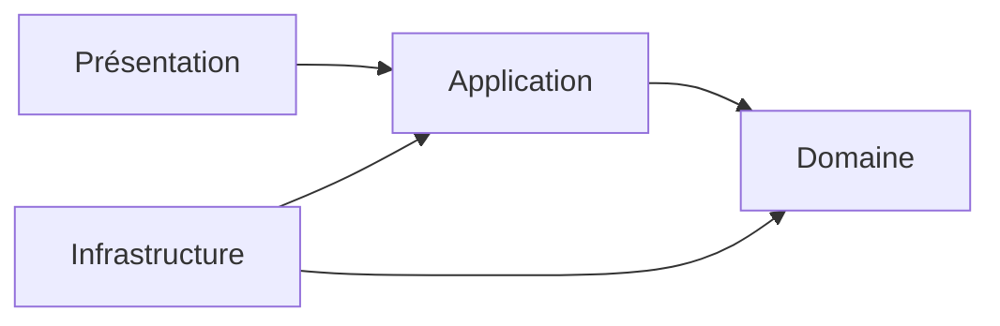
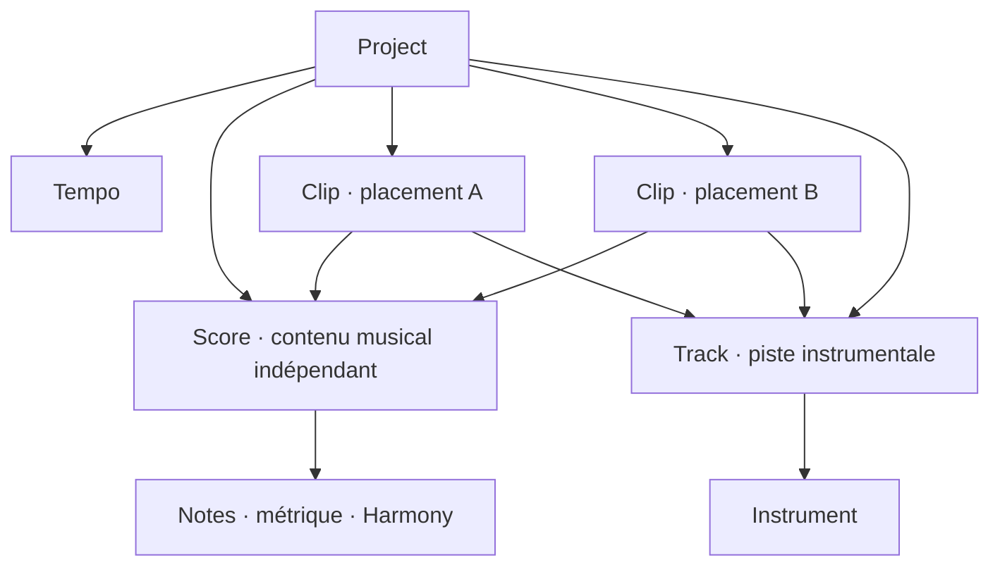
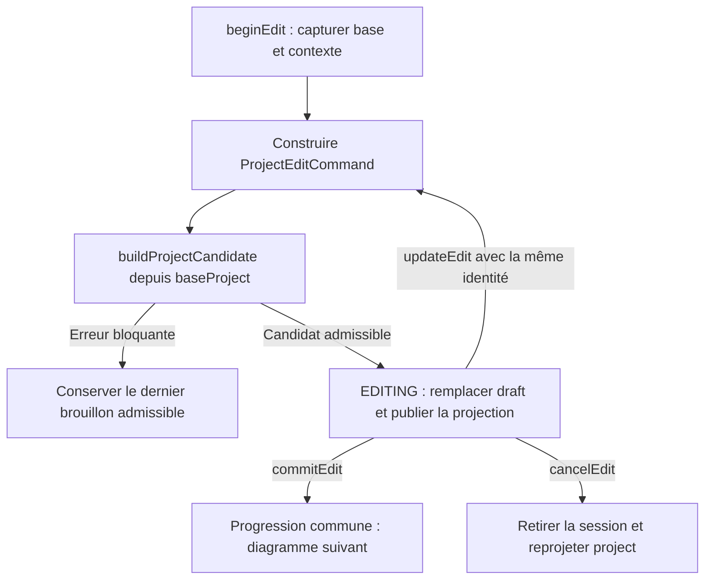
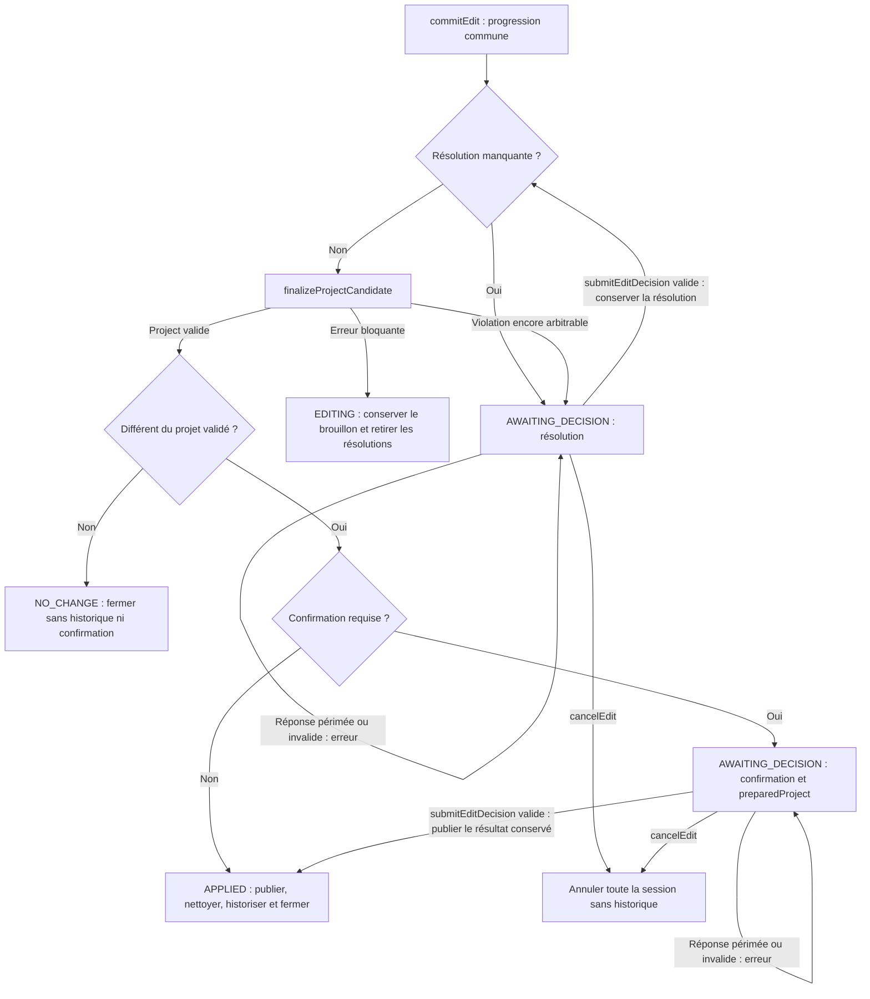
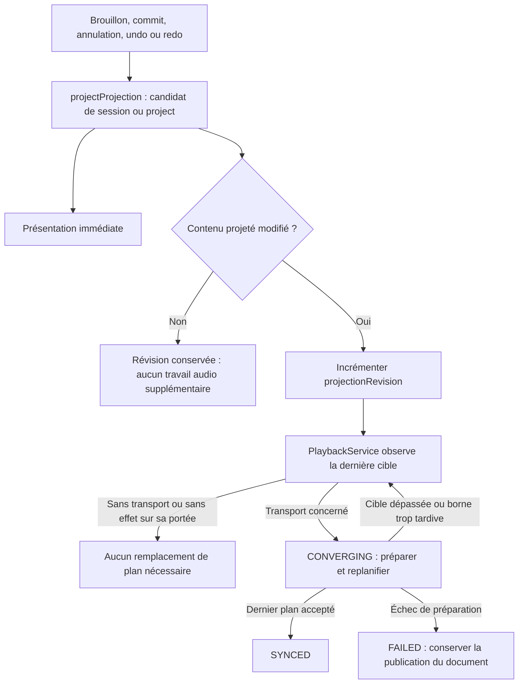
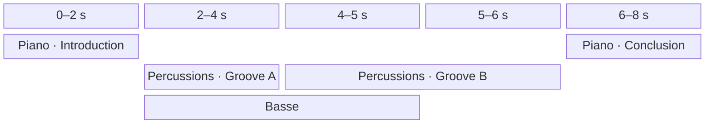
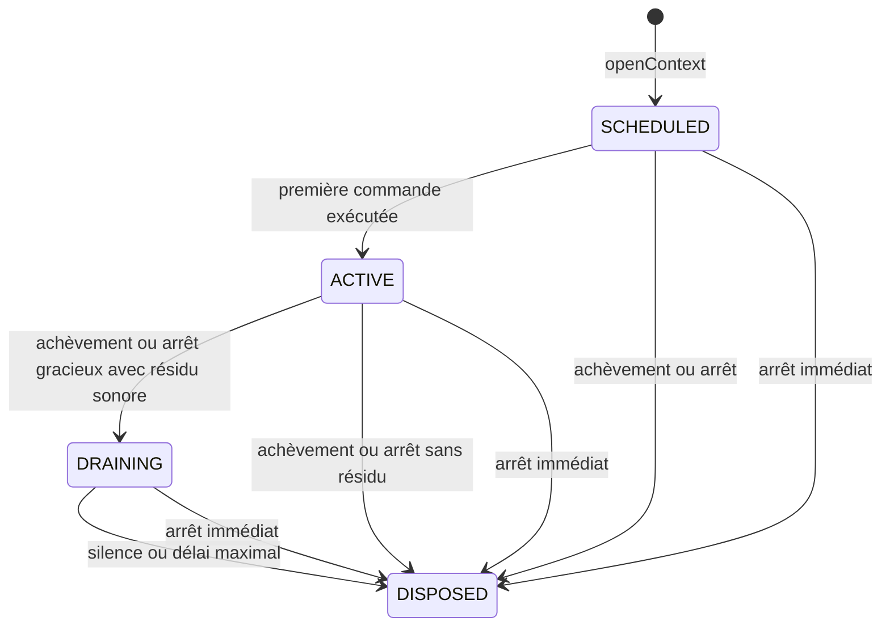

# Architecture

Ce document décrit l'architecture de Pianola, une application de piano roll avec rendu audio intégré.

Il fixe le vocabulaire courant, les responsabilités des couches et leurs dépendances. Les scénarios détaillés sont regroupés dans [etudes-de-cas.md](etudes-de-cas.md).

## Navigation

- [Vue d'ensemble](#vue-densemble)
- [Périmètre fonctionnel](#périmètre-fonctionnel)
- [Domaine](#domaine)
  - [Modèle de composition](#modèle-de-composition)
  - [Temps, hauteur et harmonie](#temps-musical)
  - [Transformations et données candidates](#transformations-du-projet-et-données-candidates)
- [Application](#application)
  - [Sélections](#sélections)
  - [États des éditeurs](#états-des-éditeurs)
  - [Édition du projet](#édition-du-projet)
  - [Lecture et préécoute](#playbackservice)
  - [Ports](#ports-applicatifs)
- [Présentation](#présentation)
- [Infrastructure](#infrastructure)
- [Dépendances architecturales](#dépendances-architecturales)
- [Arborescence cible](#arborescence-cible)
- [Questions ouvertes](#questions-ouvertes)

## Vue d'ensemble

Pianola sépare quatre responsabilités :

| Couche | Responsabilité | Exemples |
| --- | --- | --- |
| Domaine | Représenter la composition, garantir ses invariants et expliciter ses échecs attendus. | `Project`, `Score`, `Note`, `Result`, temps musical et pitch |
| Application | Orchestrer l'édition et la lecture à partir du domaine. | état de l'éditeur, cas d'usage, ports |
| Infrastructure | Réaliser les capacités techniques demandées par l'application. | Web Audio, catalogue concret, persistance |
| Présentation | Afficher la grille et traduire les gestes utilisateur. | clips, piano roll, inspecteur |



## Périmètre fonctionnel

Pianola est destiné à l'écriture et au processus initial de composition, pas à la production audio.

Le premier périmètre comprend :

- une grille bidimensionnelle de clips ;
- un axe horizontal représentant un temps global continu ;
- des pistes instrumentales ordonnées sur l’axe vertical, chacune associée à un instrument ;
- un placement horizontal et une référence de piste persistants pour chaque `Clip` ;
- des `Score` constituant des contenus musicaux indépendants, éditables et partageables, même sans clip ;
- des `Clip` référençant obligatoirement un `Score` par `scoreId` : modifier ce contenu modifie tous les clips correspondants ;
- la duplication de clips par référence ou avec création de scores indépendants ;
- un tempo unique appartenant au projet ;
- des scores sans instrument propre, dont les notes sont jouées avec l’instrument de la piste de chaque clip ;
- l'absence de chevauchement entre notes de même hauteur dans un score, avec résolution explicite `SLICE` ou `MERGE` ;
- des chronologies locales de métrique et d’harmonie pour chaque score ;
- la lecture simultanée de tous les clips dont les intervalles globaux se chevauchent, y compris sur une même piste ;
- l'édition du contenu d’un score dans un piano roll ;
- la lecture du projet depuis sa tête globale ou depuis un tick global explicite ;
- la lecture isolée du score édité depuis sa tête locale ou depuis un tick local explicite ;
- la préécoute soutenue d’une hauteur avec l’instrument de la piste d’écoute du piano roll ;
- la préécoute brève et simultanée des hauteurs uniques d’une sélection de notes ;
- un catalogue d'instruments échantillonnés intégrés et non éditables, rendus par `smplr` ;
- l’annulation et le rétablissement des éditions validées ;
- l’enregistrement et la réouverture d’un fichier de projet versionné.

Il ne comprend pas :

- une chronologie de tempo : une seule valeur s'applique au projet entier ;
- les contrôles globaux d'audibilité par instrument ;
- les automations et événements de contrôle ;
- la création, l'import ou l'édition d'instruments par l'utilisateur ;
- un état audio transitoire sauvegardé dans le projet ;
- les suggestions automatiques de remplacement harmonique ;
- le redimensionnement automatique lors d’un changement de métrique.

Les `Note` sont le seul contenu sonore des scores. La métrique et l’harmonie sont des données structurelles locales, et non des automations.

---

## Domaine

Le domaine représente les intentions musicales indépendamment de React, Zustand, du stockage et du moteur Web Audio.

### Modèle de composition

Le `Project` possède des `Track` ordonnées, des `Score` constituant les contenus musicaux éditables et des `Clip` placés dans la composition. Chaque `Clip` référence exactement un score par `scoreId: ScoreId` et une piste par `trackId: TrackId`. Les trois collections appartiennent directement au projet ; les clips ne sont pas dupliqués dans les pistes.

Un score existe indépendamment de son utilisation dans la composition : il peut être créé et édité avant tout placement, puis référencé par zéro, un ou plusieurs clips. Le partage est uniquement une conséquence de l’égalité des `scoreId`. Aucun indicateur de partage, propriétaire privilégié, type de source hybride ou contenu musical embarqué dans un clip n’est nécessaire. Deux scores de contenu identique mais d’identités différentes restent indépendants.



La coordonnée horizontale d’un clip est son instant de départ global. Sa position verticale est dérivée du rang de sa piste dans `Project.tracks`. La durée du bloc est dérivée de la durée locale du score référencé et du `repeatCount` du clip.

Les pistes possèdent une identité stable, un nom et un instrument. Leur ordre est persistant ; les réordonner ne change ni les références des clips ni leur son. Déplacer un clip vers une autre piste change son instrument effectif si les deux pistes utilisent des instruments différents. Deux clips peuvent se chevaucher sur une même piste comme sur des pistes différentes : ils sont lus simultanément, sans priorité ni contrainte de collision entre leurs notes. Chaque clip garde son contexte audio indépendant ; une piste n’introduit pas de bus de mixage partagé.

### Vue des concepts

| Concept | Nature | Rôle principal |
| --- | --- | --- |
| `Project` | Entity et racine d'agrégat | Posséder le document musical, le tempo, les pistes ordonnées, les scores et les clips qui les référencent |
| `Track` | Entity interne | Porter l’identité, le nom et l’instrument d’une piste |
| `Score` | Entity interne | Porter un contenu musical indépendant, éditable et partageable, sans instrument propre |
| `Clip` | Entity interne | Référencer un score et une piste, porter son début global et ses répétitions |
| `Note` | Entity interne | Représenter une note locale ; son instrument est résolu depuis la piste lors de la lecture |
| `Instrument` | Entity de référence | Décrire publiquement un instrument intégré |
| `Tempo` | Value Object | Définir la vitesse unique du projet |
| `MeterChange` | Entity interne | Placer une métrique sur la chronologie locale d’un score |
| `HarmonyChange` | Entity interne | Placer un accord ou une gamme sur la chronologie harmonique locale d’un score |

### Result et validation du domaine

Le domaine représente toute validation attendue par un `Result<T, E>` explicite :

```ts
type Result<T, E> =
  | { ok: true; value: T }
  | { ok: false; error: E };

type ValidationError<
  Code extends string,
  Details extends object
> = {
  kind: "VALIDATION_ERROR";
  code: Code;
  details: Details;
};
```

Les branches sont discriminées par `ok`. Des helpers purs `ok(value)` et `err(error)` peuvent construire les deux variantes ; `map` et `flatMap` peuvent les composer sans extraire prématurément une valeur.

Chaque module déclare près de ses invariants ses propres codes et détails, puis compose les unions nécessaires. Il n'existe pas d'erreur générique contenant seulement un texte. Exemples :

```ts
type TempoValidationError = ValidationError<
  "TEMPO_OUT_OF_RANGE" | "TEMPO_PRECISION_EXCEEDED",
  { received: number; min: number; max: number; decimals: number }
>;

type NoteOverlap = {
  manipulatedNoteId: NoteId;
  overlappingNoteIds: readonly NoteId[];
};

type NoteOverlapError = ValidationError<
  "NOTE_OVERLAP",
  { scoreId: ScoreId; overlaps: readonly NoteOverlap[] }
>;
```

Les `code` sont stables et indépendants de la langue. `details` contient uniquement les données structurées nécessaires pour comprendre et traiter l'échec ; le domaine ne produit aucun message destiné à l'utilisateur.

Les constructeurs capables de créer un état invalide restent privés. Les factories de Value Objects et d'entités, la reconstitution d'un agrégat et les opérations qui peuvent violer un invariant retournent un `Result` :

```ts
Tempo.create(bpm: number): Result<Tempo, TempoValidationError>;
Score.create(input: CreateScoreInput): Result<Score, ScoreValidationError>;
Clip.create(input: CreateClipInput): Result<Clip, ClipValidationError>;
Project.create(input: CreateProjectInput): Result<Project, ProjectValidationError>;
moveClips(project: Project, command: MoveClipsCommand): Result<Project, ProjectEditError>;
editNote(score: Score, command: EditNoteCommand): Result<Score, ScoreValidationError>;
```

Une branche `ok: false` ne modifie jamais l'objet d'origine et ne publie aucun état partiel. Dans le premier périmètre, une opération retourne la première erreur selon un ordre de validation déterministe ; l'accumulation de plusieurs erreurs pourra être ajoutée sans changer la forme de `Result`.

Les violations prévisibles d'une règle métier ne lèvent pas d'exception. Les exceptions restent réservées aux défauts de programmation et aux défaillances techniques inattendues ; elles ne sont pas converties artificiellement en `ValidationError`.

### Transformations du projet et données candidates

`ProjectEditCommand` appartient au domaine. Il compose les commandes métier élémentaires déclarées près des opérations qui les exécutent et représente une proposition transactionnelle de transformation du `Project`. Son union décrit les transformations acceptées par `buildProjectCandidate` ; elle ne décrit ni les gestes de présentation, ni l’exhaustivité des cas d’usage d’`EditService`.

`EditIntent` reste le contrat applicatif : `EditService` le résout à partir de l’état des éditeurs, puis construit le `ProjectEditCommand` du domaine. Les paramètres de cette commande expriment une transformation cumulée depuis `baseProject`, jamais depuis le candidat précédent. Les identifiants des créations ordinaires sont alloués une fois par l’application et fournis à la commande pendant le geste. Ceux des fragments de collision sont alloués seulement à la résolution définitive.

```ts
type DeferredViolation =
  | {
      kind: "NOTE_OVERLAP";
      scoreId: ScoreId;
      overlaps: readonly NoteOverlap[];
    };

type DeferredResolution =
  | {
      kind: "NOTE_OVERLAP";
      scoreId: ScoreId;
      choice: NoteOverlapResolution;
      fragments: readonly {
        sourceNoteId: NoteId;
        start: Tick;
        end: Tick;
        noteId: NoteId;
      }[];
    };

interface ProjectCandidate {
  // Surface de lecture complète du projet projeté, distincte de Project.
  readonly deferredViolations: readonly DeferredViolation[];
}
```

`DeferredResolution.fragments` associe chaque fragment nouveau à son identité allouée par l’application ; la liste est vide pour `MERGE` ou un `SLICE` sans nouvelle identité. La portée du score et le triplet `(sourceNoteId, start, end)` identifient un fragment dans le candidat figé. Les notes ou fragments conservant une identité existante n’y figurent pas.

Prévisualisation et validation utilisent une seule chaîne de calcul dans les opérations du domaine. Le domaine connaît `ProjectEditCommand`, `ProjectCandidate`, ses violations différées et leurs résolutions ; il ignore l’intention utilisateur, la sélection, la session d’édition et l’audio. Deux fonctions pures forment la frontière principale :

```ts
buildProjectCandidate(
  baseProject: Project,
  command: ProjectEditCommand
): Result<ProjectCandidate, BlockingProjectError>;

finalizeProjectCandidate(
  candidate: ProjectCandidate,
  resolutions: readonly DeferredResolution[]
): Result<Project, ProjectEditError>;
```

`buildProjectCandidate` applique collectivement la commande à `baseProject`. Les valeurs d’une commande expriment l’état final proposé des entités ciblées, et non une suite de mutations à valider une par une. Plusieurs changements portant sur une même entité sont normalisés en une seule proposition finale ; deux propositions contradictoires pour le même champ constituent une commande invalide. Les créations et leurs références sont également évaluées dans le résultat collectif : créer un score et un clip qui le référence ne produit aucun état intermédiaire orphelin.

Toutes les validations reposent sur les mêmes fonctions pures d’inspection. Elles produisent soit une erreur bloquante, soit une `DeferredViolation` explicitement admise par l’union fermée. Une erreur bloquante empêche le candidat et conserve la dernière projection admissible. Une violation différée est enregistrée dans `ProjectCandidate.deferredViolations` et doit recevoir une `DeferredResolution` avant publication. Le premier périmètre ne diffère que `NOTE_OVERLAP` ; ajouter une autre exception exige une nouvelle variante typée et sa fonction de résolution, sans modifier le mécanisme générique.

`finalizeProjectCandidate` applique les résolutions au candidat, relance les mêmes inspections et construit un `Project` uniquement lorsqu’aucune violation ne subsiste. Une violation différée n’est donc jamais ignorée ou transformée en autorisation générale de désactiver un invariant. Il n’existe qu’une implémentation de la détection des chevauchements, des références, des bornes et des autres règles ; seules leurs conséquences diffèrent selon qu’elles sont bloquantes ou explicitement différables.

Les fichiers `*Transformations.ts` sont classés selon le type qu’ils produisent, et non selon l’élément principalement ciblé par la commande. Une fonction qui retourne un `Score` appartient ainsi à `ScoreTransformations.ts`. Toute fonction qui retourne un `Project` appartient à `ProjectTransformations.ts`, y compris lorsqu’elle ajoute, déplace, redimensionne, duplique ou supprime un clip, ou lorsqu’elle transforme une piste. Il n’existe donc pas de `ClipTransformations.ts` tant qu’aucune opération du domaine ne retourne un `Clip` isolé.

Cette convention s’applique aussi aux copies :

```ts
// domain/operations/composition/ScoreTransformations.ts
duplicateScore(
  score: Score,
  command: DuplicateScoreCommand
): Result<Score, ScoreValidationError>;

// domain/operations/composition/ProjectTransformations.ts
addScore(
  project: Project,
  command: AddScoreCommand
): Result<Project, ProjectEditError>;

duplicateClips(
  project: Project,
  command: DuplicateClipsCommand
): Result<Project, ProjectEditError>;

makeClipIndependent(
  project: Project,
  command: MakeClipIndependentCommand
): Result<Project, ProjectEditError>;
```

`DuplicateScoreCommand` fournit la nouvelle identité du score, son nom et la correspondance complète des nouvelles identités de notes et de changements. Ces identités sont allouées une seule fois par l’application et conservées dans la commande ; les fonctions pures ne génèrent aucun identifiant aléatoire. `AddScoreCommand` insère un score valide dans l’agrégat. Dupliquer un score seul compose donc `duplicateScore` et `addScore` dans la même transaction applicative.

`DuplicateClipsCommand` précise les clips sources, les nouveaux `ClipId`, les placements et le choix explicite `REFERENCE` ou `INDEPENDENT`. La branche `INDEPENDENT` fournit un `DuplicateScoreCommand` par clip copié ; la branche `REFERENCE` n’en fournit aucun. `MakeClipIndependentCommand` cible un clip existant et fournit la commande de copie de son score. Les opérations retournant un projet délèguent la copie locale à `ScoreTransformations`, puis valident ensemble les nouveaux scores et les références des clips. Le choix de duplication appartient uniquement à la commande : il ne devient pas une propriété persistante du clip ou du score.

`ProjectCandidate` est un type du domaine distinct de `Project`. Il expose une surface de lecture complète pour la présentation et la planification audio, ainsi que la collection de ses `deferredViolations`, mais il ne peut pas être fourni à une opération exigeant un agrégat validé. Dans le premier périmètre, seul `NOTE_OVERLAP` peut apparaître dans cette collection. Les bornes numériques, durées positives, références finales, identités, limites locales des notes et chronologies restent valides. Aucun `Project` invalide n’est construit.

### Bornes numériques et valeurs élémentaires

Le premier périmètre fixe les limites suivantes :

```ts
const MAX_TRACK_COUNT = 128;
const MAX_TICK = 2_147_483_647;
const MAX_REPEAT_COUNT = 65_535;
```

| Valeur | Domaine valide |
| --- | --- |
| Nombre de pistes | entier de `0` à `MAX_TRACK_COUNT = 128` inclus |
| `Pitch.midiNumber` | entier de `0` à `127` inclus |
| `Velocity` | entier de `1` à `127` inclus |
| `Meter.beatsPerMeasure` | entier de `1` à `32` inclus |
| `Meter.beatUnit` | `1`, `2`, `4`, `8`, `16`, `32` ou `64` |
| `RootNote.letter` | `A`, `B`, `C`, `D`, `E`, `F` ou `G` |
| `RootNote.accidental` | `FLAT`, `NATURAL` ou `SHARP` |
| `Tick` | entier de `0` à `MAX_TICK` inclus |
| `Duration.ticks` | entier de `1` à `MAX_TICK` inclus |
| `repeatCount` | entier de `1` à `MAX_REPEAT_COUNT` inclus |

`Velocity = 0` n’est pas une vélocité persistante valide : Pianola représente le relâchement par une commande `NOTE_OFF` explicite. Les doubles altérations ne font pas partie du catalogue initial ; leur ajout futur étendra `Accidental` sans modifier la représentation de `RootNote`.

Toute factory valide également les résultats composés, pas seulement leurs opérandes. Les calculs temporels suivants doivent notamment rester inférieurs ou égaux à `MAX_TICK` :

```text
timeRange.start + timeRange.duration
clip.start + score.duration * clip.repeatCount
ticksPerMeasure = beatsPerMeasure * (3840 / beatUnit)
```

Une valeur reçue hors de ces bornes produit une `ValidationError` typée. Aucun arrondi, clamp ou débordement silencieux n’est effectué par le domaine. Les opérations de présentation peuvent proposer une valeur corrigée, mais doivent la soumettre explicitement comme une nouvelle intention.

### Project

`Project` représente le document musical complet ouvert dans l'application.

Attributs possibles :

- `id` ;
- `name` ;
- `tempo` ;
- `tracks` : collection ordonnée de pistes ;
- `scores` ;
- `clips` ;
- `createdAt` ;
- `updatedAt`.

Responsabilités et invariants :

- servir de racine de sauvegarde ;
- posséder directement les pistes, tous les scores et tous les clips ;
- posséder exactement un `Tempo` ;
- garantir l’unicité des `TrackId`, des `ScoreId` et des `ClipId` dans leurs collections respectives ;
- limiter la collection à `MAX_TRACK_COUNT = 128` pistes ;
- garantir que chaque `Clip.scoreId` référence un score existant et chaque `trackId` une piste existante ;
- permettre la création, le renommage, le réordonnancement et le changement d’instrument des pistes ;
- interdire la suppression d’une piste encore référencée par un clip ;
- permettre la création et l'édition des scores ainsi que l’ajout, le déplacement, la duplication et la suppression des clips qui les référencent ;
- interdire la suppression d’un score encore référencé par un clip ;
- accepter un projet sans piste ni clip, des pistes vides et des scores sans clip.

Supprimer le dernier clip d’un score ne supprime jamais implicitement sa source. Le score reste disponible pour être replacé et ne disparaît que par une commande manuelle de suppression, valide uniquement lorsqu’aucun clip ne le référence.

Une création de clip avec un nouveau contenu insère le score et le clip dans une même transaction. Le projet ne publie jamais un clip sans score ni une référence en attente de résolution. Les erreurs de référence appartiennent à `ProjectValidationError` et sont propagées par `ProjectEditError` :

| Code | Détails | Condition |
| --- | --- | --- |
| `SCORE_NOT_FOUND` | `scoreId`, et `clipId` si la référence vient d’un clip | Identité de score absente de `Project.scores` |
| `SCORE_IN_USE` | `scoreId`, `clipIds` | Suppression d’un score encore référencé dans le résultat de la commande |
| `DUPLICATE_SCORE_ID` | `scoreId` | Plusieurs scores portent la même identité dans la collection |

Un `scoreId` absent, nul ou mal formé relève de `ClipValidationError` (`INVALID_SCORE_ID`) avant la résolution de référence. Les mêmes validations s’appliquent à une création interactive, une duplication et une reconstitution depuis un fichier. Une commande collective peut retirer les clips puis leur score explicitement ; seul un résultat complet valide est publié.

Le tempo ne possède ni position, ni changement programmé. Il s'applique uniformément à toute la timeline et convertit les ticks globaux ou locaux en secondes.

La durée structurelle du projet est dérivée de la fin globale la plus tardive parmi ses clips. Elle vaut zéro lorsque le projet ne contient aucun clip.

### Track

`Track` représente une piste instrumentale appartenant au projet.

Attributs :

- `id: TrackId` ;
- `name` ;
- `instrumentId: InstrumentId`.

Une piste référence exactement un instrument. Son rang est donné uniquement par l’ordre de `Project.tracks` : aucun indice de placement ni champ d’ordre redondant n’est sauvegardé dans la piste ou dans les clips. Plusieurs pistes peuvent porter le même nom ou utiliser le même instrument ; leur identité les distingue.

La piste détermine l’instrument de tous les clips qui la référencent, sans posséder leur contenu musical. Un même score peut ainsi être joué au piano sur une piste et au vibraphone sur une autre. Modifier l’instrument d’une piste ne modifie aucun score et n’affecte pas les clips placés ailleurs.

Une piste vide est valide et peut servir de piste d’écoute au piano roll. La suppression d’une piste non vide retourne `TRACK_IN_USE`, sans suppression en cascade ni déplacement implicite. Une commande collective peut déplacer ou supprimer explicitement les clips qui la référencent puis supprimer la piste, sous réserve que le résultat complet reste valide.

La création au-delà de la limite retourne `TRACK_LIMIT_EXCEEDED` ; une référence absente retourne `TRACK_NOT_FOUND`. Ces erreurs structurées appartiennent aux validations du projet. Le réordonnancement doit conserver exactement les identités existantes, sans doublon ni omission. Les contrôles de volume, mute, solo, effets et routage ne font pas partie de ce premier périmètre.

### Score

`Score` représente un contenu musical indépendant, éditable dans le piano roll et partageable par plusieurs clips. Il décrit les notes et leur organisation locale sans imposer de placement, de répétition ou d’instrument de lecture.

Attributs possibles :

- `id: ScoreId` ;
- `name` ;
- `duration` ;
- `notes` ;
- `meterChanges` ;
- `harmonyChanges`.

Responsabilités et invariants :

- définir sa durée canonique locale en ticks ;
- contenir des notes positionnées relativement à son début local, sans association instrumentale persistante ;
- empêcher le chevauchement temporel de deux notes de même hauteur ;
- contenir et ordonner ses deux chronologies locales : métrique et harmonie ;
- fournir la métrique et l’harmonie actives à une position locale ;
- posséder un `HarmonyChange` initial obligatoire au tick `0`, dont la valeur peut être un accord ou une gamme ; la création utilise `SCALE · C CHROMATIC` par défaut ;
- garantir la cohérence locale de ses notes et changements.

Un `Score` ne possède ni début global, ni piste, ni instrument, ni nombre de répétitions. Modifier son contenu ou sa durée modifie la source commune observée et jouée par tous les clips qui le référencent.

Ses identités locales (`NoteId`, `MeterChangeId`, `HarmonyChangeId`) sont uniques dans leurs collections respectives. Une référence de contenu se résout toujours dans un `ScoreId` explicite. Une duplication indépendante crée un nouveau `ScoreId` et de nouvelles identités pour toutes ses notes et tous ses changements, y compris les changements initiaux ; elle conserve leurs valeurs musicales et leur ordre. Elle ne conserve aucun lien de synchronisation avec l’original. Les Value Objects immuables peuvent être réutilisés en mémoire sans partager l’identité des entités.

#### Chronologies locales du score

Un score possède deux collections ordonnées de changements :

| Changement | Valeur | Changement initial au tick `0` | Positions suivantes |
| --- | --- | --- | --- |
| `MeterChange` | `Meter` | Obligatoire | Début d’une nouvelle mesure locale ; peut tronquer la précédente |
| `HarmonyChange` | `Harmony` | Obligatoire, `SCALE · C CHROMATIC` par défaut | N'importe quel tick local du score |

Chaque changement possède une identité, une position locale et sa nouvelle valeur. Les règles communes sont :

- un seul changement d'un même type peut exister à une position ;
- la nouvelle valeur s'applique à partir de la position du changement, incluse ;
- un changement peut être déplacé ou modifié sans perdre son identité ;
- un changement ferme la section précédente du même type et commence la suivante ;
- un changement peut être placé de `0` à `score.duration` inclus ;
- aucun changement n'accepte `null` ni une variante `CLEAR`.

Le `HarmonyChange` initial au tick `0` ne peut être ni supprimé ni déplacé, mais sa valeur peut être remplacée par un accord ou une autre gamme. `SCALE · C CHROMATIC` est la valeur créée par défaut ; sa `RootNote` est conservée par cohérence de modèle même si elle ne modifie pas les douze classes de hauteur de la gamme chromatique.

Chaque nouveau `HarmonyChange` remplace indifféremment l’accord ou la gamme précédente. Il est donc impossible qu’un `Chord` et une `Scale` soient actifs simultanément ou que deux marqueurs harmoniques occupent le même tick.

Un changement placé exactement à `score.duration` est valide et persistant. Il n’affecte aucune note et ne produit aucun événement audio tant que la durée ne change pas. Si le score est allongé, il devient automatiquement le début de la nouvelle section terminale. Si un raccourcissement placerait un changement au-delà de la nouvelle durée, l’opération doit également déplacer ou supprimer ce changement, faute de quoi la validation échoue.

Les marqueurs visibles dans l'éditeur sont la représentation des changements existants. Ils ne forment pas un type métier générique supplémentaire.

### Clip

`Clip` représente l’application concrète d’un `Score` dans la composition. Il prend la forme d’un bloc persistant dans la grille globale.

Attributs possibles :

- `id` ;
- `scoreId: ScoreId` ;
- `start` ;
- `trackId` ;
- `repeatCount`.

`start` est un `Tick` interprété depuis le début du projet. `trackId` est un `TrackId` stable référençant une piste existante. Un clip référence exactement un `Score` existant et ne duplique jamais son contenu local. Son instrument est obtenu en recherchant dans `Project.tracks` la piste dont l’identité vaut `trackId`, puis en lisant son `instrumentId`.

`repeatCount` vaut `1` par défaut. Il accepte un entier de `1` à `MAX_REPEAT_COUNT = 65_535` et indique le nombre total de lectures contiguës du score référencé. Chaque répétition recommence au tick local `0`.

La fin globale structurelle est calculée ainsi :

```text
clipEnd = clip.start
              + score.duration * clip.repeatCount
```

Déplacer un clip modifie son `start` ou son `trackId`. Le déplacement horizontal change son instant de lecture ; le déplacement vers une autre piste change son instrument effectif si les deux pistes utilisent des instruments différents. Le score source et les autres clips restent inchangés. Le redimensionner depuis la grille globale ne modifie jamais la durée du score partagé : l’opération ajoute ou retire uniquement des répétitions complètes en modifiant son `repeatCount`.

Le bord droit conserve `start` et détermine le nouveau nombre de répétitions depuis sa position quantifiée :

```text
repeatCount = max(
  1,
  round((quantizedRightEdge - clip.start) / score.duration)
)
```

Le bord gauche conserve l’ancienne fin globale et modifie atomiquement `start` et `repeatCount` :

```text
previousEnd = clip.start + score.duration * clip.repeatCount
repeatCount = max(
  1,
  round((previousEnd - quantizedLeftEdge) / score.duration)
)
start = previousEnd - score.duration * repeatCount
```

Dans les deux cas, le bord effectivement retenu s’aimante à une frontière de répétition complète. Chaque répétition recommence au tick local `0` ; aucune durée partielle ni aucun décalage de phase propre au clip n’est introduit. L’opération reste soumise aux bornes globales ; un chevauchement avec un autre clip, quelle que soit sa piste, est valide.

Dupliquer un bloc par référence crée un nouveau `ClipId` qui conserve le même `scoreId` et, par défaut, le même `trackId`. C’est le comportement de duplication par défaut. Une duplication indépendante crée également une copie du score avec un nouveau `ScoreId`, puis fait référencer cette copie par le nouveau clip. Le clip d’origine conserve son score. Dans les deux cas, le placement de la copie est explicite et validé ; aucun déplacement des autres clips n’est implicite.

Rendre un clip existant indépendant applique la même copie de contenu, puis remplace uniquement son `scoreId`, en conservant son `ClipId`, son `trackId`, son `start` et son `repeatCount`. La création du score et le changement de référence sont atomiques. Le score d’origine reste disponible même s’il perd son dernier clip. Cette opération ne crée aucun nouveau type de clip : chaque bloc référence toujours exactement un score.

Les intervalles des clips sont semi-ouverts. Leur recouvrement avec une durée strictement positive exprime une lecture simultanée, y compris sur une même piste ; des bornes contiguës ne constituent pas un recouvrement. La piste détermine l’instrument, sans modifier le calcul des intervalles temporels.

### Partage et duplication

| Intention | Résultat persistant | Effet des éditions ultérieures |
| --- | --- | --- |
| Créer un score sans clip | Un nouveau `Score` dans `Project.scores` | Contenu éditable avant tout placement |
| Placer un score existant | Un nouveau `Clip` avec son `scoreId` | Tous les clips de ce score reflètent les modifications |
| Dupliquer un clip par référence | Un nouveau `ClipId`, même `scoreId` | Contenu commun |
| Dupliquer un clip indépendamment | Un nouveau `ClipId` et un nouveau score | Original et copie évoluent séparément |
| Rendre un clip existant indépendant | Même `ClipId`, nouveau score référencé | Seul ce clip utilise la copie à sa création |
| Dupliquer un score seul | Un nouveau score, aucun clip ajouté | La copie peut être éditée puis placée séparément |

Pour une sélection de clips, la duplication par référence conserve les relations existantes. La duplication indépendante crée un score distinct pour chaque clip copié, même si les originaux partageaient un score. Pour réutiliser ensuite une même copie dans plusieurs clips, il suffit de placer ce nouveau score ou de dupliquer l’un de ses clips par référence. Aucun score n’est fusionné automatiquement sur la base de son contenu ou de son nom.

### Note

`Note` représente une note placée dans un score. Elle ne porte aucun instrument : celui-ci est résolu depuis la piste du clip ou la piste d’écoute du piano roll.

Attributs possibles :

- `id` ;
- `pitch` ;
- `range` ;
- `velocity`.

Une note possède une identité afin de conserver sa continuité lorsqu'elle est déplacée, redimensionnée, transposée ou modifiée. Une copie ou une duplication reçoit une nouvelle identité.

Invariants :

- la position locale de début est positive ou nulle ;
- la durée est strictement positive ;
- la note se termine au plus tard à la fin locale du score ;
- `Pitch.midiNumber` reste entre `0` et `127`, et `Velocity` entre `1` et `127` ;
- deux notes de même `Pitch` ne se chevauchent jamais avec une durée strictement positive dans un même score ;
- son rôle dans l’accord ou la gamme active est dérivé et n’est pas sauvegardé ;
- une note extérieure à l’accord ou à la gamme active reste valide.

Les intervalles sont semi-ouverts : deux notes de même hauteur peuvent être contiguës lorsque la fin de l'une est égale au début de l'autre. Des notes de hauteurs différentes peuvent se chevaucher ; cet invariant préserve donc la polyphonie et les accords.

Une création, un déplacement, un redimensionnement ou une transposition qui produirait un chevauchement de même hauteur n'est jamais appliqué implicitement. Le domaine signale la collision à l'application, qui doit obtenir de la présentation un mode de résolution `SLICE` ou `MERGE` avant de soumettre une nouvelle tentative explicite.

Modifier le tempo du projet ou la métrique locale ne déplace pas la note : sa position et sa durée restent exprimées dans les ticks canoniques du score.

Lorsqu’une note traverse un `HarmonyChange`, son `TimeRange` est analysé par portions délimitées par ces changements ainsi que par le début et la fin de la note. Chaque portion produit son rôle dans l’accord ou la gamme active. Cette segmentation est une vue dérivée : elle ne découpe ni ne modifie la `Note` persistante.

Les événements instantanés `NoteOn` et `NoteOff` ne sont pas des objets persistants du domaine. Ils sont produits par le service de lecture.

`Velocity` ne possède actuellement aucun usage indépendant de `Note`, mais sa valeur et ses invariants sont isolés dans `domain/models/composition/Velocity.ts` afin que `Note.ts` reste centré sur l'entité.

### Résolution des chevauchements de notes

```ts
type NoteOverlapResolution = "SLICE" | "MERGE";
```

L'invariant d'absence de chevauchement appartient au modèle `Score`. Sa détection et sa résolution sont cependant des algorithmes purs isolés dans `domain/operations/composition/NoteOverlap.ts`. Les transformations de score les utilisent pour valider la collection complète sans alourdir `Score.ts`. Le cas d’usage obtient le choix utilisateur auprès de la présentation et transmet ce mode au domaine.

Une commande collective fournit ses `manipulatedNoteIds` dans un ordre stable. Cet ordre définit la priorité de résolution sans introduire de `primaryNoteId` supplémentaire.

`SLICE` donne priorité à la première note manipulée, puis à chacune des suivantes dans l’ordre de la commande. Chaque note conserve son identité, son intervalle et sa vélocité tant qu’elle n’est pas découpée par une note manipulée plus prioritaire. Les notes non manipulées sont moins prioritaires que toutes les notes manipulées. Toute note moins prioritaire de même hauteur est remplacée par la différence entre son intervalle et celui de la note prioritaire :

- une partie entièrement couverte est supprimée ;
- un chevauchement sur un bord raccourcit la note moins prioritaire ;
- une note moins prioritaire qui contient entièrement la note prioritaire est scindée en deux fragments ; le fragment gauche conserve son `NoteId` et sa vélocité, tandis que le fragment droit reçoit un nouveau `NoteId` avec la même vélocité.

`MERGE` calcule séparément l'union de chaque groupe transitif de notes de même hauteur en collision. La note résultante conserve le `NoteId`, le `Pitch` et la `Velocity` de la première note manipulée du groupe selon l’ordre de la commande ; les autres notes du groupe sont supprimées. Deux notes seulement contiguës ne sont ni en collision ni fusionnées automatiquement.

Une détection collective retourne une seule `NoteOverlapError` dont `details.scoreId` désigne le score concerné et `details.overlaps` contient toutes ses collisions, dans l’ordre stable des notes manipulées. Chaque entrée associe une note manipulée à tous ses `overlappingNoteIds`, qu’ils désignent des notes manipulées ou non manipulées. Une commande touchant plusieurs scores les valide dans un ordre déterministe et retourne la première erreur ; aucune collision n’est recherchée entre des notes de scores différents ou entre leurs clips.

Après résolution, le `Score` valide de nouveau l'ensemble de ses notes. Il retourne `ok(score)` lorsque le résultat satisfait tous les invariants, ou une erreur typée sans modifier le score d'origine. `SLICE` comme `MERGE` forme une seule transformation atomique sur l’ensemble de la commande.

### Instrument

`Instrument` est la représentation publique, stable et minimale d'un instrument intégré.

Attributs possibles :

- `id` ;
- `name`.

`InstrumentId` est un type stable et opaque déclaré avec `Instrument` dans `domain/models/instrument/Instrument.ts`.

Une `Track` sauvegarde uniquement cet identifiant, et non une référence directe vers l’objet `Instrument`. Plusieurs pistes peuvent référencer le même instrument. Les notes d’un clip utilisent l’instrument de sa piste ; déplacer le clip vers une autre piste peut donc modifier cette association sonore sans changer son score.

`Instrument` appartient à un modèle de référence distinct de l'agrégat `Project`. Il ne contient ni configuration d'échantillons, ni état de voix, ni objet du moteur audio.

Les instruments sont définis avant la compilation et ne sont pas éditables par l'utilisateur. À l’ouverture d’un fichier, un `InstrumentId` absent du catalogue produit une erreur applicative explicite ; aucun instrument de remplacement n’est choisi implicitement.

### Temps musical

Le temps musical canonique utilise des ticks entiers avec une résolution fixe de 960 ticks par noire.

Les battements, mesures et secondes sont des représentations dérivées. La grille visible peut quantifier un geste, mais ne réduit pas les positions valides du domaine à ses subdivisions affichées.

| Value Object | Représentation | Règles principales |
| --- | --- | --- |
| `Tick` | entier | De `0` à `MAX_TICK` inclus ; son contexte d'emploi détermine s'il est global ou local |
| `Duration` | `ticks` | De `1` à `MAX_TICK` inclus |
| `TimeRange` | `start`, `duration` | Intervalle local dont `start` est un `Tick`, utilisé notamment par une note |
| `Tempo` | `bpm` | Une décimale, de `20.0` à `999.9` BPM inclus |
| `Meter` | `beatsPerMeasure`, `beatUnit` | Numérateur de `1` à `32` ; dénominateur parmi `1, 2, 4, 8, 16, 32, 64` |

Avec une résolution de 960 ticks par noire :

```text
ticksPerMeasure = beatsPerMeasure * (4 / beatUnit) * 960
durationSeconds = (durationTicks / 960) * (60 / project.tempo.bpm)
```

Pour la répétition d'indice `i`, commençant à zéro, la position globale d'une note est :

```text
noteGlobalStart = clip.start
                + i * score.duration
                + note.range.start
```

La métrique du score n'intervient pas dans cette conversion. Elle structure les mesures et les repères locaux sans créer une horloge indépendante.

`TimeRange` facilite notamment la détection des chevauchements ainsi que les opérations de déplacement et de redimensionnement.

### Hauteur et harmonie

Ces objets décrivent la hauteur des notes et leur contexte harmonique local. Ils n'appartiennent pas au calcul du temps musical.

| Value Object | Représentation | Règles principales |
| --- | --- | --- |
| `Pitch` | `midiNumber` | Le nom et l'octave peuvent être dérivés |
| `RootNote` | `letter`, `accidental` | Lettre de `A` à `G` ; altération `FLAT`, `NATURAL` ou `SHARP` ; classe chromatique dérivée |
| `Chord` | `root`, `typeId` | Accord possédant obligatoirement une fondamentale explicite |
| `Scale` | `root`, `typeId` | Gamme possédant obligatoirement une tonique explicite |
| `Harmony` | `kind`, `chord` ou `scale` | Contexte exclusif contenant un accord ou une gamme |

`RootNote` conserve l'orthographe sous la forme d'une lettre et d'une altération, sans octave. Sa classe de hauteur chromatique est dérivée et n'est pas sauvegardée séparément : `C_SHARP` et `D_FLAT` sont enharmoniquement équivalents, mais restent deux valeurs distinctes.

```ts
interface Chord {
  root: RootNote;
  typeId: ChordTypeId;
}

interface Scale {
  root: RootNote;
  typeId: ScaleTypeId;
}

type Harmony =
  | { kind: "CHORD"; chord: Chord }
  | { kind: "SCALE"; scale: Scale };
```

`Chord` et `Scale` possèdent toujours une `RootNote` explicite. Il n'existe ni référence par degré, ni contexte supérieur implicite permettant de la déduire. Les deux variantes de `Harmony` sont exclusives : une seule est active à un tick donné.

Le catalogue initial comprend :

```ts
type ChordTypeId =
  | "MAJOR"
  | "MINOR"
  | "DIMINISHED"
  | "AUGMENTED"
  | "DOMINANT_SEVENTH"
  | "MAJOR_SEVENTH"
  | "MINOR_SEVENTH";

type ScaleTypeId =
  | "CHROMATIC"
  | "IONIAN"
  | "DORIAN"
  | "PHRYGIAN"
  | "LYDIAN"
  | "MIXOLYDIAN"
  | "AEOLIAN"
  | "LOCRIAN"
  | "MAJOR_PENTATONIC"
  | "MINOR_PENTATONIC";
```

Les types d’accords et de gammes définissent leurs classes de hauteur à partir de la fondamentale ou de la tonique. Le choix d’une nouvelle valeur est explicite dans l’éditeur et n’est pas limité par l’harmonie précédente. Les suggestions de remplacements compatibles sont hors du premier périmètre.

### Sections dérivées

`MeterSection` et `HarmonySection` sont des vues locales dérivées. Chacune couvre l'intervalle entre un changement et le changement suivant du même type, ou entre ce changement et la fin du score.

Elles ne sont pas sauvegardées comme des objets autonomes.

| Section | Valeurs dérivées | Usage principal |
| --- | --- | --- |
| `MeterSection` | `start`, `end`, `meter`, découpage en mesures | Repères métriques et frontières de mesure |
| `HarmonySection` | `start`, `end`, `harmony` | Recherche de l’accord ou de la gamme active et analyse des notes |

Pour une `MeterSection` :

```text
fullMeasureCount = floor(sectionDuration / ticksPerMeasure)
trailingMeasureDuration = sectionDuration % ticksPerMeasure
```

Une valeur non nulle de `trailingMeasureDuration` représente une dernière mesure incomplète. Cette mesure tronquée est valide aussi bien à la fin du score qu’avant un `MeterChange`. Chaque `MeterChange` termine immédiatement la section précédente, même au milieu de sa mesure théorique, puis commence une nouvelle mesure complète dans la nouvelle métrique.

Une section dérivée peut être vide : un changement placé à `score.duration` produit l’intervalle semi-ouvert `[score.duration, score.duration)`. Les calculs d’intersection et la planification l’ignorent naturellement ; aucune valeur n’est active au tick final, situé hors de l’intervalle sonore du score.

Grâce au changement initial obligatoire, une `HarmonySection` couvre toujours chaque tick de `[0, score.duration)`. Pour analyser une note, les intervalles pertinents sont dérivés de l'union des frontières de `HarmonySection` et du `TimeRange` de la note. Chaque portion expose un rôle exclusif :

```ts
type NoteHarmonyRole =
  | "CHORD_TONE"
  | "SCALE_TONE"
  | "OUTSIDE_TONE";
```

### Frontière de l'agrégat

`Project` est la racine de l'unique agrégat constituant le document de composition sauvegardé.

Les entités internes conservent des identifiants stables afin d'être ciblées par l'éditeur et les cas d'usage. Elles ne possèdent cependant ni repository ni cycle de persistance autonomes.

L’indépendance du `Score` concerne son contenu et son utilisation : elle n’en fait pas une seconde racine de sauvegarde. Dans ce périmètre, le partage relie des clips du même projet à une entrée de `Project.scores`. Les scores sans clip sont conservés dans ce document au même titre que les scores utilisés.

Une opération peut être déléguée à un `Score` ou une `Track` pour préserver ses invariants locaux. Le projet garantit les références de piste et de score ainsi que l’ordre des pistes. Le `Project` valide ensuite le résultat complet avant publication : modifier la durée d’un score doit notamment préserver les bornes des fins globales calculées de tous ses clips. Les superpositions entre clips sont valides et ne demandent aucune résolution. Une validation locale réussie ne suffit donc pas à accepter l’édition de l’agrégat.

Les `Instrument` sont extérieurs à cet agrégat et sont fournis par un catalogue.

---

## Application

La couche applicative traduit les intentions de l'utilisateur en `ProjectEditCommand` du domaine et orchestre les interactions avec l'extérieur à travers des ports.

Elle possède les états transitoires des trois éditeurs et les états d'orchestration nécessaires à la lecture. Elle ne contient ni configuration `smplr`, ni banque d'échantillons, ni `AudioNode`, ni détail de stockage.

### Sélections

Deux sélections indépendantes correspondent aux deux éditeurs spécialisés.

```ts
type ScoreContentRef =
  | { kind: "NOTE"; noteId: NoteId }
  | { kind: "METER_CHANGE"; meterChangeId: MeterChangeId }
  | { kind: "HARMONY_CHANGE"; harmonyChangeId: HarmonyChangeId };

interface ScoreContentSelection {
  items: readonly ScoreContentRef[];
}

interface ClipSelection {
  clipIds: readonly ClipId[];
}
```

`ScoreContentSelection` contient les notes et changements du score source actuellement édité. Elle est portée par le même `ScoreEditorState` que l'identité et la tête de lecture locale du score. Elle est vidée lorsque ce score change ou est fermé.

`ClipSelection` contient les clips sélectionnés dans l’éditeur d’arrangement. Elle est portée par `ArrangementEditorState` et sert notamment au déplacement temporel ou vertical des clips, à leur duplication et à leur suppression. Dupliquer cette sélection crée par défaut de nouveaux clips référençant les mêmes scores ; l’intention explicite de duplication indépendante crée les nouveaux scores décrits dans le domaine.

La couche applicative choisit explicitement la sélection correspondant à l'action, résout ses références et transmet au domaine les identifiants concernés. Le domaine ne connaît jamais la notion de sélection.

### États des éditeurs

```ts
interface ArrangementEditorState {
  playhead: Tick;
  selection: ClipSelection;
}

interface ScoreEditorState {
  scoreId: ScoreId;
  auditionTrackId?: TrackId;
  playhead: Tick;
  selection: ScoreContentSelection;
}

interface GlobalEditorState {
  // État propre à la vue globale, indépendante du projet ouvert.
}
```

Ces trois états sont indépendants et possèdent chacun leur fichier. `GlobalEditorState` appartient à la vue globale toujours présente, quel que soit le statut de l’application. Il ne contient ni `ArrangementEditorState` ni `ScoreEditorState`. Ses propriétés concrètes seront déclarées lorsque cette vue aura des données applicatives à conserver ; les détails purement visuels restent dans la présentation.

`ArrangementEditorState` existe lorsqu’un projet est ouvert dans la grille. Il possède la tête globale de la composition et la sélection de clips. Son champ `playhead` est global par son propriétaire : aucun préfixe `project` redondant n’est nécessaire.

`ScoreEditorState` existe lorsqu’un score est ouvert dans le piano roll. Regrouper `scoreId`, la tête locale, la piste d’écoute et la sélection empêche qu’un état local subsiste sans score édité. Il peut cibler un score sans clip, mais toujours un score du projet ouvert.

Pendant une édition, un score provisoirement absent de la projection peut conserver son état d’éditeur, rendu indisponible jusqu’au rétablissement ou au commit ; voir [Publication et annulation du brouillon](#publication-et-annulation-du-brouillon).

Le score source édité et la sélection de clips expriment des faits différents. Un geste d'interface peut mettre à jour `ScoreEditorState` et `ArrangementEditorState` dans une même transaction, sans imposer de lien implicite entre leurs sélections. Le point d’assemblage applicatif conserve séparément l’unique `GlobalEditorState`, l’éventuel `ArrangementEditorState` et l’éventuel `ScoreEditorState` ; aucun quatrième modèle d’éditeur ne les enveloppe.

| Situation | `GlobalEditorState` | `ArrangementEditorState` | `ScoreEditorState` |
| --- | --- | --- | --- |
| Aucun projet ouvert | Présent | Absent | Absent |
| Projet ouvert | Présent | Présent | Absent |
| Score ouvert dans le piano roll | Présent | Présent | Présent |

Le changement de `scoreId` d’un clip n’affecte pas automatiquement le `ScoreEditorState` existant : celui-ci reste attaché au score ouvert. Ouvrir explicitement la copie remplace l’état local par celui du nouveau score et vide la sélection locale ; aucune référence de note ou de changement de l’original n’est réutilisée dans la copie. `ArrangementEditorState.selection` conserve en revanche l’identité d’un clip rendu indépendant puisqu’il garde son `ClipId`.

#### Piste d’écoute du piano roll

`ScoreEditorState.auditionTrackId` désigne la piste dont l’instrument sert à `playScore`, `previewPitch` et `previewSelection`. Ce choix applicatif n’est ni une propriété du score, ni un clip supplémentaire ; il n’entre pas dans la sauvegarde ou l’historique du projet.

Ouvrir un clip initialise le contexte depuis son `scoreId` et son `trackId`. Pour un nouvel éditeur, la référence de piste est disponible immédiatement ; sa banque peut encore être en préparation et aucun son ne démarre avant sa disponibilité. Ouvrir directement un score source, sans passer par un clip, laisse la piste d’écoute absente, jusqu’à un choix explicite. Le contenu reste éditable et la tête locale déplaçable sans piste, mais les appels produisant du son retournent `NO_AUDITION_TRACK`. Aucune piste ou instrument de remplacement n’est choisi implicitement.

`PlaybackService.setAuditionTrack(trackId)` valide la piste et prépare son instrument via le même port que les transports. Tant que la préparation dure, le choix précédent reste effectif et le nouveau choix apparaît en attente. En cas d’échec, le choix précédent est conservé. Une fois la demande encore courante prête, le choix devient effectif ; si le score édité est encore joué par le transport `SCORE`, son `trackId` bascule avec le plan accepté à une borne sûre, sans changer la session ni la position locale. Si l’instrument effectif est identique, aucun contexte ni aucune voix n’est recréé. Une session `PROJECT` ou une session `SCORE` attachée à un autre score reste inchangée.

Ouvrir un autre clip du même score conserve ses notes sélectionnées et sa tête, mais applique explicitement ce changement de piste d’écoute. Ouvrir un autre score crée un nouvel état local et laisse le transport existant attaché à son ancien couple score/piste. Déplacer ultérieurement le clip d’origine ne modifie pas automatiquement la piste d’écoute : l’éditeur conserve une référence de piste, pas un lien vivant vers ce bloc.

Chaque préécoute capture `scoreId`, `trackId` et l’instrument résolu. Changer le score édité, fermer le piano roll, changer effectivement sa piste d’écoute ou l’instrument de cette piste arrête les handles concernés, y compris leurs préparations, sans réattaque automatique. Les nouveaux gestes utilisent le nouveau contexte. Une simple réorganisation des pistes n’invalide aucune audition.

#### GridResolution

`GridResolution` représente une précision de quantification utilisée pendant l'édition.

Attribut possible :

- `snapStepTicks`.

`Settings` appartient à l’application et constitue la source de vérité persistante des résolutions. Son interface est déclarée dans `ProjectState.ts`, au même endroit que son unique propriétaire :

```ts
interface Settings {
  arrangement: {
    gridResolution: GridResolution;
  };

  scores: ReadonlyMap<
    ScoreId,
    {
      gridResolution: GridResolution;
    }
  >;
}
```

Les deux espaces possèdent des réglages indépendants :

| Espace | État | Valeur initiale |
| --- | --- | ---: |
| Arrangement | `Settings.arrangement.gridResolution` | `960` ticks, soit une noire |
| Piano roll | `Settings.scores.get(scoreId).gridResolution` | `240` ticks, soit une double croche |

La résolution de l’arrangement sert au déplacement et au redimensionnement des clips ainsi qu’au positionnement quantifié de sa tête. Elle travaille dans le référentiel global du projet et ne dépend d’aucune métrique locale. Pour le redimensionnement d’un clip, la position quantifiée du bord est ensuite convertie en un `repeatCount` entier ; le bord effectif s’aligne donc sur la frontière de répétition complète la plus proche.

La résolution locale sert à créer, déplacer et redimensionner les notes, à déplacer les changements de métrique ou d’harmonie et à positionner la tête locale. Elle travaille dans le référentiel du score.

Modifier une résolution ne modifie jamais l’autre. Il n’existe ni lien automatique, ni conversion, ni option de synchronisation entre elles dans le premier périmètre.

`ProjectState.settings` correspond toujours au `ProjectState.project` validé, jamais à `projectProjection`. Pendant un geste, un score présent seulement dans `editSession.draft.candidate` n’ajoute aucune entrée provisoire dans `Settings` :

- une création ordinaire utilise la résolution locale par défaut de `240` ticks ;
- une duplication indépendante utilise la résolution du score source capturée dans `EditSession.context` ;
- ces valeurs sont résolues comme des données du geste et ne modifient pas les réglages persistants.

Au commit, la publication ajoute atomiquement au nouveau `project` l’entrée de réglage correspondante : `240` ticks pour une création ordinaire ou la résolution capturée du score source pour une duplication indépendante. L’annulation ne laisse donc aucun réglage orphelin. Supprimer un score retire son réglage lors de la même publication. Une sauvegarde effectuée pendant le geste capture le `project` validé et les seuls réglages qui lui correspondent ; elle ignore le score transitoire et sa résolution de geste.

Les deux espaces utilisent le même Value Object et la même unité `Tick`, sans pour autant partager leur valeur. `EditService` résout la grille depuis `ProjectState.settings` selon l’éditeur concerné, puis applique la règle ci-dessus lorsqu’un score n’existe que dans le brouillon ; les états d’éditeur ne dupliquent pas cette configuration. Une modification persistante de résolution cible uniquement un score du `project` validé. Elle met à jour `Settings` directement, sans `ProjectEditCommand`, projet transitoire, replanification audio ou entrée dans `ProjectHistory`, et marque le fichier comme modifié afin d’être sauvegardée.

`Settings` est validé par l’application relativement au `project` : la résolution de l’arrangement est obligatoire, chaque `ScoreId` du projet validé possède exactement un réglage et aucun réglage ne cible un score absent de ce projet. Le candidat de `EditSession.draft` n’entre pas dans cet invariant. Une création, une duplication ou une suppression de score publie atomiquement le nouveau `Project` et les réglages correspondants. Les réglages restent hors du domaine musical et de ses transformations.

#### Têtes de lecture

Les positions mémorisées `ArrangementEditorState.playhead` et `ScoreEditorState.playhead` sont des ticks applicatifs, initialisés à `0` et non sauvegardés dans le projet. Elles déterminent le départ d’une portée inactive.

Pendant la lecture, `PlaybackService` est la seule autorité sur la position de la portée active. Il la dérive de l’horloge de session et d’un ancrage temps/tick ; il ne conserve pas un second compteur `playhead` avançant indépendamment. La tête affichée du projet ou du même score est une projection de cette position. À l’arrêt, au remplacement ou à la fin naturelle, le dernier tick atteint est mémorisé dans l’état de l’éditeur correspondant, si cet espace existe encore.

| Situation | Source de la tête affichée |
| --- | --- |
| Transport `PROJECT` actif | Position globale dérivée du transport |
| Transport `SCORE` actif sur le score ouvert | Position locale dérivée du transport |
| Portée inactive ou autre score ouvert | Position mémorisée dans `ArrangementEditorState` ou `ScoreEditorState` |

L’ancrage interne conserve la précision temporelle nécessaire, y compris une fraction de tick. La position publique en `Tick` est le tick entier atteint (partie entière, bornée par la portée) ; elle n’est pas aimantée à `GridResolution`. Un changement de tempo prend effet à la borne acceptée de replanification : jusqu’à cette borne, l’ancien ancrage reste utilisé ; à partir d’elle, le nouvel ancrage conserve exactement la continuité de position. Ces données d’exécution ne constituent pas une chronologie persistante de tempo.

Pour une portée de fin `endTick`, une tête accepte `[0, endTick]`, mais la lecture exige un départ dans `[0, endTick)`. Un tick supérieur produit une erreur de validation. `playProject(tick)` et `playScore(tick)` positionnent immédiatement une tête inactive ; si leur portée est déjà active, le tick demandé reste une destination provisoire jusqu’au remplacement réussi, comme pour un seek. Un échec ne fait pas sauter la tête sonore existante.

Les deux espaces restent indépendants. Une position globale ne détermine pas une position locale, car un score peut avoir plusieurs clips et répétitions. Une synchronisation à l’ouverture d’un bloc demande une action explicite de présentation.

Un seek sur la portée active remplace gracieusement la session lorsqu’il est prêt. Un seek sur une portée inactive modifie seulement sa position mémorisée. Aller exactement à la fin termine le transport sans ouvrir de nouvelle session. `stop(GRACEFUL | IMMEDIATE)` conserve la position atteinte ; la fin naturelle mémorise exactement `endTick` et libère le rôle d’`ActiveTransport`, indépendamment des tails.

Une session `SCORE` reste attachée au couple `scoreId` / `trackId` choisi à son ouverture, sauf changement explicite de piste d’écoute pour ce même score. Fermer le piano roll ou ouvrir un autre score ne l’arrête pas : sa position continue d’être dérivée en interne, sans modifier la tête du nouvel éditeur. Rouvrir le même score pendant sa lecture affiche la position du transport ; lorsqu’il est inactif, son nouvel éditeur commence au tick `0`. Supprimer le score lu suit la politique d’arrêt explicite définie plus loin.

### Édition du projet

#### Intention, session et projection du projet

`EditService` possède le cycle d’édition. La présentation traduit les événements bruts — pointeur, clavier ou commandes d’interface — en une `EditIntent` sémantique. Le service résout ensuite la sélection et la résolution concernées, quantifie l’intention et construit le `ProjectEditCommand` transmis aux opérations du domaine. La présentation ne construit donc directement ni commande métier, ni agrégat, ni projet transitoire.

`EditIntent` est une union applicative fermée décrivant l’action demandée et son espace d’édition, sans pixel ni objet du domaine déjà transformé. Ses variantes peuvent demander l’utilisation de `ScoreContentSelection` ou de `ClipSelection` ; `EditService` capture alors les identifiants concernés au début du geste. Les positions ou deltas qu’elle transporte sont exprimés dans le référentiel sémantique global ou local, puis quantifiés par le service.

```ts
interface EditSession {
  id: EditSessionId;
  baseProject: Project;
  context: EditContext;
  draft: EditDraft;
  resolutions: readonly DeferredResolution[];
  phase: EditSessionPhase;
}

interface EditDraft {
  command: ProjectEditCommand;
  candidate: ProjectCandidate;
}

// Contrats applicatifs spécialisés selon la famille d’intention.
interface EditContext {
  readonly operation: EditIntent["kind"];
  readonly confirmation?: EditConfirmation;
  readonly targets: CapturedEditTargets;
  readonly grid: CapturedEditGrid;
  readonly creations: EditCreations;
}

type EditConfirmation = {
  code: "DELETE_CONTENT";
};

type EditSessionPhase =
  | { status: "EDITING" }
  | {
      status: "AWAITING_DECISION";
      pendingDecision: NoteOverlapDecisionRequest;
    }
  | {
      status: "AWAITING_DECISION";
      pendingDecision: ConfirmationDecisionRequest;
      preparedProject: Project;
    };

interface PendingEditDecision<
  Kind extends string,
  Details,
  Choice
> {
  id: EditDecisionId;
  kind: Kind;
  details: Details;
  choices: readonly Choice[];
}

type NoteOverlapDecisionRequest = PendingEditDecision<
  "NOTE_OVERLAP",
  { scoreId: ScoreId; overlaps: readonly NoteOverlap[] },
  NoteOverlapResolution
>;

type ConfirmationDecisionRequest = PendingEditDecision<
  "CONFIRMATION",
  EditConfirmation,
  "CONFIRM"
>;

type EditDecisionRequest =
  | NoteOverlapDecisionRequest
  | ConfirmationDecisionRequest;

interface EditDecision<Kind extends string, Choice> {
  decisionId: EditDecisionId;
  kind: Kind;
  choice: Choice;
}

type SubmittedEditDecision =
  | EditDecision<"NOTE_OVERLAP", NoteOverlapResolution>
  | EditDecision<"CONFIRMATION", "CONFIRM">;

interface ProjectState {
  project: Project;
  settings: Settings;
  editSession?: EditSession;
  history: ProjectHistory;
  projectionRevision: number;
}

const projectProjection: Project | ProjectCandidate =
  state.editSession?.draft.candidate ?? state.project;
```

Les trois diagrammes décrivent le même circuit d’édition, sous trois angles complémentaires. Une action atomique appelle `beginEdit` puis `commitEdit` avec l’identité retournée ; un geste continu intercale des appels à `updateEdit` avec cette même identité. Les contrôles d’identité et les appels interdits sont détaillés dans [Identité de session et transitions refusées](#identité-de-session-et-transitions-refusées) : ils s’appliquent avant les transitions représentées.

**Construction et actualisation du brouillon**



Au premier appel, une erreur laisse le projet intact et aucune session ouverte. Un candidat admissible peut porter des violations différées : elles ne bloquent pas son affichage. Chaque actualisation utilise le contexte capturé et la même base, jamais le candidat précédent. L’annulation ne crée aucune entrée d’historique ; une ancienne identité ne peut pas annuler une autre session.

**Résolutions, finalisation et confirmation**



Chaque attente retourne `DECISION_REQUIRED` et possède un nouveau `decisionId`. Le candidat reste figé et projeté pendant les décisions. Les choix de résolution et les identités des fragments sont conservés dans la session ; aucune résolution partielle n’est publiée. Le résultat finalisé reste privé à la phase de confirmation jusqu’à l’accord. La confirmation ne revient jamais vers la finalisation. `APPLIED` désigne une publication atomique du projet, des effets applicatifs et de l’historique. `NO_CHANGE` ferme la session par la même coordination et conserve la pile redo. Une erreur finale ne modifie ni le projet validé ni l’historique ; une erreur de réponse ne modifie même pas la session.

**Projection visible et convergence audio**



Les effets visuels n’attendent pas l’audio. Sans transport, le prochain départ lit la projection courante ; avec un transport non affecté, sa révision appliquée rejoint la cible sans remplacer le plan. Une réponse audio périmée ne peut pas appliquer un ancien plan. Un commit identique au candidat n’incrémente pas la révision, même s’il effectue le nettoyage applicatif. Une résolution qui change le contenu ou une annulation qui rétablit un autre contenu produit une nouvelle cible. L’annulation ne redémarre pas une audition déjà arrêtée. La préparation d’un `preparedProject` en attente de confirmation ne publie aucune nouvelle projection.

`project` est la version musicale courante validée faisant autorité, éventuellement non encore sauvegardée. `settings` contient les configurations persistantes associées à ce fichier. `EditSession.baseProject` référence la version immuable du projet au début du geste. Le mécanisme couvre toutes les modifications musicales du document : contenu local d’un score dans le piano roll, clips dans la grille, pistes instrumentales et propriétés générales du projet. L’éditeur de score ne possède donc ni session ni projet transitoire séparés.

`EditService` traduit l’`EditIntent` en `ProjectEditCommand` du domaine. Il réunit cette commande et le `ProjectCandidate` obtenu dans `EditSession.draft` : le brouillon exprime ainsi une seule proposition courante, entièrement possédée par la session. Son calcul relève du contrat décrit dans [Transformations du projet et données candidates](#transformations-du-projet-et-données-candidates).

`projectProjection` est dérivé depuis `editSession.draft.candidate` lorsqu’une session existe, sinon depuis le `project` validé. Il constitue la source du document affiché et la cible souhaitée par l’audio, sans prétendre décrire le plan déjà accepté par le moteur. Le candidat ne peut donc pas exister comme état frère de sa session et ne peut pas être sauvegardé.

Cette projection contient une seule entrée par `ScoreId`, résolue par tous ses clips : une édition locale partagée n’est pas recopiée dans chaque bloc. Une copie indépendante introduit une nouvelle entrée avec ses propres identités, stables pendant toutes les actualisations du geste. Annuler ce geste retire simultanément ses créations et rétablit les références initiales ; aucun clip orphelin ni score créé par un geste annulé ne subsiste.

Une seule édition du document est ouverte à la fois, y compris pendant une décision attendue. Toute autre édition, annulation d’historique, rétablissement ou ouverture de fichier retourne `EDIT_IN_PROGRESS` ; l’utilisateur termine ou annule d’abord le geste. Les commandes de transport et la sauvegarde du dernier `project` validé restent disponibles.

`EditSession` reste le même objet pendant tout le geste. Son champ `phase` porte l’état courant : `EDITING` ou `AWAITING_DECISION`. `EDITING` est donc bien une valeur d’état et non un type de session. L’union discriminée `EditSessionPhase` garantit qu’une décision n’existe que pendant la phase qui l’attend.

`PendingEditDecision<Kind, Details, Choice>` est une structure générique : elle ne connaît aucune situation particulière. Elle associe une identité, un type d’arbitrage, ses faits structurés et les choix autorisés. `EditDecisionRequest` est l’union applicative fermée qui spécialise ce conteneur. Le premier périmètre contient `NOTE_OVERLAP` et `CONFIRMATION`. Une nouvelle décision étend les unions et son traitement typé, avec les données d’attente nécessaires dans `EditSessionPhase`, sans introduire un autre circuit public.

`EditDecision<Kind, Choice>` est le conteneur générique symétrique pour la réponse. `SubmittedEditDecision` réunit ses spécialisations acceptées par l’application. Les conteneurs génériques restent indépendants du domaine musical ; les unions applicatives établissent la correspondance exhaustive entre chaque `kind`, ses `details` et ses `choices`.

Une demande contient des codes et des données structurées, jamais un titre ou un message déjà localisé. La présentation choisit le composant et les libellés à partir de `kind`. `decisionId` empêche une réponse tardive de résoudre une décision remplacée ou annulée ; le couple `kind` et `choice` interdit d’envoyer le choix d’un autre type d’arbitrage.

`EditDraft` ne possède pas de compteur de révision : le brouillon est remplacé atomiquement, `decisionId` protège les réponses et aucune actualisation n’est autorisée pendant une décision. `projectionRevision` est un compteur monotone incrémenté lorsque le contenu de `projectProjection` change : nouveau candidat, résolution, annulation, undo, redo ou remplacement du document. Un commit qui remplace le candidat par un `Project` musicalement identique ne l’incrémente pas. Le `PlaybackService` utilise cette révision pour converger vers la projection la plus récente sans retarder sa publication visuelle.

Le cycle public de `EditService` est :

```ts
beginEdit(intent: EditIntent): Result<EditSessionId, EditError>;
updateEdit(sessionId: EditSessionId, intent: EditIntent): Result<void, EditError>;
commitEdit(sessionId: EditSessionId): Result<EditOutcome, EditError>;
submitEditDecision(
  sessionId: EditSessionId,
  decision: SubmittedEditDecision
): Result<EditOutcome, EditError>;
cancelEdit(sessionId: EditSessionId): void;

type EditOutcome =
  | "APPLIED"
  | "NO_CHANGE"
  | "DECISION_REQUIRED";
type EditError = ProjectEditError | EditValidationError;
```

`beginEdit` capture la base et le contexte, construit la commande initiale, publie le premier `EditDraft` et retourne son `EditSessionId`. La présentation conserve cette identité pendant le geste et la fournit à chaque appel suivant. `updateEdit` reconstruit depuis cette même base un brouillon complet contenant la commande et son candidat, puis remplace atomiquement le précédent. Une entrée invalide conserve le dernier brouillon admissible ; un `beginEdit` invalide ne laisse pas de session ouverte. Ces opérations sont synchrones et n’attendent jamais l’audio.

`EditContext` conserve uniquement les entrées stables nécessaires aux actualisations : la famille `operation`, issue du discriminant `kind` de l’intention, l’éventuelle confirmation exigée, les cibles, la quantification et les créations. Il ne conserve pas une copie complète de l’intention initiale. Les paramètres variables sont traduits dans `draft.command`, qui représente la proposition courante.

`CapturedEditTargets` contient les identifiants résolus depuis la sélection, avec leur ordre et leur portée. `CapturedEditGrid` contient les pas concernés ou l’absence de quantification. `EditCreations` regroupe les correspondances typées d’identifiants alloués une fois pour les créations ordinaires et les réglages à copier pour les nouveaux scores. Son nom couvre donc toutes ces données, pas seulement les identités. Ces contrats sont spécialisés par famille d’intention dans `EditSession.ts`, sans dictionnaire de valeurs non typées. La commande métier reçoit les identités nécessaires au domaine, mais pas les réglages applicatifs.

Une actualisation peut changer les paramètres variables, par exemple le delta total, mais pas la famille, les cibles, les identités de création ou l’exigence de confirmation. Elle ne relit ni la sélection ni les réglages courants : la quantification utilise les valeurs capturées. Un réglage modifié pendant le geste ne prendra effet que sur le prochain geste. Une intention incompatible est refusée sans remplacer le brouillon. `baseProject` garantit le recalcul depuis une base fixe, sans accumulation d’erreurs.

`EditSession.resolutions` est initialement vide et possède les résolutions acquises pour le brouillon figé, y compris les identifiants de fragments. Une confirmation acceptée provoque directement la publication : aucune collection de confirmations acquises n’est nécessaire. Seule la phase d’attente d’une confirmation conserve `preparedProject`, résultat déjà finalisé et valide. Ce résultat n’est ni le `ProjectState.project`, ni une nouvelle projection, ni une entrée d’historique. `EditService` ne conserve aucune copie de ces données hors session.

#### Identité de session et transitions refusées

Chaque session reçoit une identité qui n’est pas réutilisée pendant la vie de l’application, y compris après un remplacement de document. Le service vérifie l’identité avant toute transformation ou transition. `updateEdit`, `commitEdit` et `submitEditDecision` retournent une erreur structurée si aucune session n’existe ou si l’identité ne correspond pas ; ils ne modifient pas la session courante. Une réponse de décision doit en plus correspondre au `decisionId`, au `kind` et à un choix autorisé.

`cancelEdit(sessionId)` est idempotente et sans effet si cette session est déjà terminée ou remplacée. Un événement retardé du geste A ne peut donc ni modifier, ni valider, ni annuler le geste B. La présentation doit transmettre l’identité capturée par le gestionnaire du geste, et non relire l’identité de la session courante lors du callback.

| État et appel | Résultat et effet |
| --- | --- |
| Aucune session, `beginEdit` admissible | Ouvrir `EDITING`, publier le brouillon, retourner l’identité |
| Aucune session, `beginEdit` invalide | Erreur, aucune session ni projection nouvelle |
| Session ouverte, nouveau `beginEdit` | `EDIT_IN_PROGRESS`, conserver la session |
| Identité absente ou périmée, actualisation, commit ou réponse | Erreur, aucun changement |
| Identité absente ou périmée, annulation | Aucun effet |
| `EDITING`, actualisation admissible | Remplacer le brouillon depuis la base |
| `EDITING`, actualisation invalide | Erreur, conserver le dernier brouillon admissible |
| `EDITING`, réponse de décision | Erreur, aucune décision n’est attendue |
| `EDITING`, commit | Lancer la progression ci-dessous |
| `AWAITING_DECISION`, actualisation ou second commit | Erreur, conserver le brouillon figé et la décision |
| `AWAITING_DECISION`, réponse périmée ou incompatible | Erreur, conserver la décision et les données acquises |
| Attente de résolution, réponse valide | Conserver la résolution puis reprendre la progression |
| Attente de confirmation, réponse valide | Publier le `preparedProject` déjà validé, sans nouveau calcul |
| Session correspondante, annulation | Retirer toute la session, reprojeter le projet validé, sans historique |

Une session ouverte interdit aussi undo, redo et l’ouverture d’un document (`EDIT_IN_PROGRESS`). Les commandes de transport et la sauvegarde de la version validée restent disponibles. Les codes détaillés des autres refus restent à fixer dans Q3.

#### Progression commune des décisions

`commitEdit` et `submitEditDecision` utilisent la même routine interne de progression. Elle suit cet ordre :

1. chercher la première violation différée sans résolution, dans l’ordre fourni par le domaine, et demander son arbitrage ;
2. lorsque les résolutions sont acquises, appeler `finalizeProjectCandidate` avec le candidat figé et ces résolutions ;
3. si le résultat ne change pas le projet validé, fermer la session par la coordination de publication et retourner `NO_CHANGE`, sans confirmation ni entrée d’historique ;
4. si une confirmation est requise, conserver le résultat dans `phase.preparedProject` et demander l’accord ; sinon publier immédiatement ;
5. à l’accord, publier exactement ce résultat déjà valide, réconcilier les états applicatifs et fermer la session, avec une seule entrée d’historique.

Une collision produit une demande `NOTE_OVERLAP` portant sur un score, avec les choix `SLICE` et `MERGE`. Chaque attente retourne `ok("DECISION_REQUIRED")`. Une réponse valide ajoute sa résolution à `session.resolutions` ; la décision suivante reçoit une nouvelle identité. Les résolutions d’un score sont conservées lorsque le suivant demande son arbitrage. Aucun résultat partiel ne remplace le brouillon affiché.

Les fragments de `SLICE` sont déterminés par un calcul pur du domaine sur le candidat figé et le choix reçu ; ce calcul partage l’algorithme de résolution utilisé par la finalisation. L’application alloue leurs identifiants une seule fois lors de l’acceptation du choix et les fournit dans la `DeferredResolution`. La finalisation vérifie la correspondance exacte des fragments. Une reprise conserve les identités déjà acquises ; le domaine ne génère aucun identifiant aléatoire.

Une erreur finale bloquante conserve la base, le contexte et le brouillon, retire les résolutions acquises et remet la phase en `EDITING`, sans publier de projet ni modifier l’historique. Une violation finale encore arbitrable produit une nouvelle demande de résolution avant toute confirmation. Si elle remet en cause une résolution acquise, celle-ci et les résolutions qui en dépendent sont invalidées ; dans le premier périmètre, les résolutions de scores distincts sont indépendantes. Les refus de réponse ou d’identité ne déclenchent jamais ce retrait.

La confirmation utilise `CONFIRMATION`, le code applicatif `DELETE_CONTENT` et le choix `CONFIRM`. Son exigence provient de l’intention capturée ; elle n’est pas déduite de toute disparition d’entité. Une suppression induite par `SLICE` ou `MERGE` ne provoque donc pas une seconde confirmation. Le refus appelle `cancelEdit(sessionId)`. Le domaine ne connaît pas cette confirmation et ne reçoit aucune `DeferredResolution` à son sujet.

La confirmation porte sur un résultat déjà calculé et valide. Le candidat, la commande et les résolutions restent figés jusqu’à l’accord ou l’annulation ; modifier l’opération exige une nouvelle session. Une réponse valide ne relance ni résolution ni finalisation : elle publie le `preparedProject` conservé. Il n’existe donc plus de boucle de confirmation suivie d’une nouvelle erreur de validation du domaine.

La projection continue d’exposer le candidat pendant cette attente, même si le résultat résolu diffère. La présentation peut consulter le résultat préparé pour décrire exactement ce qui sera publié, sans en faire la cible audio. Une suppression provisoire peut déjà être visible et audible avant l’accord. Cette confirmation autorise la publication validée ; elle ne garantit pas l’absence d’effets provisoires. Le refus ne redémarre pas les auditions déjà arrêtées.

Les erreurs attendues ne publient jamais un nouveau projet validé et ne modifient jamais l’historique. Elles peuvent modifier la session uniquement selon les transitions explicites ci-dessus. Les défauts de programmation restent des exceptions.

#### Publication et annulation du brouillon

Une coordination interne à `EditService` centralise les effets de publication. Elle ne constitue ni un bus d’événements ni un nouveau service. Les autres propriétaires, notamment `PlaybackService`, observent la projection publiée.

| Publication | Document et projection | États applicatifs et historique |
| --- | --- | --- |
| Brouillon admissible | Remplacer `draft`, exposer immédiatement son candidat | Conserver les références et positions mémorisées ; aucun historique |
| Version validée | Remplacer `project`, retirer la session, réconcilier les réglages | Nettoyer les références absentes, fermer les éditeurs sans score, borner les têtes inactives ; une entrée sauf `NO_CHANGE` |
| Annulation | Retirer la session, exposer à nouveau `project` | Conserver les références encore valides dans le projet rétabli, retirer celles créées seulement dans le brouillon ; aucun historique |

Chaque publication incrémente `projectionRevision` seulement si le contenu projeté change. Un commit musicalement identique au candidat ne déclenche pas de nouvelle convergence, mais effectue tout de même le nettoyage applicatif. Undo/redo réutilise la coordination de publication d’une version validée avec sa propre gestion des piles, sans créer une nouvelle édition.

Pendant le brouillon, la disponibilité d’un score, d’une sélection ou d’une piste d’écoute est dérivée de la projection. Une référence provisoirement absente est conservée dans l’état applicatif, mais n’est pas utilisable pour une commande exigeant une entité présente. Un éditeur dont le score disparaît provisoirement reste mémorisé et est affiché comme indisponible. Il retrouve sa disponibilité à l’annulation sans restaurer une copie de tout l’état d’interface. Les références créées uniquement dans le brouillon sont en revanche retirées à son annulation.

Pour une tête inactive, le bornage provisoire est une valeur d’affichage dérivée ; il n’écrase pas la position mémorisée. Les changements explicites de sélection, d’éditeur ou de tête effectués par l’utilisateur pendant la session restent acquis, sous réserve des références et bornes du projet rétabli. Les écritures provenant d’un arrêt réel du transport restent également acquises.

L’audio continue de suivre chaque projection. Une disparition provisoire de score ou de piste peut arrêter les auditions concernées ; un raccourcissement peut terminer le transport. `cancelEdit` ne redémarre jamais une audition arrêtée, ne ressuscite pas un handle terminé et ne rembobine pas un transport. Un transport toujours actif converge vers le projet rétabli selon les règles ordinaires.

`cancelEdit(sessionId)` est idempotente. Pour la session correspondante, elle retire immédiatement toute la session et ne crée ni historique ni sauvegarde. Elle ne restaure pas un instantané global des éditeurs ou de l’audio. Contrairement à cette annulation, undo/redo intervient après le nettoyage définitif d’une version validée et ne restaure pas les anciennes sélections ou pistes d’écoute.

#### Coût des actualisations

Recalculer depuis `baseProject` n’impose pas de recopier l’agrégat entier. L’implémentation partage les objets immuables inchangés et reconstruit les branches affectées. Les inspections et analyses d’un contenu inchangé peuvent être réutilisées si leurs dépendances sont inchangées. Les contrôles collectifs et les références de l’agrégat restent obligatoires : une optimisation ne doit ni dépendre du candidat précédent, ni modifier les erreurs ou décisions obtenues. Aucun système supplémentaire de patches ou de cache global n’est requis pour le premier périmètre.

#### Responsabilités d’EditService

`EditService` expose les cas d’usage d’édition et leur cycle commun. Il :

- reçoit des intentions sémantiques, jamais des événements bruts de pointeur ou de clavier ;
- choisit `ArrangementEditorState.selection` ou `ScoreEditorState.selection` selon la portée de l'action ;
- résout les références vers les entités du projet ;
- applique si nécessaire la quantification ;
- construit et compose les Value Objects par leurs `Result` sans forcer une valeur invalide ;
- traduit l’intention en commandes métier élémentaires et compose leur `ProjectEditCommand` transactionnel du domaine ;
- délègue au domaine les transformations et validations ;
- publie les versions validées et gère `ProjectHistory`.

`ProjectFileService` possède séparément les cas d’usage d’ouverture et de sauvegarde. Ces services partagent l’état applicatif par des dépendances explicites ; aucun bus d’événements ni service générique de mutation n’est nécessaire.

Il orchestre aussi bien les transformations du contenu local d’un score que celles des scores, clips, pistes et propriétés générales du projet. Une même intention peut combiner plusieurs de ces familles, par exemple déplacer ensemble des notes et des changements, créer un score avec son premier clip, dupliquer des clips avec ou sans partage du score, ou réaffecter des clips à des pistes.

Le cycle d’édition est commun à ces intentions explicites. Une commande peut composer plusieurs transformations de notes, de changements, de pistes et de clips ; le résultat est validé et publié atomiquement. Les commandes métier élémentaires et `ProjectEditCommand` appartiennent aux modules du domaine qui réalisent leurs transformations. `EditService` possède leur construction à partir de l’`EditIntent` et leur conservation pendant la session. Les références de contenu `ScoreContentRef` restent des adresses d’entités du domaine, sans porter de notion de sélection ; les sélections applicatives les réutilisent.

Un cas d’usage propage une erreur de domaine ou la traduit vers une erreur applicative contextualisée, sans la remplacer par une exception. Une erreur ne modifie ni le projet validé ni l’historique ; elle peut faire évoluer la session selon les transitions documentées, notamment le retour en `EDITING` après une erreur finale bloquante.

Un déplacement collectif reçoit un delta temporel global et, pour chaque clip, une piste cible explicite. L’application traduit le déplacement vertical selon l’ordre des pistes dans la base du geste, en conservant les écarts de rang entre les blocs sélectionnés. Une destination hors de la collection est refusée, sans créer de piste ni borner silencieusement le geste. Le domaine reçoit des identités stables, jamais un delta d’indice d’affichage :

```ts
interface MoveClipsCommand {
  placements: readonly {
    clipId: ClipId;
    trackId: TrackId;
  }[];
  deltaTicks: number;
}
```

Chaque clip apparaît au plus une fois dans `placements`. Un déplacement uniquement horizontal conserve ses `trackId`. Les transformations sont recalculées depuis `EditSession.baseProject` ; un réordonnancement concurrent des pistes est exclu par le cycle d’édition unique.

Un déplacement temporel du contenu local peut recevoir une autre commande :

```ts
interface MoveScoreContentCommand {
  scoreId: ScoreId;
  items: readonly ScoreContentRef[];
  deltaTicks: number;
}
```

Les références peuvent désigner simultanément des notes et des changements de métrique et d’harmonie. La transformation est atomique : si un élément ne peut pas atteindre la position proposée sans violer un invariant, aucun résultat partiel n'est publié.

Les identifiants des entités déplacées sont conservés. Lorsqu'une transformation provisoire crée des entités, leurs identifiants sont générés une seule fois pour le geste, restent stables pendant ses actualisations et sont conservés si le projet transitoire est appliqué.

#### Projection et résolution des violations différées

Pendant une manipulation continue, la présentation appelle `EditService.updateEdit` à chaque actualisation utile de l’intention. Le service normalise la commande puis appelle `buildProjectCandidate(baseProject, command)`. Toutes les entités ciblées sont projetées collectivement depuis la même base ; aucun ordre d’exécution intermédiaire ne porte de signification métier.

Une erreur bloquante ne remplace pas le dernier `EditDraft` admissible. Une violation différée reste au contraire visible dans `ProjectCandidate.deferredViolations` : la projection suit immédiatement le pointeur. L’audio reçoit cette projection comme nouvelle cible et peut la rejoindre plus tard ; avec `NOTE_OVERLAP`, il peut alors faire entendre simultanément les notes provisoirement superposées. Aucune résolution `SLICE` ou `MERGE` et aucun fragment ne sont produits à ce stade.

Au relâchement, `commitEdit` lance la [progression commune](#progression-commune-des-décisions). Elle collecte les résolutions, finalise le résultat puis demande, si nécessaire, sa confirmation avant publication. Sans décision, le projet valide est publié immédiatement. Avec une décision, le brouillon reste affiché et figé jusqu’à la réponse ou l’annulation ; la même règle vaut pour une action atomique.

Pour `NOTE_OVERLAP`, `submitEditDecision` conserve la résolution et ses identifiants de fragments dans `EditSession.resolutions`. Une autre violation produit la décision suivante, sans publication partielle. Après les résolutions, la finalisation produit un seul projet, conservé sans publication si une confirmation est nécessaire. Si son contenu diffère du candidat, notamment après `SLICE` ou `MERGE`, la publication incrémente `projectionRevision` ; sinon le passage au projet validé ne demande aucune nouvelle réconciliation audio.

Le domaine ne dépend d’aucune interaction utilisateur. Il reçoit le candidat et les résolutions typées ; l’application possède les confirmations, l’ordre des demandes et la progression de session, tandis que la présentation possède leurs composants et libellés.

Les règles de `SLICE` et `MERGE` sont définies dans le [domaine](#résolution-des-chevauchements-de-notes). `ProjectEditError` réunit les erreurs locales et celles de l’agrégat. La validation entière constitue une seule unité d’annulation.

Les intentions d’édition sont regroupées dans `EditService`, sans imposer un fichier par commande.

#### Historique des versions validées

`ProjectHistory` appartient à l’application et conserve un historique borné de versions immuables validées, avec une limite technique configurable. Il ne contient ni réglages de grille, ni brouillons, ni sélections, ni têtes, ni ressources audio et n’est pas enregistré dans le fichier du projet.

```ts
undo(): Result<"APPLIED" | "NO_CHANGE", EditError>;
redo(): Result<"APPLIED" | "NO_CHANGE", EditError>;
```

Ces opérations appartiennent à `EditService`. Sans édition ouverte, elles restaurent synchroniquement la version précédente ou suivante et publient immédiatement la nouvelle `projectProjection`. `PlaybackService` converge ensuite vers sa nouvelle révision sans bloquer l’historique. Un échec de domaine conserve le projet et les piles ; un échec audio ultérieur ne les annule pas. Une nouvelle édition validée après undo efface la branche de rétablissement. Un commit sans effet retourne `NO_CHANGE` avant toute confirmation, ne crée pas d’entrée et conserve la branche de rétablissement ; une pile vide retourne également `NO_CHANGE`.

Après publication, les références de sélection absentes sont retirées et les têtes immobiles sont ramenées dans les nouvelles bornes. Un éditeur dont le score a disparu est fermé ; les transports concernés suivent les règles de suppression et de fin de portée. Undo/redo n’a pas pour rôle de restaurer une sélection ou une ancienne position de transport.

Après un undo ou un redo, l’application réconcilie `Settings.scores` avec les scores de la version restaurée : elle conserve les réglages des identités encore présentes, retire ceux dont le score disparaît et initialise à `240` ticks tout score restauré sans réglage courant. Cette réconciliation ne crée pas une seconde entrée d’historique. La résolution de l’arrangement est conservée, puisque l’arrangement reste celui du même fichier.

La copie d’un score et la création ou la réaffectation de son clip constituent une seule entrée d’historique. Undo restaure les collections et les références précédentes ; redo restaure exactement les mêmes `ScoreId`, `ClipId` et identités locales, sans effectuer une nouvelle copie. Si undo retire le score actuellement édité ou joué isolément, l’éditeur est fermé et les auditions de ce score sont arrêtées selon les mêmes règles que sa suppression.

#### Cas particulier : modification de la métrique

Modifier la valeur d’une métrique conserve les ticks des notes, des changements et de la fin du score, même lorsque celui-ci est vide. Le nombre de mesures est recalculé et une dernière mesure tronquée reste valide. Aucune politique supplémentaire de conservation automatique du nombre de mesures n’appartient au premier périmètre.

À la création d’un score, un nombre de mesures et une métrique servent à calculer sa durée initiale en ticks. Par la suite, changer cette durée est une commande explicite de redimensionnement, pouvant être composée avec un changement de métrique dans une même intention atomique. Les notes et changements doivent rester dans les nouvelles bornes. Allonger le score allonge tous ses clips sans déplacer leurs débuts, même si de nouvelles superpositions en résultent.

L’ajout initial à la grille crée un clip référençant le score. Cette création peut être réunie avec celle du contenu dans une seule commande. Le tempo du projet n’intervient pas dans le calcul de la durée en ticks.

### ProjectFileService

`ProjectFileService` expose `openProject()` et `saveProject()` et utilise le port `ProjectFileStore`. L’infrastructure possède le format JSON et son décodage ; le service vérifie les références d’instrument auprès d’`InstrumentCatalog` et coordonne avec `EditService` et `PlaybackService` l’exclusion des éditions ainsi que l’arrêt des auditions de l’ancien document. Cette vérification confirme seulement qu’un `InstrumentId` est disponible dans le catalogue : `ProjectFileService` ne prépare ni ne charge aucune banque.

Une ouverture valide remplace ensemble `ProjectState.project` et `ProjectState.settings`, crée un nouvel `ArrangementEditorState` avec sa tête à `0` et une sélection vide, puis ferme l’éventuel `ScoreEditorState`. `GlobalEditorState` reste présent et n’est pas recréé. Le remplacement arrête les transports et préécoutes de l’ancien document et invalide leurs demandes en attente. Le nouveau document est arrêté ; ses banques seront préparées à sa prochaine audition. Une ouverture n’est pas une commande d’undo du document précédent.

Fermer le projet retire `ArrangementEditorState` et `ScoreEditorState`, après avoir arrêté les auditions et traité le document modifié selon l’interaction retenue. `GlobalEditorState` demeure disponible avant l’ouverture, pendant l’utilisation et après la fermeture d’un projet.

Le fichier est intégralement lu et validé avant de fermer l’ancien document. Une erreur ou l’annulation du choix de fichier conserve le projet, ses réglages, ses états d’éditeur, son historique et l’audio existants. Un `InstrumentId` inconnu produit `INSTRUMENT_UNAVAILABLE`, erreur applicative structurée contenant les identifiants concernés ; aucun remplacement sonore implicite n’est appliqué. Les versions de fichier non prises en charge sont refusées explicitement.

L’ouverture partage l’exclusion des modifications du document : elle est refusée si une édition ou restauration est en cours, et aucune nouvelle édition ne peut commencer pendant sa lecture. Les transports restent utilisables jusqu’au remplacement effectif ; leurs requêtes sont alors invalidées. La sauvegarde capture au contraire le dernier `project` validé et les `settings` courants au moment de l’appel, puis peut se terminer pendant que l’édition continue. Elle ne valide aucun brouillon, ne modifie pas l’historique et ne marque pas comme sauvegardées les modifications du projet ou des réglages survenues après cette capture.

### PlaybackService

`PlaybackService` orchestre le transport global du projet, le transport local du score édité, la préécoute d’une hauteur et celle d’une sélection, puis produit les commandes audio correspondantes.

#### Projection du projet et convergence audio

Le service observe `projectProjection` et sa `projectionRevision`. Une lecture ou une préécoute déclenchée pendant une manipulation utilise donc la projection la plus récente, y compris ses collisions provisoires. La présentation l’affiche immédiatement ; un transport déjà actif peut encore exécuter un plan issu d’une révision antérieure pendant que l’audio converge.

```ts
type AudioProjectionState =
  | {
      status: "SYNCED";
      appliedRevision: number;
      targetRevision: number;
    }
  | {
      status: "CONVERGING";
      appliedRevision: number;
      targetRevision: number;
      instrumentIds: readonly InstrumentId[];
    }
  | {
      status: "FAILED";
      appliedRevision: number;
      targetRevision: number;
      error: InstrumentPreparationError;
    };
```

`AudioProjectionState` appartient à `PlaybackService`, jamais à `ProjectState` ou `EditSession`. `targetRevision` désigne la dernière projection demandée ; `appliedRevision` désigne la projection du plan actuellement accepté. Sans transport actif, aucune convergence n’est nécessaire et le prochain départ relit directement la projection courante. Si une nouvelle projection n’affecte pas la portée du transport actif, `PlaybackService` fait immédiatement rejoindre `appliedRevision` à `targetRevision` sans appeler le moteur.

Lorsqu’un transport est actif, chaque nouvelle projection susceptible d’affecter sa portée devient immédiatement la cible. Le service conserve en interne la projection du dernier plan accepté, obtient `safeAt` par `AudioEngine.getClock(sessionId)`, prépare les éventuelles banques manquantes, puis recalcule depuis cette borne et transmet une unique mise à jour atomique au moteur. L’ancien plan continue jusque-là. En cas de refus temporel, le calcul est repris depuis une nouvelle borne sans retarder l’affichage ni revenir à une ancienne projection. Deux notes provisoirement superposées restent deux occurrences distinctes pour le moteur. Pour `SCORE`, seules les modifications du score attaché, de l’instrument de sa piste d’écoute et du tempo du projet affectent la planification ; les placements et les autres scores sont sans effet.

Une projection plus récente remplace la cible précédente. Une réponse tardive peut alimenter le cache d’instruments mais ne peut appliquer un plan obsolète. Quand le moteur accepte le plan de la dernière cible, `appliedRevision` la rejoint et l’état devient `SYNCED`. Valider un brouillon sans modifier son contenu projeté ne provoque aucune nouvelle planification ; l’annuler produit au contraire une nouvelle projection vers laquelle l’audio converge selon les mêmes règles.

La réconciliation dépend de la portée du transport actif. Pour un transport `PROJECT`, elle compare les notes par `(ClipId, ScoreId, repeatIndex, NoteId)`. Pour un transport `SCORE`, elle compare les notes par `(ScoreId, NoteId)` dans le score attaché à la session. Ces clés restent internes au service ; le moteur utilise les `NoteOccurrenceId`. Dans les deux cas, la comparaison est faite au tick correspondant à `safeAt`, calculé avec l’ancien ancrage, et sur les voix que l’ancien plan aura encore actives à cette borne. Dans les règles ci-dessous, « tête » désigne cette position de réconciliation, et non le tick affiché au moment du geste :

| Avant | Après | Comportement |
| --- | --- | --- |
| L'occurrence de note est audible | La note couvre toujours la tête et ses données d’attaque sont inchangées | Conserver l'occurrence de note et replanifier son `NOTE_OFF` |
| L'occurrence de note est audible | La note ne couvre plus la tête dans la portée active | Produire un `NOTE_OFF` à la borne de replanification |
| La note n'est pas audible dans la portée active | Elle couvre désormais la tête | Créer une occurrence de note et produire un `NOTE_ON` à la borne |
| La note n'est pas audible dans la portée active | Elle ne couvre toujours pas la tête | Replanifier uniquement ses éventuelles commandes futures |

Cette règle vaut autant pour une modification locale de la note que pour le déplacement global d’un `Clip`. Déplacer le début d'une note ou d’un clip sans faire franchir la tête à l'attaque ne redéclenche pas une occurrence de note déjà audible. Dans un transport `PROJECT`, modifier un `Score` source déclenche la réconciliation séparément pour chacun de ses clips actifs ou planifiés. Dans un transport `SCORE`, la même modification est réconciliée une seule fois dans le contexte local du score attaché à la session.

Dupliquer un clip, par référence ou indépendamment, crée de nouvelles clés sonores parce que le `ClipId` est nouveau. Les voix des clips d’origine sont conservées ; seules les notes de la copie qui couvrent la borne sûre ou se trouvent dans le futur sont planifiées. Créer ou dupliquer un score sans le placer n’affecte pas un transport `PROJECT`, et les éditions d’une copie indépendante n’affectent jamais les clips de l’original.

Rendre un clip existant indépendant change son `scoreId` et les identités locales résolues. Dans `PROJECT`, ses anciennes voix sont relâchées à la borne acceptée ; les notes du nouveau score couvrant cette borne sont réattaquées et ses événements futurs remplacent ceux de l’ancien contenu, même si les valeurs musicales copiées sont identiques. La session et la tête globale restent inchangées. Le contexte peut être conservé si son instrument est inchangé et s’il accepte encore des commandes ; un contexte déjà en drainage ne peut pas être réactivé. Les autres clips du score d’origine conservent leurs voix. Une session `SCORE` reste attachée à son `scoreId` initial : changer la référence d’un clip ne redirige ni ce transport ni les préécoutes vers la copie.

Si la note reste couverte mais que sa hauteur, sa vélocité ou une autre propriété sonore d'attaque change, l'occurrence de note existante est relâchée puis remplacée par une nouvelle occurrence de note. Un changement du tempo unique conserve cette occurrence de note et replanifie ses commandes temporelles : il ne modifie aucune donnée d'attaque. Un `NOTE_OFF` déjà engagé avant `safeAt` ne peut toutefois plus être prolongé : si le nouvel intervalle couvre la borne après ce relâchement, une nouvelle attaque est nécessaire. Une édition limitée à la métrique ou à l’harmonie, sans effet sur les intervalles sonores, n’impose aucune replanification audio.

##### Réconciliation des répétitions

Dans un transport `PROJECT`, chaque occurrence sonore issue d’une répétition est identifiée par :

```text
(ClipId, ScoreId, repeatIndex, NoteId)
```

`repeatIndex` est l’indice stable de la répétition qui a produit l’attaque. Une voix déjà créée ne change jamais d’indice et n’est jamais réattribuée à une autre répétition.

Le `ScoreId` de cette clé est celui référencé par le clip dans le plan concerné. Un changement de référence ne réattribue jamais une voix de l’ancien score au nouveau, même si des identifiants locaux ou des valeurs musicales coïncident.

Modifier `score.duration` recalcule le début global de chaque répétition :

```text
repeatStart =
  clip.start + repeatIndex * score.duration
```

Pour chaque identité après ce recalcul :

- si son nouvel intervalle couvre encore la tête et que ses données d’attaque sont inchangées, sa voix est conservée et son `NOTE_OFF` est replanifié ;
- si son intervalle ne couvre plus la tête, sa voix est relâchée ;
- si une autre répétition couvre désormais la tête, une nouvelle occurrence sonore possédant son propre `repeatIndex` est attaquée ;
- deux identités ne sont jamais fusionnées, même lorsqu’elles produisent la même note au même instant.

Modifier seulement `repeatCount` ne déplace et ne renumérote aucune frontière existante. Une augmentation ajoute des répétitions terminales et leurs événements futurs. Une diminution annule les répétitions terminales supprimées et relâche leurs éventuelles voix actives ; les indices conservés restent inchangés.

Le redimensionnement par le bord gauche modifie à la fois `start` et `repeatCount`. Le déplacement de `start` recalcule alors toutes les frontières globales selon les règles ordinaires de réconciliation, tandis que le changement de `repeatCount` ajoute ou retire seulement les indices terminaux.

Pour un transport `SCORE`, aucune de ces règles de répétition ne s’applique : il ignore les clips et lit directement le score jusqu’à `score.duration`.

##### Convergence audio des projections

`PlaybackService` est l’unique consommateur applicatif de `AudioEngine.prepareInstruments`. `EditService`, les composants de présentation et `ProjectFileService` ne l’appellent jamais directement et ne conditionnent aucune publication musicale à son résultat.

Avec un transport actif, la convergence prépare toute banque introduite dans la portée restant à lire : placement d’un score inutilisé, création d’un clip, déplacement vers une autre piste, changement d’instrument d’une piste ou restauration par undo/redo. Créer une piste vide ou modifier un instrument lorsque le transport est arrêté ne charge rien ; le prochain transport ou la prochaine préécoute préparera les ressources réellement nécessaires. Les identifiants restent validés auprès du catalogue indépendamment de la disponibilité technique des banques.

À chaque changement de `projectionRevision`, le service capture la nouvelle cible et passe à `CONVERGING` lorsqu’elle affecte le transport. Il revalide la portée sonore au moment où les ressources deviennent disponibles, réutilise les banques déjà prêtes et ne charge que les banques supplémentaires. Une cible plus récente rend l’ancienne continuation obsolète sans annuler le chargement partagé.

Un échec de banque produit `InstrumentPreparationError` dans `AudioProjectionState` et place la convergence en `FAILED`. Il ne modifie ni `projectProjection`, ni le projet validé, ni l’historique ; le moteur conserve son dernier plan accepté. Une nouvelle projection ou une nouvelle demande de synchronisation peut reprendre la convergence en réutilisant le cache déjà disponible.

Quand toutes les ressources sont disponibles, le service calcule le remplacement à une borne sûre. Un refus `SCHEDULE_TOO_LATE` conserve l’ancien plan et relance le calcul à une nouvelle borne. L’acceptation met à jour le plan sonore et `appliedRevision`, sans publication supplémentaire du document.

Un changement d’instrument ouvre de nouveaux contextes dans la session existante. La mise à jour atomique contient les `NOTE_OFF` et `ContextCompletion` des anciens contextes à la borne choisie, ainsi que les nouvelles attaques et fins. Les anciens contextes peuvent se drainer pendant que les nouveaux jouent ; aucune voix n’est coupée avant l’acceptation du plan. Les notes couvrant cette borne sont réattaquées au nouvel instrument. Les contextes futurs encore remplaçables sont également recalculés.

Chaque clip concerné de la piste possède sa propre substitution, même si elle référence un autre score. Les clips du même score sur d’autres pistes ne sont pas affectés. Une session `SCORE` ne remplace son contexte local que si elle utilise cette piste. Déplacer un seul clip vers une piste d’instrument différent remplace uniquement son contexte dans `PROJECT` ; si l’instrument est identique, ses voix sont conservées selon les règles temporelles ordinaires. Renommer ou réordonner les pistes ne requiert aucune replanification sonore. Aucun nouveau transport n’est ouvert. En cas de calcul refusé, les contextes nouvellement ouverts qui ne sont utilisés par aucun plan accepté sont libérés, sans toucher aux contextes de l’ancien plan.

Au choix de `SLICE` ou `MERGE`, le résultat valide remplace la projection provisoire comme une modification atomique : les notes supprimées sont relâchées si nécessaire, les fragments nouvellement créés sont planifiés selon leur position, et la note manipulée suit les règles ordinaires de modification de son attaque et de son `NOTE_OFF`.

Cette replanification est une conséquence applicative du geste d'édition, pas une nouvelle commande publique de la présentation.

#### Interface publique

```ts
type StopMode = "GRACEFUL" | "IMMEDIATE";

type TransportRequestOutcome =
  | "STARTED"
  | "POSITIONED"
  | "NO_CONTENT"
  | "SUPERSEDED"
  | "CANCELLED";

type PreviewReadyOutcome =
  | "STARTED"
  | "CANCELLED";

type PlaybackValidationError = ValidationError<
  "NO_SCORE_EDITED" | "SCORE_NOT_FOUND" | "TICK_OUT_OF_RANGE" |
  "NO_AUDITION_TRACK" | "TRACK_NOT_FOUND",
  {
    tick?: Tick;
    scoreId?: ScoreId;
    trackId?: TrackId;
    endTick?: Tick;
  }
>;

type PreviewValidationError = ValidationError<
  "NO_SCORE_EDITED" | "PITCH_OUT_OF_RANGE" |
  "EMPTY_SELECTION" | "NOTE_NOT_IN_EDITED_SCORE" |
  "NO_AUDITION_TRACK" | "TRACK_NOT_FOUND",
  {
    pitch?: number;
    noteIds?: readonly NoteId[];
    scoreId?: ScoreId;
    trackId?: TrackId;
  }
>;

interface InstrumentPreparationError {
  kind: "PREPARATION_ERROR";
  code: "INSTRUMENT_LOAD_FAILED";
  instrumentIds: readonly InstrumentId[];
}

type PlaybackRequestError =
  | PlaybackValidationError
  | InstrumentPreparationError;

interface PreviewPitchHandle {
  ready: Promise<
    Result<PreviewReadyOutcome, InstrumentPreparationError>
  >;

  release(): void;
}

interface PreviewSelectionHandle {
  ready: Promise<
    Result<PreviewReadyOutcome, InstrumentPreparationError>
  >;

  stop(): void;
}

setAuditionTrack(
  trackId: TrackId
): Promise<Result<"APPLIED" | "SUPERSEDED" | "CANCELLED", PlaybackRequestError>>;

playProject(
  tick?: Tick
): Promise<Result<TransportRequestOutcome, PlaybackRequestError>>;

playScore(
  tick?: Tick
): Promise<Result<TransportRequestOutcome, PlaybackRequestError>>;

seekProject(
  tick: Tick
): Promise<Result<TransportRequestOutcome, PlaybackRequestError>>;

seekScore(
  tick: Tick
): Promise<Result<TransportRequestOutcome, PlaybackRequestError>>;

previewPitch(
  pitch: Pitch,
  velocity?: Velocity
): Result<PreviewPitchHandle, PreviewValidationError>;

previewSelection(
  noteIds: readonly NoteId[]
): Result<PreviewSelectionHandle, PreviewValidationError>;

stop(mode?: StopMode): void;
```

`StopMode` est déclaré par `application/ports/AudioEngine.ts`, qui constitue la source de vérité de cette politique d’arrêt. `PlaybackService` l’importe et le réexpose dans son API publique sans le redéfinir. `Tick` est un entier borné validé à sa création. Il représente seulement l'unité temporelle ; la méthode ou le champ qui le reçoit fixe son référentiel global ou local.

`setAuditionTrack` exige un score édité et un `TrackId` existant. Une piste d’écoute absente produit `NO_AUDITION_TRACK` pour les appels sonores ; une référence de piste invalide produit `TRACK_NOT_FOUND`. Les erreurs de validation sont déterminées avant toute préparation lorsque c’est possible. Les méthodes de transport les retournent néanmoins dans leur promesse de `Result` ; seules les validations des préécoutes sont retournées synchroniquement. `InstrumentPreparationError` représente un échec technique attendu du chargement et reste distinct d’une `ValidationError`. Les défauts de programmation et défaillances techniques non prévues restent des exceptions.

`SUPERSEDED` et `CANCELLED` sont des résultats normaux d’orchestration : ils ne doivent pas produire de message d’erreur utilisateur.

#### Préparation asynchrone des transports

Le service conserve au plus une requête en préparation pour le transport ou le changement explicite de piste d’écoute :

```ts
interface PendingTransportRequest {
  id: TransportRequestId;
  kind: "PLAY_PROJECT" | "PLAY_SCORE" | "SEEK_PROJECT" | "SEEK_SCORE" | "SET_AUDITION_TRACK";
  targetTick: Tick;
  scoreId?: ScoreId;
  trackId?: TrackId;
  projectionRevision: number;
  status: "PREPARING";
}
```

Chaque `playProject`, `playScore`, `seekProject`, `seekScore` ou `setAuditionTrack` reçoit un nouvel identifiant et remplace la requête encore en attente. La promesse de l’ancienne se résout avec `ok("SUPERSEDED")`. Une fin de chargement tardive vérifie toujours l’identifiant courant avant toute ouverture de session.

`stop(mode)` invalide la requête en attente en plus d’arrêter l’éventuel transport actif. Sa promesse se résout avec `ok("CANCELLED")`. Le service transmet un signal d’annulation au chargement lorsque l’infrastructure le permet, mais l’identité de requête reste la protection obligatoire contre les réponses tardives.

Pour les requêtes locales nécessitant une préparation, `scoreId` et `trackId` capturent le contexte d’écoute ; ils sont absents pour le projet. `SET_AUDITION_TRACK` utilise le tick local courant comme repère initial, mais recalcule la borne de bascule si le transport avance ; il ne crée pas de transport et retourne `APPLIED` après publication du choix. Fermer ou changer le score édité invalide les requêtes locales encore en attente et les résout avec `CANCELLED`, sans arrêter une session déjà démarrée.

La requête capture `projectionRevision` avant de déterminer les instruments nécessaires. Après chaque préparation réussie, le service compare cette révision à la valeur courante :

1. si elles sont égales et que la requête est toujours courante, il poursuit l’opération : ouverture de session pour un play/seek, ou publication du choix et éventuelle réconciliation de la session existante pour `SET_AUDITION_TRACK` ;
2. si elles diffèrent, il relit la dernière `projectProjection`, revalide les références et les bornes applicables, puis recalcule la portée et les instruments requis ;
3. les banques déjà préparées sont réutilisées et seules les banques supplémentaires sont chargées ;
4. le contrôle recommence avant le démarrage ou la publication du choix d’écoute.

Une modification continue du projet ne publie donc jamais une session construite depuis une ancienne projection. Pour les requêtes de play/seek, si le tick est devenu supérieur à la nouvelle fin, la requête retourne `err(TICK_OUT_OF_RANGE)`. S’il est exactement à la fin, elle retourne `ok("NO_CONTENT")` sans ouvrir de session. `SET_AUDITION_TRACK` ne déplace pas la tête : il relit sa position courante et peut retourner `APPLIED` même à la fin du score ou après la fin naturelle du transport, sans le redémarrer.

Lors d’un seek sur le transport actif, la tête sonore actuelle continue d’avancer pendant la préparation. La destination demandée est affichée séparément comme un repère provisoire en chargement ; elle ne devient pas encore la tête effective. Lorsque la préparation réussit, l’ancienne session est remplacée gracieusement et la tête saute à la destination.

Sans transport actif, un seek valide déplace immédiatement la tête immobile. Il retourne `ok("POSITIONED")` et ne prépare aucune banque avant le prochain `play`.

#### Lecture du projet

`playProject()` exige un `ArrangementEditorState`. Il capture le tick global dérivé si le transport `PROJECT` est actif, sinon `ArrangementEditorState.playhead`. Si cette tête se trouve à la fin structurelle du projet, l’appel la replace au tick `0` avant de préparer la lecture. Pour un projet vide, il laisse la tête à `0`, n’ouvre aucune session et sa promesse se résout normalement.

`playProject(tick)` valide explicitement le tick dans `[0, project.duration]`. Il positionne une tête inactive ; sur un transport `PROJECT` actif, la destination reste provisoire jusqu’au remplacement réussi. Si `tick === project.duration`, aucune session n’est ouverte et un transport `PROJECT` actif est terminé à cette destination ; si `tick > project.duration`, l’appel retourne une erreur de validation.

#### Lecture du score édité

`playScore()` exige un `ScoreEditorState` avec une piste d’écoute existante et capture son `scoreId` et son `auditionTrackId` comme `trackId` de session. Il utilise le tick local dérivé si ce même score est en cours de lecture, sinon la position mémorisée `ScoreEditorState.playhead`. Si cette tête se trouve à `score.duration`, l’appel la replace au tick `0` avant de préparer la lecture. Un score possède toujours une durée strictement positive.

`playScore(tick)` valide explicitement le tick dans `[0, score.duration]`. Il positionne une tête inactive ; sur le transport du même score actif, la destination reste provisoire jusqu’au remplacement réussi. Si `tick === score.duration`, aucune session n’est ouverte et un transport du même score actif est terminé à cette destination ; si `tick > score.duration`, l’appel retourne une erreur de validation.

Ce transport :

- lit uniquement le contenu du score édité ;
- ignore les clips, leurs positions et leurs `repeatCount` ;
- utilise l’instrument de sa piste d’écoute et le tempo unique du projet ;
- s'arrête structurellement à `score.duration` ;
- ouvre un seul `PlaybackContext` pour ce score.

`PROJECT` et `SCORE` sont deux portées d'un même transport exclusif. Démarrer l'une remplace gracieusement l'autre sans modifier la tête inactive.

Avant d'ouvrir la session et de faire avancer sa tête, le service résout tous les `InstrumentId` nécessaires à la portée demandée et attend le chargement de leurs échantillons. Pour `PROJECT`, il considère les clips susceptibles d’être lus entre le tick de départ et la fin du projet ; pour `SCORE`, seulement l’instrument de la piste d’écoute capturée. Les pistes sans clip dans la portée ne sont pas préparées pour `PROJECT`. Chaque instrument requis est obtenu depuis le `trackId` du clip, et les identifiants d’instrument sont dédupliqués avant la préparation. La promesse se résout lorsque le transport a effectivement démarré, ou immédiatement lorsqu’aucune session ne doit être ouverte. Aucun transport ne commence avec une banque requise manquante.

Sur une session `SCORE` active du même score, `seekScore` conserve le `trackId` de cette session, même si le score a été rouvert directement sans piste d’écoute dans l’éditeur. Le choix de piste relève de `setAuditionTrack` ou d’un nouveau `playScore`, pas du seek.

`seekProject(tick)` et `seekScore(tick)` acceptent la fin correspondante mais refusent toute valeur supérieure. Si la tête appartient au transport actif — et, pour `SCORE`, au même `scoreId` — un déplacement avant la fin crée une requête asynchrone de même portée, soumise à la même barrière de préparation ; un déplacement exactement à la fin termine naturellement le transport et retourne `ok("NO_CONTENT")`. Lorsque la portée est inactive, le seek déplace seulement la tête et retourne `ok("POSITIONED")`, même si le score édité n’a pas encore de piste d’écoute.

#### Fin de portée après modification

Lorsqu’une édition raccourcit la portée, sa tête est ramenée dans les nouvelles bornes :

```text
newPlayhead = min(currentPlayhead, newEndTick)
```

Si un transport actif reste strictement avant `newEndTick`, il continue avec ses commandes et `ContextCompletion` replanifiées.

Si la position du transport se trouve à la nouvelle fin ou au-delà, l’état applicatif ramène immédiatement la tête affichée sur `newEndTick`. `PlaybackService` fait ensuite converger le plan :

- il annule les attaques futures remplaçables ;
- il relâche les voix actives à la première borne `safeAt` disponible ;
- les contextes passent à `DRAINING` s’ils possèdent encore des releases ou tails ;
- l’`ActiveTransport` est supprimé lorsque la fin sonore est acceptée ; la session est ensuite libérée après drainage.

La projection raccourcie n’attend donc pas cette fermeture sonore.

Si la portée est inactive, le bornage de la tête est seulement dérivé pour l’affichage pendant un brouillon ; sa position mémorisée est bornée lors de la publication validée. Annuler le raccourcissement rend donc la position mémorisée à nouveau visible. Après un raccourcissement validé, l’allongement ultérieur ne déplace jamais automatiquement la tête.

#### Suppression du score attaché à une session

Un score ne peut être supprimé du domaine que s’il n’est référencé par aucun `Clip`. Après validation, le cas d’usage publie immédiatement le nouveau `project`, ferme `ScoreEditorState` s’il ciblait ce score et termine les préécoutes qui le référencent. Si une session `SCORE` le joue encore, `PlaybackService` observe la nouvelle projection puis :

1. invalide ses préparations devenues sans objet ;
2. annule ses attaques futures ;
3. relâche ses voix actives à la borne sûre et draine éventuellement ses contextes ;
4. supprime l’`ActiveTransport` lorsque l’arrêt `GRACEFUL` est accepté.

La disparition du document et de l’éditeur n’attend pas la fin sonore. Si le score disparaît seulement dans un brouillon, les mêmes arrêts audio suivent la projection, mais l’état de son éditeur est conservé et rendu indisponible. Une annulation rétablit cette disponibilité, sans redémarrer les auditions arrêtées.

La tête locale appartient au `ScoreEditorState` supprimé : elle n’est ni conservée sans score, ni transférée au prochain score ouvert. Les tails de l’ancienne session peuvent continuer à se drainer après la suppression sans maintenir le score dans l’agrégat.

Supprimer un score non placé pendant un transport `PROJECT` n’a aucun effet sur cette session, puisqu’aucun clip ne peut le rendre audible.

#### Suppression d’une piste utilisée pour l’écoute

Le projet refuse une piste encore référencée par des clips. Une piste vide peut toutefois être utilisée par une session `SCORE` ou des préécoutes. Lorsqu’une édition, une annulation de brouillon ou un undo/redo retire effectivement cette piste, l’application arrête gracieusement la session `SCORE` liée, mémorise la tête locale si ce score est ouvert, termine les handles concernés et invalide les préparations visant la piste. Si la disparition est provisoire, `auditionTrackId` est conservé mais indisponible. Il n’est retiré qu’à la publication validée ou si la piste était une création du brouillon annulé ; le score ouvert, ses notes sélectionnées et sa tête sont conservés.

Le nettoyage définitif est atomique avec la publication du nouveau projet. Les effets sonores suivent déjà la projection provisoire ; une erreur bloquante empêchant la création du candidat ne les déclenche pas, tandis qu’un refus de confirmation ne redémarre pas les auditions arrêtées. Restaurer ensuite la piste via l’historique ne restaure ni une audition arrêtée ni un choix applicatif effacé. Une suppression collective qui retire aussi des clips suit en plus la réconciliation ordinaire de `PROJECT`.

#### Préécoutes du piano roll

Les deux préécoutes utilisent l’instrument de `ScoreEditorState.auditionTrackId`, ne déplacent aucune tête de lecture et peuvent coexister avec le transport actif. Elles n’exposent aucun identifiant de session ou de contexte audio à la présentation.

##### Préécoute d’une hauteur

`previewPitch(pitch, velocity?)` joue une hauteur explicite, qu’une `Note` correspondante existe ou non dans le score. La vélocité reçoit une valeur de préécoute par défaut lorsqu’elle est omise.

L’audition est soutenue jusqu’à `PreviewPitchHandle.release()` ou jusqu’à une durée maximale de sécurité. `release()` est idempotente et relâche uniquement la voix créée par cet appel ; sa release et son tail peuvent ensuite se terminer naturellement. La présentation conserve le handle entre `pointerdown` et `pointerup` ou `pointercancel`.

##### Préécoute d’une sélection

`previewSelection(noteIds)` résout les notes dans le score édité depuis l’`projectProjection`, ignore leurs positions et leurs durées, déduplique leurs `Pitch` et attaque simultanément l’ensemble obtenu avec une vélocité de préécoute fixe. Chaque attaque est brève et produit automatiquement ses `NOTE_OFF` après une durée applicative fixe : aucune note n’est soutenue jusqu’à la fin du geste.

Le `PreviewSelectionHandle` reste toutefois actif pendant le geste afin de suivre les transformations. À chaque remplacement de l’`projectProjection`, le service compare la hauteur de chaque `NoteId` sélectionné avec sa valeur précédente :

- si aucune hauteur sélectionnée n’a changé, notamment pendant un déplacement seulement temporel, aucune attaque n’est produite ;
- dès que la hauteur d’au moins une note sélectionnée change, toute attaque précédente encore active est relâchée, puis l’ensemble complet des hauteurs actuelles est de nouveau dédupliqué et réattaqué brièvement ;
- les hauteurs inchangées sont donc elles aussi rejouées ;
- plusieurs notes partageant désormais le même `Pitch` ne produisent qu’une seule voix.

Le déclenchement dépend des hauteurs portées par les identités sélectionnées, et non seulement de l’ensemble dédupliqué final. Ainsi, une note peut changer de hauteur et imposer une réattaque complète même si les doublons produisent finalement le même ensemble de `Pitch`.

Les mises à jour reçues dans un même cycle sûr de planification sont coalescées : seule la projection la plus récente déclenche l’attaque. `PreviewSelectionHandle.stop()` est idempotente, cesse d’observer le geste, annule toute attaque encore en attente et relâche les voix brèves encore actives.

##### Préparation de l’instrument

`PlaybackService` demande le préchargement de l’instrument à l’ouverture du piano roll lorsqu’une piste d’écoute est définie, ou lors de son choix explicite. Sans piste, aucune banque n’est préparée. `previewPitch` et `previewSelection` effectuent d’abord leur validation synchrone et retournent `err(PreviewValidationError)` sans handle lorsque l’entrée est invalide.

Lorsqu’un handle est retourné, il l’est immédiatement, même si la banque n’est pas encore disponible. Sa propriété `ready` expose l’issue asynchrone de la préparation :

- après chargement, `previewPitch` ne produit son `NOTE_ON` que si son handle n’a pas déjà été relâché ;
- pour `previewSelection`, seule la projection de hauteurs la plus récente est attaquée si le handle est encore actif ;
- un `release()` ou un `stop()` antérieur à la fin du chargement fait résoudre `ready` avec `ok("CANCELLED")` et empêche toute attaque tardive ;
- un échec de chargement fait résoudre `ready` avec `err(InstrumentPreparationError)` et ne crée aucune voix ;
- une attaque effectivement créée fait résoudre `ready` avec `ok("STARTED")`.

Le handle représente ainsi une intention immédiatement annulable, tandis que `ready` décrit son démarrage technique différé.

#### Planification selon la portée

Pour un transport `PROJECT`, le service obtient directement l’intervalle global de chaque clip depuis son `start`, son `repeatCount` et la durée du score référencé :

```text
clipInterval = [clip.start,
                      clip.start + score.duration * clip.repeatCount)
projectEnd = max(clipInterval.end), ou 0 sans clip
```

Les intervalles sont semi-ouverts. Tous ceux qui se recouvrent sont planifiés simultanément, indépendamment de leurs pistes. Chaque répétition recommence au tick local `0` avec les valeurs initiales de métrique et d’harmonie du score.

Pour un transport `SCORE`, le service parcourt les événements du `scoreId` attaché à la session entre son curseur local et `score.duration`, avec l’instrument de son `trackId`. Aucun placement global ni `repeatCount` n'intervient.

Le tempo unique du projet convertit les ticks en secondes dans les deux portées :

```text
PROJECT:
command.at = ((eventGlobalTick - sessionStartProjectTick) / 960)
           * (60 / project.tempo.bpm)

SCORE:
command.at = ((eventLocalTick - sessionStartScoreTick) / 960)
           * (60 / project.tempo.bpm)
```

La planification peut rester glissante et bornée pour limiter le volume de commandes préparées.

Si le tempo est modifié pendant le transport, le service ancre la nouvelle conversion à la borne de replanification. Le temps déjà écoulé n'est pas recalculé et aucune chronologie de tempo n'est créée :

```text
command.at = replanAt
           + ((eventTick - replanTick) / 960)
           * (60 / projectProjection.tempo.bpm)
```

`eventTick` et `replanTick` sont interprétés dans le référentiel du transport actif. La borne conserve donc le tick global atteint pour `PROJECT`, ou le tick local atteint pour `SCORE`.

Lorsqu’un transport commence au milieu d’un clip ou d’un score, le service applique une note chase minimale : toute note dont l'intervalle couvre la tête est réattaquée à l'ouverture de la session, puis relâchée à sa fin restante. Il ne tente pas de reconstruire une enveloppe ou un état de voix antérieur. Pour `PROJECT`, le service calcule d'abord la position locale dans chaque clip en tenant compte de sa répétition.

#### Identités d'exécution

La lecture utilise trois niveaux d'identité opaques et transitoires :

| Identité | Portée |
| --- | --- |
| `PlaybackSessionId` | Un transport de projet, un transport de score ou une préécoute |
| `PlaybackContextId` | Une unité audio isolée appartenant à une session |
| `NoteOccurrenceId` | Une attaque précise dans un contexte |

Une nouvelle occurrence de note est créée à chaque attaque, y compris lors des répétitions et des réattaques complètes d’une sélection. Deux notes issues de clips utilisant le même instrument, avec la même hauteur et le même instant, restent ainsi indépendantes, sauf la déduplication explicite propre à `previewSelection`.

Un nouveau contexte est créé à chaque activation d’un clip dans un transport `PROJECT`, pour le score isolé d’un transport `SCORE`, pour chaque `previewPitch` et pour une préécoute de sélection. Les répétitions d’un même clip réutilisent son contexte et son instance d'instrument, mais produisent de nouvelles occurrences de notes. Deux clips simultanés référençant le même `ScoreId` possèdent toujours des contextes distincts.

Les identifiants persistants `ScoreId`, `ClipId` et `NoteId` restent connus du domaine et du service. Ils ne sont pas transmis au moteur audio.

Ces identités d'exécution appartiennent au langage interne du port `AudioEngine` et ne sont jamais exposées à la présentation. `PreviewPitchHandle` et `PreviewSelectionHandle` exposent uniquement le contrôle nécessaire à leur audition.

#### Sessions et concurrence

```ts
type PlaybackSessionKind =
  | "PROJECT"
  | "SCORE"
  | "PITCH_PREVIEW"
  | "SELECTION_PREVIEW";

interface TransportAnchor {
  at: number;     // secondes relatives à la session
  tick: number;   // position continue interne, globale ou locale
  tempo: Tempo;
}

type ActiveTransport =
  | { kind: "PROJECT"; sessionId: PlaybackSessionId; anchor: TransportAnchor }
  | { kind: "SCORE"; sessionId: PlaybackSessionId; scoreId: ScoreId; trackId: TrackId; anchor: TransportAnchor };
```

| Catégorie | Kind | Règle de concurrence |
| --- | --- | --- |
| Transport global | `PROJECT` | Mutuellement exclusif avec `SCORE` |
| Transport local | `SCORE` | Mutuellement exclusif avec `PROJECT` |
| Touche du piano roll | `PITCH_PREVIEW` | Plusieurs sessions peuvent coexister entre elles et avec le transport |
| Sélection manipulée | `SELECTION_PREVIEW` | Au plus une session de sélection ; peut coexister avec le transport et les préécoutes de hauteur |

`PlaybackSessionKind` appartient à `PlaybackService` : il décrit les catégories de cas d’usage et leurs règles de concurrence. Il n’est pas transmis à `AudioEngine`, dont toutes les sessions suivent le même contrat technique.

Le service conserve au plus un `ActiveTransport`. Démarrer `playProject` ou `playScore` retire ce rôle au transport précédent et annule ses attaques futures lorsque la nouvelle portée est prête à démarrer. Ses contextes peuvent néanmoins subsister jusqu'à la fin de leurs releases et tails ; cela ne constitue pas un second transport actif. Les deux têtes de lecture restent indépendantes.

`previewPitch` et `previewSelection` ne remplacent jamais le transport. Démarrer une nouvelle préécoute de sélection arrête la précédente. Relâcher ou arrêter leurs handles termine structurellement leur session sans affecter les autres auditions.

`stop(mode)` invalide d’abord toute `PendingTransportRequest`, puis arrête l'unique transport actif, qu'il soit `PROJECT` ou `SCORE`, immobilise sa tête à la position courante et n'affecte aucune préécoute. Ni `GRACEFUL` ni `IMMEDIATE` ne réinitialise l'une des deux têtes. Le service transmet au moteur l'identifiant de la session correspondante. Sans transport actif, l’opération annule encore la requête de transport en préparation ; sans transport ni requête en attente, elle est sans effet.

Le mode par défaut est `GRACEFUL` :

- les attaques futures sont annulées ;
- les occurrences de note actives sont relâchées immédiatement ;
- les contextes laissent leurs releases et tails se terminer.

`IMMEDIATE` détruit sans délai les contextes ciblés et leur sortie sonore. Le remplacement d’un transport suit la politique `GRACEFUL`.

### Ports applicatifs

#### AudioEngine

`AudioEngine` accepte des identités d'exécution, des commandes sonores et des bornes de cycle de vie sans exposer `smplr`, les définitions ou instances techniques d'instrument, ni les objets Web Audio. Il ne reçoit pas la catégorie applicative de la session. Le `PlaybackService` résout le `Track.instrumentId` depuis le clip pour `PROJECT` ou depuis la piste d’écoute capturée pour `SCORE` et les préécoutes, puis le copie dans chaque commande `NOTE_ON` ; la commande reste ainsi autonome au moment de son exécution sans attribuer l'instrument à la note persistante.

```ts
type AudioCommand = {
  contextId: PlaybackContextId;
  at: number;
} & (
  | {
      kind: "NOTE_ON";
      occurrenceId: NoteOccurrenceId;
      instrumentId: InstrumentId;
      pitch: Pitch;
      velocity: Velocity;
    }
  | {
      kind: "NOTE_OFF";
      occurrenceId: NoteOccurrenceId;
    }
);

interface ContextCompletion {
  contextId: PlaybackContextId;
  at: number;
}

interface PlaybackSchedule {
  audioCommands: readonly AudioCommand[];
  contextCompletions: readonly ContextCompletion[];
}

interface ScheduleUpdate extends PlaybackSchedule {
  from: number;
}

interface PlaybackClock {
  now: number;
  safeAt: number;
}

type ScheduleError = {
  kind: "SCHEDULE_ERROR";
  code: "SCHEDULE_TOO_LATE";
  safeAt: number;
};

interface AudioEngine {
  prepareInstruments(
    instrumentIds: readonly InstrumentId[]
  ): Promise<Result<"READY", InstrumentPreparationError>>;

  openSession(sessionId: PlaybackSessionId): void;

  openContext(
    sessionId: PlaybackSessionId,
    contextId: PlaybackContextId
  ): void;

  getClock(sessionId: PlaybackSessionId): PlaybackClock;

  schedule(
    sessionId: PlaybackSessionId,
    schedule: PlaybackSchedule
  ): Result<void, ScheduleError>;

  replaceSchedule(
    sessionId: PlaybackSessionId,
    update: ScheduleUpdate
  ): Result<void, ScheduleError>;

  closeSession(sessionId: PlaybackSessionId): void;
  stopContext(contextId: PlaybackContextId, mode: StopMode): void;
  stopSession(sessionId: PlaybackSessionId, mode: StopMode): void;
}
```

Tous les champs `at`, ainsi que `PlaybackClock.now`, `PlaybackClock.safeAt` et `ScheduleUpdate.from`, sont exprimés en secondes relativement au début de la session. Le moteur possède l’horloge monotone et la conversion vers son horloge technique interne ; l’application n’utilise ni `Date.now()` ni directement `AudioContext.currentTime`.

`now` représente la position audio actuelle de la session. `safeAt` est la première borne que l’application peut encore remplacer ou programmer de façon fiable selon le lookahead, la latence et le cycle du moteur. Le moteur garantit `safeAt >= now`. Les événements antérieurs à `safeAt` sont considérés comme engagés.

`prepareInstruments` résout et charge toutes les ressources demandées selon le contrat universel détaillé dans [Ressources d'échantillons partagées](#ressources-déchantillons-partagées). Il retourne un échec attendu par `err(InstrumentPreparationError)` sans rejeter la promesse. Les défauts de programmation et les défaillances techniques non prévues restent des exceptions. `PlaybackService`, son unique appelant applicatif, détermine après ce résultat si la demande est toujours courante ; l’obsolescence, `CANCELLED` et `SUPERSEDED` n’appartiennent pas au port.

`openContext` enregistre une seule fois la relation entre le contexte et sa session propriétaire. Chaque `AudioCommand` et `ContextCompletion` transporte donc uniquement son `contextId`.

`ContextCompletion` n’est pas une commande sonore. Elle fixe la fin structurelle planifiée d’un contexte : aucune nouvelle attaque de ce contexte n’est acceptée à partir de `at`, ses voix encore actives sont relâchées, puis il passe à `DRAINING` ou directement à `DISPOSED`. Les commandes et fins nécessaires placées avant cette borne restent exécutées.

`replaceSchedule` retire, pour la session ciblée, les `AudioCommand` et `ContextCompletion` non encore exécutés dont `at >= from`, puis installe atomiquement les deux nouvelles collections. `from` doit être supérieur ou égal à la borne sûre encore valable lors de l’acceptation par le moteur, pas seulement à celle lue avant le calcul. Si cette borne a été dépassée, le moteur retourne `err({ kind: "SCHEDULE_ERROR", code: "SCHEDULE_TOO_LATE", safeAt })` sans retirer ni installer aucun événement. Le service recalcule les voix et commandes à une nouvelle borne avec la dernière projection candidate ; il ne décale pas simplement les anciennes commandes. Ce résultat reste interne à l’orchestration. `schedule` vérifie de même les ajouts devenus tardifs. L’identité, l’origine temporelle et la continuité du transport restent inchangées.

La borne retournée peut devenir dépassée à son tour ; le service peut choisir une marge supplémentaire bornée. Une replanification ne doit jamais prolonger un `NOTE_OFF` déjà engagé avant sa borne. Le moteur conserve donc les événements remplaçables dans sa propre file et ne transmet à `smplr` que la portion engagée ; les possibilités d’annulation et le lookahead du moteur d’instrument déterminent la borne annoncée.

`openSession` crée une session ouverte sans lancer une horloge audible à vide. La première planification acceptée fixe son origine technique avec une marge suffisante pour jouer les événements `at = 0`. Avant cette origine, la tête reste au tick de départ ; l’horloge peut exposer un `now` négatif pour cette courte attente technique. Les conversions et le démarrage visuel utilisent la même origine.

À un même instant `at`, le moteur garantit l’ordre suivant sur l’ensemble de la session :

1. tous les `NOTE_OFF` ;
2. toutes les `ContextCompletion` ;
3. tous les `NOTE_ON`.

Une fin de contexte interdit ainsi ses propres attaques simultanées, tandis qu’un `NOTE_ON` appartenant à un nouveau contexte reste accepté. Entre événements d’une même catégorie et du même instant, l’ordre d’insertion est stable mais ne porte aucune signification musicale.

`closeSession` marque la fin structurelle naturelle décidée par le service lorsque sa borne est atteinte. Elle interdit de nouveaux contextes ou plans sans avancer les fins déjà acceptées ; les derniers contextes se terminent puis la session est libérée. Elle est idempotente. `stopContext` et `stopSession` restent les opérations d’interruption demandées immédiatement selon un `StopMode` ; `stopSession` ferme aussi la session aux nouveaux plans. Elles sont distinctes d’une `ContextCompletion` planifiée et ne servent pas à replanifier un transport qui continue.

`InstrumentDefinition`, `InstrumentInstance`, `AudioNode` et `AudioContext` ne traversent jamais ce port.

#### InstrumentCatalog

`InstrumentCatalog` est un port de consultation permettant :

- de lister les `Instrument` disponibles ;
- d'obtenir un `Instrument` à partir de son `InstrumentId` ;
- de vérifier si un identifiant peut être résolu.

Il retourne directement les objets `Instrument` du domaine. Aucune configuration `smplr`, banque d'échantillons, instance technique ou donnée de chargement ne traverse ce port.

#### ProjectFileStore

```ts
interface ProjectFileStore {
  read(): Promise<Result<
    { project: Project; settings: Settings } | undefined,
    ProjectFileError
  >>;

  write(
    project: Project,
    settings: Settings
  ): Promise<Result<"SAVED" | "CANCELLED", ProjectFileError>>;
}
```

`undefined` dans une lecture réussie représente l’annulation du choix de fichier. `ProjectFileError` compose les erreurs de lecture/écriture, de format JSON, de réglages invalides et de version non prise en charge (`UNSUPPORTED_FILE_VERSION`) avec les unions de validation déjà définies par le domaine ; il ne redéclare pas ces dernières. Le port reçoit ou retourne un `Project` validé avec ses `Settings` applicatifs ; ses types d’erreur sont structurés, sans message d’interface. Le contrôle de disponibilité des `InstrumentId` appartient à `ProjectFileService`, après reconstitution et avant publication.

Le port ne reçoit aucun des trois états d’éditeur ni projet transitoire. Il connaît `Settings`, car ces configurations font partie du fichier sans appartenir au domaine musical. Les chemins, dialogues de fichiers, chaînes JSON et données brutes restent à l’infrastructure. Le service propage l’échec attendu par `Result` ; les défauts de programmation restent des exceptions.

---

## Présentation

La présentation distingue une vue globale toujours présente, un éditeur d’arrangement pour le projet ouvert et un éditeur de score pour le contenu local. Leurs états applicatifs suivent la même séparation et ne sont pas imbriqués.

### Éditeur global

L’éditeur global existe pendant tout le cycle de l’application et observe `GlobalEditorState`. Il fournit le cadre commun dans lequel l’utilisateur peut ouvrir ou fermer un projet, puis accéder aux éditeurs spécialisés. Il ne possède ni la sélection des clips, ni la tête de l’arrangement, ni le score ouvert. Les états d’affichage sans portée applicative restent dans les stores de présentation.

### Éditeur d’arrangement

L’éditeur d’arrangement observe `ArrangementEditorState` et affiche une grille temporelle bidimensionnelle contenant directement les `Clip` persistants. L'axe horizontal représente des `Tick` depuis le début du projet. Il est commun à tous les scores et continu sur toute la composition. L’axe vertical présente les pistes dans l’ordre de `Project.tracks`, avec leur nom et leur instrument.



Ce schéma reprend le cas 3 ; ses colonnes représentent des intervalles de durées différentes et ne constituent pas une échelle proportionnelle.

Dans cette représentation :

| Élément visuel | Signification |
| --- | --- |
| Position horizontale | `Clip.start` sauvegardé |
| Longueur d'un bloc | `score.duration * clip.repeatCount`, convertie par le tempo du projet |
| Position verticale | Rang de la piste référencée par `Clip.trackId` dans `Project.tracks` |
| Blocs chevauchants, sur une même piste ou non | Clips lus simultanément |
| Tête globale verticale | Position dérivée du transport actif, sinon `ArrangementEditorState.playhead` |

Tous les clips d’une piste utilisent son instrument. Déplacer un clip verticalement change sa piste et peut donc changer le son ; la superposition avec un bloc de la piste cible reste valide. Réordonner les pistes conserve au contraire toutes les affectations instrumentales. La présentation permet de distinguer et sélectionner les blocs superposés ; leur ordre de dessin n’introduit aucune priorité audio.

La présentation affiche toujours la `projectProjection`. Ouvrir un bloc dans le piano roll résout son `scoreId` et son `trackId`, initialise la piste d’écoute et crée, si le score change, le `ScoreEditorState` avec une position mémorisée au tick `0` et édite le contenu référencé ; si ce score est déjà lu isolément, sa tête affichée suit la position dérivée du transport ; tous les clips correspondants reflètent immédiatement la modification. Pendant un geste, `EditService` construit `editSession.draft.candidate` avec la commande quantifiée et la base du geste. Cette projection devient visible immédiatement, même si une collision provisoire empêche encore d’en faire un `Project` valide ; l’audio la rejoint ensuite selon son propre état de convergence. Les coordonnées acceptées au terme du geste appartiennent au domaine ; le pointeur brut, les pixels, le zoom et le défilement restent des états de présentation.

Les actions de duplication distinguent clairement le partage du score et la création d’une copie indépendante. Le nombre de clips utilisant un score peut être dérivé de leurs `scoreId` pour informer l’utilisateur de la portée d’une édition. Cette information n’est ni un champ du document ni un mode d’édition : modifier le score ouvert modifie toujours ce score et tous les clips qui le référencent.

### Éditeur de score

L’éditeur de score observe `ScoreEditorState` et présente le contenu local du score ouvert dans un piano roll. Il peut afficher simultanément des notes de hauteurs différentes. Après quantification d'une création ou d'une transformation, une collision n'existe que si deux notes de même hauteur se chevauchent avec une durée strictement positive.

Lorsque `commitEdit` retourne `ok("DECISION_REQUIRED")`, la présentation lit `EditSession.phase.pendingDecision` après discrimination sur `phase.status`. Pour la variante `NOTE_OVERLAP`, elle utilise `details.overlaps` et affiche les choix `SLICE` et `MERGE`. Aucun mode n'est choisi par défaut ni mémorisé implicitement. La réponse appelle `submitEditDecision` avec l’identité de la décision et le choix explicite ; l’éditeur observe ensuite le projet publié si la validation réussit.

Pour les autres erreurs de validation, la présentation effectue une correspondance exhaustive sur `error.code` et construit elle-même le message localisé. Elle ne reçoit jamais une chaîne métier déjà formatée par le domaine.

---

## Infrastructure

L'infrastructure contient les implémentations techniques des ports applicatifs. Elle peut être remplacée sans modifier le cœur de la composition.

### Infrastructure audio

L'infrastructure audio possède :

- le catalogue concret des instruments intégrés ;
- leurs définitions techniques et leurs sources `smplr` ;
- le chargeur et les échantillons partagés ;
- les sessions et contextes d'exécution ;
- les instances d'instrument ;
- le moteur Web Audio concret.

Le moteur et son `AudioContext` Web Audio sont globaux. Un `PlaybackContext` constitue un périmètre logique et une chaîne audio isolée, pas un nouvel `AudioContext` natif.

### BuiltInCatalog

`BuiltInCatalog` est l’adaptateur concret du port `InstrumentCatalog`. Il expose uniquement les `Instrument` publics à la couche applicative et permet de résoudre un `InstrumentId` vers la définition technique correspondante pour le moteur audio.

Il consomme la collection immuable déclarée par `SmplrInstruments`. Cette relation conserve une seule source de vérité sans introduire de second port ni de registre parallèle.

### SmplrInstruments

Le module `infrastructure/audio/instruments/SmplrInstruments.ts` contient ce qui dépend directement de `smplr` :

- le type technique `InstrumentDefinition` ;
- la collection des définitions intégrées ;
- leurs sources d’échantillons ;
- leurs factories `createInstance`.

Chaque `InstrumentDefinition` associe l’`Instrument` public à sa factory technique. `createInstance` reçoit l’`AudioContext` global, le bus de sortie du `PlaybackContext` et le chargeur d’échantillons partagé, puis crée une `InstrumentInstance` fondée sur [`smplr`](https://github.com/danigb/smplr).

`InstrumentDefinition` peut être exporté pour le typage interne de l’infrastructure, mais ni ce type, ni les données `smplr` ne traversent un port applicatif.

La définition choisit l'instrument ou le preset `smplr` employé. Elle ne décrit aucune chaîne de traitement ni politique d'allocation des voix propre à Pianola. Ces détails ne traversent jamais le port `InstrumentCatalog`.

### PlaybackSession

`PlaybackSession` est l'état technique transitoire d’un transport de projet, d’un transport de score, d’une préécoute de hauteur ou d’une préécoute de sélection. Elle possède les contextes ouverts pour cette opération et permet leur arrêt collectif.

Une session ouverte reste vivante pendant les silences, même sans contexte vivant ; la planification glissante peut ouvrir des contextes plus tard. Une session est libérée seulement après sa fermeture structurelle (`closeSession` ou `stopSession`) et après la destruction de tous ses contextes. Une session remplacée ne devient pas elle-même `DRAINING` : elle est fermée et subsiste comme propriétaire de contextes éventuellement en drainage.

### PlaybackContext

`PlaybackContext` est une unité de lecture audio isolée dans une session.

Il possède notamment :

- un bus de sortie propre ;
- l’`InstrumentId` résolu depuis la piste et son unique `InstrumentInstance`, créés paresseusement au premier `NOTE_ON` ;
- une table `NoteOccurrenceId -> VoiceHandle` ;
- les commandes programmées qui doivent pouvoir être annulées ;
- un état `SCHEDULED`, `ACTIVE`, `DRAINING` ou `DISPOSED`.

`DRAINING` appartient exclusivement au cycle de vie du contexte. Il commence après la fin structurelle ou un arrêt gracieux, lorsque des releases ou tails restent audibles.

#### Propriétaire et transitions d'état

La machine d'état de `PlaybackContext` appartient au moteur audio concret. Le `PlaybackService` reste l'autorité temporelle : il décide de la fin structurelle, de la replanification et des arrêts, puis les exprime à travers `AudioEngine`.



| État | Signification | Nouvelles commandes |
| --- | --- | --- |
| `SCHEDULED` | Le contexte est ouvert, mais aucune de ses commandes n'a encore été exécutée. | Acceptées. |
| `ACTIVE` | Au moins une commande a été exécutée et la lecture structurelle peut encore produire des attaques. | Acceptées. |
| `DRAINING` | La lecture structurelle est terminée ; seules les occurrences de note relâchées et les tails subsistent. | Toute nouvelle attaque est refusée. |
| `DISPOSED` | La chaîne audio, les instances et les références du contexte ont été libérées. | Toute commande devient sans effet. |

Une `ContextCompletion` exprime la fin structurelle décidée par le `PlaybackService`. À son instant planifié, le moteur refuse les nouvelles attaques de ce contexte, relâche ses occurrences de note encore actives et passe à `DRAINING` si un signal peut encore être produit ; sinon il passe directement à `DISPOSED`.

Un arrêt `GRACEFUL` suit la même sortie vers `DRAINING`, mais peut survenir avant la fin structurelle. Le remplacement préparé d’un instrument utilise également cette sortie pour l’ancien contexte, tandis que le nouveau contexte est ouvert dans la même session. Un arrêt `IMMEDIATE` annule les commandes futures, coupe la sortie et conduit directement à `DISPOSED` depuis tout état non détruit.

Le moteur réalise seul la transition `DRAINING -> DISPOSED`, lorsqu'aucune voix ni aucun tail ne peut encore produire de signal, ou lorsque la durée maximale de sécurité est atteinte. Il notifie alors la session propriétaire, qui n’est détruite que si elle est structurellement fermée et si tous ses contextes sont `DISPOSED`.

Les opérations de cycle de vie sont idempotentes. Un contexte `DRAINING` ne peut pas redevenir `ACTIVE` : si une replanification exige de nouvelles attaques après son achèvement, le `PlaybackService` doit ouvrir un nouveau contexte. `replaceSchedule` peut déplacer une fin encore future, mais ne change pas l'état d'un contexte toujours `SCHEDULED` ou `ACTIVE`.

Si un clip est déplacé au-delà de la tête alors que son ancien contexte est déjà `DRAINING`, ce contexte conserve uniquement ses releases et tails jusqu'au silence. Il n'est ni réactivé ni coupé. Si le nouveau placement requiert des attaques futures, le service ouvre un autre contexte indépendant.

Un contexte de lecture correspond soit à l’activation audio d’un `Clip` dans un transport `PROJECT`, soit à la lecture isolée du score attaché à un transport `SCORE`. Dans le premier cas, les identifiants `ClipId`, `ScoreId` et `TrackId` référencés ainsi que leur correspondance avec le contexte restent une connaissance du `PlaybackService`. Dans le second, le service conserve l’association entre le couple `ScoreId` / `TrackId` et le contexte courant de la session. Deux clips du même score ouverts simultanément reçoivent toujours des contextes et des instances d’instrument indépendants. Le remplacement de l’instrument suit la convergence audio des projections et crée un nouveau contexte dans la même session ; l’ancien peut encore se drainer.

Les deux formes de préécoute utilisent le même type de contexte. Le `PlaybackService` conserve les associations internes entre leurs handles publics, leurs sessions, leurs contextes et leurs occurrences sonores ; aucun descripteur supplémentaire n'est nécessaire.

### InstrumentInstance

`InstrumentInstance` adapte une instance `smplr` au cycle de vie audio de Pianola.

Une instance appartient exclusivement à un `PlaybackContext` et dirige sa sortie vers le bus propre à ce contexte. Un contexte utilise un seul instrument résolu depuis une piste et crée au plus une instance, paresseusement. Deux clips sur la même piste possèdent néanmoins des instances indépendantes ; il en va de même pour deux pistes utilisant le même instrument.

Lors d'un `NOTE_ON`, l'instance déclenche la note à l'instant `at`. Le contrôle d'arrêt retourné par `smplr` est associé au `NoteOccurrenceId` par le contexte, afin qu'un `NOTE_OFF` puisse relâcher exactement la bonne occurrence.

`smplr` prend en charge la lecture et le cycle de vie interne de ses voix. Pianola ne modélise ni oscillateurs, ni enveloppes, ni allocation de voix propre à l'instrument.

### Ressources d'échantillons partagées

Les banques `smplr` font partie des ressources statiques distribuées et versionnées avec chaque version de l’application. Pianola ne dépend d’aucun catalogue distant ni d’un téléchargement dynamique depuis un fournisseur externe pour résoudre un instrument intégré.

Chaque `InstrumentDefinition` référence uniquement les chemins internes des échantillons livrés avec l’application. Une mise à jour de banque est donc publiée comme une nouvelle version de l’application et reste cohérente avec le catalogue compilé correspondant.

Le moteur possède un chargeur `smplr` partagé. Le chargement des ressources distribuées et leur décodage sont mutualisés entre les instances, tandis que leurs voix et leurs connexions de sortie restent isolées par contexte.

`prepareInstruments` applique un contrat universel, indépendamment de la demande qui l’a déclenché :

- les `InstrumentId` répétés sont dédupliqués ;
- une banque déjà prête produit immédiatement `ok("READY")` ;
- les demandes concurrentes d’une même banque partagent le même chargement et le même décodage ;
- chaque appel attend l’ensemble des banques distinctes qu’il a demandé ;
- l’obsolescence ou l’annulation d’une demande applicative n’invalide pas une ressource déjà chargée et n’interdit pas au chargement partagé de terminer ;
- une réussite tardive peut alimenter le cache, mais ne déclenche par elle-même ni publication, ni session, ni attaque.

Le propriétaire de chaque parcours reste responsable de vérifier que sa demande est encore courante après la préparation : `PendingTransportRequest` pour un transport, `targetRevision` dans `AudioProjectionState` pour la convergence d’un plan actif, et l’état du handle pour une préécoute. Ces contrôles ne dupliquent pas le chargement ; ils définissent des continuations applicatives différentes autour du même résultat technique.

La préparation constitue une barrière de démarrage : toutes les banques nécessaires à la portée sont chargées et décodées avant l’ouverture de la session. Le cache mémoire partagé évite de recommencer le décodage lors des lectures suivantes. Le cache HTTP éventuel des ressources statiques relève du mécanisme ordinaire de distribution de l’application et non d’un catalogue de banques téléchargées à la demande.

### WebAudioEngine

Le moteur audio concret implémente `AudioEngine`, crée les instances `smplr` propres aux contextes et produit leur mixage dans l'`AudioContext` global.

`smplr` est utilisé uniquement comme moteur d'instrument. Son séquenceur n'est pas utilisé : le `PlaybackService` reste l'unique autorité qui transforme soit les clips placés, soit le contenu local du score attaché au transport, en commandes horodatées.

Le premier périmètre repose sur les nœuds Web Audio natifs employés par `smplr` et ne nécessite aucun `AudioWorklet`. Tout l'état du moteur est transitoire et n'est jamais sauvegardé dans le `Project`.

### Persistance

`JsonProjectFileStore` implémente `ProjectFileStore`. Il lit et écrit un fichier JSON dont l’enveloppe est :

```ts
interface ProjectFileData {
  schemaVersion: 1;
  project: ProjectData;
  settings: SettingsData;
}

interface SettingsData {
  arrangement: {
    gridResolution: GridResolutionData;
  };

  scores: Record<
    ScoreId,
    {
      gridResolution: GridResolutionData;
    }
  >;
}

interface GridResolutionData {
  snapStepTicks: number;
}
```

`ProjectData` est la représentation sérialisable de l’agrégat : identifiants, nom et métadonnées du projet, tempo en BPM, collection ordonnée `tracks`, collections `scores` et `clips`. Les pistes contiennent `id`, `name` et `instrumentId` ; leur ordre dans la collection est sauvegardé. Chaque `ScoreData` contient `id`, `name`, `duration` en ticks, `notes`, `meterChanges` et `harmonyChanges`, avec les identités locales de ces entités. Chaque `ClipData` contient `id`, `scoreId`, `trackId`, `start` et `repeatCount` ; `scoreId` est toujours obligatoire. Les Value Objects y sont représentés par leurs valeurs primitives validables. Les références et identités sont conservées exactement, sans dupliquer les contenus partagés.

Un score est sérialisé une seule fois dans `scores`, qu’il soit référencé par zéro, un ou plusieurs clips. Une copie indépendante occupe une seconde entrée avec un autre `id`, même si son contenu est identique. Il n’existe aucun contenu musical inline, champ de liaison optionnel, indicateur de partage ni déduplication par valeur à la lecture. L’ouverture conserve donc à la fois le partage volontaire et l’indépendance des copies ; elle ne génère pas de nouveaux identifiants.

`SettingsData.arrangement` conserve la résolution de l’éditeur d’arrangement. `SettingsData.scores` contient exactement une entrée par `ScoreId` de `ProjectData.scores` et conserve la résolution locale de chacun, y compris lorsqu’il n’est pas ouvert ou qu’aucun clip ne le référence. `GridResolutionData` reprend la valeur primitive validable de `GridResolution` sans faire entrer le schéma JSON dans l’application.

Le fichier ne contient ni sections dérivées, ni secondes, ni rôles harmoniques calculés, ni `GlobalEditorState`, ni `ArrangementEditorState`, ni `ScoreEditorState`, ni sélection, ni piste d’écoute du piano roll, ni tête, ni historique, ni ressources audio. Le schéma initial `1` décrit ce modèle de scores référencés, de pistes instrumentales et de réglages de grille ; toute autre version est refusée. Une enveloppe de version `1` dont les champs ne respectent pas cette structure est également refusée, sans alias de champs ni conversion implicite.

Le décodage vérifie l’enveloppe et la forme des données, puis reconstitue l’agrégat avec les mêmes factories et validations que la création interactive. Il reconstitue aussi chaque `GridResolution` par sa factory et vérifie la correspondance exacte entre les clés de `SettingsData.scores` et les `ScoreId` du projet. Une incohérence métier ou applicative produit une erreur de validation sans objet partiellement valide. Un problème de syntaxe, de version ou d’accès reste distinct. `ProjectFileService` contrôle ensuite le catalogue avant de publier ensemble le projet et ses réglages.

La sauvegarde porte exclusivement sur la version validée du projet et les réglages capturés par le cas d’usage. Un geste musical en cours, même audible, n’est jamais adopté implicitement.

---

## Dépendances architecturales

| Depuis | Dépend de | Ne connaît pas |
| --- | --- | --- |
| Domaine | Aucun élément extérieur | sélection, pixels, cas d'usage, ports, Web Audio, stockage |
| Application | Domaine et ports qu'elle définit | implémentations concrètes, `smplr`, banques d'échantillons, `AudioNode` |
| Infrastructure | Domaine et ports applicatifs | composants et état de présentation |
| Présentation | API applicative et modèles d'affichage | définitions et instances audio internes |

## Arborescence cible

Cette arborescence sépare explicitement les données métier et leurs invariants des algorithmes qui les transforment ou les analysent. `models/` contient les représentations immuables, leurs identités, leurs factories et leurs validations intrinsèques. `operations/` contient des fonctions pures et sans état qui reçoivent des modèles valides et retournent une nouvelle version validée, un candidat typé ou une information dérivée. Les dépendances extérieures restent assemblées au point d’entrée de l’application ; les services ne construisent pas leurs adaptateurs.

```text
src/
├── domain/
│   ├── Result.ts
│   ├── models/
│   │   ├── composition/
│   │   │   ├── Project.ts
│   │   │   ├── Track.ts
│   │   │   ├── Score.ts
│   │   │   ├── Clip.ts
│   │   │   ├── Note.ts
│   │   │   └── Velocity.ts
│   │   ├── time/
│   │   │   ├── Tick.ts
│   │   │   ├── Duration.ts
│   │   │   ├── TimeRange.ts
│   │   │   ├── Tempo.ts
│   │   │   ├── Meter.ts
│   │   │   └── MeterChange.ts
│   │   ├── pitch/
│   │   │   ├── Pitch.ts
│   │   │   └── RootNote.ts
│   │   ├── harmony/
│   │   │   ├── Chord.ts
│   │   │   ├── Scale.ts
│   │   │   ├── Harmony.ts
│   │   │   └── HarmonyChange.ts
│   │   └── instrument/
│   │       └── Instrument.ts
│   └── operations/
│       ├── composition/
│       │   ├── ProjectTransformations.ts
│       │   ├── ScoreTransformations.ts
│       │   └── NoteOverlap.ts
│       ├── time/
│       │   └── MeterTimeline.ts
│       └── harmony/
│           ├── HarmonyTimeline.ts
│           └── NoteRoleAnalysis.ts
├── application/
│   ├── GlobalEditorState.ts
│   ├── ArrangementEditorState.ts
│   ├── ScoreEditorState.ts
│   ├── ProjectState.ts
│   ├── EditSession.ts
│   ├── ProjectHistory.ts
│   ├── Selection.ts
│   ├── Grid.ts
│   ├── use-cases/
│   │   ├── EditService.ts
│   │   ├── PlaybackService.ts
│   │   └── ProjectFileService.ts
│   └── ports/
│       ├── AudioEngine.ts
│       ├── InstrumentCatalog.ts
│       └── ProjectFileStore.ts
├── infrastructure/
│   ├── audio/
│   │   ├── instruments/
│   │   │   ├── BuiltInCatalog.ts
│   │   │   └── SmplrInstruments.ts
│   │   └── engine/
│   │       ├── WebAudioEngine.ts
│   │       ├── PlaybackSession.ts
│   │       ├── PlaybackContext.ts
│   │       └── InstrumentInstance.ts
│   └── persistence/
│       └── JsonProjectFileStore.ts
└── presentation/
    ├── components/
    └── stores/
```

### Propriétaires des types et comportements

| Modules | Propriétaire de |
| --- | --- |
| `domain/Result.ts` | `Result`, helpers et forme générique de `ValidationError` |
| `domain/models/composition/` | `Project`, `Track`, `Score`, `Clip`, `Note`, `Velocity`, leurs identités, factories et invariants |
| `domain/models/time/` | `Tick`, `Duration`, `TimeRange`, `Tempo`, `Meter` et `MeterChange` |
| `domain/models/pitch/`, `harmony/`, `instrument/` | Hauteurs, racines, accords, gammes, changements harmoniques et instruments publics |
| `domain/operations/composition/ProjectTransformations.ts` | `ProjectEditCommand`, `ProjectCandidate`, inspections, finalisation et transformations retournant un `Project` |
| `domain/operations/composition/ScoreTransformations.ts`, `NoteOverlap.ts` | Transformations retournant un `Score`, détection et résolution des chevauchements |
| `domain/operations/time/`, `harmony/` | Chronologies dérivées et analyse des rôles de notes |
| `application/*State.ts`, `EditSession.ts`, `ProjectHistory.ts`, `Selection.ts`, `Grid.ts` | État applicatif, session et décisions d’édition, historique, sélections et quantification |
| `application/use-cases/EditService.ts` | `EditIntent`, traduction vers `ProjectEditCommand`, brouillons, publication et undo/redo |
| `application/use-cases/PlaybackService.ts` | Transports, préécoutes, convergence des projections, planification, préparation et identités d’exécution applicatives |
| `application/use-cases/ProjectFileService.ts` | Ouverture, sauvegarde, contrôle du catalogue et remplacement du document |
| `application/ports/` | Contrats abstraits du moteur audio, du catalogue d’instruments et du stockage |
| `infrastructure/audio/` | Catalogue concret, ressources `smplr`, moteur, sessions, contextes et instances |
| `infrastructure/persistence/JsonProjectFileStore.ts` | Schéma versionné, encodage et reconstitution du fichier de projet |
| `presentation/` | Rendu, interactions et état strictement visuel |

Les modules de `models/` décrivent des données immuables et empêchent leur construction dans un état invalide. Les modules de `operations/` ne les modifient jamais en place : une transformation reçoit un modèle valide et retourne une nouvelle version avec `Result`, tandis qu'une timeline ou une analyse produit uniquement une vue dérivée. Le terme « transformation » décrit donc un changement métier, et non une mutation de l'objet reçu.

Les commandes et erreurs propres à une transformation restent dans son module. Les erreurs de création restent auprès du modèle qui protège l'invariant correspondant. `MeterSection`, `HarmonySection` et les segments de rôle sont dérivés par les opérations et ne sont pas persistés. `Clip` demeure possédé directement par `Project` malgré son fichier distinct. Enfin, `ScoreContentRef` reste une adresse typée d'entité locale et non une sélection ; `Selection.ts` l'emploie sans déplacer sa propriété hors du domaine.

Les services de `use-cases/` sont les points d’entrée applicatifs. `ports/` décrit uniquement les capacités sortantes réalisées par l’infrastructure. `EditService` publie les projections sans attendre l’audio ; `PlaybackService` les observe et converge indépendamment vers leur dernière révision. `ProjectFileService` coordonne le remplacement d’un document avec les arrêts nécessaires. `PlaybackService` ne dépend pas d’`EditService` et ne modifie pas l’historique. Les stores de présentation observent séparément `GlobalEditorState`, `ArrangementEditorState` et `ScoreEditorState` et conservent les détails d’interface ; ils ne les regroupent pas dans un autre modèle d’éditeur et ne dupliquent ni l’agrégat, ni la commande courante, ni l’horloge active.

## Questions ouvertes

Les grandes responsabilités et les règles déjà actées ci-dessus constituent la base du modèle. Leur articulation laisse toutefois les questions suivantes à trancher pour obtenir un comportement entièrement déterministe avant de préparer un plan d’implémentation. Les formulations alternatives et les pistes évoquées dans cette section ne sont pas des décisions : lorsqu’un contrat existant est ambigu ou contradictoire, son arbitrage devra être reporté dans la section concernée puis illustré dans les études de cas.

### Exigence transversale — Périmètre du déterminisme

- Quel contrat exact veut-on garantir : à état initial, commandes, identifiants alloués, configuration et événements externes horodatés identiques, les états applicatifs et commandes audio doivent-ils être identiques ?
- Quelles entrées externes faut-il rendre explicites pour rejouer un scénario : horloge, résultats de chargement, interruptions audio, allocation d’identifiants et dates de métadonnées ?
- Le déterminisme vise-t-il le document, les transitions applicatives et le plan sonore, ou également une identité du signal rendu entre navigateurs et versions de banques ? Comment distinguer ces garanties ?
- Quels ordres et paramètres doivent être fixés par le contrat, et lesquels peuvent être configurables tout en restant des entrées explicites du calcul ?

### Points bloquants

#### Q1 — Plans audio successifs et ancrages temporels

Voir [Projection du projet et convergence audio](#projection-du-projet-et-convergence-audio), [Convergence audio des projections](#convergence-audio-des-projections), [Sessions et concurrence](#sessions-et-concurrence) et [Éditeur d’arrangement](#éditeur-darrangement).

La projection devient désormais visible immédiatement et `PlaybackService` possède le dernier plan accepté ainsi que l’état de convergence. Il reste à préciser :

- comment représenter les ancrages temporels encore nécessaires lorsque plusieurs changements de tempo sont acceptés avant leur prise d’effet ; l’unique `ActiveTransport.anchor` présenté suffit-il au contrat ?
- lors d’un nouveau `replaceSchedule`, quels changements futurs d’ancrage, de contexte ou d’instrument sont conservés, remplacés ou annulés ?
- sur quelle version du plan accepté et de ses ancrages se fondent la tête affichée et la réconciliation suivante ?

Cas à résoudre : un changement de tempo est accepté pour 5,04 s ; un second changement arrive avant cette borne. La conversion temps/tick doit rester définie avant, entre et après les bornes conservées.

#### Q2 — État de réconciliation exactement à la borne

Voir [Projection du projet et convergence audio](#projection-du-projet-et-convergence-audio) et [AudioEngine](#audioengine).

- L’état utilisé à `from` est-il celui obtenu après les seuls événements strictement antérieurs à cette borne, ou après les anciens événements situés exactement à cette borne ?
- Comment rendre cette définition compatible avec le retrait des événements `at >= from` par `replaceSchedule` et l’ordre `NOTE_OFF`, `ContextCompletion`, `NOTE_ON` du nouveau plan ?
- Un ancien `NOTE_OFF` exactement à `from`, remplacé par un arrêt plus tardif, permet-il de conserver la voix sans réattaque ?
- Comment traiter une ancienne attaque ou une ancienne fin de contexte exactement à `from`, lorsqu’elle est retirée ou remplacée ?

Les études de cas doivent distinguer explicitement un événement strictement antérieur, exactement égal et strictement postérieur à la borne.

### Contrats importants à compléter

#### Q3 — Codes et transitions complètes du cycle d’édition

Voir [Intention, session et projection du projet](#intention-session-et-projection-du-projet) et [Historique des versions validées](#historique-des-versions-validées).

Le cycle d’édition est synchrone et indépendant de la convergence audio. Il reste à fixer les codes publics distinguant l’absence de session, une identité de session périmée, une réponse de décision périmée, une intention incompatible avec le contexte capturé et une actualisation ou un commit interdit pendant `AWAITING_DECISION`.

La table des transitions d’édition et la protection par identité sont définies dans [Identité de session et transitions refusées](#identité-de-session-et-transitions-refusées). Les branches de progression et d’erreur finale figurent dans la section suivante ; undo/redo conserve le contrat de l’historique.

La politique des effets applicatifs est fixée dans [Publication et annulation du brouillon](#publication-et-annulation-du-brouillon).

#### Q4 — Politique d’annulation du brouillon — résolue

La politique est fixée dans [Publication et annulation du brouillon](#publication-et-annulation-du-brouillon) : références provisoirement absentes conservées mais indisponibles, bornage visuel dérivé des têtes inactives, nettoyage définitif au commit, retrait des seules références devenues invalides à l’annulation et aucun redémarrage automatique des auditions. Les actions explicites de l’utilisateur et les arrêts audio restent acquis. Les cas 45 et 46 illustrent ces règles.

#### Q5 — Quantification et frontières de responsabilité

Voir [GridResolution](#gridresolution), [Clip](#clip) et [Responsabilités d’EditService](#responsabilités-deditservice).

- Quelles valeurs sont valides pour `snapStepTicks` et quelles erreurs sa factory retourne-t-elle ?
- La grille locale est-elle toujours ancrée au tick 0 ou recommence-t-elle à chaque section métrique ?
- Quelle règle d’arrondi s’applique à mi-distance et aux deltas négatifs ?
- Un déplacement collectif quantifie-t-il le delta commun ou les positions de chaque élément ? Comment préserver ou transformer les écarts d’éléments initialement hors grille ?
- Que produit un redimensionnement dont le bord traverse le bord opposé ?
- Les formules `round()` et `max(1, …)` de la section `Clip` décrivent-elles une conversion applicative du geste ou une opération du domaine ? Comment les articuler avec l’interdiction des arrondis et clamps silencieux dans le domaine ?

#### Q6 — Ordres canoniques et identités des fragments

Voir [Result et validation du domaine](#result-et-validation-du-domaine), [Résolution des chevauchements de notes](#résolution-des-chevauchements-de-notes) et [Intention, session et projection du projet](#intention-session-et-projection-du-projet).

- Comment l’application construit-elle l’ordre des `manipulatedNoteIds` depuis une sélection : ordre de sélection, ordre musical ou ordre canonique d’identifiants ? L’ordre choisi est ensuite conservé dans le contexte capturé et la commande.
- Quel ordre exact détermine le premier score invalide, la première erreur de validation et l’ordre des `overlappingNoteIds` ?
- Quel ordre canonique de parcours des fragments impose l’allocation reproductible de leurs identifiants ? Leur correspondance est portée par `DeferredResolution.fragments` et conservée dans `EditSession.resolutions`, avec une portée de score et les bornes de chaque fragment.
- Quels ordres de collections doivent être conservés ou normalisés pour que les résultats et erreurs restent reproductibles ?

#### Q7 — Préécoute de sélection et références disparues

Voir [Préécoute d’une sélection](#préécoute-dune-sélection) et [Préparation de l’instrument](#préparation-de-linstrument).

- Que devient un handle lorsque `MERGE`, `SLICE`, une suppression ou une restauration fait disparaître un `NoteId` suivi ?
- Les références disparues sont-elles retirées individuellement ou terminent-elles le handle ? Que se passe-t-il lorsqu’il n’en reste aucune ?
- Un fragment créé par une résolution est-il suivi automatiquement ou reste-t-il extérieur à la sélection capturée ?
- Une suppression seule déclenche-t-elle une nouvelle audition des hauteurs restantes ?
- Quelle issue reçoit `ready` si toutes les notes suivies disparaissent avant la fin du chargement ?
- Quelle définition temporelle précise du « même cycle sûr de planification » rend la coalescence des mises à jour reproductible ?

#### Q8 — Disponibilité audio, retards et contrat de l’adaptateur

Voir [Planification selon la portée](#planification-selon-la-portée), [AudioEngine](#audioengine), [PlaybackContext](#playbackcontext) et [InstrumentInstance](#instrumentinstance).

- Quels états et événements applicatifs représentent un moteur audio suspendu, interrompu, fermé ou impossible à démarrer ? Quel est leur effet sur l’horloge, les transports, les requêtes et les handles ?
- Quel résultat public distingue cette indisponibilité d’un échec de chargement de banque ?
- Quelle politique s’applique lorsque les refus `SCHEDULE_TOO_LATE` se répètent ? Quel traitement réserver aux attaques ratées et à la reprise après un retard du planificateur ?
- Comment fixer l’origine et faire progresser une session dont le début ou une partie du parcours est silencieux avec une planification glissante ? Quel volume de commandes et quelle fenêtre sont préparés ?
- La réconciliation doit-elle se fonder sur une occurrence logiquement active plutôt que sur une note dite « audible », un échantillon pouvant terminer son signal avant son `NOTE_OFF` musical ?
- Quelle version de `smplr`, quels presets et quelles versions de banques fixent le comportement attendu de l’adaptateur ?
- Comment vérifier les garanties nécessaires : arrêt individuel programmé, frontière des événements engagés, prolongation avant engagement du relâchement, partage du chargement et du décodage, fin des voix et libération des tails ?

### Précisions complémentaires

#### Q9 — Égalité, métadonnées, persistance et valeurs initiales

Voir [Project](#project), [Historique des versions validées](#historique-des-versions-validées), [ProjectFileService](#projectfileservice), [Chronologies locales du score](#chronologies-locales-du-score) et [Persistance](#persistance).

- Quelle égalité définit `NO_CHANGE` : valeurs musicales, identités, ordre des collections et métadonnées ? Comment la relier à l’état « modifié non sauvegardé » ?
- Les champs possibles `createdAt` et `updatedAt` sont-ils retenus ? Qui fournit leurs valeurs, quand changent-ils et que deviennent-ils lors d’undo/redo ?
- Quel ordre régit les sauvegardes concurrentes, notamment si une écriture ancienne se termine après une plus récente ?
- Comment l’identité du document et celle de la capture empêchent-elles la fin d’une sauvegarde de l’ancien document de modifier l’état sauvegardé du nouveau ?
- Quelle forme exacte est valide pour les identifiants et les noms : chaînes vides, longueur, normalisation éventuelle et erreurs associées ?
- Quelles opérations sont autorisées sur le `MeterChange` initial : modification de valeur, déplacement, suppression ou remplacement dans une transaction ? Comment expliciter son invariant symétriquement à celui du changement harmonique initial ?
- Quelles tables exactes d’intervalles correspondent à chaque `ChordTypeId` et `ScaleTypeId` ?
- Quel résultat ou quelle précondition explicite couvre les appels publics exigeant un projet lorsqu’aucun document n’est ouvert ?

#### Q10 — Nommage et représentation des états

- `PendingTransportRequest` est-il suffisamment précis alors qu’il couvre aussi `SET_AUDITION_TRACK`, y compris sans transport actif ?
- `GlobalEditorState`, encore vide, doit-il déjà exister comme objet d’exécution ou seulement comme responsabilité documentée en attendant ses premières données applicatives ?

Ces questions ne remettent pas en cause à elles seules les noms `Score`, `Clip`, `Track`, `ArrangementEditorState`, `ScoreEditorState`, ni la colocalisation de `Settings` avec `ProjectState`.

#### Q11 — Présentation et paramètres techniques déjà ouverts

- Comment distinguer et sélectionner les clips superposés sur une même piste dans la présentation ?
- Quelles valeurs techniques retenir pour la marge de planification, la durée maximale des préécoutes et tails et la capacité de l’historique ? Ces paramètres ne doivent pas modifier les règles de propriété ou de concurrence.
- Quelle interaction proposer pour quitter ou remplacer un document modifié non sauvegardé ? L’ouverture réussie reste atomique et la sauvegarde porte toujours sur une version validée.

### Formalisation attendue avant le plan d’implémentation

La résolution de ces questions devra compléter les contrats existants avec :

- des tables de transitions des éditions et des requêtes de lecture, incluant les événements asynchrones ;
- un contrat temporel couvrant le plan accepté, les bornes exactes et les changements successifs ;
- des études de cas avec résultats attendus pour les scénarios ci-dessus.

Ces éléments constituent un travail de spécification préalable, pas un plan d’implémentation. Les nouveaux cas devront être ajoutés à `etudes-de-cas.md` après arbitrage, afin de ne pas présenter une option encore ouverte comme un comportement acquis.
