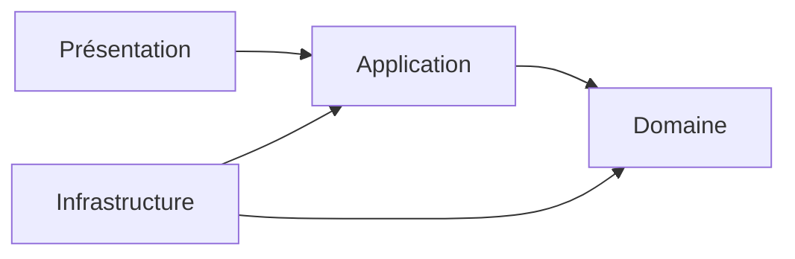
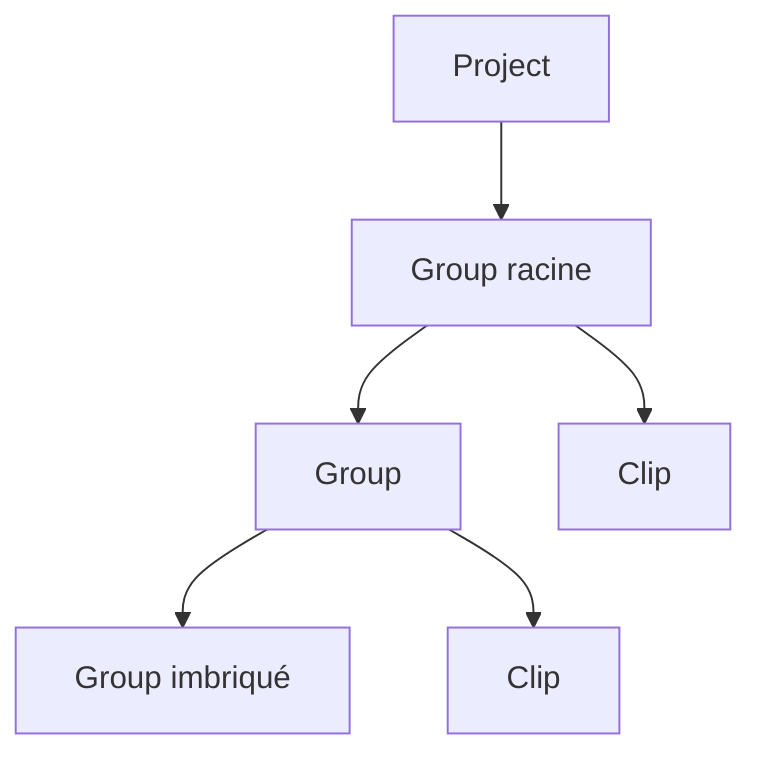
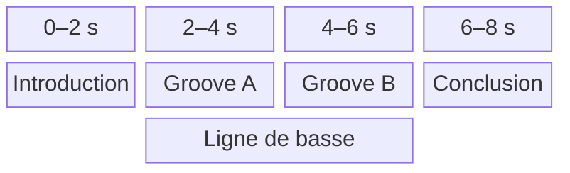

# Architecture

Ce document décrit l'architecture de Pianola, une application de piano roll avec instruments modulaires.

Il fixe le vocabulaire courant, les responsabilités des trois couches principales et leurs dépendances. Les études de cas détaillées sont regroupées dans [etudes-de-cas.md](etudes-de-cas.md).

## Navigation

- [Vue d'ensemble](#vue-densemble)
- [Périmètre fonctionnel](#périmètre-fonctionnel)
- [Domaine](#domaine)
- [Application](#application)
- [Présentation](#présentation)
- [Infrastructure](#infrastructure)
- [Dépendances architecturales](#dépendances-architecturales)
- [Questions ouvertes](#questions-ouvertes)
- [Arborescence cible](#arborescence-cible)

## Vue d'ensemble

Pianola sépare trois responsabilités :

| Couche | Responsabilité | Exemples |
| --- | --- | --- |
| Domaine | Représenter la composition et garantir ses invariants musicaux. | `Project`, `Group`, `Clip`, `Note`, temps musical |
| Application | Orchestrer l'édition et la lecture à partir du domaine. | état de l'éditeur, cas d'usage, ports |
| Infrastructure | Réaliser les capacités techniques demandées par l'application. | Web Audio, catalogue concret, persistance |



Le sens des dépendances de code pointe vers l'intérieur :

- le domaine ne connaît aucune autre couche ;
- l'application dépend du domaine et définit les ports dont elle a besoin ;
- l'infrastructure dépend du domaine et des ports applicatifs qu'elle implémente ;
- la présentation déclenche les cas d'usage et observe leur résultat.

## Périmètre fonctionnel

Pianola est destiné à l'écriture et au processus initial de composition, pas à la production audio.

Le premier périmètre comprend :

- une composition structurée en groupes et clips imbriqués ;
- des groupes lus en séquence ou simultanément ;
- des notes associées individuellement à un instrument ;
- des chronologies locales de tempo, de métrique et de contexte de hauteurs ;
- l'édition dans un piano roll ;
- la lecture du projet depuis la tête de lecture ou depuis la position dérivée d'un groupe ou d'un clip ;
- la préécoute ponctuelle d'une note ;
- le mute et le solo persistants des instruments ;
- des instruments modulaires intégrés et non éditables.

Il ne comprend pas :

- une vue d'arrangement multipiste où les clips seraient placés librement sur des pistes instrumentales ;
- les automations et événements de contrôle ;
- la création ou l'édition des patchs par l'utilisateur ;
- un état audio transitoire sauvegardé dans le projet.

Les `Note` sont donc le seul contenu musical des clips. Les changements de tempo, de métrique et de contexte de hauteurs sont des données structurelles, et non des automations.

---

## Domaine

Le domaine représente les intentions musicales indépendamment de React, Zustand, du stockage et du moteur Web Audio.

### Modèle de composition

Le `Project` possède un unique `rootGroup`. Ce groupe constitue la racine d'un arbre dont les nœuds sont des `Group` et les feuilles des `Clip`.



Chaque groupe ordonne ses enfants et définit leur mode de lecture. Chaque clip possède sa propre chronologie, son tempo, sa métrique, ses contextes de hauteurs et ses notes.

Les clips n'ont pas de position dans une timeline globale. Leur départ est dérivé de leur place dans l'arbre et du mode de lecture de leurs groupes ancêtres.

### Vue des concepts

| Concept | Nature | Rôle principal |
| --- | --- | --- |
| `Project` | Entity et racine d'agrégat | Posséder le document musical sauvegardé |
| `Group` | Entity interne | Ordonner des groupes ou clips et définir leur relation temporelle |
| `Clip` | Entity interne | Porter une section musicale et sa chronologie locale |
| `Note` | Entity interne | Représenter une note persistante associée à un instrument |
| `Instrument` | Entity de référence | Décrire publiquement un instrument intégré |
| `TempoChange` | Entity interne | Placer un tempo sur la chronologie d'un clip |
| `MeterChange` | Entity interne | Placer une métrique sur la chronologie d'un clip |
| `PitchContextChange` | Entity interne | Placer un contexte de hauteurs sur la chronologie d'un clip |

### Project

`Project` représente le document musical complet ouvert dans l'application.

Attributs possibles :

- `id` ;
- `name` ;
- `rootGroup` ;
- `mutedInstrumentIds` ;
- `soloedInstrumentIds` ;
- `createdAt` ;
- `updatedAt`.

Responsabilités et invariants :

- servir de racine de sauvegarde ;
- posséder l'unique groupe racine ;
- garantir la cohérence globale de l'arbre ;
- garantir qu'un élément non racine appartient à un seul groupe parent ;
- interdire les cycles ;
- permettre l'ajout, le déplacement, le regroupement et la suppression des éléments de l'arbre ;
- conserver les intentions de mute et de solo associées aux instruments.

Le groupe racine est un `Group` ordinaire et peut utiliser n'importe quel `PlaybackMode` pris en charge. Un groupe vide est valide.

Le projet ne porte ni tempo ni métrique globaux. Ces propriétés appartiennent à chaque clip.

Les ensembles `mutedInstrumentIds` et `soloedInstrumentIds` sont des données persistantes du projet. Ils référencent les instruments sans modifier les objets partagés du catalogue.

### Group

`Group` représente un ensemble ordonné de clips ou d'autres groupes.

```ts
type GroupItem = Clip | Group;
type PlaybackMode = "SEQUENTIAL" | "SIMULTANEOUS";
```

Attributs possibles :

- `id` ;
- `name` ;
- `playbackMode` ;
- `items`.

Sémantique des modes initiaux :

| Mode | Départ des enfants | Fin du groupe |
| --- | --- | --- |
| `SEQUENTIAL` | Chaque enfant commence à la fin du précédent. | Fin du dernier enfant lu. |
| `SIMULTANEOUS` | Tous les enfants commencent au même instant. | Fin de l'enfant le plus long. |

`PlaybackMode` est extensible. Chaque nouveau mode devra définir la planification des enfants, ses points d'entrée autorisés et sa condition de fin.

Responsabilités et invariants :

- contenir et ordonner ses enfants ;
- exprimer leur relation temporelle sans leur attribuer de position globale ;
- permettre l'imbrication de séquences et de superpositions ;
- préserver un ordre significatif pour la structure et l'affichage, y compris en mode simultané.

Un groupe ne possède ni tempo, ni métrique, ni chronologie locale. Il ne porte pas non plus de `repeatCount` ou d'`isBypassed` dans le premier périmètre.

Il ne possède pas de durée canonique en ticks : des enfants simultanés peuvent convertir leurs ticks en temps réel avec des tempos différents. Sa durée de lecture est dérivée par l'application.

### Clip

`Clip` représente une section musicale éditable, copiable, réordonnable et répétable.

Attributs possibles :

- `id` ;
- `name` ;
- `duration` ;
- `isBypassed` ;
- `repeatCount` ;
- `notes` ;
- `tempoChanges` ;
- `meterChanges` ;
- `pitchContextChanges`.

Responsabilités et invariants :

- définir sa durée canonique en ticks ;
- contenir des notes positionnées relativement à son début ;
- contenir et ordonner ses trois chronologies locales ;
- fournir le tempo, la métrique et le contexte de hauteurs actifs à une position ;
- conserver son bypass et son nombre de lectures dans la sauvegarde ;
- garantir la cohérence locale de ses notes et changements.

`repeatCount` vaut `1` par défaut. Il accepte uniquement un entier strictement positif et indique le nombre total de lectures du clip. Toute branche possède ainsi une durée structurelle finie.

`isBypassed` permet de contourner un clip sans le retirer de l'arbre. Il reste indépendant de `repeatCount`, afin qu'un clip puisse être désactivé puis réactivé sans perdre son nombre de lectures.

Un clip ne possède pas de position globale. Lorsqu'il est bypassé avant son activation, il ne contribue pas à la durée de lecture de son groupe parent et n'apparaît pas dans la timeline dérivée.

### Note

`Note` représente une note placée dans un clip et associée à un instrument.

Attributs possibles :

- `id` ;
- `pitch` ;
- `range` ;
- `velocity` ;
- `instrumentId`.

Une note possède une identité afin de conserver sa continuité lorsqu'elle est déplacée, redimensionnée, transposée ou modifiée. Une copie ou une duplication reçoit une nouvelle identité.

Invariants :

- la position de début est positive ou nulle ;
- la durée est strictement positive ;
- la note se termine au plus tard à la fin du clip ;
- la hauteur et la vélocité restent dans leurs plages valides ;
- exactement un `InstrumentId` est présent ;
- l'appartenance au `PitchContext` actif est calculée à partir de la position de début et n'est pas sauvegardée ;
- une note extérieure au contexte de hauteurs actif reste valide.

Modifier le tempo ou la métrique ne déplace pas la note : sa position et sa durée restent exprimées dans les ticks canoniques du clip.

Les événements instantanés `NoteOn` et `NoteOff` ne sont pas des objets persistants du domaine. Ils sont produits par le service de lecture.

`Velocity` ne possède actuellement aucun usage indépendant de `Note`. Son type et ses règles sont déclarés dans `domain/Note.ts`.

### Instrument

`Instrument` est la représentation publique, stable et minimale d'un instrument intégré.

Attributs possibles :

- `id` ;
- `name`.

`InstrumentId` est un type stable et opaque déclaré avec `Instrument` dans `domain/Instrument.ts`.

Une `Note` sauvegarde uniquement cet identifiant, et non une référence directe vers l'objet `Instrument`. Plusieurs instruments peuvent coexister dans un même clip, et plusieurs clips peuvent référencer le même instrument.

`Instrument` appartient à un modèle de référence distinct de l'agrégat `Project`. Il ne contient ni patch, ni politique d'allocation des voix, ni état du moteur audio.

Les instruments sont définis avant la compilation et ne sont pas éditables par l'utilisateur. La politique de chargement d'un `InstrumentId` devenu indisponible sera définie avec la persistance.

Le mute et le solo ne sont pas des propriétés de l'`Instrument` partagé. Le `Project` conserve les `InstrumentId` concernés afin d'exprimer une intention de lecture propre au document.

Un instrument est audible lorsqu'il n'est pas muté et qu'aucun solo n'est actif, ou lorsqu'il appartient lui-même à l'ensemble des instruments solo. Si un identifiant est simultanément muté et solo, le mute est prioritaire.

Cette règle s'applique à toutes les notes portant cet `InstrumentId`, quels que soient leur clip, leur répétition ou leur `PlaybackContext`. Elle filtre la production sonore sans modifier les positions ni les durées de la composition.

### Temps musical

Le temps musical canonique utilise des ticks entiers avec une résolution fixe de 960 ticks par noire.

Les battements, mesures et secondes sont des représentations dérivées. La grille visible ne contraint jamais les positions ou durées conservées par le domaine.

| Value Object | Représentation | Règles principales |
| --- | --- | --- |
| `TimePosition` | `ticks` | Entier positif ou nul, local au clip |
| `Duration` | `ticks` | Entier strictement positif |
| `TimeRange` | `start`, `duration` | Intervalle utilisé notamment par une note |
| `Tempo` | `bpm` | Valeur musicalement exploitable |
| `Meter` | `beatsPerMeasure`, `beatUnit` | Permet de calculer les frontières de mesure |
| `Pitch` | `midiNumber` | Le nom et l'octave peuvent être dérivés |
| `PitchContext` | `label`, `pitchClasses` | Ensemble descriptif de classes de hauteurs |

Avec une résolution de 960 ticks par noire :

```text
ticksPerMeasure = beatsPerMeasure * (4 / beatUnit) * 960
```

`TimeRange` facilite notamment la détection des chevauchements ainsi que les opérations de déplacement et de redimensionnement.

`PitchContext` peut représenter une gamme, un mode, un accord ou un ensemble arbitraire de classes de hauteurs. Il permet à l'éditeur de mettre en évidence les hauteurs intérieures et extérieures, sans valider ni refuser les notes.

### Chronologies du clip

Un clip possède trois collections ordonnées de changements :

| Changement | Valeur | Changement initial au tick `0` | Positions suivantes |
| --- | --- | --- | --- |
| `TempoChange` | `Tempo` | Obligatoire | N'importe quel tick du clip |
| `MeterChange` | `Meter` | Obligatoire | Frontière de mesure |
| `PitchContextChange` | `PitchContext` | Facultatif | N'importe quel tick du clip |

Chaque changement possède une identité, une position et sa nouvelle valeur. Les règles communes sont :

- un seul changement d'un même type peut exister à une position ;
- la nouvelle valeur s'applique à partir de la position du changement, incluse ;
- un changement peut être déplacé ou modifié sans perdre son identité ;
- un changement ferme la section précédente et commence la suivante ;
- un changement reste compris dans les bornes du clip.

Avant le premier `PitchContextChange`, aucun contexte de hauteurs n'est actif. Un changement de chaque type peut exister au même tick.

Les marqueurs visibles dans l'éditeur sont la représentation des changements existants. Ils ne forment pas un type métier générique supplémentaire.

### Sections dérivées

`TempoSection`, `MeterSection` et `PitchContextSection` sont des vues dérivées. Chacune couvre l'intervalle entre un changement et le changement suivant du même type, ou entre ce changement et la fin du clip.

Elles ne sont pas sauvegardées comme des objets autonomes.

| Section | Valeurs dérivées | Usage principal |
| --- | --- | --- |
| `TempoSection` | `start`, `end`, `tempo` | Conversion des ticks en temps réel |
| `MeterSection` | `start`, `end`, `meter`, découpage en mesures | Repères métriques et frontières de mesure |
| `PitchContextSection` | `start`, `end`, `context` | Recherche du contexte actif |

Pour une `MeterSection` :

```text
fullMeasureCount = floor(sectionDuration / ticksPerMeasure)
trailingMeasureDuration = sectionDuration % ticksPerMeasure
```

Une valeur non nulle de `trailingMeasureDuration` représente une dernière mesure incomplète. Le changement suivant constitue alors une frontière explicite et commence une nouvelle mesure.

### Frontière de l'agrégat

`Project` est la racine de l'unique agrégat constituant le document de composition sauvegardé.

Il possède :

- son unique `rootGroup` et tous ses descendants ;
- les notes appartenant à chaque clip ;
- les changements appartenant à chaque chronologie ;
- ses informations de sauvegarde.

Les entités internes conservent des identifiants stables afin d'être ciblées par l'éditeur et les cas d'usage. Elles ne possèdent cependant ni repository ni cycle de persistance autonomes.

Une opération peut être déléguée à un `Group` ou à un `Clip` pour préserver ses invariants locaux, mais l'entité est toujours atteinte depuis le `Project` chargé.

Les `Instrument` sont extérieurs à cet agrégat et sont fournis par un catalogue.

---

## Application

La couche applicative traduit les intentions de l'utilisateur en opérations sur le domaine et orchestre les interactions avec l'extérieur à travers des ports.

Elle possède l'état transitoire de l'éditeur et les états d'orchestration nécessaires à la lecture. Elle ne contient ni patch audio, ni `AudioNode`, ni détail de stockage.

### État de l'éditeur

L'état de l'éditeur décrit le contexte dans lequel l'utilisateur manipule la composition. Sa modification ne change pas, à elle seule, le contenu musical du projet.

#### Sélections

Deux sélections indépendantes correspondent à deux espaces d'édition distincts.

```ts
type ClipContentRef =
  | { kind: "NOTE"; noteId: NoteId }
  | { kind: "TEMPO_CHANGE"; tempoChangeId: TempoChangeId }
  | { kind: "METER_CHANGE"; meterChangeId: MeterChangeId }
  | {
      kind: "PITCH_CONTEXT_CHANGE";
      pitchContextChangeId: PitchContextChangeId;
    };

interface ClipContentSelection {
  items: readonly ClipContentRef[];
}

type GraphContentRef =
  | { kind: "CLIP"; clipId: ClipId }
  | { kind: "GROUP"; groupId: GroupId };

interface GraphContentSelection {
  items: readonly GraphContentRef[];
}
```

`ClipContentSelection` contient les notes et changements du clip actuellement édité. Tous ses éléments appartiennent au clip désigné par `editedClipId`. Elle est vidée lorsque ce clip change ou est fermé.

`GraphContentSelection` contient les clips et groupes sélectionnés dans le graphe de composition. Elle sert notamment au regroupement, au déplacement, à la duplication et à la suppression d'éléments structurels.

```ts
interface EditorState {
  editedClipId?: ClipId;
  clipContentSelection: ClipContentSelection;
  graphContentSelection: GraphContentSelection;
}
```

Le clip édité et la sélection structurelle expriment des faits différents. Un geste d'interface peut les mettre à jour ensemble, mais aucun lien implicite n'est imposé entre eux.

La couche applicative choisit explicitement la sélection correspondant à l'action, résout ses références et transmet au domaine les identifiants concernés. Le domaine ne connaît jamais la notion de sélection.

#### GridResolution

`GridResolution` représente la précision de la grille utilisée pendant l'édition.

Attribut possible :

- `snapStepTicks`.

Elle permet de convertir un geste en position ou durée quantifiée avant l'appel au domaine. La quantification guide l'édition sans rendre le modèle musical dépendant d'une grille.

Les sélections et la résolution de grille ne sont pas sauvegardées comme des données musicales. Leur persistance éventuelle relève des préférences ou de la restauration de session.

#### Tête de lecture

La tête de lecture est un état applicatif transitoire exprimé par une `ProjectTime`, distincte des `TimePosition` locales aux clips. Sa position appartient à la timeline globale dérivée du projet et n'est pas sauvegardée dans l'agrégat.

Sa position initiale est le début du projet. Elle peut être déplacée directement par l'utilisateur ou résolue à partir du début global d'un `Group` ou d'un `Clip`.

### Cas d'usage d'édition

Les cas d'usage d'édition :

- traduisent les gestes en commandes explicites ;
- choisissent la sélection adaptée à la portée de l'action ;
- résolvent les références vers les entités du projet ;
- appliquent si nécessaire la quantification ;
- délèguent au domaine les mutations qui protègent ses invariants ;
- chargent et sauvegardent le projet à travers des ports.

Exemples :

- déplacer ou transposer des notes ;
- redimensionner un clip ;
- ajouter, déplacer ou supprimer un changement ;
- créer, imbriquer, déplacer, réordonner ou supprimer un groupe ;
- changer le `PlaybackMode` d'un groupe ;
- modifier le `repeatCount` ou le bypass d'un clip ;
- associer un instrument disponible à une ou plusieurs notes.

Aucun `EditorService` générique n'est introduit. Les services seront nommés et ajoutés dans `application/use-cases/` lorsque leurs responsabilités précises seront établies.

#### Modification de la métrique

Changer une métrique exprime explicitement l'une de deux intentions :

| Politique | Effet |
| --- | --- |
| `PRESERVE_DURATION` | Conserve les ticks des notes, des marqueurs et de la fin de section. Le nombre de mesures est recalculé. |
| `PRESERVE_MEASURE_COUNT` | Recalcule la borne de fin selon la nouvelle longueur de mesure. |

Dans le premier périmètre, `PRESERVE_MEASURE_COUNT` s'applique à un clip vide ou à une section terminale vide, afin de ne pas imposer de déplacement en cascade aux sections suivantes.

Lors de la création d'un clip, le cas d'usage reçoit un nombre de mesures, une métrique et un tempo, puis calcule sa durée canonique en ticks. Un clip vide conserve par défaut son nombre de mesures. Une section contenant des notes ou suivie d'autres sections conserve par défaut sa durée.

### PlaybackService

`PlaybackService` est le cas d'usage qui interprète l'arbre de composition, construit sa timeline dérivée et produit les commandes nécessaires à sa lecture.

#### Interface publique

```ts
type StopMode = "GRACEFUL" | "IMMEDIATE";

play(): PlaybackSessionId;
play(itemId: GroupId | ClipId): PlaybackSessionId;
preview(noteId: NoteId): PlaybackSessionId;
stop(sessionId: PlaybackSessionId, mode?: StopMode): void;
stopTransport(mode?: StopMode): void;
```

#### Lecture du projet

Toute opération `play` ouvre une session `PROJECT` et conserve le projet entier comme portée de lecture.

`play()` commence à la position actuelle de la tête de lecture. Cette position vaut le début du projet tant qu'elle n'a pas été déplacée.

`play(itemId)` utilise le groupe ou le clip comme repère temporel :

- le service résout son instant de début dans la timeline globale dérivée ;
- il place la tête de lecture à cet instant ;
- il lit le projet depuis cette position, et non le seul sous-arbre ciblé ;
- `play(rootGroup.id)` replace donc la tête au début et redémarre le projet.

Tout `Group` ou `Clip` est un repère valide. Un descendant d'un groupe `SIMULTANEOUS` partage éventuellement son instant de départ avec d'autres branches : celles qui sont actives à la position obtenue participent également à la lecture.

L'identifiant transmis à `play` ne devient ni la racine de la session ni une frontière de parcours. Il sert uniquement à déterminer la position de départ.

#### Préécoute d'une note

`preview(noteId)` auditionne uniquement la note ciblée. Cette opération :

- ne déplace pas la tête de lecture ;
- ne parcourt aucun groupe ou clip ;
- ouvre une session `NOTE_PREVIEW` indépendante ;
- peut coexister avec le transport et avec d'autres préécoutes de notes ;
- respecte le mute et le solo de son `InstrumentId`, comme dans tout autre contexte.

Il n'existe aucune préécoute bornée de groupe ou de clip. Leur bouton de lecture déclenche toujours une lecture globale avec `play(itemId)`.

#### Timeline dérivée, parcours et durée

Les clips et groupes ne sauvegardent aucune position globale. Le service projette récursivement les éléments actifs de l'arbre vers une timeline d'exécution contenant notamment leur début, leur fin et les activations de clips qui peuvent se chevaucher. Les éléments bypassés restent dans le graphe, mais sont exclus de cette projection.

Le calcul suit les règles suivantes :

- un groupe `SEQUENTIAL` transmet la fin de chaque enfant comme départ du suivant ;
- un groupe `SIMULTANEOUS` transmet le même départ à tous ses enfants et se termine avec le plus long ;
- un clip bypassé avant son activation est ignoré, ne produit aucune activation et n'apparaît pas dans la timeline dérivée ;
- chaque répétition recommence au tick `0` avec les chronologies initiales du clip ;
- `repeatCount` étant fini, chaque élément possède une durée et une position globale finies.

Le calcul structurel peut être décrit par :

```text
schedule(item, startTime) -> endTime
```

La timeline aplatie n'est pas une simple liste séquentielle : elle représente des intervalles et des activations susceptibles de se chevaucher. La planification peut rester glissante et bornée pour limiter le volume de commandes préparées.

Chaque clip convertit indépendamment ses ticks vers le temps réel en intégrant ses propres `TempoSection`.

Lorsqu'une lecture commence à une position où plusieurs branches sont actives, le service doit reprendre chacune à sa position locale correspondante. La politique applicable aux notes ayant commencé avant cette position reste une question ouverte.

#### Audibilité des instruments

Le `PlaybackService` consulte les ensembles persistants `mutedInstrumentIds` et `soloedInstrumentIds` du projet avant de produire les commandes audio.

Le mute et le solo :

- s'appliquent par `InstrumentId`, indépendamment des clips et contextes ;
- ne changent ni le parcours, ni les positions, ni les durées de la timeline ;
- empêchent seulement la production des commandes correspondant aux notes inaudibles ;
- s'appliquent également à `preview(noteId)`.

Le bypass reste distinct : il cible un clip, supprime son activation de la timeline dérivée et modifie la position des éléments suivants lorsque la structure est séquentielle.

#### Modification du bypass pendant la lecture

Si `isBypassed` passe à `true` avant l'activation d'un clip, celui-ci est ignoré.

Si son itération a déjà commencé :

- l'itération atteint sa fin structurelle ;
- aucune répétition supplémentaire n'est lancée ;
- le parcours reprend ensuite si l'arbre le permet ;
- les notes déjà attaquées suivent leur relâchement naturel ;
- leurs releases et tails ne prolongent pas la durée structurelle du clip.

#### Identités d'exécution

La lecture utilise trois niveaux d'identité opaques et transitoires :

| Identité | Portée |
| --- | --- |
| `PlaybackSessionId` | Une opération globale de lecture ou une préécoute de note |
| `PlaybackContextId` | Une unité audio isolée appartenant à une session |
| `NoteOccurrenceId` | Une attaque précise dans un contexte |

Une nouvelle occurrence est créée à chaque attaque, y compris lors des répétitions. Deux notes utilisant le même instrument, la même hauteur et le même instant restent ainsi indépendantes.

Un nouveau contexte est créé :

- à chaque activation d'un clip ;
- à chaque préécoute de note.

Les répétitions d'une même activation de clip réutilisent le contexte et ses instances d'instrument, mais produisent de nouvelles occurrences de notes.

Les identifiants persistants `ClipId` et `NoteId` restent connus du domaine et du service. Ils ne sont pas transmis au moteur audio.

#### Sessions et concurrence

```ts
type PlaybackSessionKind = "PROJECT" | "NOTE_PREVIEW";
```

Les sessions se répartissent en deux catégories :

| Catégorie | Kind | Règle de concurrence |
| --- | --- | --- |
| Transport | `PROJECT` | Une seule session peut planifier de nouvelles commandes |
| Audition | `NOTE_PREVIEW` | Plusieurs sessions peuvent coexister entre elles et avec le transport |

Le service conserve un `activeTransportSessionId` optionnel et un ensemble de `notePreviewSessionIds`.

Démarrer une nouvelle lecture avec `play` retire immédiatement son rôle au transport précédent et annule ses attaques futures. Ses contextes peuvent néanmoins subsister jusqu'à la fin de leurs releases et tails ; cela ne constitue pas un second transport actif.

`preview(noteId)` ne remplace jamais le transport.

`stop(sessionId, mode)` cible exactement la session indiquée. `stopTransport(mode)` cible uniquement le transport actif et n'affecte aucune préécoute de note.

Le mode par défaut est `GRACEFUL` :

- les attaques futures sont annulées ;
- les occurrences actives sont relâchées immédiatement ;
- les contextes laissent leurs releases et tails se terminer.

`IMMEDIATE` détruit sans délai les contextes ciblés et leur sortie sonore.

Le remplacement d'un transport suit la politique `GRACEFUL`.

Les scénarios complets sont décrits dans [etudes-de-cas.md](etudes-de-cas.md).

### Ports applicatifs

Les ports décrivent les capacités extérieures attendues par l'application sans imposer leur implémentation.

#### AudioEngine

`AudioEngine` accepte des identités d'exécution et des commandes audio sans exposer les patchs, les instances d'instrument ou les objets Web Audio.

```ts
type AudioCommand = {
  contextId: PlaybackContextId;
  at: number;
} & (
  | {
      kind: "NOTE_ON";
      occurrenceId: NoteOccurrenceId;
      instrumentId: InstrumentId;
      pitch: Pitch;
      velocity: Velocity;
    }
  | {
      kind: "NOTE_OFF";
      occurrenceId: NoteOccurrenceId;
    }
);

interface AudioEngine {
  openSession(
    sessionId: PlaybackSessionId,
    kind: PlaybackSessionKind
  ): void;

  openContext(
    sessionId: PlaybackSessionId,
    contextId: PlaybackContextId
  ): void;

  schedule(commands: readonly AudioCommand[]): void;
  completeContext(contextId: PlaybackContextId): void;
  stopContext(contextId: PlaybackContextId, mode: StopMode): void;
  stopSession(sessionId: PlaybackSessionId, mode: StopMode): void;
}
```

`openContext` enregistre une seule fois la relation entre le contexte et sa session propriétaire. Chaque `AudioCommand` transporte donc uniquement son `contextId`, placé dans la partie commune de l'union.

Cette commande reste autonome lorsqu'elle est mise en file, triée ou transmise à un processeur audio. Le moteur retrouve sa session en remontant depuis le contexte ; répéter le `PlaybackSessionId` dans chaque commande serait inutile.

`completeContext` signale la fin structurelle et autorise le drainage naturel. `stopContext` et `stopSession` demandent un arrêt selon le `StopMode` indiqué.

`InstrumentDefinition`, `InstrumentInstance`, `AudioNode` et `AudioContext` ne traversent jamais ce port.

#### InstrumentCatalog

`InstrumentCatalog` est un port de consultation permettant :

- de lister les `Instrument` disponibles ;
- d'obtenir un `Instrument` à partir de son `InstrumentId` ;
- de vérifier si un identifiant peut être résolu.

Il retourne directement les objets `Instrument` du domaine. Aucun modèle de sortie intermédiaire, patch, paramètre audio ou détail d'allocation des voix ne traverse ce port.

Les futurs ports de persistance seront définis avec les cas d'usage correspondants. Aucun dossier générique `application/contracts/` n'est nécessaire : les ports possèdent leurs modèles d'échange et les types métier restent dans le domaine.

---

## Présentation

La présentation offre une vue temporelle du graphe de composition. Elle projette les `Group` et les `Clip` sur une timeline globale sans créer un second modèle de composition.

### Timeline globale

L'axe horizontal représente la `ProjectTime` dérivée depuis le début du projet. L'axe vertical empile les clips afin que les séquences, les superpositions et leurs durées relatives restent visibles simultanément.

La structure du cas 3 peut ainsi être représentée de manière conceptuelle :



Dans cette projection :

| Élément visuel | Signification |
| --- | --- |
| Position horizontale | Instant global de début dérivé du graphe |
| Longueur d'un bloc | Durée réelle du clip, répétitions comprises |
| Ligne verticale | Emplacement d'un clip dans l'empilement |
| Blocs alignés ou chevauchants | Branches actives simultanément |
| Tête de lecture verticale | Position utilisée par `play()` |
| Mise en sourdine visuelle | État mute ou solo, sans changement de géométrie |

Les clips restent ordonnés verticalement selon une règle de présentation stable issue du parcours du graphe. Les groupes peuvent être matérialisés par des bandes, des accolades ou des niveaux de regroupement, mais ils ne deviennent pas des pistes persistantes.

La timeline applique directement la sémantique du transport :

- `play()` commence à la tête de lecture affichée ;
- `play(itemId)` déplace la tête au début horizontal dérivé de l'élément puis démarre la lecture globale ;
- plusieurs clips traversés par la tête peuvent appartenir au même instant de lecture ;
- `preview(noteId)` ne déplace ni la tête ni la timeline.

Le bypass modifie la géométrie temporelle dérivée : un clip bypassé n'y apparaît pas et les éléments séquentiels suivants sont avancés. Le mute et le solo modifient uniquement l'apparence et l'audibilité des notes concernées ; les blocs conservent leurs positions et leurs dimensions.

La présentation consomme cette projection depuis la couche applicative. Toute interaction structurelle réalisée depuis la timeline est traduite en opération sur le graphe, puis la projection est recalculée. Aucune coordonnée horizontale ou verticale n'est sauvegardée dans le domaine.

---

## Infrastructure

L'infrastructure contient les implémentations techniques des ports applicatifs. Elle peut être remplacée sans modifier le cœur de la composition.

### Infrastructure audio

L'infrastructure audio possède :

- le catalogue concret des instruments intégrés ;
- leurs définitions techniques et leurs patchs ;
- les sessions et contextes d'exécution ;
- les instances d'instrument ;
- le moteur Web Audio concret.

Le moteur et son `AudioContext` Web Audio sont globaux. Un `PlaybackContext` constitue un périmètre logique et un sous-graphe audio, pas un nouvel `AudioContext` natif.

### StaticInstrumentCatalog

`StaticInstrumentCatalog` est l'implémentation concrète du port `InstrumentCatalog` et la source de vérité des instruments intégrés.

Il conserve une collection immuable d'`InstrumentDefinition` :

- la couche applicative le manipule à travers `InstrumentCatalog`, qui n'expose que les `Instrument` publics ;
- le moteur audio concret l'utilise directement pour résoudre un `InstrumentId` vers sa définition technique.

Cette résolution interne à l'infrastructure ne nécessite pas de second port ni de registre parallèle.

### InstrumentDefinition

`InstrumentDefinition` est la définition technique complète, immuable et partagée d'un instrument intégré.

Attributs possibles :

- `instrument` ;
- `patch` ;
- `voiceAllocation`.

Elle associe l'`Instrument` public à son patch, définit l'allocation de ses voix et peut fournir les informations nécessaires pour borner ses tails.

`voiceAllocation` peut préciser :

- un mode `MONOPHONIC` ou `POLYPHONIC` ;
- un nombre maximal de voix ;
- une politique de vol de voix ;
- une priorité ou une politique de retrigger pour un instrument monophonique.

Ces politiques s'appliquent par `InstrumentInstance`. Une limite globale du moteur peut protéger les ressources, mais ne constitue pas la politique musicale de l'instrument.

### PlaybackSession

`PlaybackSession` est l'état technique transitoire d'une opération globale. Elle possède les contextes ouverts pour cette opération et permet leur arrêt collectif.

Une session remplacée ne devient pas elle-même `DRAINING`. Elle subsiste uniquement comme propriétaire de contextes éventuellement en drainage, puis est détruite lorsqu'ils sont tous `DISPOSED`.

### PlaybackContext

`PlaybackContext` est une unité de lecture audio isolée dans une session.

Il possède notamment :

- un bus de sortie propre ;
- une table `InstrumentId -> InstrumentInstance` ;
- une table `NoteOccurrenceId -> VoiceHandle` ;
- les commandes programmées qui doivent pouvoir être annulées ;
- un état `SCHEDULED`, `ACTIVE`, `DRAINING` ou `DISPOSED`.

`DRAINING` appartient exclusivement au cycle de vie du contexte. Il commence après la fin structurelle ou un arrêt gracieux, lorsque des releases ou tails restent audibles.

Un contexte de clip correspond à une activation audio du clip. Le `ClipId` d'origine et la correspondance entre le clip et son contexte restent une connaissance du `PlaybackService`.

Une préécoute de note utilise le même type de contexte. Sa session `NOTE_PREVIEW` indique déjà la nature de l'opération, tandis que sa commande `NOTE_ON` porte l'`InstrumentId`. Aucun descripteur de contexte supplémentaire n'est nécessaire.

Les groupes ne possèdent pas de contexte audio dans le premier périmètre, puisqu'ils n'ont ni gain, ni bus, ni effet propre. Une session de groupe contient les contextes des clips effectivement activés dans son sous-arbre.

### InstrumentInstance

`InstrumentInstance` est l'état audio mutable créé à partir d'une `InstrumentDefinition`.

Une instance appartient exclusivement à un `PlaybackContext` et possède ses voix, phases, enveloppes, filtres, effets et son allocateur de voix.

Pour un contexte, une seule instance est créée paresseusement par `InstrumentId`. Deux contextes utilisant le même instrument possèdent des instances indépendantes, mais partagent sa définition et ses ressources statiques immuables.

### Patch modulaire

| Concept | Rôle | Attributs possibles |
| --- | --- | --- |
| `ModularPatch` | Décrire le graphe statique d'un instrument | `modules`, `connections`, `outputModuleId` |
| `AudioModule` | Décrire un module audio ou de contrôle | `id`, `type`, `parameters`, `inputs`, `outputs` |
| `ModuleConnection` | Relier deux ports | `sourcePort`, `targetPort` |
| `ModulePort` | Identifier un point de connexion | `moduleId`, `portName`, `signalType` |

`ModularPatch` garantit la cohérence technique des connexions et décrit le parcours du signal et des modulations.

Les types de signal initiaux sont `audio`, `control`, `gate` et `trigger`.

### Ressources audio partagées

Les données immuables coûteuses sont mutualisées entre les instances :

- échantillons décodés ;
- tables d'ondes ;
- réponses impulsionnelles ;
- descriptions de patch ;
- code des processeurs audio.

Les objets qui possèdent un état temporel restent propres à chaque instance : enveloppes, filtres, oscillateurs, effets et allocateurs de voix.

La création des instances est paresseuse, mais peut être anticipée dans la fenêtre de planification avant le premier `NOTE_ON`. Une instance peut rejoindre un pool uniquement si elle est entièrement réinitialisable et n'est plus utilisée par aucun contexte.

### WebAudioEngine

Le moteur audio concret implémente `AudioEngine`, instancie les sous-graphes propres aux contextes et produit leur mixage dans l'`AudioContext` global.

Il assure :

- la gestion des sessions et contextes ;
- la résolution des instruments auprès de `StaticInstrumentCatalog` ;
- la création d'une instance par couple `(PlaybackContext, InstrumentId)` ;
- l'exécution des patchs modulaires ;
- la planification temporelle des commandes ;
- la création et le relâchement ciblé des occurrences ;
- l'application des politiques de voix par instance ;
- l'annulation des commandes d'un contexte ou d'une session ;
- le drainage puis la destruction des contextes ;
- la mutualisation des ressources statiques ;
- les limites globales de sécurité et la sortie audio.

Tout cet état est transitoire et n'est jamais sauvegardé dans le `Project`.

### Persistance

L'infrastructure de persistance chargera et sauvegardera l'agrégat `Project` complet à travers les futurs ports applicatifs dédiés.

La stratégie applicable lorsqu'un `InstrumentId` sauvegardé ne peut plus être résolu n'est pas encore définie. Elle sera traitée avec la conception de la persistance.

---

## Dépendances architecturales

Les frontières suivantes sont obligatoires :

| Depuis | Dépend de | Ne connaît pas |
| --- | --- | --- |
| Domaine | Aucun élément extérieur | sélection, grille, cas d'usage, ports, Web Audio, stockage |
| Application | Domaine et ports qu'elle définit | implémentations concrètes, patchs, `AudioNode` |
| Infrastructure | Domaine et ports applicatifs | composants et état de présentation |
| Présentation | API applicative et modèles d'affichage | définitions et instances audio internes |

Quelques relations structurantes :

- `Project.rootGroup` possède la racine de l'arbre sauvegardé ;
- `Group.items` ordonne des `Clip` ou d'autres `Group` ;
- `Note.instrumentId` référence un instrument sans importer sa définition technique ;
- `Project.mutedInstrumentIds` et `Project.soloedInstrumentIds` conservent les intentions d'audibilité par instrument ;
- `PlaybackService` dérive la timeline du graphe puis transforme la portion lue en commandes pour `AudioEngine` ;
- `InstrumentCatalog` expose les instruments disponibles à l'application ;
- `StaticInstrumentCatalog` implémente ce port et fournit les définitions au moteur concret ;
- `PlaybackSession` possède des `PlaybackContext` ;
- chaque contexte possède au plus une `InstrumentInstance` par `InstrumentId`.

## Questions ouvertes

- Lorsqu'une lecture commence au milieu d'une note déjà engagée dans la timeline, faut-il ignorer cette note, la réattaquer pour sa durée restante ou reconstruire son état par une politique de note chase ?
- Lorsqu'un mute ou un solo change pendant que des occurrences de l'instrument concerné sont actives ou déjà planifiées, faut-il les relâcher, les laisser se terminer ou replanifier la fenêtre courante ?
- Que devient exactement la tête de lecture après une fin naturelle, un `stop` gracieux ou un `stop` immédiat ?
- Si la structure ou les tempos sont modifiés alors que la tête est positionnée, faut-il préserver son temps global, son repère structurel ou sa position locale dans un clip ?
- Déplacer la tête pendant un transport actif doit-il provoquer immédiatement une nouvelle session `PROJECT`, ou seulement fixer le point de départ du prochain appel à `play()` ?

## Arborescence cible

Cette arborescence documente les frontières actuelles. Elle exprime des responsabilités et non l'obligation de créer un fichier autonome pour chaque type.

```text
src/
├── domain/
│   ├── Project.ts
│   ├── Instrument.ts
│   ├── Group.ts
│   ├── Clip.ts
│   ├── Note.ts
│   ├── time/
│   │   ├── TimePosition.ts
│   │   ├── Duration.ts
│   │   ├── TimeRange.ts
│   │   ├── Tempo.ts
│   │   ├── TempoChange.ts
│   │   ├── TempoSection.ts
│   │   ├── Meter.ts
│   │   ├── MeterChange.ts
│   │   └── MeterSection.ts
│   └── pitch/
│       ├── Pitch.ts
│       ├── PitchContext.ts
│       ├── PitchContextChange.ts
│       └── PitchContextSection.ts
├── application/
│   ├── editor/
│   │   ├── EditorState.ts
│   │   ├── Selection.ts
│   │   └── GridResolution.ts
│   ├── use-cases/
│   │   └── PlaybackService.ts
│   └── ports/
│       ├── AudioEngine.ts
│       └── InstrumentCatalog.ts
├── infrastructure/
│   ├── audio/
│   │   ├── catalog/
│   │   │   ├── StaticInstrumentCatalog.ts
│   │   │   └── InstrumentDefinition.ts
│   │   ├── modular/
│   │   │   ├── ModularPatch.ts
│   │   │   ├── AudioModule.ts
│   │   │   ├── ModuleConnection.ts
│   │   │   └── ModulePort.ts
│   │   └── engine/
│   │       ├── WebAudioEngine.ts
│   │       ├── PlaybackSession.ts
│   │       ├── PlaybackContext.ts
│   │       ├── InstrumentInstance.ts
│   │       ├── InstrumentInstanceFactory.ts
│   │       └── SharedAudioResources.ts
│   └── persistence/
└── presentation/
    ├── components/
    └── stores/
```

Les objets centraux restent à la racine de `domain/`. Les concepts temporels sont regroupés dans `time/` et les concepts de hauteurs dans `pitch/`. Ces sous-ensembles restent indépendants de l'agrégat : `Clip` peut connaître `MeterChange`, mais `MeterChange` ne connaît pas `Clip`.

`Instrument` et `InstrumentId` sont déclarés ensemble dans `domain/Instrument.ts`. `Velocity` reste déclaré avec `Note`.

`ClipContentSelection`, `GraphContentSelection` et leurs références peuvent rester réunies dans `application/editor/Selection.ts`.

`ProjectTime` et l'état de la tête de lecture appartiennent à l'application. `PlaybackSessionId`, `PlaybackContextId`, `NoteOccurrenceId`, `PlaybackSessionKind`, `AudioCommand` et `StopMode` forment le langage du port `AudioEngine` et peuvent être déclarés avec lui.

Un module `application/playback/` ne deviendra utile que si ce vocabulaire acquiert plusieurs consommateurs ou des comportements indépendants.
