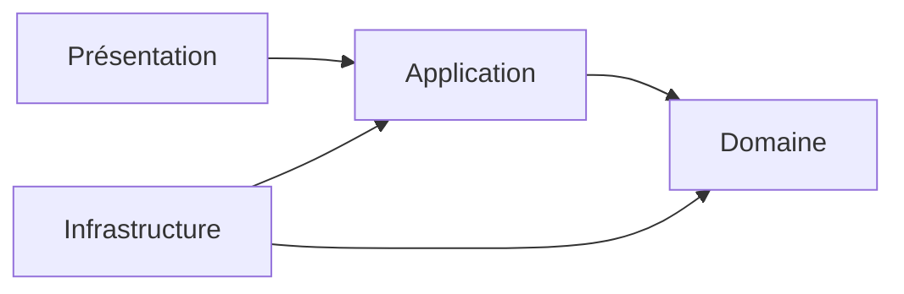
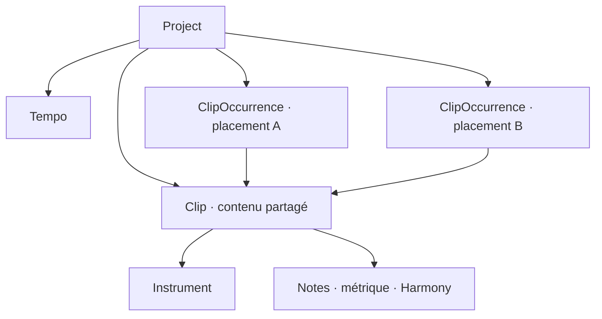
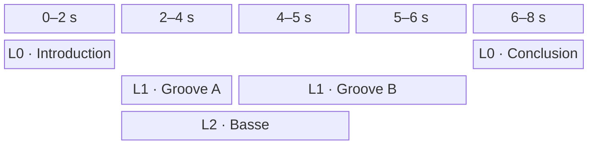
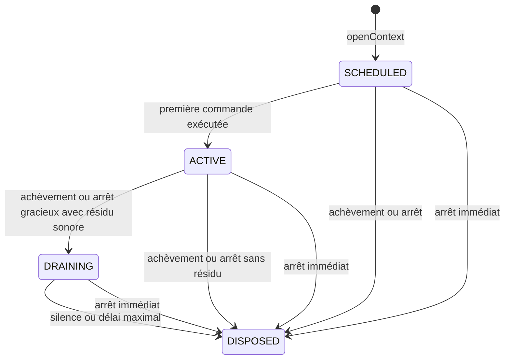

# Architecture

Ce document décrit l'architecture de Pianola, une application de piano roll avec rendu audio intégré.

Il fixe le vocabulaire courant, les responsabilités des couches et leurs dépendances. Les scénarios détaillés sont regroupés dans [etudes-de-cas.md](etudes-de-cas.md).

## Navigation

- [Vue d'ensemble](#vue-densemble)
- [Périmètre fonctionnel](#périmètre-fonctionnel)
- [Domaine](#domaine)
- [Application](#application)
- [Présentation](#présentation)
- [Infrastructure](#infrastructure)
- [Dépendances architecturales](#dépendances-architecturales)
- [Questions ouvertes](#questions-ouvertes)
- [Arborescence cible](#arborescence-cible)

## Vue d'ensemble

Pianola sépare quatre responsabilités :

| Couche | Responsabilité | Exemples |
| --- | --- | --- |
| Domaine | Représenter la composition, garantir ses invariants et expliciter ses échecs attendus. | `Project`, `Clip`, `Note`, `Result`, temps musical et pitch |
| Application | Orchestrer l'édition et la lecture à partir du domaine. | état de l'éditeur, cas d'usage, ports |
| Infrastructure | Réaliser les capacités techniques demandées par l'application. | Web Audio, catalogue concret, persistance |
| Présentation | Afficher la grille et traduire les gestes utilisateur. | blocs de clips, piano roll, inspecteur |



## Périmètre fonctionnel

Pianola est destiné à l'écriture et au processus initial de composition, pas à la production audio.

Le premier périmètre comprend :

- une grille bidimensionnelle de clips ;
- un axe horizontal représentant un temps global continu ;
- des lignes d'organisation réparties sur l'axe vertical, sans instrument, routage ni comportement musical associé ;
- un placement horizontal et une ligne persistants pour chaque occurrence de clip ;
- des occurrences référençant par défaut un contenu `Clip` partagé : modifier ce contenu modifie toutes ses occurrences ;
- un tempo unique appartenant au projet ;
- un instrument associé à chaque clip et partagé par toutes ses notes ;
- l'absence de chevauchement entre notes de même hauteur dans un clip, avec résolution explicite `SLICE` ou `MERGE` ;
- des chronologies locales de métrique et d’harmonie pour chaque clip ;
- la lecture simultanée de tous les clips dont les intervalles globaux se chevauchent ;
- l'édition du contenu d'un clip dans un piano roll ;
- la lecture du projet depuis sa tête globale ou depuis un tick global explicite ;
- la lecture isolée du clip édité depuis sa tête locale ou depuis un tick local explicite ;
- la préécoute soutenue d’une hauteur avec l’instrument du clip édité ;
- la préécoute brève et simultanée des hauteurs uniques d’une sélection de notes ;
- un catalogue d'instruments échantillonnés intégrés et non éditables, rendus par `smplr`.

Il ne comprend pas :

- des pistes instrumentales : une ligne n'impose aucun instrument aux clips qu'elle contient ;
- une chronologie de tempo : une seule valeur s'applique au projet entier ;
- les contrôles globaux d'audibilité par instrument ;
- les automations et événements de contrôle ;
- la création, l'import ou l'édition d'instruments par l'utilisateur ;
- un état audio transitoire sauvegardé dans le projet.

Les `Note` sont le seul contenu sonore des clips. La métrique et l’harmonie sont des données structurelles locales, et non des automations.

---

## Domaine

Le domaine représente les intentions musicales indépendamment de React, Zustand, du stockage et du moteur Web Audio.

### Modèle de composition

Le `Project` possède d'une part des `Clip`, contenus musicaux éditables dans le piano roll, et d'autre part des `ClipOccurrence`, blocs persistants placés dans l'espace temporel bidimensionnel. Chaque occurrence référence exactement un clip par son `ClipId`.



La coordonnée horizontale d'une occurrence est son instant de départ global. Sa coordonnée verticale est un indice de ligne. La durée du bloc est dérivée de la durée locale du clip référencé et du `repeatCount` de l'occurrence.

Les lignes ne sont ni des pistes, ni des conteneurs, ni des canaux audio. Dans le premier périmètre, elles sont de simples indices bornés par une limite fixe de sécurité et ne font l'objet d'aucune commande d'ajout ou de suppression. Deux occurrences placées sur des lignes différentes peuvent se chevaucher et sont alors lues simultanément. Deux blocs ne peuvent en revanche pas occuper des intervalles qui se chevauchent sur une même ligne.

### Vue des concepts

| Concept | Nature | Rôle principal |
| --- | --- | --- |
| `Project` | Entity et racine d'agrégat | Posséder le document musical, le tempo, les clips et leurs occurrences |
| `Clip` | Entity interne | Porter un instrument et un contenu musical local partagé et éditable |
| `ClipOccurrence` | Entity interne | Référencer un clip et porter son placement global dans la grille |
| `Note` | Entity interne | Représenter une note persistante dont l'instrument est hérité du clip |
| `Instrument` | Entity de référence | Décrire publiquement un instrument intégré |
| `Tempo` | Value Object | Définir la vitesse unique du projet |
| `MeterChange` | Entity interne | Placer une métrique sur la chronologie locale d'un clip |
| `HarmonyChange` | Entity interne | Placer un accord ou une gamme sur la chronologie harmonique locale d’un clip |

### Result et validation du domaine

Le domaine représente toute validation attendue par un `Result<T, E>` explicite :

```ts
type Result<T, E> =
  | { ok: true; value: T }
  | { ok: false; error: E };

type ValidationError<
  Code extends string,
  Details extends object
> = {
  kind: "VALIDATION_ERROR";
  code: Code;
  details: Details;
};
```

Les branches sont discriminées par `ok`. Des helpers purs `ok(value)` et `err(error)` peuvent construire les deux variantes ; `map` et `flatMap` peuvent les composer sans extraire prématurément une valeur.

Chaque module déclare près de ses invariants ses propres codes et détails, puis compose les unions nécessaires. Il n'existe pas d'erreur générique contenant seulement un texte. Exemples :

```ts
type TempoValidationError = ValidationError<
  "TEMPO_OUT_OF_RANGE" | "TEMPO_PRECISION_EXCEEDED",
  { received: number; min: number; max: number; decimals: number }
>;

type NoteCollision = {
  manipulatedNoteId: NoteId;
  conflictingNoteIds: readonly NoteId[];
};

type NoteCollisionError = ValidationError<
  "NOTE_OVERLAP",
  { collisions: readonly NoteCollision[] }
>;
```

Les `code` sont stables et indépendants de la langue. `details` contient uniquement les données structurées nécessaires pour comprendre et traiter l'échec ; le domaine ne produit aucun message destiné à l'utilisateur.

Les constructeurs capables de créer un état invalide restent privés. Les factories de Value Objects et d'entités, la reconstitution d'un agrégat et les opérations qui peuvent violer un invariant retournent un `Result` :

```ts
Tempo.create(bpm: number): Result<Tempo, TempoValidationError>;
Clip.create(input: CreateClipInput): Result<Clip, ClipValidationError>;
Project.create(input: CreateProjectInput): Result<Project, ProjectValidationError>;
project.moveClipOccurrences(command: MoveClipOccurrencesCommand): Result<Project, ProjectEditError>;
clip.editNote(command: EditNoteCommand): Result<Clip, ClipValidationError>;
```

Une branche `ok: false` ne modifie jamais l'objet d'origine et ne publie aucun état partiel. Dans le premier périmètre, une opération retourne la première erreur selon un ordre de validation déterministe ; l'accumulation de plusieurs erreurs pourra être ajoutée sans changer la forme de `Result`.

Les violations prévisibles d'une règle métier ne lèvent pas d'exception. Les exceptions restent réservées aux défauts de programmation et aux défaillances techniques inattendues ; elles ne sont pas converties artificiellement en `ValidationError`.

### Bornes numériques et valeurs élémentaires

Le premier périmètre fixe les limites suivantes :

```ts
const MAX_LINE_COUNT = 128;
const MAX_TICK = 2_147_483_647;
const MAX_REPEAT_COUNT = 65_535;
```

| Valeur | Domaine valide |
| --- | --- |
| `LineIndex` | entier de `0` à `127` inclus |
| `Pitch.midiNumber` | entier de `0` à `127` inclus |
| `Velocity` | entier de `1` à `127` inclus |
| `Meter.beatsPerMeasure` | entier de `1` à `32` inclus |
| `Meter.beatUnit` | `1`, `2`, `4`, `8`, `16`, `32` ou `64` |
| `RootNote.letter` | `A`, `B`, `C`, `D`, `E`, `F` ou `G` |
| `RootNote.accidental` | `FLAT`, `NATURAL` ou `SHARP` |
| `Tick` | entier de `0` à `MAX_TICK` inclus |
| `Duration.ticks` | entier de `1` à `MAX_TICK` inclus |
| `repeatCount` | entier de `1` à `MAX_REPEAT_COUNT` inclus |

`Velocity = 0` n’est pas une vélocité persistante valide : Pianola représente le relâchement par une commande `NOTE_OFF` explicite. Les doubles altérations ne font pas partie du catalogue initial ; leur ajout futur étendra `Accidental` sans modifier la représentation de `RootNote`.

Toute factory valide également les résultats composés, pas seulement leurs opérandes. Les calculs temporels suivants doivent notamment rester inférieurs ou égaux à `MAX_TICK` :

```text
timeRange.start + timeRange.duration
occurrence.start + clip.duration * occurrence.repeatCount
ticksPerMeasure = beatsPerMeasure * (3840 / beatUnit)
```

Une valeur reçue hors de ces bornes produit une `ValidationError` typée. Aucun arrondi, clamp ou débordement silencieux n’est effectué par le domaine. Les opérations de présentation peuvent proposer une valeur corrigée, mais doivent la soumettre explicitement comme une nouvelle intention.

### Project

`Project` représente le document musical complet ouvert dans l'application.

Attributs possibles :

- `id` ;
- `name` ;
- `tempo` ;
- `clips` ;
- `clipOccurrences` ;
- `createdAt` ;
- `updatedAt`.

Responsabilités et invariants :

- servir de racine de sauvegarde ;
- posséder directement tous les clips et toutes leurs occurrences ;
- posséder exactement un `Tempo` ;
- garantir l'unicité des `ClipId` et des `ClipOccurrenceId` ;
- garantir que chaque `ClipOccurrence.clipId` référence un clip existant ;
- garantir que les intervalles de deux occurrences d'une même ligne ne se chevauchent pas ;
- permettre la création et l'édition des clips ainsi que l'ajout, le déplacement, la duplication et la suppression de leurs occurrences ;
- interdire la suppression d'un clip encore référencé par une occurrence ;
- accepter un projet vide et les clips temporairement sans occurrence.

Supprimer la dernière occurrence d'un clip ne supprime jamais implicitement sa source. Le clip reste disponible pour être replacé et ne disparaît que par une commande manuelle de suppression, valide uniquement lorsqu'aucune occurrence ne le référence.

Le tempo ne possède ni position, ni changement programmé. Il s'applique uniformément à toute la timeline et convertit les ticks globaux ou locaux en secondes.

La durée structurelle du projet est dérivée de la fin globale la plus tardive parmi ses occurrences. Elle vaut zéro lorsque le projet ne contient aucune occurrence.

### Clip

`Clip` représente un contenu musical local éditable dans le piano roll, associé à un instrument et partageable par plusieurs occurrences.

Attributs possibles :

- `id` ;
- `name` ;
- `duration` ;
- `instrumentId` ;
- `notes` ;
- `meterChanges` ;
- `harmonyChanges`.

Responsabilités et invariants :

- définir sa durée canonique locale en ticks ;
- référencer exactement un `InstrumentId` ;
- contenir des notes positionnées relativement à son début local, toutes jouées par l'instrument du clip ;
- empêcher le chevauchement temporel de deux notes de même hauteur ;
- contenir et ordonner ses deux chronologies locales : métrique et harmonie ;
- fournir la métrique et l’harmonie actives à une position locale ;
- posséder un `HarmonyChange` initial obligatoire au tick `0`, de variante `SCALE` et chromatique par défaut ;
- garantir la cohérence locale de ses notes et changements.

Un `Clip` ne possède ni début global, ni ligne, ni nombre de répétitions. Modifier son contenu ou sa durée modifie la source commune observée et jouée par toutes les `ClipOccurrence` qui le référencent.

### ClipOccurrence

`ClipOccurrence` représente un bloc persistant placé dans la grille globale.

Attributs possibles :

- `id` ;
- `clipId` ;
- `start` ;
- `line` ;
- `repeatCount`.

`start` est un `Tick` interprété depuis le début du projet. `line` est un `LineIndex` compris entre `0` et `127` inclus, conformément à `MAX_LINE_COUNT = 128`. Les lignes n'ont dans le premier périmètre ni identité, ni métadonnées, ni cycle de vie propre. Une occurrence référence exactement un `Clip` existant et ne duplique jamais son contenu local.

`repeatCount` vaut `1` par défaut. Il accepte un entier de `1` à `MAX_REPEAT_COUNT = 65_535` et indique le nombre total de lectures contiguës du clip référencé. Chaque répétition recommence au tick local `0`.

La fin globale structurelle est calculée ainsi :

```text
occurrenceEnd = occurrence.start
              + clip.duration * occurrence.repeatCount
```

Déplacer une occurrence modifie seulement son `start` ou sa `line`. La redimensionner depuis la grille globale ne modifie jamais la durée du clip partagé : elle ajoute ou retire uniquement des répétitions complètes en modifiant son `repeatCount`.

Le bord droit conserve `start` et détermine le nouveau nombre de répétitions depuis sa position quantifiée :

```text
repeatCount = max(
  1,
  round((quantizedRightEdge - occurrence.start) / clip.duration)
)
```

Le bord gauche conserve l’ancienne fin globale et modifie atomiquement `start` et `repeatCount` :

```text
previousEnd = occurrence.start + clip.duration * occurrence.repeatCount
repeatCount = max(
  1,
  round((previousEnd - quantizedLeftEdge) / clip.duration)
)
start = previousEnd - clip.duration * repeatCount
```

Dans les deux cas, le bord effectivement retenu s’aimante à une frontière de répétition complète. Chaque répétition recommence au tick local `0` ; aucune durée partielle ni aucun décalage de phase propre à l’occurrence n’est introduit. L’opération reste soumise aux bornes globales et à l’absence de chevauchement avec les autres occurrences de la ligne.

Dupliquer un bloc crée une nouvelle `ClipOccurrenceId` qui conserve le même `clipId` ; les deux blocs restent donc liés au même contenu. Le premier périmètre ne permet ni de délier une occurrence, ni de transformer une occurrence liée en copie indépendante.

Les intervalles de deux occurrences d'une même ligne sont semi-ouverts et ne peuvent pas se chevaucher avec une durée strictement positive ; des bornes contiguës restent valides. La ligne n'intervient toutefois jamais dans la planification audio : les occurrences qui se chevauchent sur des lignes différentes sont lues simultanément.

### Note

`Note` représente une note placée dans un clip. Son instrument est celui du clip qui la contient.

Attributs possibles :

- `id` ;
- `pitch` ;
- `range` ;
- `velocity`.

Une note possède une identité afin de conserver sa continuité lorsqu'elle est déplacée, redimensionnée, transposée ou modifiée. Une copie ou une duplication reçoit une nouvelle identité.

Invariants :

- la position locale de début est positive ou nulle ;
- la durée est strictement positive ;
- la note se termine au plus tard à la fin locale du clip ;
- `Pitch.midiNumber` reste entre `0` et `127`, et `Velocity` entre `1` et `127` ;
- deux notes de même `Pitch` ne se chevauchent jamais avec une durée strictement positive dans un même clip ;
- son rôle dans l’accord ou la gamme active est dérivé et n’est pas sauvegardé ;
- une note extérieure à l’accord ou à la gamme active reste valide.

Les intervalles sont semi-ouverts : deux notes de même hauteur peuvent être contiguës lorsque la fin de l'une est égale au début de l'autre. Des notes de hauteurs différentes peuvent se chevaucher ; cet invariant préserve donc la polyphonie et les accords.

Une création, un déplacement, un redimensionnement ou une transposition qui produirait un chevauchement de même hauteur n'est jamais appliqué implicitement. Le domaine signale la collision à l'application, qui doit obtenir de la présentation un mode de résolution `SLICE` ou `MERGE` avant de soumettre une nouvelle tentative explicite.

Modifier le tempo du projet ou la métrique locale ne déplace pas la note : sa position et sa durée restent exprimées dans les ticks canoniques du clip.

Lorsqu’une note traverse un `HarmonyChange`, son `TimeRange` est analysé par portions délimitées par ces changements ainsi que par le début et la fin de la note. Chaque portion produit son rôle dans l’accord ou la gamme active. Cette segmentation est une vue dérivée : elle ne découpe ni ne modifie la `Note` persistante.

Les événements instantanés `NoteOn` et `NoteOff` ne sont pas des objets persistants du domaine. Ils sont produits par le service de lecture.

`Velocity` ne possède actuellement aucun usage indépendant de `Note`. Son type et ses règles sont déclarés dans `domain/Note.ts`.

### Résolution des collisions de notes

```ts
type NoteCollisionResolution = "SLICE" | "MERGE";
```

La détection et la résolution sont des règles pures du domaine, orchestrées par `Clip` qui valide la collection complète. Elles peuvent rester dans `Clip.ts` ; un module dédié ne devient utile que si leur complexité le justifie. Le cas d’usage obtient le choix utilisateur auprès de la présentation et transmet ce mode au domaine.

Une commande collective fournit ses `manipulatedNoteIds` dans un ordre stable. Cet ordre définit la priorité de résolution sans introduire de `primaryNoteId` supplémentaire.

`SLICE` donne priorité à la première note manipulée, puis à chacune des suivantes dans l’ordre de la commande. Chaque note conserve son identité, son intervalle et sa vélocité tant qu’elle n’est pas découpée par une note manipulée plus prioritaire. Les notes non manipulées sont moins prioritaires que toutes les notes manipulées. Toute note moins prioritaire de même hauteur est remplacée par la différence entre son intervalle et celui de la note prioritaire :

- une partie entièrement couverte est supprimée ;
- un chevauchement sur un bord raccourcit la note moins prioritaire ;
- une note moins prioritaire qui contient entièrement la note prioritaire est scindée en deux fragments ; le fragment gauche conserve son `NoteId` et sa vélocité, tandis que le fragment droit reçoit un nouveau `NoteId` avec la même vélocité.

`MERGE` calcule séparément l'union de chaque groupe transitif de notes de même hauteur en collision. La note résultante conserve le `NoteId`, le `Pitch` et la `Velocity` de la première note manipulée du groupe selon l’ordre de la commande ; les autres notes du groupe sont supprimées. Deux notes seulement contiguës ne sont ni en collision ni fusionnées automatiquement.

Une détection collective retourne une seule `NoteCollisionError` dont `details.collisions` contient toutes les collisions, dans l’ordre stable des notes manipulées. Chaque entrée associe une note manipulée à tous ses `conflictingNoteIds`, qu’ils désignent des notes manipulées ou non manipulées.

Après résolution, le `Clip` valide de nouveau l'ensemble de ses notes. Il retourne `ok(clip)` lorsque le résultat satisfait tous les invariants, ou une erreur typée sans modifier le clip d'origine. `SLICE` comme `MERGE` forme une seule transformation atomique sur l’ensemble de la commande.

### Instrument

`Instrument` est la représentation publique, stable et minimale d'un instrument intégré.

Attributs possibles :

- `id` ;
- `name`.

`InstrumentId` est un type stable et opaque déclaré avec `Instrument` dans `domain/Instrument.ts`.

Un `Clip` sauvegarde uniquement cet identifiant, et non une référence directe vers l'objet `Instrument`. Il référence exactement un instrument, dont héritent toutes ses notes. Plusieurs clips peuvent référencer le même instrument. Le placement d'une occurrence sur une ligne ne modifie jamais cette association.

`Instrument` appartient à un modèle de référence distinct de l'agrégat `Project`. Il ne contient ni configuration d'échantillons, ni état de voix, ni objet du moteur audio.

Les instruments sont définis avant la compilation et ne sont pas éditables par l'utilisateur. La politique de chargement d'un `InstrumentId` devenu indisponible sera définie avec la persistance.

### Temps musical

Le temps musical canonique utilise des ticks entiers avec une résolution fixe de 960 ticks par noire.

Les battements, mesures et secondes sont des représentations dérivées. La grille visible peut quantifier un geste, mais ne réduit pas les positions valides du domaine à ses subdivisions affichées.

| Value Object | Représentation | Règles principales |
| --- | --- | --- |
| `Tick` | entier | De `0` à `MAX_TICK` inclus ; son contexte d'emploi détermine s'il est global ou local |
| `Duration` | `ticks` | De `1` à `MAX_TICK` inclus |
| `TimeRange` | `start`, `duration` | Intervalle local dont `start` est un `Tick`, utilisé notamment par une note |
| `Tempo` | `bpm` | Une décimale, de `20.0` à `999.9` BPM inclus |
| `Meter` | `beatsPerMeasure`, `beatUnit` | Numérateur de `1` à `32` ; dénominateur parmi `1, 2, 4, 8, 16, 32, 64` |

Avec une résolution de 960 ticks par noire :

```text
ticksPerMeasure = beatsPerMeasure * (4 / beatUnit) * 960
durationSeconds = (durationTicks / 960) * (60 / project.tempo.bpm)
```

Pour la répétition d'indice `i`, commençant à zéro, la position globale d'une note est :

```text
noteGlobalStart = occurrence.start
                + i * clip.duration
                + note.range.start
```

La métrique du clip n'intervient pas dans cette conversion. Elle structure les mesures et les repères locaux sans créer une horloge indépendante.

`TimeRange` facilite notamment la détection des chevauchements ainsi que les opérations de déplacement et de redimensionnement.

### Hauteur et harmonie

Ces objets décrivent la hauteur des notes et leur contexte harmonique local. Ils n'appartiennent pas au calcul du temps musical.

| Value Object | Représentation | Règles principales |
| --- | --- | --- |
| `Pitch` | `midiNumber` | Le nom et l'octave peuvent être dérivés |
| `RootNote` | `letter`, `accidental` | Lettre de `A` à `G` ; altération `FLAT`, `NATURAL` ou `SHARP` ; classe chromatique dérivée |
| `Chord` | `root`, `typeId` | Accord possédant obligatoirement une fondamentale explicite |
| `Scale` | `root`, `typeId` | Gamme possédant obligatoirement une tonique explicite |
| `Harmony` | `kind`, `chord` ou `scale` | Contexte exclusif contenant un accord ou une gamme |

`RootNote` conserve l'orthographe sous la forme d'une lettre et d'une altération, sans octave. Sa classe de hauteur chromatique est dérivée et n'est pas sauvegardée séparément : `C_SHARP` et `D_FLAT` sont enharmoniquement équivalents, mais restent deux valeurs distinctes.

```ts
interface Chord {
  root: RootNote;
  typeId: ChordTypeId;
}

interface Scale {
  root: RootNote;
  typeId: ScaleTypeId;
}

type Harmony =
  | { kind: "CHORD"; chord: Chord }
  | { kind: "SCALE"; scale: Scale };
```

`Chord` et `Scale` possèdent toujours une `RootNote` explicite. Il n'existe ni référence par degré, ni contexte supérieur implicite permettant de la déduire. Les deux variantes de `Harmony` sont exclusives : une seule est active à un tick donné.

Le catalogue initial comprend :

```ts
type ChordTypeId =
  | "MAJOR"
  | "MINOR"
  | "DIMINISHED"
  | "AUGMENTED"
  | "DOMINANT_SEVENTH"
  | "MAJOR_SEVENTH"
  | "MINOR_SEVENTH";

type ScaleTypeId =
  | "CHROMATIC"
  | "IONIAN"
  | "DORIAN"
  | "PHRYGIAN"
  | "LYDIAN"
  | "MIXOLYDIAN"
  | "AEOLIAN"
  | "LOCRIAN"
  | "MAJOR_PENTATONIC"
  | "MINOR_PENTATONIC";
```

Une gamme est compatible avec un accord lorsque les classes de hauteur résolues de l'accord sont incluses dans celles de la gamme :

```text
chordPitchClasses ⊆ scalePitchClasses
```

Puisqu’un accord et une gamme ne sont jamais actifs simultanément, cette compatibilité sert uniquement à proposer des remplacements pertinents dans l’éditeur. Les propositions compatibles précèdent les autres ; au sein de chaque groupe, l'ordre stable du catalogue s'applique. Aucun classement musical manuel supplémentaire n'appartient au premier périmètre.

### Chronologies locales du clip

Un clip possède deux collections ordonnées de changements :

| Changement | Valeur | Changement initial au tick `0` | Positions suivantes |
| --- | --- | --- | --- |
| `MeterChange` | `Meter` | Obligatoire | Début d’une nouvelle mesure locale ; peut tronquer la précédente |
| `HarmonyChange` | `Harmony` | Obligatoire, `SCALE · C CHROMATIC` par défaut | N'importe quel tick local du clip |

Chaque changement possède une identité, une position locale et sa nouvelle valeur. Les règles communes sont :

- un seul changement d'un même type peut exister à une position ;
- la nouvelle valeur s'applique à partir de la position du changement, incluse ;
- un changement peut être déplacé ou modifié sans perdre son identité ;
- un changement ferme la section précédente du même type et commence la suivante ;
- un changement peut être placé de `0` à `clip.duration` inclus ;
- aucun changement n'accepte `null` ni une variante `CLEAR`.

Le `HarmonyChange` initial au tick `0` ne peut être ni supprimé ni déplacé, mais sa valeur peut être remplacée par un accord ou une autre gamme. `SCALE · C CHROMATIC` est la valeur créée par défaut ; sa `RootNote` est conservée par cohérence de modèle même si elle ne modifie pas les douze classes de hauteur de la gamme chromatique.

Chaque nouveau `HarmonyChange` remplace indifféremment l’accord ou la gamme précédente. Il est donc impossible qu’un `Chord` et une `Scale` soient actifs simultanément ou que deux marqueurs harmoniques occupent le même tick.

Un changement placé exactement à `clip.duration` est valide et persistant. Il n’affecte aucune note et ne produit aucun événement audio tant que la durée ne change pas. Si le clip est allongé, il devient automatiquement le début de la nouvelle section terminale. Si un raccourcissement placerait un changement au-delà de la nouvelle durée, l’opération doit également déplacer ou supprimer ce changement, faute de quoi la validation échoue.

Les marqueurs visibles dans l'éditeur sont la représentation des changements existants. Ils ne forment pas un type métier générique supplémentaire.

### Sections dérivées

`MeterSection` et `HarmonySection` sont des vues locales dérivées. Chacune couvre l'intervalle entre un changement et le changement suivant du même type, ou entre ce changement et la fin du clip.

Elles ne sont pas sauvegardées comme des objets autonomes.

| Section | Valeurs dérivées | Usage principal |
| --- | --- | --- |
| `MeterSection` | `start`, `end`, `meter`, découpage en mesures | Repères métriques et frontières de mesure |
| `HarmonySection` | `start`, `end`, `harmony` | Recherche de l’accord ou de la gamme active et analyse des notes |

Pour une `MeterSection` :

```text
fullMeasureCount = floor(sectionDuration / ticksPerMeasure)
trailingMeasureDuration = sectionDuration % ticksPerMeasure
```

Une valeur non nulle de `trailingMeasureDuration` représente une dernière mesure incomplète. Cette mesure tronquée est valide aussi bien à la fin du clip qu’avant un `MeterChange`. Chaque `MeterChange` termine immédiatement la section précédente, même au milieu de sa mesure théorique, puis commence une nouvelle mesure complète dans la nouvelle métrique.

Une section dérivée peut être vide : un changement placé à `clip.duration` produit l’intervalle semi-ouvert `[clip.duration, clip.duration)`. Les calculs d’intersection et la planification l’ignorent naturellement ; aucune valeur n’est active au tick final, situé hors de l’intervalle sonore du clip.

Grâce au changement initial obligatoire, une `HarmonySection` couvre toujours chaque tick de `[0, clip.duration)`. Pour analyser une note, les intervalles pertinents sont dérivés de l'union des frontières de `HarmonySection` et du `TimeRange` de la note. Chaque portion expose un rôle exclusif :

```ts
type NoteHarmonyRole =
  | "CHORD_TONE"
  | "SCALE_TONE"
  | "OUTSIDE_TONE";
```

### Frontière de l'agrégat

`Project` est la racine de l'unique agrégat constituant le document de composition sauvegardé.

Les entités internes conservent des identifiants stables afin d'être ciblées par l'éditeur et les cas d'usage. Elles ne possèdent cependant ni repository ni cycle de persistance autonomes.

Une opération peut être déléguée à un `Clip` pour préserver ses invariants locaux. Le `Project` valide ensuite le résultat complet avant publication : modifier la durée d’un clip peut notamment provoquer une collision entre ses occurrences et d’autres blocs de leurs lignes. Une validation locale réussie ne suffit donc pas à accepter l’édition de l’agrégat.

Les `Instrument` sont extérieurs à cet agrégat et sont fournis par un catalogue.

---

## Application

La couche applicative traduit les intentions de l'utilisateur en opérations sur le domaine et orchestre les interactions avec l'extérieur à travers des ports.

Elle possède l'état transitoire de l'éditeur et les états d'orchestration nécessaires à la lecture. Elle ne contient ni configuration `smplr`, ni banque d'échantillons, ni `AudioNode`, ni détail de stockage.

### État de l'éditeur

#### Sélections

Deux sélections indépendantes correspondent à deux espaces d'édition distincts.

```ts
type ClipContentRef =
  | { kind: "NOTE"; noteId: NoteId }
  | { kind: "METER_CHANGE"; meterChangeId: MeterChangeId }
  | { kind: "HARMONY_CHANGE"; harmonyChangeId: HarmonyChangeId };

interface ClipContentSelection {
  items: readonly ClipContentRef[];
}

interface ClipOccurrenceSelection {
  occurrenceIds: readonly ClipOccurrenceId[];
}
```

`ClipContentSelection` contient les notes et changements du clip source actuellement édité. Elle est portée par le même `ClipEditorState` que l'identité et la tête de lecture locale du clip. Elle est vidée lorsque ce clip change ou est fermé.

`ClipOccurrenceSelection` contient les blocs sélectionnés dans la grille de composition. Elle sert notamment à leur déplacement temporel ou vertical, à leur duplication et à leur suppression. Dupliquer cette sélection crée par défaut de nouvelles occurrences référençant les mêmes clips.

```ts
interface ClipEditorState {
  clipId: ClipId;
  playhead: Tick;
  gridResolution: GridResolution;
  selection: ClipContentSelection;
}

interface EditorState {
  projectPlayhead: Tick;
  gridResolution: GridResolution;
  clipEditor?: ClipEditorState;
  clipOccurrenceSelection: ClipOccurrenceSelection;
}
```

Le clip source édité et la sélection d'occurrences expriment des faits différents. Un geste d'interface peut les mettre à jour ensemble, mais aucun lien implicite n'est imposé entre eux. Regrouper `clipId`, la tête locale et la sélection empêche qu'un état local subsiste sans clip édité.

La couche applicative choisit explicitement la sélection correspondant à l'action, résout ses références et transmet au domaine les identifiants concernés. Le domaine ne connaît jamais la notion de sélection.

#### GridResolution

`GridResolution` représente une précision de quantification utilisée pendant l'édition.

Attribut possible :

- `snapStepTicks`.

Les deux espaces possèdent des réglages indépendants :

| Espace | État | Valeur initiale |
| --- | --- | ---: |
| Grille globale | `EditorState.gridResolution` | `960` ticks, soit une noire |
| Piano roll | `ClipEditorState.gridResolution` | `240` ticks, soit une double croche |

La résolution globale sert au déplacement et au redimensionnement des occurrences ainsi qu’au positionnement quantifié de la tête globale. Elle travaille dans le référentiel global et ne dépend d’aucune métrique locale. Pour le redimensionnement d’une occurrence, la position quantifiée du bord est ensuite convertie en un `repeatCount` entier ; le bord effectif s’aligne donc sur la frontière de répétition complète la plus proche.

La résolution locale sert à créer, déplacer et redimensionner les notes, à déplacer les changements de métrique ou d’harmonie et à positionner la tête locale. Elle travaille dans le référentiel du clip.

Modifier une résolution ne modifie jamais l’autre. Il n’existe ni lien automatique, ni conversion, ni option de synchronisation entre elles dans le premier périmètre. Ouvrir un clip initialise son `ClipEditorState.gridResolution` à `240` ticks ; changer ou rouvrir un clip recrée cette valeur initiale.

Les deux instances utilisent le même Value Object et la même unité `Tick`, sans pour autant partager leur valeur. Les résolutions et sélections ne sont pas sauvegardées comme des données musicales. Leur persistance éventuelle relève des préférences ou de la restauration de session.

#### Têtes de lecture

Les deux espaces d'édition possèdent des têtes de lecture applicatives, transitoires et non sauvegardées dans l'agrégat :

| Tête | État | Référentiel |
| --- | --- | --- |
| Projet | `EditorState.projectPlayhead` | Tick global depuis le début du projet |
| Clip | `EditorState.clipEditor.playhead` | Tick local depuis le début du clip édité |

Leur position initiale est le tick `0`. Seule la tête correspondant au transport actif avance tant que son espace d'édition reste ouvert ; l'autre conserve sa position. Fournir un tick à `playProject` ou `playClip` déplace la tête correspondante avant de tenter la lecture.

Pour une portée dont la fin structurelle vaut `endTick`, une tête accepte l’intervalle fermé `[0, endTick]`, mais une lecture exige un départ dans `[0, endTick)`. Le tick final est donc une position valide sans contenu restant. Un tick strictement supérieur à `endTick` produit une erreur de validation et n’est jamais silencieusement ramené dans les bornes.

Les deux têtes restent indépendantes. Une position globale ne détermine pas implicitement une position locale, car un même clip peut être utilisé par plusieurs occurrences et répétitions. Une éventuelle synchronisation visuelle lors de l'ouverture d'une occurrence relève d'une action explicite de présentation.

Déplacer la tête correspondant au transport actif vers une position strictement antérieure à la fin est un seek : le `PlaybackService` remplace gracieusement la session courante par une nouvelle session de même portée au tick demandé. La déplacer exactement à la fin provoque la fin naturelle du transport sans ouvrir de nouvelle session. Déplacer la tête inactive modifie seulement le point de départ du prochain transport de cette portée.

`stop(GRACEFUL)` et `stop(IMMEDIATE)` immobilisent la tête active à sa position courante sans réinitialiser aucune tête. À la fin naturelle, la tête est placée exactement sur `endTick`, l’`ActiveTransport` disparaît et les contextes peuvent continuer en `DRAINING` jusqu’à la fin de leurs releases et tails.

Une session `CLIP` reste attachée au `clipId` avec lequel elle a été ouverte. Fermer le piano roll ou ouvrir un autre clip ne l'arrête pas. Si son `ClipEditorState` disparaît ou change de clip, sa position courante reste un curseur d'exécution interne à l'`ActiveTransport` et ne déplace pas la tête locale du nouvel éditeur. La suppression du clip attaché suit toutefois la politique d’arrêt explicite décrite avec la portée `CLIP`.

#### Projet transitoire

L'application distingue le projet courant validé d'un éventuel projet transitoire représentant le brouillon du geste en cours.

```ts
interface PendingInstrumentChange {
  requestId: string;
  clipId: ClipId;
  instrumentId: InstrumentId;
}

interface ProjectState {
  project: Project;
  transientProject?: TransientProject;
  effectiveProjectRevision: number;
  pendingInstrumentChange?: PendingInstrumentChange;
}

const effectiveProject: Project | TransientProject =
  state.transientProject ?? state.project;
```

`project` est la version courante faisant autorité dans l'éditeur. Elle respecte les invariants du domaine et peut comporter des modifications validées qui n'ont pas encore été sauvegardées. Le terme ne doit donc pas être remplacé par `persistedProject`.

`TransientProject` appartient à l'application. Il constitue une projection complète de `project` après application visuelle et sonore du geste, mais n'est pas un `Project` du domaine. Il peut notamment contenir provisoirement des chevauchements de notes de même hauteur. Il ne peut être ni sauvegardé, ni transmis à une opération exigeant un agrégat valide.

`effectiveProjectRevision` est un compteur monotone applicatif, incrémenté chaque fois que `project`, `transientProject` ou leur résolution effective change. Il permet aux préparations asynchrones de détecter qu’un plan a été calculé depuis une projection dépassée.

`effectiveProject` est une valeur dérivée, jamais un troisième état stocké :

- il vaut `transientProject` lorsqu'il existe ;
- il vaut sinon `project` ;
- il constitue la source commune de la présentation et de la lecture audio ;
- son nom relève du vocabulaire applicatif et ne garantit pas la validité de domaine de sa valeur ;
- il n'est jamais transmis tel quel à la persistance.

Un seul projet transitoire peut exister à la fois. Chaque actualisation est recalculée depuis `project` et l'intention initiale du geste, non depuis la projection précédente, afin d'éviter l'accumulation d'arrondis.

`pendingInstrumentChange` représente séparément une demande de changement d’instrument dont la banque est encore en préparation. Elle ne modifie ni `project`, ni `transientProject`, ni `effectiveProject`. Son `requestId` empêche une réponse de chargement devenue obsolète d’appliquer un choix que l’utilisateur a depuis remplacé ou annulé.

Le cycle expose conceptuellement trois opérations :

```ts
setTransientProject(project: TransientProject): void;
commitTransientProject(
  resolution?: NoteCollisionResolution
): Result<Project, ProjectEditError>;
discardTransientProject(): void;
```

`setTransientProject` crée ou remplace le brouillon affiché et joué. `commitTransientProject` soumet l'intention finale au domaine et ne remplace `project` que si un nouveau projet valide est produit. `discardTransientProject` abandonne le brouillon et rétablit immédiatement le projet validé comme projet effectif.

Valider le geste ne sauvegarde pas le projet. Sa validation formera également une seule unité dans un futur historique d'annulation, quels que soient le nombre de mouvements intermédiaires et le mode de résolution éventuellement choisi.

### Cas d'usage d'édition

Les cas d'usage d'édition :

- traduisent les gestes en commandes explicites ;
- construisent et composent les Value Objects par leurs `Result` sans forcer une valeur invalide ;
- choisissent la sélection adaptée à la portée de l'action ;
- résolvent les références vers les entités du projet ;
- appliquent si nécessaire la quantification ;
- délèguent au domaine les mutations qui protègent ses invariants ;
- chargent et sauvegardent le projet à travers des ports.

Exemples :

- déplacer ensemble des notes et des changements appartenant à un même clip ;
- transposer ou redimensionner des notes ;
- ajouter, déplacer ou supprimer un changement local ;
- redimensionner le contenu d'un clip, ce qui redimensionne toutes ses occurrences ;
- déplacer une ou plusieurs occurrences sur l'axe temporel ou entre les lignes ;
- créer ou supprimer un clip source ;
- créer, dupliquer ou supprimer des occurrences liées à des clips existants ;
- modifier le tempo unique du projet ;
- modifier le `repeatCount` d'une occurrence ;
- associer un instrument disponible à un clip.

La substitution du projet transitoire est commune à tous les gestes d'édition. Chaque geste reste porté par un cas d'usage explicite, qui peut transformer atomiquement plusieurs types d'éléments lorsqu'ils participent à une même intention utilisateur.

Un cas d'usage propage explicitement une erreur de domaine ou la traduit vers une erreur applicative plus contextuelle. Il ne la remplace jamais par une exception et ne met à jour `ProjectState` que depuis la branche `ok: true`.

Un déplacement d'occurrences reçoit par exemple un delta temporel global et un delta de ligne. Les occurrences sélectionnées conservent leurs positions relatives :

```ts
interface MoveClipOccurrencesCommand {
  occurrenceIds: readonly ClipOccurrenceId[];
  deltaTicks: number;
  deltaLines: number;
}
```

Un déplacement temporel du contenu local peut recevoir une autre commande :

```ts
interface MoveClipContentCommand {
  clipId: ClipId;
  items: readonly ClipContentRef[];
  deltaTicks: number;
  collisionResolution?: NoteCollisionResolution;
}
```

Les références peuvent désigner simultanément des notes et des changements de métrique et d’harmonie. La transformation est atomique : si un élément ne peut pas atteindre la position proposée sans violer un invariant, aucun résultat partiel n'est publié.

Les identifiants des entités déplacées sont conservés. Lorsqu'une transformation provisoire crée des entités, leurs identifiants sont générés une seule fois pour le geste, restent stables pendant ses actualisations et sont conservés si le projet transitoire est appliqué.

#### Orchestration des collisions

Pendant un déplacement, un redimensionnement ou une autre manipulation continue, la présentation met à jour `transientProject` à chaque mouvement. Cette projection suit le pointeur et reste la source commune du rendu visuel et audio, même lorsqu'elle contient provisoirement plusieurs notes de même hauteur en collision. Ces notes sont alors rendues comme des occurrences sonores simultanées.

Aucune résolution `SLICE` ou `MERGE` n'est exécutée pendant le geste et aucun fragment n'est créé. Les collisions intermédiaires n'ont donc aucun effet durable.

Au relâchement, le cas d'usage soumet une seule fois l'intention finale quantifiée au domaine :

```ts
type NoteEditResult = Result<Project, ProjectEditError>;
```

Sans collision, le projet valide retourné remplace `project` et `transientProject` disparaît. En cas de `NOTE_OVERLAP`, le brouillon final reste affiché et audible, tandis que la commande finale est suspendue. La présentation demande alors `SLICE`, `MERGE` ou l'annulation :

- `SLICE` ou `MERGE` rejoue la même intention contre `project`, avec le mode choisi ;
- les fragments et leurs identifiants sont créés une seule fois pendant cette résolution définitive ;
- l'annulation supprime `transientProject` sans modifier `project`.

Pendant cette attente, le geste ne reçoit plus d'actualisation : sa géométrie finale et la commande quantifiée sont figées. Le domaine ne dépend d'aucune interaction utilisateur et ne reçoit jamais le projet transitoire potentiellement invalide.

Les règles de `SLICE` et `MERGE` sont définies dans le [domaine](#résolution-des-collisions-de-notes). Le cas d’usage soumet le clip résolu à la validation du `Project` avant publication. `ProjectEditError` réunit les erreurs locales et celles de l’agrégat. La validation entière constitue une seule future unité d’annulation.

Les services seront nommés et ajoutés dans `application/use-cases/` lorsque leurs responsabilités précises seront établies.

#### Modification de la métrique

Changer une métrique exprime explicitement l'une de deux intentions :

| Politique | Effet |
| --- | --- |
| `PRESERVE_DURATION` | Conserve les ticks des notes, des changements et de la fin de section. Le nombre de mesures complètes est recalculé et une dernière mesure tronquée est autorisée. |
| `PRESERVE_MEASURE_COUNT` | Recalcule la borne de fin selon la nouvelle longueur de mesure. |

Dans le premier périmètre, `PRESERVE_MEASURE_COUNT` s'applique à un clip vide ou à une section terminale vide, afin de ne pas imposer de déplacement en cascade aux sections suivantes.

Lors de la création d'un clip, le cas d'usage reçoit un nombre de mesures et une métrique, puis calcule sa durée canonique locale en ticks. L'ajout initial à la grille crée séparément une première occurrence qui le référence. Le tempo est déjà fourni par le projet et n'intervient pas dans ce calcul. Un clip vide conserve par défaut son nombre de mesures. Une section contenant des notes ou suivie d'autres sections conserve par défaut sa durée.

### PlaybackService

`PlaybackService` orchestre le transport global du projet, le transport local du clip édité, la préécoute d’une hauteur et celle d’une sélection, puis produit les commandes audio correspondantes.

#### Projet effectif et modification en temps réel

Le service lit le même `effectiveProject` que la présentation. Une lecture ou une préécoute déclenchée pendant une manipulation utilise donc immédiatement le projet transitoire lorsqu'il existe, y compris ses collisions provisoires.

Lorsqu'un transport est déjà actif, chaque remplacement de `transientProject` susceptible d'affecter sa portée invalide la portion future de la planification construite depuis l'ancien projet effectif. Le service obtient alors `safeAt` par `AudioEngine.getClock(sessionId)`, recalcule depuis cette borne avec le nouvel `effectiveProject`, puis transmet une unique mise à jour atomique au moteur. Deux notes provisoirement superposées restent deux occurrences distinctes pour le moteur. Pour `CLIP`, seules les modifications du clip attaché à la session et du tempo du projet affectent la planification ; les placements et les autres clips sont sans effet.

Valider un brouillon sans en modifier la projection sonore ne doit provoquer ni nouvelle planification ni rupture. L'abandonner entraîne la même réconciliation que toute autre modification du projet effectif.

La réconciliation dépend de la portée du transport actif. Pour un transport `PROJECT`, elle compare les notes par `(ClipOccurrenceId, repeatIndex, NoteId)` à la tête globale. Pour un transport `CLIP`, elle compare les notes du `clipId` attaché à la session à son curseur local :

| Avant | Après | Comportement |
| --- | --- | --- |
| L'occurrence de note est audible | La note couvre toujours la tête et ses données d’attaque sont inchangées | Conserver l'occurrence de note et replanifier son `NOTE_OFF` |
| L'occurrence de note est audible | La note ne couvre plus la tête dans la portée active | Produire un `NOTE_OFF` à la borne de replanification |
| La note n'est pas audible dans la portée active | Elle couvre désormais la tête | Créer une occurrence de note et produire un `NOTE_ON` à la borne |
| La note n'est pas audible dans la portée active | Elle ne couvre toujours pas la tête | Replanifier uniquement ses éventuelles commandes futures |

Cette règle vaut autant pour une modification locale de la note que pour le déplacement global d'une `ClipOccurrence`. Déplacer le début d'une note ou d'une occurrence de clip sans faire franchir la tête à l'attaque ne redéclenche pas une occurrence de note déjà audible. Dans un transport `PROJECT`, modifier un `Clip` source déclenche la réconciliation séparément pour chacune de ses occurrences actives ou planifiées. Dans un transport `CLIP`, la même modification est réconciliée une seule fois dans le contexte local du clip attaché à la session.

Si la note reste couverte mais que sa hauteur, sa vélocité ou une autre propriété sonore d'attaque change, l'occurrence de note existante est relâchée puis remplacée par une nouvelle occurrence de note. Un changement du tempo unique conserve cette occurrence de note et replanifie ses commandes temporelles : il ne modifie aucune donnée d'attaque.

##### Réconciliation des répétitions

Dans un transport `PROJECT`, chaque occurrence sonore issue d’une répétition est identifiée par :

```text
(ClipOccurrenceId, repeatIndex, NoteId)
```

`repeatIndex` est l’indice stable de la répétition qui a produit l’attaque. Une voix déjà créée ne change jamais d’indice et n’est jamais réattribuée à une autre répétition.

Modifier `clip.duration` recalcule le début global de chaque répétition :

```text
repeatStart =
  occurrence.start + repeatIndex * clip.duration
```

Pour chaque identité après ce recalcul :

- si son nouvel intervalle couvre encore la tête et que ses données d’attaque sont inchangées, sa voix est conservée et son `NOTE_OFF` est replanifié ;
- si son intervalle ne couvre plus la tête, sa voix est relâchée ;
- si une autre répétition couvre désormais la tête, une nouvelle occurrence sonore possédant son propre `repeatIndex` est attaquée ;
- deux identités ne sont jamais fusionnées, même lorsqu’elles produisent la même note au même instant.

Modifier seulement `repeatCount` ne déplace et ne renumérote aucune frontière existante. Une augmentation ajoute des répétitions terminales et leurs événements futurs. Une diminution annule les répétitions terminales supprimées et relâche leurs éventuelles voix actives ; les indices conservés restent inchangés.

Le redimensionnement par le bord gauche modifie à la fois `start` et `repeatCount`. Le déplacement de `start` recalcule alors toutes les frontières globales selon les règles ordinaires de réconciliation, tandis que le changement de `repeatCount` ajoute ou retire seulement les indices terminaux.

Pour un transport `CLIP`, aucune de ces règles de répétition ne s’applique : il ignore les occurrences et lit directement le clip jusqu’à `clip.duration`.

##### Changement d’instrument préparé

Changer le `Clip.instrumentId` est une opération asynchrone préparée avant de modifier le projet effectif. L’application crée un `pendingInstrumentChange` et appelle `AudioEngine.prepareInstruments([instrumentId])`. Jusqu’à la réussite de cette préparation :

- l’ancien `InstrumentId` reste dans `effectiveProject` ;
- les contextes existants continuent de jouer et de recevoir leurs attaques avec l’ancien instrument ;
- la présentation montre le nouveau choix comme étant en chargement, sans le présenter comme déjà appliqué ;
- une annulation ou une nouvelle demande invalide la précédente par son `requestId`.

Si le chargement échoue, la demande est supprimée, le projet et l’audio restent inchangés, et l’échec technique est remonté selon le contrat public retenu.

Lorsque la banque est prête, le changement de `instrumentId` et le basculement audio sont appliqués à la même borne sûre de planification. Pour chaque contexte actif jouant ce clip :

1. le service ouvre un nouveau `PlaybackContext` dans la même `PlaybackSession` ;
2. il annule les attaques futures de l’ancien contexte et relâche ses occurrences actives ;
3. l’ancien contexte passe à `DRAINING` afin de conserver ses releases et tails ;
4. le nouveau contexte reçoit les attaques futures avec le nouvel instrument ;
5. toute note couvrant encore la tête est réattaquée dans le nouveau contexte.

Dans un transport `PROJECT`, cette substitution est effectuée séparément pour chaque occurrence active du clip. Dans un transport `CLIP`, elle concerne uniquement son contexte local. Si le clip n’est pas actif, aucun contexte n’est ouvert : le projet est mis à jour après préparation et le nouvel instrument sera utilisé à sa prochaine lecture.

Le nouveau contexte appartient à la session existante ; aucun second transport et aucune nouvelle origine temporelle ne sont créés. Un contexte `DRAINING` ne reçoit jamais de nouvelle attaque.

Au choix de `SLICE` ou `MERGE`, le résultat valide remplace la projection provisoire comme une modification atomique : les notes supprimées sont relâchées si nécessaire, les fragments nouvellement créés sont planifiés selon leur position, et la note manipulée suit les règles ordinaires de modification de son attaque et de son `NOTE_OFF`.

Cette replanification est une conséquence applicative du geste d'édition, pas une nouvelle commande publique de la présentation.

#### Interface publique

```ts
type StopMode = "GRACEFUL" | "IMMEDIATE";

type TransportRequestOutcome =
  | "STARTED"
  | "POSITIONED"
  | "NO_CONTENT"
  | "SUPERSEDED"
  | "CANCELLED";

type PreviewReadyOutcome =
  | "STARTED"
  | "CANCELLED";

type PlaybackValidationError = ValidationError<
  "NO_CLIP_EDITED" | "CLIP_NOT_FOUND" | "TICK_OUT_OF_RANGE",
  {
    tick?: Tick;
    clipId?: ClipId;
    endTick?: Tick;
  }
>;

type PreviewValidationError = ValidationError<
  "NO_CLIP_EDITED" | "PITCH_OUT_OF_RANGE" |
  "EMPTY_SELECTION" | "NOTE_NOT_IN_EDITED_CLIP",
  {
    pitch?: number;
    noteIds?: readonly NoteId[];
    clipId?: ClipId;
  }
>;

interface InstrumentPreparationError {
  kind: "PREPARATION_ERROR";
  code: "INSTRUMENT_LOAD_FAILED";
  instrumentIds: readonly InstrumentId[];
}

type PlaybackRequestError =
  | PlaybackValidationError
  | InstrumentPreparationError;

interface PreviewPitchHandle {
  ready: Promise<
    Result<PreviewReadyOutcome, InstrumentPreparationError>
  >;

  release(): void;
}

interface PreviewSelectionHandle {
  ready: Promise<
    Result<PreviewReadyOutcome, InstrumentPreparationError>
  >;

  stop(): void;
}

playProject(
  tick?: Tick
): Promise<Result<TransportRequestOutcome, PlaybackRequestError>>;

playClip(
  tick?: Tick
): Promise<Result<TransportRequestOutcome, PlaybackRequestError>>;

seekProject(
  tick: Tick
): Promise<Result<TransportRequestOutcome, PlaybackRequestError>>;

seekClip(
  tick: Tick
): Promise<Result<TransportRequestOutcome, PlaybackRequestError>>;

previewPitch(
  pitch: Pitch,
  velocity?: Velocity
): Result<PreviewPitchHandle, PreviewValidationError>;

previewSelection(
  noteIds: readonly NoteId[]
): Result<PreviewSelectionHandle, PreviewValidationError>;

stop(mode?: StopMode): void;
```

`Tick` est un entier borné validé à sa création. Il représente seulement l'unité temporelle ; la méthode ou le champ qui le reçoit fixe son référentiel global ou local.

Les erreurs de validation sont des échecs applicatifs attendus et synchrones lorsqu’ils peuvent être déterminés avant toute préparation. `InstrumentPreparationError` représente un échec technique attendu du chargement et reste distinct d’une `ValidationError`. Les défauts de programmation et défaillances techniques non prévues restent des exceptions.

`SUPERSEDED` et `CANCELLED` sont des résultats normaux d’orchestration : ils ne doivent pas produire de message d’erreur utilisateur.

#### Préparation asynchrone des transports

Le service conserve au plus une requête de transport en préparation :

```ts
interface PendingTransportRequest {
  id: TransportRequestId;
  kind: "PLAY_PROJECT" | "PLAY_CLIP" | "SEEK_PROJECT" | "SEEK_CLIP";
  targetTick: Tick;
  clipId?: ClipId;
  effectiveProjectRevision: number;
  status: "PREPARING";
}
```

Chaque `playProject`, `playClip`, `seekProject` ou `seekClip` reçoit un nouvel identifiant et remplace la requête encore en attente. La promesse de l’ancienne se résout avec `ok("SUPERSEDED")`. Une fin de chargement tardive vérifie toujours l’identifiant courant avant toute ouverture de session.

`stop(mode)` invalide la requête en attente en plus d’arrêter l’éventuel transport actif. Sa promesse se résout avec `ok("CANCELLED")`. Le service transmet un signal d’annulation au chargement lorsque l’infrastructure le permet, mais l’identité de requête reste la protection obligatoire contre les réponses tardives.

La requête capture `effectiveProjectRevision` avant de déterminer les instruments nécessaires. Après chaque préparation réussie, le service compare cette révision à la valeur courante :

1. si elles sont égales et que la requête est toujours courante, il planifie et ouvre la session ;
2. si elles diffèrent, il relit le dernier `effectiveProject`, revalide le tick et recalcule la portée ;
3. les banques déjà préparées sont réutilisées et seules les banques supplémentaires sont chargées ;
4. le contrôle recommence avant le démarrage.

Une modification continue du projet ne publie donc jamais une session construite depuis une ancienne projection. Si le tick est devenu supérieur à la nouvelle fin, la requête retourne `err(TICK_OUT_OF_RANGE)`. S’il est exactement à la fin, elle retourne `ok("NO_CONTENT")` sans ouvrir de session.

Lors d’un seek sur le transport actif, la tête sonore actuelle continue d’avancer pendant la préparation. La destination demandée est affichée séparément comme un repère provisoire en chargement ; elle ne devient pas encore la tête effective. Lorsque la préparation réussit, l’ancienne session est remplacée gracieusement et la tête saute à la destination.

Sans transport actif, un seek valide déplace immédiatement la tête immobile. Il retourne `ok("POSITIONED")` et ne prépare aucune banque avant le prochain `play`.

#### Lecture du projet

`playProject()` utilise `EditorState.projectPlayhead`. Si cette tête se trouve à la fin structurelle du projet, l’appel la replace au tick `0` avant de préparer la lecture. Pour un projet vide, il laisse la tête à `0`, n’ouvre aucune session et sa promesse se résout normalement.

`playProject(tick)` valide explicitement le tick dans `[0, project.duration]` et place la tête à cette position. Si `tick === project.duration`, aucune session n’est ouverte ; si `tick > project.duration`, l’appel retourne une erreur de validation.

#### Lecture du clip édité

`playClip()` exige un `clipEditor` et utilise le `clipId` ainsi que la tête locale conservée dans `clipEditor.playhead`. Si cette tête se trouve à `clip.duration`, l’appel la replace au tick `0` avant de préparer la lecture. Un clip possède toujours une durée strictement positive.

`playClip(tick)` valide explicitement le tick dans `[0, clip.duration]` et place la tête à cette position. Si `tick === clip.duration`, aucune session n’est ouverte ; si `tick > clip.duration`, l’appel retourne une erreur de validation.

Ce transport :

- lit uniquement le contenu du clip édité ;
- ignore ses `ClipOccurrence`, leurs positions, leurs lignes et leurs `repeatCount` ;
- utilise le tempo unique du projet ;
- s'arrête structurellement à `clip.duration` ;
- ouvre un seul `PlaybackContext` pour ce clip.

`PROJECT` et `CLIP` sont deux portées d'un même transport exclusif. Démarrer l'une remplace gracieusement l'autre sans modifier la tête inactive.

Avant d'ouvrir la session et de faire avancer sa tête, le service résout tous les `InstrumentId` nécessaires à la portée demandée et attend le chargement de leurs échantillons. Pour `PROJECT`, il considère les occurrences susceptibles d'être lues entre le tick de départ et la fin du projet ; pour `CLIP`, seulement l'instrument du clip ciblé. La promesse se résout lorsque le transport a effectivement démarré, ou immédiatement lorsqu’aucune session ne doit être ouverte. Aucun transport ne commence avec une banque requise manquante.

`seekProject(tick)` et `seekClip(tick)` acceptent la fin correspondante mais refusent toute valeur supérieure. Si la tête appartient au transport actif — et, pour `CLIP`, au même `clipId` — un déplacement avant la fin crée une requête asynchrone de même portée, soumise à la même barrière de préparation ; un déplacement exactement à la fin termine naturellement le transport et retourne `ok("NO_CONTENT")`. Lorsque la portée est inactive, le seek déplace seulement la tête et retourne `ok("POSITIONED")`.

#### Fin de portée après modification

Lorsqu’une édition raccourcit la portée, sa tête est ramenée dans les nouvelles bornes :

```text
newPlayhead = min(currentPlayhead, newEndTick)
```

Si un transport actif reste strictement avant `newEndTick`, il continue avec ses commandes et `ContextCompletion` replanifiées.

Si sa tête se trouve à la nouvelle fin ou au-delà :

- l’état applicatif place immédiatement la tête sur `newEndTick` ;
- le service annule les attaques futures remplaçables ;
- il relâche les voix actives à la première borne `safeAt` disponible ;
- les contextes passent à `DRAINING` s’ils possèdent encore des releases ou tails ;
- l’`ActiveTransport` est supprimé.

Si la portée est inactive, seul le clamp de sa tête est nécessaire. L’allongement ultérieur d’une portée ne déplace jamais automatiquement sa tête.

#### Suppression du clip attaché à une session

Un clip ne peut être supprimé du domaine que s’il n’est référencé par aucune `ClipOccurrence`. Si ce clip est actuellement joué par une session `CLIP`, le cas d’usage orchestre avant sa suppression :

1. l’arrêt `GRACEFUL` de la session et l’annulation de ses attaques futures ;
2. le relâchement de ses voix actives et le drainage éventuel de ses contextes ;
3. la suppression de l’`ActiveTransport` ;
4. l’arrêt de ses `PITCH_PREVIEW` et `SELECTION_PREVIEW` ;
5. l’annulation de tout `pendingInstrumentChange` visant ce clip ;
6. la fermeture du `ClipEditorState` s’il cible encore ce clip ;
7. la suppression du clip dans le nouveau `project`.

La tête locale appartient au `ClipEditorState` supprimé : elle n’est ni conservée sans clip, ni transférée au prochain clip ouvert. Les tails de l’ancienne session peuvent continuer à se drainer après la suppression sans maintenir le clip dans l’agrégat.

Supprimer un clip non placé pendant un transport `PROJECT` n’a aucun effet sur cette session, puisqu’aucune occurrence ne peut le rendre audible.

#### Préécoutes du piano roll

Les deux préécoutes utilisent l’instrument du clip actuellement édité, ne déplacent aucune tête de lecture et peuvent coexister avec le transport actif. Elles n’exposent aucun identifiant de session ou de contexte audio à la présentation.

##### Préécoute d’une hauteur

`previewPitch(pitch, velocity?)` joue une hauteur explicite, qu’une `Note` correspondante existe ou non dans le clip. La vélocité reçoit une valeur de préécoute par défaut lorsqu’elle est omise.

L’audition est soutenue jusqu’à `PreviewPitchHandle.release()` ou jusqu’à une durée maximale de sécurité. `release()` est idempotente et relâche uniquement la voix créée par cet appel ; sa release et son tail peuvent ensuite se terminer naturellement. La présentation conserve le handle entre `pointerdown` et `pointerup` ou `pointercancel`.

##### Préécoute d’une sélection

`previewSelection(noteIds)` résout les notes dans le clip édité depuis l’`effectiveProject`, ignore leurs positions et leurs durées, déduplique leurs `Pitch` et attaque simultanément l’ensemble obtenu avec une vélocité de préécoute fixe. Chaque attaque est brève et produit automatiquement ses `NOTE_OFF` après une durée applicative fixe : aucune note n’est soutenue jusqu’à la fin du geste.

Le `PreviewSelectionHandle` reste toutefois actif pendant le geste afin de suivre les transformations. À chaque remplacement de l’`effectiveProject`, le service compare la hauteur de chaque `NoteId` sélectionné avec sa valeur précédente :

- si aucune hauteur sélectionnée n’a changé, notamment pendant un déplacement seulement temporel, aucune attaque n’est produite ;
- dès que la hauteur d’au moins une note sélectionnée change, toute attaque précédente encore active est relâchée, puis l’ensemble complet des hauteurs actuelles est de nouveau dédupliqué et réattaqué brièvement ;
- les hauteurs inchangées sont donc elles aussi rejouées ;
- plusieurs notes partageant désormais le même `Pitch` ne produisent qu’une seule voix.

Le déclenchement dépend des hauteurs portées par les identités sélectionnées, et non seulement de l’ensemble dédupliqué final. Ainsi, une note peut changer de hauteur et imposer une réattaque complète même si les doublons produisent finalement le même ensemble de `Pitch`.

Les mises à jour reçues dans un même cycle sûr de planification sont coalescées : seule la projection la plus récente déclenche l’attaque. `PreviewSelectionHandle.stop()` est idempotente, cesse d’observer le geste, annule toute attaque encore en attente et relâche les voix brèves encore actives.

##### Préparation de l’instrument

L’application demande le préchargement de l’instrument dès l’ouverture du piano roll. `previewPitch` et `previewSelection` effectuent d’abord leur validation synchrone et retournent `err(PreviewValidationError)` sans handle lorsque l’entrée est invalide.

Lorsqu’un handle est retourné, il l’est immédiatement, même si la banque n’est pas encore disponible. Sa propriété `ready` expose l’issue asynchrone de la préparation :

- après chargement, `previewPitch` ne produit son `NOTE_ON` que si son handle n’a pas déjà été relâché ;
- pour `previewSelection`, seule la projection de hauteurs la plus récente est attaquée si le handle est encore actif ;
- un `release()` ou un `stop()` antérieur à la fin du chargement fait résoudre `ready` avec `ok("CANCELLED")` et empêche toute attaque tardive ;
- un échec de chargement fait résoudre `ready` avec `err(InstrumentPreparationError)` et ne crée aucune voix ;
- une attaque effectivement créée fait résoudre `ready` avec `ok("STARTED")`.

Le handle représente ainsi une intention immédiatement annulable, tandis que `ready` décrit son démarrage technique différé.

#### Planification selon la portée

Pour un transport `PROJECT`, le service obtient directement l'intervalle global de chaque occurrence depuis son `start`, son `repeatCount` et la durée du clip référencé :

```text
occurrenceInterval = [occurrence.start,
                      occurrence.start + clip.duration * occurrence.repeatCount)
projectEnd = max(occurrenceInterval.end), ou 0 sans occurrence
```

Les intervalles sont semi-ouverts. Tous ceux qui se recouvrent sont planifiés simultanément ; l'invariant de grille garantit simplement qu'ils se trouvent alors sur des lignes différentes. Chaque répétition recommence au tick local `0` avec les valeurs initiales de métrique et d’harmonie du clip.

Pour un transport `CLIP`, le service parcourt les événements du `clipId` attaché à la session entre son curseur local et `clip.duration`. Aucun placement global ni `repeatCount` n'intervient.

Le tempo unique du projet convertit les ticks en secondes dans les deux portées :

```text
PROJECT:
command.at = ((eventGlobalTick - sessionStartProjectTick) / 960)
           * (60 / project.tempo.bpm)

CLIP:
command.at = ((eventLocalTick - sessionStartClipTick) / 960)
           * (60 / project.tempo.bpm)
```

La planification peut rester glissante et bornée pour limiter le volume de commandes préparées.

Si le tempo est modifié pendant le transport, le service ancre la nouvelle conversion à la borne de replanification. Le temps déjà écoulé n'est pas recalculé et aucune chronologie de tempo n'est créée :

```text
command.at = replanAt
           + ((eventTick - replanTick) / 960)
           * (60 / effectiveProject.tempo.bpm)
```

`eventTick` et `replanTick` sont interprétés dans le référentiel du transport actif. La borne conserve donc le tick global atteint pour `PROJECT`, ou le tick local atteint pour `CLIP`.

Lorsqu'un transport commence au milieu d'une occurrence ou d'un clip, le service applique une note chase minimale : toute note dont l'intervalle couvre la tête est réattaquée à l'ouverture de la session, puis relâchée à sa fin restante. Il ne tente pas de reconstruire une enveloppe ou un état de voix antérieur. Pour `PROJECT`, le service calcule d'abord la position locale dans chaque occurrence en tenant compte de sa répétition.

#### Identités d'exécution

La lecture utilise trois niveaux d'identité opaques et transitoires :

| Identité | Portée |
| --- | --- |
| `PlaybackSessionId` | Un transport de projet, un transport de clip ou une préécoute |
| `PlaybackContextId` | Une unité audio isolée appartenant à une session |
| `NoteOccurrenceId` | Une attaque précise dans un contexte |

Une nouvelle occurrence de note est créée à chaque attaque, y compris lors des répétitions et des réattaques complètes d’une sélection. Deux notes issues de clips associés au même instrument, avec la même hauteur et le même instant, restent ainsi indépendantes, sauf la déduplication explicite propre à `previewSelection`.

Un nouveau contexte est créé à chaque activation d'une occurrence dans un transport `PROJECT`, pour le clip isolé d'un transport `CLIP`, pour chaque `previewPitch` et pour une préécoute de sélection. Les répétitions d'une même occurrence réutilisent son contexte et son instance d'instrument, mais produisent de nouvelles occurrences de notes. Deux occurrences simultanées référençant le même `ClipId` possèdent toujours des contextes distincts.

Les identifiants persistants `ClipId`, `ClipOccurrenceId` et `NoteId` restent connus du domaine et du service. Ils ne sont pas transmis au moteur audio.

Ces identités d'exécution appartiennent au langage interne du port `AudioEngine` et ne sont jamais exposées à la présentation. `PreviewPitchHandle` et `PreviewSelectionHandle` exposent uniquement le contrôle nécessaire à leur audition.

#### Sessions et concurrence

```ts
type PlaybackSessionKind =
  | "PROJECT"
  | "CLIP"
  | "PITCH_PREVIEW"
  | "SELECTION_PREVIEW";

type ActiveTransport =
  | { kind: "PROJECT"; sessionId: PlaybackSessionId; playhead: Tick }
  | { kind: "CLIP"; sessionId: PlaybackSessionId; clipId: ClipId; playhead: Tick };
```

| Catégorie | Kind | Règle de concurrence |
| --- | --- | --- |
| Transport global | `PROJECT` | Mutuellement exclusif avec `CLIP` |
| Transport local | `CLIP` | Mutuellement exclusif avec `PROJECT` |
| Touche du piano roll | `PITCH_PREVIEW` | Plusieurs sessions peuvent coexister entre elles et avec le transport |
| Sélection manipulée | `SELECTION_PREVIEW` | Au plus une session de sélection ; peut coexister avec le transport et les préécoutes de hauteur |

Le service conserve au plus un `ActiveTransport`. Démarrer `playProject` ou `playClip` retire ce rôle au transport précédent et annule ses attaques futures lorsque la nouvelle portée est prête à démarrer. Ses contextes peuvent néanmoins subsister jusqu'à la fin de leurs releases et tails ; cela ne constitue pas un second transport actif. Les deux têtes de lecture restent indépendantes.

`previewPitch` et `previewSelection` ne remplacent jamais le transport. Démarrer une nouvelle préécoute de sélection arrête la précédente. Relâcher ou arrêter leurs handles termine structurellement leur session sans affecter les autres auditions.

`stop(mode)` invalide d’abord toute `PendingTransportRequest`, puis arrête l'unique transport actif, qu'il soit `PROJECT` ou `CLIP`, immobilise sa tête à la position courante et n'affecte aucune préécoute. Ni `GRACEFUL` ni `IMMEDIATE` ne réinitialise l'une des deux têtes. Le service transmet au moteur l'identifiant de la session correspondante. S'il n'existe aucun transport actif, l'opération est sans effet.

Le mode par défaut est `GRACEFUL` :

- les attaques futures sont annulées ;
- les occurrences actives sont relâchées immédiatement ;
- les contextes laissent leurs releases et tails se terminer.

`IMMEDIATE` détruit sans délai les contextes ciblés et leur sortie sonore. Le remplacement d'un transport suit la politique `GRACEFUL`.

### Ports applicatifs

#### AudioEngine

`AudioEngine` accepte des identités d'exécution, des commandes sonores et des bornes de cycle de vie sans exposer `smplr`, les définitions ou instances techniques d'instrument, ni les objets Web Audio. Le `PlaybackService` copie le `Clip.instrumentId` dans chaque commande `NOTE_ON` ; la commande reste ainsi autonome au moment de son exécution sans attribuer l'instrument à la note persistante.

```ts
type AudioCommand = {
  contextId: PlaybackContextId;
  at: number;
} & (
  | {
      kind: "NOTE_ON";
      occurrenceId: NoteOccurrenceId;
      instrumentId: InstrumentId;
      pitch: Pitch;
      velocity: Velocity;
    }
  | {
      kind: "NOTE_OFF";
      occurrenceId: NoteOccurrenceId;
    }
);

interface ContextCompletion {
  contextId: PlaybackContextId;
  at: number;
}

interface PlaybackSchedule {
  audioCommands: readonly AudioCommand[];
  contextCompletions: readonly ContextCompletion[];
}

interface ScheduleUpdate extends PlaybackSchedule {
  from: number;
}

interface PlaybackClock {
  now: number;
  safeAt: number;
}

interface AudioEngine {
  prepareInstruments(instrumentIds: readonly InstrumentId[]): Promise<void>;

  openSession(
    sessionId: PlaybackSessionId,
    kind: PlaybackSessionKind
  ): void;

  openContext(
    sessionId: PlaybackSessionId,
    contextId: PlaybackContextId
  ): void;

  getClock(sessionId: PlaybackSessionId): PlaybackClock;

  schedule(
    sessionId: PlaybackSessionId,
    schedule: PlaybackSchedule
  ): void;

  replaceSchedule(
    sessionId: PlaybackSessionId,
    update: ScheduleUpdate
  ): void;

  stopContext(contextId: PlaybackContextId, mode: StopMode): void;
  stopSession(sessionId: PlaybackSessionId, mode: StopMode): void;
}
```

Tous les champs `at`, ainsi que `PlaybackClock.now`, `PlaybackClock.safeAt` et `ScheduleUpdate.from`, sont exprimés en secondes relativement au début de la session. Le moteur possède l’horloge monotone et la conversion vers son horloge technique interne ; l’application n’utilise ni `Date.now()` ni directement `AudioContext.currentTime`.

`now` représente la position audio actuelle de la session. `safeAt` est la première borne que l’application peut encore remplacer ou programmer de façon fiable selon le lookahead, la latence et le cycle du moteur. Le moteur garantit `safeAt >= now`. Les événements antérieurs à `safeAt` sont considérés comme engagés.

`prepareInstruments` résout et charge toutes les ressources demandées. `PlaybackService` attend sa réussite avant `openSession`. Lors d’un changement d’instrument en cours de session, il attend également cette réussite avant de modifier `effectiveProject`, d’ouvrir les nouveaux contextes et de drainer les anciens. Le chargement reste ainsi technique sans déplacer dans l'application les définitions `smplr`.

`openContext` enregistre une seule fois la relation entre le contexte et sa session propriétaire. Chaque `AudioCommand` et `ContextCompletion` transporte donc uniquement son `contextId`.

`ContextCompletion` n’est pas une commande sonore. Elle fixe la fin structurelle planifiée d’un contexte : aucune nouvelle attaque de ce contexte n’est acceptée à partir de `at`, ses voix encore actives sont relâchées, puis il passe à `DRAINING` ou directement à `DISPOSED`. Les commandes et fins nécessaires placées avant cette borne restent exécutées.

`replaceSchedule` retire, pour la session ciblée, les `AudioCommand` et `ContextCompletion` non encore exécutés dont `at >= from`, puis installe atomiquement les deux nouvelles collections. `from` doit être supérieur ou égal au `safeAt` obtenu pour cette mise à jour. L’identité, l’origine temporelle et la continuité du transport restent inchangées.

À un même instant `at`, le moteur garantit l’ordre suivant sur l’ensemble de la session :

1. tous les `NOTE_OFF` ;
2. toutes les `ContextCompletion` ;
3. tous les `NOTE_ON`.

Une fin de contexte interdit ainsi ses propres attaques simultanées, tandis qu’un `NOTE_ON` appartenant à un nouveau contexte reste accepté. Entre événements d’une même catégorie et du même instant, l’ordre d’insertion est stable mais ne porte aucune signification musicale.

`stopContext` et `stopSession` restent les opérations d’interruption demandées immédiatement selon un `StopMode`. Elles sont distinctes d’une `ContextCompletion` planifiée et ne servent pas à replanifier un transport qui continue.

`InstrumentDefinition`, `InstrumentInstance`, `AudioNode` et `AudioContext` ne traversent jamais ce port.

#### InstrumentCatalog

`InstrumentCatalog` est un port de consultation permettant :

- de lister les `Instrument` disponibles ;
- d'obtenir un `Instrument` à partir de son `InstrumentId` ;
- de vérifier si un identifiant peut être résolu.

Il retourne directement les objets `Instrument` du domaine. Aucune configuration `smplr`, banque d'échantillons, instance technique ou donnée de chargement ne traverse ce port.

Les futurs ports de persistance seront définis avec les cas d'usage correspondants.

---

## Présentation

La présentation offre une grille temporelle bidimensionnelle qui affiche directement les `ClipOccurrence` persistantes.

### Grille globale

L'axe horizontal représente des `Tick` depuis le début du projet. Il est commun à tous les clips et continu sur toute la composition. L'axe vertical est formé de lignes d'organisation numérotées.



Ce schéma reprend le cas 3 ; ses colonnes représentent des intervalles de durées différentes et ne constituent pas une échelle proportionnelle.

Dans cette représentation :

| Élément visuel | Signification |
| --- | --- |
| Position horizontale | `ClipOccurrence.start` sauvegardé |
| Longueur d'un bloc | `clip.duration * occurrence.repeatCount`, convertie par le tempo du projet |
| Position verticale | `ClipOccurrence.line` sauvegardé |
| Blocs chevauchants sur des lignes différentes | Occurrences lues simultanément |
| Tête globale verticale | `EditorState.projectPlayhead`, utilisée par `playProject()` |

Une ligne ne possède aucun instrument implicite. Deux occurrences successives d'une même ligne peuvent référencer des clips associés à des instruments différents. Chaque clip conserve toutefois un seul instrument pour toutes ses notes. Déplacer une occurrence verticalement ne change donc jamais le son, mais le geste est refusé si le bloc chevaucherait un autre bloc de la ligne cible.

La présentation affiche toujours l’`effectiveProject`. Ouvrir un bloc dans le piano roll résout son `clipId`, crée le `ClipEditorState` avec une tête locale au tick `0` et édite le contenu source partagé ; toutes les occurrences correspondantes reflètent immédiatement la modification. Pendant un geste, `transientProject` suit la transformation quantifiée et devient immédiatement visible et audible, même si une collision provisoire empêche encore d’en faire un `Project` valide. Les coordonnées acceptées au terme du geste appartiennent au domaine ; le pointeur brut, les pixels, le zoom et le défilement restent des états de présentation.

### Piano roll et collisions

Le piano roll peut afficher simultanément des notes de hauteurs différentes. Après quantification d'une création ou d'une transformation, une collision n'existe que si deux notes de même hauteur se chevauchent avec une durée strictement positive.

Lorsque le cas d'usage retourne `ok: false` avec le code `NOTE_OVERLAP`, la présentation conserve le projet effectif précédent, lit les identifiants conflictuels dans `error.details` et affiche les deux choix `SLICE` et `MERGE`. Aucun mode n'est choisi par défaut ni mémorisé implicitement : l'utilisateur décide pour cette collision. La réponse rejoue la commande initiale avec la résolution explicite ; l'éditeur affiche ensuite uniquement la valeur d'un `Result` réussi.

Pour les autres erreurs de validation, la présentation effectue une correspondance exhaustive sur `error.code` et construit elle-même le message localisé. Elle ne reçoit jamais une chaîne métier déjà formatée par le domaine.

---

## Infrastructure

L'infrastructure contient les implémentations techniques des ports applicatifs. Elle peut être remplacée sans modifier le cœur de la composition.

### Infrastructure audio

L'infrastructure audio possède :

- le catalogue concret des instruments intégrés ;
- leurs définitions techniques et leurs sources `smplr` ;
- le chargeur et les échantillons partagés ;
- les sessions et contextes d'exécution ;
- les instances d'instrument ;
- le moteur Web Audio concret.

Le moteur et son `AudioContext` Web Audio sont globaux. Un `PlaybackContext` constitue un périmètre logique et une chaîne audio isolée, pas un nouvel `AudioContext` natif.

### StaticInstrumentCatalog

`StaticInstrumentCatalog` est l'implémentation concrète du port `InstrumentCatalog` et la source de vérité des instruments intégrés.

Il conserve une collection immuable d'`InstrumentDefinition` :

- la couche applicative le manipule à travers `InstrumentCatalog`, qui n'expose que les `Instrument` publics ;
- le moteur audio concret l'utilise directement pour résoudre un `InstrumentId` vers sa définition technique.

Cette résolution interne à l'infrastructure ne nécessite pas de second port ni de registre parallèle.

### InstrumentDefinition

`InstrumentDefinition` est la définition technique immuable d'un instrument intégré.

Attributs possibles :

- `instrument` ;
- `createInstance`.

`createInstance` est une factory interne à l'infrastructure. Elle reçoit l'`AudioContext` global, le bus de sortie du `PlaybackContext` et le chargeur d'échantillons partagé, puis crée une `InstrumentInstance` fondée sur [`smplr`](https://github.com/danigb/smplr).

La définition choisit l'instrument ou le preset `smplr` employé. Elle ne décrit aucune chaîne de traitement ni politique d'allocation des voix propre à Pianola. Ces détails ne traversent jamais le port `InstrumentCatalog`.

### PlaybackSession

`PlaybackSession` est l'état technique transitoire d'un transport de projet, d'un transport de clip, d’une préécoute de hauteur ou d’une préécoute de sélection. Elle possède les contextes ouverts pour cette opération et permet leur arrêt collectif.

Une session remplacée ne devient pas elle-même `DRAINING`. Elle subsiste uniquement comme propriétaire de contextes éventuellement en drainage, puis est détruite lorsqu'ils sont tous `DISPOSED`.

### PlaybackContext

`PlaybackContext` est une unité de lecture audio isolée dans une session.

Il possède notamment :

- un bus de sortie propre ;
- l'`InstrumentId` du clip joué et son unique `InstrumentInstance`, créés paresseusement au premier `NOTE_ON` ;
- une table `NoteOccurrenceId -> VoiceHandle` ;
- les commandes programmées qui doivent pouvoir être annulées ;
- un état `SCHEDULED`, `ACTIVE`, `DRAINING` ou `DISPOSED`.

`DRAINING` appartient exclusivement au cycle de vie du contexte. Il commence après la fin structurelle ou un arrêt gracieux, lorsque des releases ou tails restent audibles.

#### Propriétaire et transitions d'état

La machine d'état de `PlaybackContext` appartient au moteur audio concret. Le `PlaybackService` reste l'autorité temporelle : il décide de la fin structurelle, de la replanification et des arrêts, puis les exprime à travers `AudioEngine`.



| État | Signification | Nouvelles commandes |
| --- | --- | --- |
| `SCHEDULED` | Le contexte est ouvert, mais aucune de ses commandes n'a encore été exécutée. | Acceptées. |
| `ACTIVE` | Au moins une commande a été exécutée et la lecture structurelle peut encore produire des attaques. | Acceptées. |
| `DRAINING` | La lecture structurelle est terminée ; seules les occurrences relâchées et les tails subsistent. | Toute nouvelle attaque est refusée. |
| `DISPOSED` | La chaîne audio, les instances et les références du contexte ont été libérées. | Toute commande devient sans effet. |

Une `ContextCompletion` exprime la fin structurelle décidée par le `PlaybackService`. À son instant planifié, le moteur refuse les nouvelles attaques de ce contexte, relâche ses occurrences encore actives et passe à `DRAINING` si un signal peut encore être produit ; sinon il passe directement à `DISPOSED`.

Un arrêt `GRACEFUL` suit la même sortie vers `DRAINING`, mais peut survenir avant la fin structurelle. Le remplacement préparé d’un instrument utilise également cette sortie pour l’ancien contexte, tandis que le nouveau contexte est ouvert dans la même session. Un arrêt `IMMEDIATE` annule les commandes futures, coupe la sortie et conduit directement à `DISPOSED` depuis tout état non détruit.

Le moteur réalise seul la transition `DRAINING -> DISPOSED`, lorsqu'aucune voix ni aucun tail ne peut encore produire de signal, ou lorsque la durée maximale de sécurité est atteinte. Il notifie alors la session propriétaire, qui est elle-même détruite dès que tous ses contextes sont `DISPOSED`.

Les opérations de cycle de vie sont idempotentes. Un contexte `DRAINING` ne peut pas redevenir `ACTIVE` : si une replanification exige de nouvelles attaques après son achèvement, le `PlaybackService` doit ouvrir un nouveau contexte. `replaceSchedule` peut déplacer une fin encore future, mais ne change pas l'état d'un contexte toujours `SCHEDULED` ou `ACTIVE`.

Si une occurrence est déplacée au-delà de la tête alors que son ancien contexte est déjà `DRAINING`, ce contexte conserve uniquement ses releases et tails jusqu'au silence. Il n'est ni réactivé ni coupé. Si le nouveau placement requiert des attaques futures, le service ouvre un autre contexte indépendant.

Un contexte de clip correspond soit à l'activation audio d'une `ClipOccurrence` dans un transport `PROJECT`, soit à la lecture isolée du clip édité dans un transport `CLIP`. Dans le premier cas, le `ClipOccurrenceId`, le `ClipId` référencé et leur correspondance avec le contexte restent une connaissance du `PlaybackService`. Dans le second, le service conserve seulement l'association entre le `ClipId` édité et l'unique contexte de la session. Deux occurrences du même clip ouvertes simultanément reçoivent toujours des contextes et des instances d’instrument indépendants. Le remplacement de cet instrument pendant la lecture reste un contrat à préciser dans les questions ouvertes.

Les deux formes de préécoute utilisent le même type de contexte. Le `PlaybackService` conserve les associations internes entre leurs handles publics, leurs sessions, leurs contextes et leurs occurrences sonores ; aucun descripteur supplémentaire n'est nécessaire.

### InstrumentInstance

`InstrumentInstance` adapte une instance `smplr` au cycle de vie audio de Pianola.

Une instance appartient exclusivement à un `PlaybackContext` et dirige sa sortie vers le bus propre à ce contexte. Comme toutes les notes d'un clip partagent son `InstrumentId`, un contexte de lecture de clip crée au plus une instance, paresseusement. Deux contextes jouant des clips associés au même instrument possèdent néanmoins des instances indépendantes.

Lors d'un `NOTE_ON`, l'instance déclenche la note à l'instant `at`. Le contrôle d'arrêt retourné par `smplr` est associé au `NoteOccurrenceId` par le contexte, afin qu'un `NOTE_OFF` puisse relâcher exactement la bonne occurrence.

`smplr` prend en charge la lecture et le cycle de vie interne de ses voix. Pianola ne modélise ni oscillateurs, ni enveloppes, ni allocation de voix propre à l'instrument.

### Ressources d'échantillons partagées

Les banques `smplr` font partie des ressources statiques distribuées et versionnées avec chaque version de l’application. Pianola ne dépend d’aucun catalogue distant ni d’un téléchargement dynamique depuis un fournisseur externe pour résoudre un instrument intégré.

Chaque `InstrumentDefinition` référence uniquement les chemins internes des échantillons livrés avec l’application. Une mise à jour de banque est donc publiée comme une nouvelle version de l’application et reste cohérente avec le catalogue compilé correspondant.

Le moteur possède un chargeur `smplr` partagé. Le chargement des ressources distribuées et leur décodage sont mutualisés entre les instances, tandis que leurs voix et leurs connexions de sortie restent isolées par contexte.

Le chargeur travaille à la demande d’un transport ou d’une préécoute, mais sa préparation constitue une barrière de démarrage : toutes les banques nécessaires à la portée sont chargées et décodées avant l’ouverture de la session. Le cache mémoire partagé évite de recommencer le décodage lors des lectures suivantes. Le cache HTTP éventuel des ressources statiques relève du mécanisme ordinaire de distribution de l’application et non d’un catalogue de banques téléchargées à la demande.

### WebAudioEngine

Le moteur audio concret implémente `AudioEngine`, crée les instances `smplr` propres aux contextes et produit leur mixage dans l'`AudioContext` global.

`smplr` est utilisé uniquement comme moteur d'instrument. Son séquenceur n'est pas utilisé : le `PlaybackService` reste l'unique autorité qui transforme soit les occurrences placées, soit le contenu local du clip attaché au transport, en commandes horodatées.

Le premier périmètre repose sur les nœuds Web Audio natifs employés par `smplr` et ne nécessite aucun `AudioWorklet`. Tout l'état du moteur est transitoire et n'est jamais sauvegardé dans le `Project`.

### Persistance

L'infrastructure de persistance chargera et sauvegardera l'agrégat `Project` complet à travers les futurs ports applicatifs dédiés.

La reconstitution depuis des données sauvegardées passe par les mêmes factories que la création interactive. Un document syntaxiquement lisible mais contraire aux invariants produit donc un `Result` en erreur de validation plutôt qu'un agrégat partiellement valide. Les erreurs d'accès, de décodage ou de stockage restent des erreurs techniques du port de persistance et ne sont pas déguisées en erreurs métier.

La sauvegarde contient notamment le tempo unique du projet, les contenus `Clip`, ainsi que le `clipId`, le `start`, la `line` et le `repeatCount` de chaque `ClipOccurrence`. Les secondes affichées restent dérivées et ne sont pas sauvegardées parallèlement aux ticks.

Seul le `project` courant validé peut être sauvegardé. `transientProject` et `effectiveProject` appartiennent à l'orchestration applicative et ne traversent jamais le port de persistance. Une demande de sauvegarde effectuée pendant une manipulation enregistre donc le dernier `project` validé, sans adopter implicitement le projet transitoire.

La stratégie applicable lorsqu'un `Clip.instrumentId` sauvegardé ne peut plus être résolu n'est pas encore définie. Elle sera traitée avec la conception de la persistance.

---

## Dépendances architecturales

| Depuis | Dépend de | Ne connaît pas |
| --- | --- | --- |
| Domaine | Aucun élément extérieur | sélection, pixels, cas d'usage, ports, Web Audio, stockage |
| Application | Domaine et ports qu'elle définit | implémentations concrètes, `smplr`, banques d'échantillons, `AudioNode` |
| Infrastructure | Domaine et ports applicatifs | composants et état de présentation |
| Présentation | API applicative et modèles d'affichage | définitions et instances audio internes |

## Questions ouvertes

Ces points ne sont pas des décisions actées. Les contrats concernés restent à compléter avant leur implémentation.

### Édition et invariants


### Transport et contrat audio


### Ressources et persistance

- Quelle politique adopter au chargement pour un `InstrumentId` indisponible ? Ce point sera traité avec les ports et le format de persistance.

## Arborescence cible

Cette arborescence documente les frontières actuelles. Elle exprime des responsabilités et non l'obligation de créer un fichier autonome pour chaque type.

```text
src/
├── domain/
│   ├── Result.ts
│   ├── Project.ts
│   ├── Clip.ts
│   ├── Instrument.ts
│   ├── Note.ts
│   ├── Tick.ts
│   ├── Duration.ts
│   ├── TimeRange.ts
│   ├── Tempo.ts
│   ├── Meter.ts
│   ├── Pitch.ts
│   └── Harmony.ts
├── application/
│   ├── EditorState.ts
│   ├── ProjectState.ts
│   ├── Selection.ts
│   ├── Grid.ts
│   ├── use-cases/
│   │   └── PlaybackService.ts
│   └── ports/
│       ├── AudioEngine.ts
│       └── InstrumentCatalog.ts
├── infrastructure/
│   ├── audio/
│   │   ├── catalog/
│   │   │   ├── StaticInstrumentCatalog.ts
│   │   │   └── InstrumentDefinition.ts
│   │   └── engine/
│   │       ├── WebAudioEngine.ts
│   │       ├── PlaybackSession.ts
│   │       ├── PlaybackContext.ts
│   │       └── InstrumentInstance.ts
│   └── persistence/
└── presentation/
    ├── components/
    └── stores/
```

`Tempo.ts` déclare uniquement le value object global `Tempo`. `Meter.ts` déclare ensemble `Meter`, `MeterChange` et `MeterSection`. `Pitch.ts` déclare `Pitch` et le value object commun `RootNote`. `Harmony.ts` déclare `Chord`, `Scale`, leur catalogue de types, l’union exclusive `Harmony`, `HarmonyChange` et `HarmonySection`.

`domain/Result.ts` déclare `Result`, ses helpers génériques et la forme générique `ValidationError`. Les codes, les détails et leurs unions restent placés près des invariants qu'ils décrivent afin d'éviter un catalogue central dépendant de tout le domaine.

`Tick.ts` déclare l’unité entière bornée commune aux positions globales et locales ainsi que `MAX_TICK`. Leur référentiel est fixé par le champ ou l'opération qui reçoit le tick. `Clip.ts` porte `MAX_LINE_COUNT` et `MAX_REPEAT_COUNT` avec les invariants qui les utilisent. `Clip.ts` regroupe `Clip`, `ClipId`, `ClipOccurrence`, `ClipOccurrenceId` et `LineIndex`. Cette colocalisation ne change pas leur responsabilité : `ClipOccurrence` reste une entité de placement possédée par `Project` et ne devient pas une partie du contenu local du clip.

Les modules de temps et de hauteur sont déclarés directement sous `domain/`. Cette organisation physique ne fusionne pas leurs concepts.

`Instrument` et `InstrumentId` sont déclarés ensemble dans `domain/Instrument.ts`. `Velocity`, `NoteCollisionResolution` et les faits de collision restent déclarés avec `Note` ; les résultats d'un cas d'usage d'édition appartiennent à l'application. `RootNote` est partagé par `Scale` et `Chord` et reste déclaré dans `domain/Pitch.ts`. `Harmony` les réunit uniquement comme variantes exclusives d’un même contexte local.

`ClipContentSelection`, `ClipOccurrenceSelection` et leurs références peuvent rester réunies dans `application/Selection.ts`.

`ProjectState` conserve le `project` validé, son éventuel `transientProject`, la révision monotone du projet effectif et une éventuelle demande de changement d’instrument en préparation. `effectiveProject` est la résolution dérivée utilisée par la présentation et l’audio ; ce nom ne lui confère pas les invariants du `Project` domaine et ne nécessite ni fichier ni état autonome.

`PlaybackSessionId`, `PlaybackContextId`, `NoteOccurrenceId`, `PlaybackSessionKind`, `AudioCommand`, `ContextCompletion`, `PlaybackSchedule`, `PlaybackClock` et `StopMode` forment le langage du port `AudioEngine` et peuvent être déclarés avec lui. `TransportRequestId`, `PendingTransportRequest` et les résultats publics de lecture appartiennent à `PlaybackService`.

Un module `application/playback/` ne deviendra utile que si ce vocabulaire acquiert plusieurs consommateurs ou des comportements indépendants.

