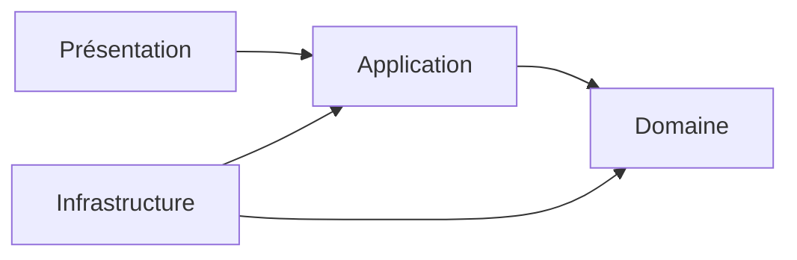
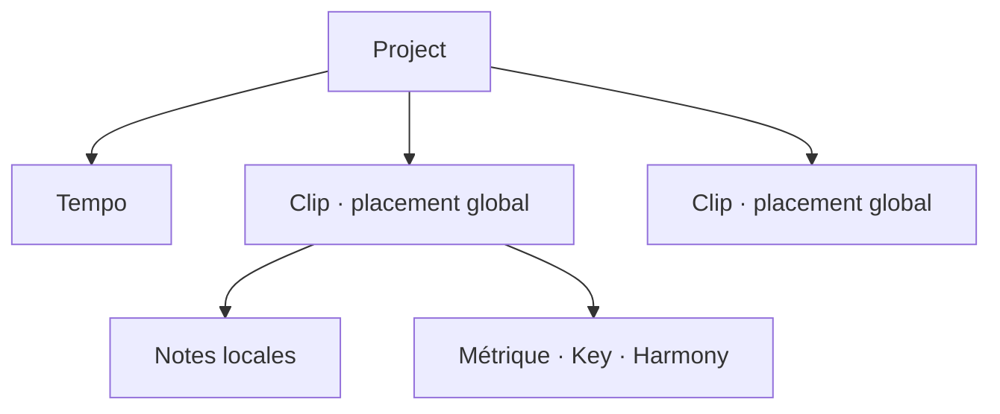
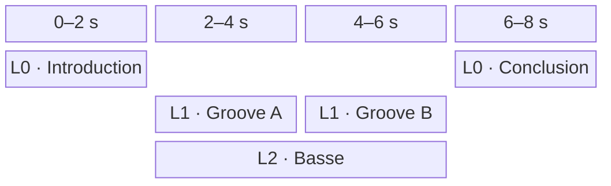
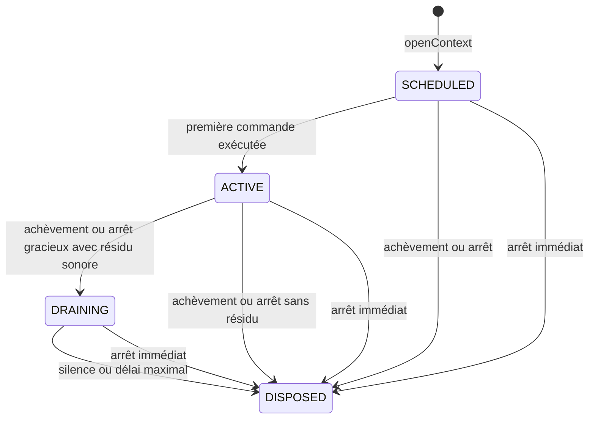

# Architecture

Ce document décrit l'architecture de Pianola, une application de piano roll avec rendu audio intégré.

Il fixe le vocabulaire courant, les responsabilités des couches et leurs dépendances. Les scénarios détaillés sont regroupés dans [etudes-de-cas.md](etudes-de-cas.md).

## Navigation

- [Vue d'ensemble](#vue-densemble)
- [Périmètre fonctionnel](#périmètre-fonctionnel)
- [Domaine](#domaine)
- [Application](#application)
- [Présentation](#présentation)
- [Infrastructure](#infrastructure)
- [Dépendances architecturales](#dépendances-architecturales)
- [Questions ouvertes](#questions-ouvertes)
- [Arborescence cible](#arborescence-cible)

## Vue d'ensemble

Pianola sépare quatre responsabilités :

| Couche | Responsabilité | Exemples |
| --- | --- | --- |
| Domaine | Représenter la composition et garantir ses invariants musicaux. | `Project`, `Clip`, `Note`, placement et temps musical |
| Application | Orchestrer l'édition et la lecture à partir du domaine. | état de l'éditeur, cas d'usage, ports |
| Infrastructure | Réaliser les capacités techniques demandées par l'application. | Web Audio, catalogue concret, persistance |
| Présentation | Afficher la grille et traduire les gestes utilisateur. | blocs de clips, piano roll, inspecteur |



Le sens des dépendances de code pointe vers l'intérieur :

- le domaine ne connaît aucune autre couche ;
- l'application dépend du domaine et définit les ports dont elle a besoin ;
- l'infrastructure dépend du domaine et des ports applicatifs qu'elle implémente ;
- la présentation déclenche les cas d'usage et observe leur résultat.

## Périmètre fonctionnel

Pianola est destiné à l'écriture et au processus initial de composition, pas à la production audio.

Le premier périmètre comprend :

- une grille bidimensionnelle de clips ;
- un axe horizontal représentant un temps global continu ;
- des lignes d'organisation réparties sur l'axe vertical, sans instrument, routage ni comportement musical associé ;
- un placement horizontal et une ligne persistants pour chaque clip ;
- un tempo unique appartenant au projet ;
- des notes associées individuellement à un instrument ;
- des chronologies de métrique, de tonalité et d'harmonie locales à chaque clip ;
- la lecture simultanée de tous les clips dont les intervalles globaux se chevauchent ;
- l'édition du contenu d'un clip dans un piano roll ;
- la lecture du projet depuis la tête de lecture ou depuis le début global d'un clip ;
- la préécoute ponctuelle d'une note ;
- un catalogue d'instruments échantillonnés intégrés et non éditables, rendus par `smplr`.

Il ne comprend pas :

- des pistes instrumentales : une ligne n'impose aucun instrument aux clips qu'elle contient ;
- une chronologie de tempo : une seule valeur s'applique au projet entier ;
- les contrôles globaux d'audibilité par instrument ;
- les automations et événements de contrôle ;
- la création, l'import ou l'édition d'instruments par l'utilisateur ;
- un état audio transitoire sauvegardé dans le projet.

Les `Note` sont le seul contenu sonore des clips. La métrique, la tonalité et l'harmonie sont des données structurelles locales, et non des automations.

---

## Domaine

Le domaine représente les intentions musicales indépendamment de React, Zustand, du stockage et du moteur Web Audio.

### Modèle de composition

Le `Project` possède directement une collection de `Clip` placés dans un même espace temporel bidimensionnel.



La coordonnée horizontale d'un clip est son instant de départ global. Sa coordonnée verticale est un indice de ligne. La durée du bloc est dérivée de sa durée locale et de son `repeatCount`.

Les lignes ne sont ni des pistes, ni des conteneurs, ni des canaux audio. Deux clips placés sur des lignes différentes ou identiques obéissent aux mêmes règles : si leurs intervalles globaux se chevauchent, leurs contenus sont lus simultanément.

### Vue des concepts

| Concept | Nature | Rôle principal |
| --- | --- | --- |
| `Project` | Entity et racine d'agrégat | Posséder le document musical, le tempo et les clips placés |
| `Clip` | Entity interne | Porter un placement global et une section musicale locale |
| `ClipPlacement` | Value Object | Associer un début global à un indice de ligne |
| `Note` | Entity interne | Représenter une note persistante associée à un instrument |
| `Instrument` | Entity de référence | Décrire publiquement un instrument intégré |
| `Tempo` | Value Object | Définir la vitesse unique du projet |
| `MeterChange` | Entity interne | Placer une métrique sur la chronologie locale d'un clip |
| `HarmonyChange` | Entity interne | Placer un accord ou une gamme sur la chronologie locale d'un clip |
| `KeyChange` | Entity interne | Placer une tonalité sur la chronologie locale d'un clip |

### Project

`Project` représente le document musical complet ouvert dans l'application.

Attributs possibles :

- `id` ;
- `name` ;
- `tempo` ;
- `clips` ;
- `createdAt` ;
- `updatedAt`.

Responsabilités et invariants :

- servir de racine de sauvegarde ;
- posséder directement tous les clips ;
- posséder exactement un `Tempo` ;
- garantir l'unicité des `ClipId` ;
- permettre l'ajout, le déplacement, la duplication et la suppression de clips ;
- accepter un projet vide.

Le tempo ne possède ni position, ni changement programmé. Il s'applique uniformément à toute la timeline et convertit les ticks globaux ou locaux en secondes.

La durée structurelle du projet est dérivée de la fin globale la plus tardive. Elle vaut zéro lorsque le projet ne contient aucun clip.

### ClipPlacement

`ClipPlacement` exprime les deux coordonnées persistantes d'un clip :

```ts
interface ClipPlacement {
  start: ProjectPosition;
  line: LineIndex;
}
```

`ProjectPosition` est un nombre entier de ticks depuis le début du projet. `LineIndex` est un entier positif ou nul. Le placement appartient au clip et est sauvegardé avec lui.

Deux placements peuvent partager la même ligne et tout ou partie du même intervalle horizontal. La ligne n'intervient jamais dans la planification audio. L'ordre d'affichage de deux blocs superposés sur la même ligne relève de la présentation.

### Clip

`Clip` représente une section musicale éditable, copiable, déplaçable et répétable.

Attributs possibles :

- `id` ;
- `name` ;
- `placement` ;
- `duration` ;
- `repeatCount` ;
- `notes` ;
- `meterChanges` ;
- `keyChanges` ;
- `harmonyChanges`.

Responsabilités et invariants :

- définir sa durée canonique locale en ticks ;
- posséder son début global et sa ligne d'organisation ;
- contenir des notes positionnées relativement à son début ;
- contenir et ordonner ses trois chronologies locales ;
- fournir la métrique, la tonalité et l'harmonie actives à une position locale ;
- conserver son nombre de lectures dans la sauvegarde ;
- garantir la cohérence locale de ses notes et changements.

`repeatCount` vaut `1` par défaut. Il accepte uniquement un entier strictement positif et indique le nombre total de lectures contiguës du contenu local. Chaque répétition recommence au tick local `0`.

La fin globale structurelle est calculée ainsi :

```text
clipEnd = placement.start + duration * repeatCount
```

Déplacer un clip modifie seulement son `placement`. Ses notes et ses changements conservent leurs positions locales. Changer de ligne ne modifie ni son temps global, ni son contenu, ni son rendu audio.

### Note

`Note` représente une note placée dans un clip et associée à un instrument.

Attributs possibles :

- `id` ;
- `pitch` ;
- `range` ;
- `velocity` ;
- `instrumentId`.

Une note possède une identité afin de conserver sa continuité lorsqu'elle est déplacée, redimensionnée, transposée ou modifiée. Une copie ou une duplication reçoit une nouvelle identité.

Invariants :

- la position locale de début est positive ou nulle ;
- la durée est strictement positive ;
- la note se termine au plus tard à la fin locale du clip ;
- la hauteur et la vélocité restent dans leurs plages valides ;
- exactement un `InstrumentId` est présent ;
- sa relation à la `Key` et à l'`Harmony` actives est dérivée et n'est pas sauvegardée ;
- une note extérieure à la tonalité, à l'accord ou à la gamme active reste valide.

Modifier le tempo du projet ou la métrique locale ne déplace pas la note : sa position et sa durée restent exprimées dans les ticks canoniques du clip.

Lorsqu'une note traverse un `KeyChange` ou un `HarmonyChange`, son `TimeRange` est analysé par portions délimitées par ces changements ainsi que par le début et la fin de la note. Chaque portion utilise la tonalité et l'harmonie alors actives. Cette segmentation est une vue dérivée : elle ne découpe ni ne modifie la `Note` persistante.

Les événements instantanés `NoteOn` et `NoteOff` ne sont pas des objets persistants du domaine. Ils sont produits par le service de lecture.

`Velocity` ne possède actuellement aucun usage indépendant de `Note`. Son type et ses règles sont déclarés dans `domain/Note.ts`.

### Instrument

`Instrument` est la représentation publique, stable et minimale d'un instrument intégré.

Attributs possibles :

- `id` ;
- `name`.

`InstrumentId` est un type stable et opaque déclaré avec `Instrument` dans `domain/Instrument.ts`.

Une `Note` sauvegarde uniquement cet identifiant, et non une référence directe vers l'objet `Instrument`. Plusieurs instruments peuvent coexister dans un même clip, et plusieurs clips peuvent référencer le même instrument. Le placement d'un clip sur une ligne ne modifie jamais cette association.

`Instrument` appartient à un modèle de référence distinct de l'agrégat `Project`. Il ne contient ni configuration d'échantillons, ni état de voix, ni objet du moteur audio.

Les instruments sont définis avant la compilation et ne sont pas éditables par l'utilisateur. La politique de chargement d'un `InstrumentId` devenu indisponible sera définie avec la persistance.

### Temps musical

Le temps musical canonique utilise des ticks entiers avec une résolution fixe de 960 ticks par noire.

Les battements, mesures et secondes sont des représentations dérivées. La grille visible peut quantifier un geste, mais ne réduit pas les positions valides du domaine à ses subdivisions affichées.

| Value Object | Représentation | Règles principales |
| --- | --- | --- |
| `ProjectPosition` | `ticks` | Entier positif ou nul depuis le début du projet |
| `TimePosition` | `ticks` | Entier positif ou nul, local au clip |
| `Duration` | `ticks` | Entier strictement positif |
| `TimeRange` | `start`, `duration` | Intervalle local utilisé notamment par une note |
| `LineIndex` | entier | Entier positif ou nul, sans sémantique audio |
| `Tempo` | `bpm` | Valeur unique et musicalement exploitable du projet |
| `Meter` | `beatsPerMeasure`, `beatUnit` | Permet de calculer les frontières de mesure locales |
| `Pitch` | `midiNumber` | Le nom et l'octave peuvent être dérivés |
| `Tonic` | `letter`, `accidental` | Centre tonal orthographié sans octave |
| `Key` | `tonic`, `mode` | Tonalité active |
| `ChordRoot` | `letter`, `accidental` | Fondamentale orthographiée d'un accord |
| `ScaleRoot` | `letter`, `accidental` | Tonique orthographiée d'une gamme |
| `TonalDegree` | `value`, `accidental` | Degré éventuellement altéré dans la tonalité active |
| `Chord` | `reference`, `typeId` | Accord défini par une fondamentale ou un degré |
| `Scale` | `reference`, `typeId` | Gamme définie par une tonique ou un degré |
| `Harmony` | `kind`, `chord` ou `scale` | Matériau harmonique actif, accord ou gamme |

Avec une résolution de 960 ticks par noire :

```text
ticksPerMeasure = beatsPerMeasure * (4 / beatUnit) * 960
durationSeconds = (durationTicks / 960) * (60 / project.tempo.bpm)
```

Pour la répétition d'indice `i`, commençant à zéro, la position globale d'une note est :

```text
noteGlobalStart = clip.placement.start
                + i * clip.duration
                + note.range.start
```

La métrique du clip n'intervient pas dans cette conversion. Elle structure les mesures et les repères locaux sans créer une horloge indépendante.

`TimeRange` facilite notamment la détection des chevauchements ainsi que les opérations de déplacement et de redimensionnement.

`Tonic` conserve l'orthographe du centre tonal sous la forme d'une lettre et d'une altération, sans octave. Sa classe de hauteur chromatique est dérivée et n'est pas sauvegardée séparément : `C_SHARP` et `D_FLAT` sont enharmoniquement équivalents, mais restent deux valeurs distinctes. `Key` associe une `Tonic` à un mode tonal. Elle fournit un contexte d'analyse et de présentation sans déplacer ni invalider les notes.

`Harmony` exprime le matériau harmonique actif. Ses variantes `CHORD` et `SCALE` sont exclusives : une section contient soit un `Chord`, soit une `Scale`, jamais les deux simultanément.

```ts
type Chord =
  | { reference: "ROOT"; root: ChordRoot; typeId: ChordTypeId }
  | { reference: "DEGREE"; degree: TonalDegree; typeId: ChordTypeId };

type Scale =
  | { reference: "ROOT"; root: ScaleRoot; typeId: ScaleTypeId }
  | { reference: "DEGREE"; degree: TonalDegree; typeId: ScaleTypeId };

type Harmony =
  | { kind: "CHORD"; chord: Chord }
  | { kind: "SCALE"; scale: Scale };
```

Une référence `ROOT` sauvegarde une fondamentale ou une tonique orthographiée et reste inchangée lors d'un `KeyChange`. Une référence `DEGREE` sauvegarde seulement un `TonalDegree` ; sa hauteur effective est résolue depuis la `Key` active et évolue donc avec elle. La hauteur résolue n'est jamais sauvegardée parallèlement au degré.

Le `typeId` reste explicite dans les deux représentations. Un degré ne détermine donc pas automatiquement la qualité d'un accord ni le type d'une gamme. `ScaleTypeId` peut notamment désigner des gammes diatoniques modales, pentatoniques ou d'autres collections prises en charge.

Une `Harmony` fondée sur `DEGREE` exige une `Key` active. Si un `KeyChange` et un `HarmonyChange` se trouvent au même tick local, leurs nouvelles valeurs s'appliquent ensemble à partir de ce tick.

Une `Harmony` de variante `CHORD` peut permettre de dériver des gammes compatibles, tandis qu'une variante `SCALE` peut permettre de dériver des accords compatibles. Ces propositions ne constituent jamais une seconde `Harmony` active et ne sont pas sauvegardées tant que l'utilisateur ne remplace pas explicitement la valeur courante.

### Chronologies locales du clip

Un clip possède trois collections ordonnées de changements :

| Changement | Valeur | Changement initial au tick `0` | Positions suivantes |
| --- | --- | --- | --- |
| `MeterChange` | `Meter` | Obligatoire | Frontière de mesure locale |
| `KeyChange` | `Key` | Facultatif | N'importe quel tick local du clip |
| `HarmonyChange` | `Harmony` | Facultatif | N'importe quel tick local du clip |

Chaque changement possède une identité, une position locale et sa nouvelle valeur. Les règles communes sont :

- un seul changement d'un même type peut exister à une position ;
- la nouvelle valeur s'applique à partir de la position du changement, incluse ;
- un changement peut être déplacé ou modifié sans perdre son identité ;
- un changement ferme la section précédente et commence la suivante ;
- un changement reste compris dans les bornes locales du clip.

Avant le premier `KeyChange`, aucune tonalité n'est active. Avant le premier `HarmonyChange`, aucune harmonie n'est active. Un changement de chaque type peut exister au même tick. Un `HarmonyChange` utilisant `DEGREE` ne peut toutefois exister qu'à une position où une `Key` est active.

Les marqueurs visibles dans l'éditeur sont la représentation des changements existants. Ils ne forment pas un type métier générique supplémentaire.

### Sections dérivées

`MeterSection`, `KeySection` et `HarmonySection` sont des vues locales dérivées. Chacune couvre l'intervalle entre un changement et le changement suivant du même type, ou entre ce changement et la fin du clip.

Elles ne sont pas sauvegardées comme des objets autonomes.

| Section | Valeurs dérivées | Usage principal |
| --- | --- | --- |
| `MeterSection` | `start`, `end`, `meter`, découpage en mesures | Repères métriques et frontières de mesure |
| `KeySection` | `start`, `end`, `key` | Recherche de la tonalité active |
| `HarmonySection` | `start`, `end`, `harmony` | Recherche de l'accord ou de la gamme active |

Pour une `MeterSection` :

```text
fullMeasureCount = floor(sectionDuration / ticksPerMeasure)
trailingMeasureDuration = sectionDuration % ticksPerMeasure
```

Une valeur non nulle de `trailingMeasureDuration` représente une dernière mesure incomplète. Le changement suivant constitue alors une frontière explicite et commence une nouvelle mesure.

Une `HarmonySection` dont le `Chord` ou la `Scale` utilise `DEGREE` peut produire plusieurs résolutions successives lorsqu'elle traverse des `KeySection`. Pour l'analyse d'une note, les intervalles pertinents sont donc dérivés de l'union des frontières de `KeySection`, d'`HarmonySection` et du `TimeRange` de la note.

### Frontière de l'agrégat

`Project` est la racine de l'unique agrégat constituant le document de composition sauvegardé.

Il possède :

- son tempo unique ;
- tous ses clips et leurs placements ;
- les notes appartenant à chaque clip ;
- les changements appartenant à chaque chronologie locale ;
- ses informations de sauvegarde.

Les entités internes conservent des identifiants stables afin d'être ciblées par l'éditeur et les cas d'usage. Elles ne possèdent cependant ni repository ni cycle de persistance autonomes.

Une opération peut être déléguée à un `Clip` pour préserver ses invariants locaux, mais l'entité est toujours atteinte depuis le `Project` chargé.

Les `Instrument` sont extérieurs à cet agrégat et sont fournis par un catalogue.

---

## Application

La couche applicative traduit les intentions de l'utilisateur en opérations sur le domaine et orchestre les interactions avec l'extérieur à travers des ports.

Elle possède l'état transitoire de l'éditeur et les états d'orchestration nécessaires à la lecture. Elle ne contient ni configuration `smplr`, ni banque d'échantillons, ni `AudioNode`, ni détail de stockage.

### État de l'éditeur

#### Sélections

Deux sélections indépendantes correspondent à deux espaces d'édition distincts.

```ts
type ClipContentRef =
  | { kind: "NOTE"; noteId: NoteId }
  | { kind: "METER_CHANGE"; meterChangeId: MeterChangeId }
  | { kind: "KEY_CHANGE"; keyChangeId: KeyChangeId }
  | { kind: "HARMONY_CHANGE"; harmonyChangeId: HarmonyChangeId };

interface ClipContentSelection {
  items: readonly ClipContentRef[];
}

interface ClipSelection {
  clipIds: readonly ClipId[];
}
```

`ClipContentSelection` contient les notes et changements du clip actuellement édité. Tous ses éléments appartiennent au clip désigné par `editedClipId`. Elle est vidée lorsque ce clip change ou est fermé.

`ClipSelection` contient les clips sélectionnés dans la grille de composition. Elle sert notamment à leur déplacement temporel ou vertical, à leur duplication et à leur suppression.

```ts
interface EditorState {
  editedClipId?: ClipId;
  clipContentSelection: ClipContentSelection;
  clipSelection: ClipSelection;
}
```

Le clip édité et la sélection de clips expriment des faits différents. Un geste d'interface peut les mettre à jour ensemble, mais aucun lien implicite n'est imposé entre eux.

La couche applicative choisit explicitement la sélection correspondant à l'action, résout ses références et transmet au domaine les identifiants concernés. Le domaine ne connaît jamais la notion de sélection.

#### GridResolution

`GridResolution` représente la précision utilisée pendant l'édition.

Attribut possible :

- `snapStepTicks`.

Elle permet de convertir un geste en position ou durée quantifiée avant l'appel au domaine. La même résolution peut guider un déplacement global de clip ou une édition locale, mais les deux espaces temporels restent typés séparément.

Les sélections et la résolution ne sont pas sauvegardées comme des données musicales. Leur persistance éventuelle relève des préférences ou de la restauration de session.

#### Tête de lecture

La tête de lecture est un état applicatif transitoire exprimé par une `ProjectPosition`. Elle partage le référentiel global des placements de clips, mais n'est pas sauvegardée dans l'agrégat.

Sa position initiale est le tick global `0`. Elle peut être déplacée directement par l'utilisateur ou fixée au `placement.start` d'un clip. À une position donnée, tous les clips dont l'intervalle structurel contient la tête participent au transport.

#### Projet transitoire

L'application distingue le projet courant validé d'un éventuel projet transitoire produit pendant une manipulation.

```ts
interface ProjectState {
  project: Project;
  transientProject?: Project;
}

const effectiveProject = state.transientProject ?? state.project;
```

`project` est la version courante faisant autorité dans l'éditeur. Elle peut comporter des modifications validées qui n'ont pas encore été sauvegardées. Le terme ne doit donc pas être remplacé par `persistedProject`.

`transientProject` est le résultat provisoire de la manipulation en cours. Il remplace temporairement `project` pour tous les usages interactifs, sans le modifier. Il reste un `Project` ordinaire soumis aux mêmes invariants : aucun type `TransientProject` n'est introduit dans le domaine.

`effectiveProject` est une valeur dérivée, jamais un troisième projet stocké :

- il vaut `transientProject` lorsqu'il existe ;
- il vaut sinon `project` ;
- il constitue la source commune de la présentation et de la lecture audio ;
- il n'est jamais transmis tel quel à la persistance.

Un seul projet transitoire peut exister à la fois. Chaque actualisation est recalculée depuis `project`, et non depuis la version transitoire précédente, afin d'éviter l'accumulation d'arrondis au cours d'un geste continu.

Le cycle de substitution expose conceptuellement trois opérations :

```ts
setTransientProject(project: Project): void;
applyTransientProject(): void;
discardTransientProject(): void;
```

`setTransientProject` crée ou remplace le résultat provisoire. `applyTransientProject` en fait atomiquement le nouveau `project`, puis supprime l'état transitoire. `discardTransientProject` l'abandonne et rétablit immédiatement le projet précédent comme projet effectif.

Appliquer un projet transitoire ne le sauvegarde pas. Une application du projet transitoire formera également une seule unité dans un futur historique d'annulation, quels que soient le nombre de mises à jour produites pendant le geste.

### Cas d'usage d'édition

Les cas d'usage d'édition :

- traduisent les gestes en commandes explicites ;
- choisissent la sélection adaptée à la portée de l'action ;
- résolvent les références vers les entités du projet ;
- appliquent si nécessaire la quantification ;
- délèguent au domaine les mutations qui protègent ses invariants ;
- chargent et sauvegardent le projet à travers des ports.

Exemples :

- déplacer ensemble des notes et des changements appartenant à un même clip ;
- transposer ou redimensionner des notes ;
- ajouter, déplacer ou supprimer un changement local ;
- redimensionner un clip ;
- déplacer un ou plusieurs clips sur l'axe temporel ou entre les lignes ;
- créer, dupliquer ou supprimer des clips ;
- modifier le tempo unique du projet ;
- modifier le `repeatCount` d'un clip ;
- associer un instrument disponible à une ou plusieurs notes.

La substitution du projet transitoire est commune à tous les gestes d'édition. Chaque geste reste porté par un cas d'usage explicite, qui peut transformer atomiquement plusieurs types d'éléments lorsqu'ils participent à une même intention utilisateur.

Un déplacement de clips reçoit par exemple un delta temporel global et un delta de ligne. Les clips sélectionnés conservent leurs positions relatives :

```ts
interface MoveClipsCommand {
  clipIds: readonly ClipId[];
  deltaTicks: number;
  deltaLines: number;
}
```

Un déplacement temporel du contenu local peut recevoir une autre commande :

```ts
interface MoveClipContentCommand {
  clipId: ClipId;
  items: readonly ClipContentRef[];
  deltaTicks: number;
}
```

Les références peuvent désigner simultanément des notes et des changements de métrique, de tonalité et d'harmonie. La transformation est atomique : si un élément ne peut pas atteindre la position proposée sans violer un invariant, aucun résultat partiel n'est publié.

Les identifiants des entités déplacées sont conservés. Lorsqu'une transformation provisoire crée des entités, leurs identifiants sont générés une seule fois pour le geste, restent stables pendant ses actualisations et sont conservés si le projet transitoire est appliqué.

Les services seront nommés et ajoutés dans `application/use-cases/` lorsque leurs responsabilités précises seront établies.

#### Modification de la métrique

Changer une métrique exprime explicitement l'une de deux intentions :

| Politique | Effet |
| --- | --- |
| `PRESERVE_DURATION` | Conserve les ticks des notes, des changements et de la fin de section. Le nombre de mesures est recalculé. |
| `PRESERVE_MEASURE_COUNT` | Recalcule la borne de fin selon la nouvelle longueur de mesure. |

Dans le premier périmètre, `PRESERVE_MEASURE_COUNT` s'applique à un clip vide ou à une section terminale vide, afin de ne pas imposer de déplacement en cascade aux sections suivantes.

Lors de la création d'un clip, le cas d'usage reçoit un nombre de mesures et une métrique, puis calcule sa durée canonique locale en ticks. Le tempo est déjà fourni par le projet et n'intervient pas dans ce calcul. Un clip vide conserve par défaut son nombre de mesures. Une section contenant des notes ou suivie d'autres sections conserve par défaut sa durée.

### PlaybackService

`PlaybackService` est le cas d'usage qui interprète les placements de clips et produit les commandes nécessaires à la lecture du projet.

#### Projet effectif et modification en temps réel

Le service lit le même `effectiveProject` que la présentation. Une lecture ou une préécoute déclenchée pendant une manipulation utilise donc immédiatement le projet transitoire lorsqu'il existe.

Lorsqu'un transport est déjà actif, chaque remplacement de `transientProject` invalide la portion future de la planification construite depuis l'ancien projet effectif. Le service la recalcule depuis le nouvel `effectiveProject` et transmet les changements au moteur lors du prochain cycle de planification sûr.

Appliquer le projet transitoire ne change pas le contenu d'`effectiveProject` et ne doit donc provoquer ni nouvelle planification ni rupture sonore. L'abandonner entraîne la même réconciliation que toute autre modification transitoire.

La réconciliation compare la couverture de la tête de lecture par chaque occurrence avant et après la modification :

| Avant | Après | Comportement |
| --- | --- | --- |
| L'occurrence est audible | La note couvre toujours la tête | Conserver l'occurrence et replanifier son `NOTE_OFF` |
| L'occurrence est audible | La note ne couvre plus la tête | Produire un `NOTE_OFF` à la borne de replanification |
| La note n'est pas audible | La note couvre désormais la tête | Créer une occurrence et produire un `NOTE_ON` à la borne |
| La note n'est pas audible | La note ne couvre toujours pas la tête | Replanifier uniquement ses éventuelles commandes futures |

Cette règle vaut autant pour une modification locale de la note que pour le déplacement global de son clip. Déplacer le début d'une note ou d'un clip sans faire franchir la tête à l'attaque ne redéclenche pas une occurrence déjà audible.

Si la note reste couverte mais que sa hauteur, son `instrumentId`, sa vélocité ou une autre propriété sonore d'attaque change, l'occurrence existante est relâchée puis remplacée par une nouvelle occurrence. Un changement du tempo unique conserve l'occurrence et replanifie ses commandes temporelles : il ne modifie aucune donnée d'attaque.

Cette replanification est une conséquence applicative du geste d'édition, pas une nouvelle commande publique de la présentation.

#### Interface publique

```ts
type StopMode = "GRACEFUL" | "IMMEDIATE";

interface NotePreviewHandle {
  release(): void;
}

play(): void;
play(clipId: ClipId): void;
preview(noteId: NoteId): NotePreviewHandle;
stop(mode?: StopMode): void;
```

#### Lecture du projet

Toute opération `play` ouvre une session `PROJECT` et conserve le projet entier comme portée de lecture.

`play()` commence à la position actuelle de la tête de lecture. Cette position vaut le tick global `0` tant qu'elle n'a pas été déplacée.

`play(clipId)` utilise le clip comme repère temporel : le service place la tête à son `placement.start`, puis lit le projet entier depuis cette position. Il ne limite pas la lecture au clip ciblé. Tous les autres clips déjà actifs ou commençant à la même position participent donc au transport.

L'identifiant transmis à `play` sert uniquement à déterminer la position de départ. Il ne devient ni la racine de la session, ni une frontière de lecture.

#### Préécoute d'une note

`preview(noteId)` déclenche immédiatement une audition soutenue de la note ciblée et retourne un `NotePreviewHandle`. La durée persistante de la note ne détermine pas celle de cette audition : celle-ci se poursuit jusqu'au relâchement du handle ou jusqu'à une durée maximale de sécurité.

Cette opération :

- ne déplace pas la tête de lecture ;
- ne parcourt aucun autre clip ;
- ouvre en interne une session `NOTE_PREVIEW` indépendante ;
- peut coexister avec le transport et avec d'autres préécoutes de notes.

`NotePreviewHandle.release()` relâche uniquement l'occurrence créée par l'appel correspondant. L'opération est idempotente. La release et le tail peuvent ensuite se terminer naturellement.

Pour une touche du piano roll, la présentation appelle `preview(noteId)` au début du geste, conserve le handle, puis appelle `release()` à sa fin, notamment lors de `pointerup` ou `pointercancel`. Elle ne reçoit aucun identifiant de session ou de contexte audio.

Il n'existe aucune préécoute structurelle bornée d'un clip. Son bouton de lecture déclenche toujours une lecture globale avec `play(clipId)`.

#### Planification globale et chevauchements

Le service n'a pas à reconstruire les départs depuis une structure implicite. Pour chaque clip, son intervalle global est directement obtenu depuis son placement, sa durée et son `repeatCount`.

```text
clipInterval = [placement.start, placement.start + duration * repeatCount)
projectEnd = max(clipInterval.end)
```

Les intervalles sont semi-ouverts : un clip qui se termine exactement quand un autre commence ne le chevauche pas. Tous les intervalles qui se recouvrent sont planifiés simultanément, indépendamment de leur ligne.

Chaque répétition recommence au tick local `0` avec les valeurs initiales de métrique, de tonalité et d'harmonie du clip. La planification peut rester glissante et bornée pour limiter le volume de commandes préparées.

Le tempo unique permet une conversion affine entre ticks globaux et secondes. Au démarrage d'une session :

```text
command.at = ((eventGlobalTick - sessionStartProjectPosition) / 960)
           * (60 / project.tempo.bpm)
```

Si le tempo est modifié pendant le transport, le service ancre la nouvelle conversion à la borne de replanification. Le temps déjà écoulé n'est pas recalculé et aucune chronologie de tempo n'est créée dans le projet :

```text
command.at = replanAt
           + ((eventGlobalTick - replanProjectPosition) / 960)
           * (60 / effectiveProject.tempo.bpm)
```

La borne conserve la `ProjectPosition` atteinte sous l'ancien tempo, puis la nouvelle valeur s'applique à toute la portion future.

Lorsqu'une lecture commence au milieu d'un clip, le service calcule sa position locale en tenant compte de la répétition correspondante. La politique applicable aux notes ayant commencé avant cette position reste une question ouverte.

#### Identités d'exécution

La lecture utilise trois niveaux d'identité opaques et transitoires :

| Identité | Portée |
| --- | --- |
| `PlaybackSessionId` | Une opération globale de lecture ou une préécoute de note |
| `PlaybackContextId` | Une unité audio isolée appartenant à une session |
| `NoteOccurrenceId` | Une attaque précise dans un contexte |

Une nouvelle occurrence est créée à chaque attaque, y compris lors des répétitions. Deux notes utilisant le même instrument, la même hauteur et le même instant restent ainsi indépendantes.

Un nouveau contexte est créé à chaque activation d'un clip et à chaque préécoute de note. Les répétitions d'un clip réutilisent son contexte et ses instances d'instrument, mais produisent de nouvelles occurrences de notes.

Les identifiants persistants `ClipId` et `NoteId` restent connus du domaine et du service. Ils ne sont pas transmis au moteur audio.

Ces identités d'exécution appartiennent au langage interne du port `AudioEngine` et ne sont jamais exposées à la présentation. Le `NotePreviewHandle` public n'est pas une identité audio : il expose uniquement la capacité de relâcher l'audition qui l'a créé.

#### Sessions et concurrence

```ts
type PlaybackSessionKind = "PROJECT" | "NOTE_PREVIEW";
```

| Catégorie | Kind | Règle de concurrence |
| --- | --- | --- |
| Transport | `PROJECT` | Une seule session peut planifier de nouvelles commandes |
| Audition | `NOTE_PREVIEW` | Plusieurs sessions peuvent coexister entre elles et avec le transport |

Démarrer une nouvelle lecture avec `play` retire immédiatement son rôle au transport précédent et annule ses attaques futures. Ses contextes peuvent néanmoins subsister jusqu'à la fin de leurs releases et tails ; cela ne constitue pas un second transport actif.

`preview(noteId)` ne remplace jamais le transport. Relâcher son handle produit le `NOTE_OFF` de son occurrence, termine structurellement son contexte et laisse ses releases et tails se drainer. Si le handle n'est pas relâché par la fin du geste, la durée maximale de sécurité applique automatiquement le même comportement.

`stop(mode)` arrête uniquement le transport actif et n'affecte aucune préécoute de note. Le service transmet au moteur l'identifiant de la session correspondante. S'il n'existe aucun transport actif, l'opération est sans effet.

Le mode par défaut est `GRACEFUL` :

- les attaques futures sont annulées ;
- les occurrences actives sont relâchées immédiatement ;
- les contextes laissent leurs releases et tails se terminer.

`IMMEDIATE` détruit sans délai les contextes ciblés et leur sortie sonore. Le remplacement d'un transport suit la politique `GRACEFUL`.

Les scénarios complets sont décrits dans [etudes-de-cas.md](etudes-de-cas.md).

### Ports applicatifs

#### AudioEngine

`AudioEngine` accepte des identités d'exécution et des commandes audio sans exposer `smplr`, les définitions ou instances techniques d'instrument, ni les objets Web Audio.

```ts
type AudioCommand = {
  contextId: PlaybackContextId;
  at: number;
} & (
  | {
      kind: "NOTE_ON";
      occurrenceId: NoteOccurrenceId;
      instrumentId: InstrumentId;
      pitch: Pitch;
      velocity: Velocity;
    }
  | {
      kind: "NOTE_OFF";
      occurrenceId: NoteOccurrenceId;
    }
);

interface AudioEngine {
  openSession(
    sessionId: PlaybackSessionId,
    kind: PlaybackSessionKind
  ): void;

  openContext(
    sessionId: PlaybackSessionId,
    contextId: PlaybackContextId
  ): void;

  schedule(commands: readonly AudioCommand[]): void;

  replaceScheduledCommands(
    sessionId: PlaybackSessionId,
    from: number,
    commands: readonly AudioCommand[]
  ): void;

  completeContext(contextId: PlaybackContextId): void;
  stopContext(contextId: PlaybackContextId, mode: StopMode): void;
  stopSession(sessionId: PlaybackSessionId, mode: StopMode): void;
}
```

`openContext` enregistre une seule fois la relation entre le contexte et sa session propriétaire. Chaque `AudioCommand` transporte donc uniquement son `contextId`.

`replaceScheduledCommands` retire, pour la session ciblée, toutes les commandes non encore exécutées dont `at >= from`, puis installe atomiquement la nouvelle séquence. `from` et les `AudioCommand.at` sont exprimés en secondes relativement au début de la session. Son identité, son origine temporelle et la continuité du transport restent inchangées.

Cette opération ne relâche aucune occurrence active et ne détruit aucun contexte par elle-même. Le `PlaybackService` exprime ces effets par les nouvelles commandes. Les nouveaux contextes nécessaires sont ouverts avant le remplacement ; ceux devenus inutiles sont ensuite achevés ou arrêtés selon leur cycle de vie.

`completeContext` signale la fin structurelle et autorise le drainage naturel. `stopContext` et `stopSession` demandent un arrêt selon le `StopMode` indiqué. Ces opérations ne servent pas à replanifier un transport qui continue.

`InstrumentDefinition`, `InstrumentInstance`, `AudioNode` et `AudioContext` ne traversent jamais ce port.

#### InstrumentCatalog

`InstrumentCatalog` est un port de consultation permettant :

- de lister les `Instrument` disponibles ;
- d'obtenir un `Instrument` à partir de son `InstrumentId` ;
- de vérifier si un identifiant peut être résolu.

Il retourne directement les objets `Instrument` du domaine. Aucune configuration `smplr`, banque d'échantillons, instance technique ou donnée de chargement ne traverse ce port.

Les futurs ports de persistance seront définis avec les cas d'usage correspondants.

---

## Présentation

La présentation offre une grille temporelle bidimensionnelle qui affiche directement les placements persistants des clips.

### Grille globale

L'axe horizontal représente la `ProjectPosition` depuis le début du projet. Il est commun à tous les clips et continu sur toute la composition. L'axe vertical est formé de lignes d'organisation numérotées.



Dans cette représentation :

| Élément visuel | Signification |
| --- | --- |
| Position horizontale | `ClipPlacement.start` sauvegardé |
| Longueur d'un bloc | `duration * repeatCount`, convertie par le tempo du projet |
| Position verticale | `ClipPlacement.line` sauvegardé |
| Blocs chevauchants | Clips lus simultanément |
| Tête de lecture verticale | `ProjectPosition` utilisée par `play()` |

Une ligne ne possède aucun instrument implicite. Deux clips d'une même ligne peuvent utiliser des instruments différents ; un clip peut lui-même contenir plusieurs instruments. Déplacer un clip verticalement ne change donc jamais le son.

La grille applique directement la sémantique du transport :

- `play()` commence à la tête affichée ;
- `play(clipId)` déplace la tête au début sauvegardé du clip puis démarre la lecture globale ;
- tous les clips traversés par la tête appartiennent au même instant de lecture ;
- `preview(noteId)` ne déplace ni la tête ni la grille.

La présentation affiche toujours l'`effectiveProject`. Pendant un geste, le déplacement global ou vertical provisoire d'un clip est donc immédiatement visible et audible. Les coordonnées validées appartiennent au domaine ; le pointeur brut, les pixels, le zoom et le défilement restent des états de présentation.

---

## Infrastructure

L'infrastructure contient les implémentations techniques des ports applicatifs. Elle peut être remplacée sans modifier le cœur de la composition.

### Infrastructure audio

L'infrastructure audio possède :

- le catalogue concret des instruments intégrés ;
- leurs définitions techniques et leurs sources `smplr` ;
- le chargeur et les échantillons partagés ;
- les sessions et contextes d'exécution ;
- les instances d'instrument ;
- le moteur Web Audio concret.

Le moteur et son `AudioContext` Web Audio sont globaux. Un `PlaybackContext` constitue un périmètre logique et une chaîne audio isolée, pas un nouvel `AudioContext` natif.

### StaticInstrumentCatalog

`StaticInstrumentCatalog` est l'implémentation concrète du port `InstrumentCatalog` et la source de vérité des instruments intégrés.

Il conserve une collection immuable d'`InstrumentDefinition` :

- la couche applicative le manipule à travers `InstrumentCatalog`, qui n'expose que les `Instrument` publics ;
- le moteur audio concret l'utilise directement pour résoudre un `InstrumentId` vers sa définition technique.

Cette résolution interne à l'infrastructure ne nécessite pas de second port ni de registre parallèle.

### InstrumentDefinition

`InstrumentDefinition` est la définition technique immuable d'un instrument intégré.

Attributs possibles :

- `instrument` ;
- `createInstance`.

`createInstance` est une factory interne à l'infrastructure. Elle reçoit l'`AudioContext` global, le bus de sortie du `PlaybackContext` et le chargeur d'échantillons partagé, puis crée une `InstrumentInstance` fondée sur [`smplr`](https://github.com/danigb/smplr).

La définition choisit l'instrument ou le preset `smplr` employé. Elle ne décrit aucune chaîne de traitement ni politique d'allocation des voix propre à Pianola. Ces détails ne traversent jamais le port `InstrumentCatalog`.

### PlaybackSession

`PlaybackSession` est l'état technique transitoire d'une opération globale. Elle possède les contextes ouverts pour cette opération et permet leur arrêt collectif.

Une session remplacée ne devient pas elle-même `DRAINING`. Elle subsiste uniquement comme propriétaire de contextes éventuellement en drainage, puis est détruite lorsqu'ils sont tous `DISPOSED`.

### PlaybackContext

`PlaybackContext` est une unité de lecture audio isolée dans une session.

Il possède notamment :

- un bus de sortie propre ;
- une table `InstrumentId -> InstrumentInstance` ;
- une table `NoteOccurrenceId -> VoiceHandle` ;
- les commandes programmées qui doivent pouvoir être annulées ;
- un état `SCHEDULED`, `ACTIVE`, `DRAINING` ou `DISPOSED`.

`DRAINING` appartient exclusivement au cycle de vie du contexte. Il commence après la fin structurelle ou un arrêt gracieux, lorsque des releases ou tails restent audibles.

#### Propriétaire et transitions d'état

La machine d'état de `PlaybackContext` appartient au moteur audio concret. Le `PlaybackService` reste l'autorité temporelle : il décide de la fin structurelle, de la replanification et des arrêts, puis les exprime à travers `AudioEngine`.



| État | Signification | Nouvelles commandes |
| --- | --- | --- |
| `SCHEDULED` | Le contexte est ouvert, mais aucune de ses commandes n'a encore été exécutée. | Acceptées. |
| `ACTIVE` | Au moins une commande a été exécutée et la lecture structurelle peut encore produire des attaques. | Acceptées. |
| `DRAINING` | La lecture structurelle est terminée ; seules les occurrences relâchées et les tails subsistent. | Toute nouvelle attaque est refusée. |
| `DISPOSED` | La chaîne audio, les instances et les références du contexte ont été libérées. | Toute commande devient sans effet. |

`completeContext` exprime la fin structurelle décidée par le `PlaybackService`. Le moteur annule les commandes encore futures du contexte, relâche ses occurrences actives et passe à `DRAINING` si un signal peut encore être produit ; sinon il passe directement à `DISPOSED`.

Un arrêt `GRACEFUL` suit la même sortie vers `DRAINING`, mais peut survenir avant la fin structurelle. Un arrêt `IMMEDIATE` annule les commandes futures, coupe la sortie et conduit directement à `DISPOSED` depuis tout état non détruit.

Le moteur réalise seul la transition `DRAINING -> DISPOSED`, lorsqu'aucune voix ni aucun tail ne peut encore produire de signal, ou lorsque la durée maximale de sécurité est atteinte. Il notifie alors la session propriétaire, qui est elle-même détruite dès que tous ses contextes sont `DISPOSED`.

Les opérations de cycle de vie sont idempotentes. Un contexte `DRAINING` ne peut pas redevenir `ACTIVE` : si une replanification exige de nouvelles attaques après son achèvement, le `PlaybackService` doit ouvrir un nouveau contexte. `replaceScheduledCommands` ne change en revanche pas l'état d'un contexte encore `SCHEDULED` ou `ACTIVE`.

Un contexte de clip correspond à l'activation audio d'un clip placé. Le `ClipId` d'origine et la correspondance entre le clip et son contexte restent une connaissance du `PlaybackService`.

Une préécoute de note utilise le même type de contexte. Le `PlaybackService` conserve l'association interne entre le `NotePreviewHandle`, la session, le contexte et l'occurrence correspondants ; aucun descripteur supplémentaire n'est nécessaire.

### InstrumentInstance

`InstrumentInstance` adapte une instance `smplr` au cycle de vie audio de Pianola.

Une instance appartient exclusivement à un `PlaybackContext` et dirige sa sortie vers le bus propre à ce contexte. Pour un contexte, une seule instance est créée paresseusement par `InstrumentId`. Deux contextes utilisant le même instrument possèdent donc des instances indépendantes.

Lors d'un `NOTE_ON`, l'instance déclenche la note à l'instant `at`. Le contrôle d'arrêt retourné par `smplr` est associé au `NoteOccurrenceId` par le contexte, afin qu'un `NOTE_OFF` puisse relâcher exactement la bonne occurrence.

`smplr` prend en charge la lecture et le cycle de vie interne de ses voix. Pianola ne modélise ni oscillateurs, ni enveloppes, ni allocation de voix propre à l'instrument.

### Ressources d'échantillons partagées

Le moteur possède un chargeur `smplr` partagé. Les échantillons téléchargés et décodés sont ainsi mutualisés entre les instances, tandis que leurs voix et leurs connexions de sortie restent isolées par contexte.

Le chargement est paresseux et peut être anticipé dans la fenêtre de planification avant le premier `NOTE_ON`. Le premier périmètre n'ajoute aucun effet nécessitant un `AudioWorklet`.

### WebAudioEngine

Le moteur audio concret implémente `AudioEngine`, crée les instances `smplr` propres aux contextes et produit leur mixage dans l'`AudioContext` global.

Il assure :

- la gestion des sessions et contextes ;
- la résolution des instruments auprès de `StaticInstrumentCatalog` ;
- la création d'une instance par couple `(PlaybackContext, InstrumentId)` ;
- la planification des commandes sur l'horloge de l'`AudioContext` ;
- le remplacement atomique des commandes futures d'une session ;
- l'association de chaque `NoteOccurrenceId` au contrôle d'arrêt de sa voix ;
- l'annulation des commandes d'un contexte ou d'une session ;
- le drainage puis la destruction des contextes ;
- la mutualisation du chargement et du décodage des échantillons ;
- les limites globales de sécurité et la sortie audio.

`smplr` est utilisé uniquement comme moteur d'instrument. Son séquenceur n'est pas utilisé : le `PlaybackService` reste l'unique autorité qui transforme les placements et le contenu musical en commandes horodatées.

Le premier périmètre repose sur les nœuds Web Audio natifs employés par `smplr` et ne nécessite aucun `AudioWorklet`. Tout l'état du moteur est transitoire et n'est jamais sauvegardé dans le `Project`.

### Persistance

L'infrastructure de persistance chargera et sauvegardera l'agrégat `Project` complet à travers les futurs ports applicatifs dédiés.

La sauvegarde contient notamment le tempo unique du projet ainsi que le `placement.start` et le `placement.line` de chaque clip. Les secondes affichées restent dérivées et ne sont pas sauvegardées parallèlement aux ticks.

Seul le `project` courant validé peut être sauvegardé. `transientProject` et `effectiveProject` appartiennent à l'orchestration applicative et ne traversent jamais le port de persistance. Une demande de sauvegarde effectuée pendant une manipulation enregistre donc le dernier `project` validé, sans adopter implicitement le projet transitoire.

La stratégie applicable lorsqu'un `InstrumentId` sauvegardé ne peut plus être résolu n'est pas encore définie. Elle sera traitée avec la conception de la persistance.

---

## Dépendances architecturales

| Depuis | Dépend de | Ne connaît pas |
| --- | --- | --- |
| Domaine | Aucun élément extérieur | sélection, pixels, cas d'usage, ports, Web Audio, stockage |
| Application | Domaine et ports qu'elle définit | implémentations concrètes, `smplr`, banques d'échantillons, `AudioNode` |
| Infrastructure | Domaine et ports applicatifs | composants et état de présentation |
| Présentation | API applicative et modèles d'affichage | définitions et instances audio internes |

Quelques relations structurantes :

- `Project.tempo` fournit l'unique tempo de la composition ;
- `Project.clips` possède directement tous les clips sauvegardés ;
- `Clip.placement` conserve le début global et la ligne ;
- `Note.instrumentId` référence un instrument sans importer sa définition technique ;
- `transientProject` remplace provisoirement `project` sans constituer un type du domaine ;
- `effectiveProject` résout cette substitution pour la présentation et le `PlaybackService` ;
- seule la valeur `project` est proposée à la persistance ;
- `PlaybackService` transforme les placements et contenus locaux en commandes pour `AudioEngine` ;
- `InstrumentCatalog` expose les instruments disponibles à l'application ;
- `StaticInstrumentCatalog` implémente ce port et fournit au moteur les définitions capables de créer les instances `smplr` ;
- `PlaybackSession` possède des `PlaybackContext` ;
- chaque contexte possède au plus une `InstrumentInstance` par `InstrumentId`.

## Questions ouvertes

- Les chevauchements sur une même ligne doivent-ils rester entièrement libres, être interdits par l'éditeur ou recevoir une règle explicite de superposition visuelle ? Leur lecture audio est dans tous les cas simultanée.
- Les lignes doivent-elles rester de simples indices, ou faut-il leur donner plus tard une identité et des métadonnées persistantes telles qu'un nom, une couleur ou une hauteur d'affichage ? Elles ne devront pas acquérir de sémantique instrumentale implicite.
- Lorsqu'une ligne vide est supprimée ou qu'une ligne est insérée, les indices des clips suivants doivent-ils être décalés automatiquement ou les espaces vides doivent-ils rester stables ?
- Le déplacement et le redimensionnement des clips doivent-ils autoriser tout tick global ou appliquer par défaut une quantification relative à une grille globale sans métrique ?
- Quelle plage de BPM et quelle précision décimale le `Tempo` du projet doit-il accepter ?
- Une tonalité active doit-elle pouvoir être interrompue sans être remplacée, et faut-il alors qu'un `KeyChange` porte explicitement un état sans tonalité ? Une telle interruption devra être interdite sur tout intervalle couvert par une `Harmony` utilisant `DEGREE`.
- Quels `ChordTypeId` et `ScaleTypeId` appartiennent au premier périmètre, et selon quelles règles la `Key` active classe-t-elle les accords ou gammes compatibles proposés à l'utilisateur ?
- Quelle politique appliquer lorsqu'un instrument `smplr` requis n'est pas encore chargé : attendre tous les instruments nécessaires avant de démarrer le transport, ou les précharger dès l'ouverture et chaque modification du projet ?
- Les banques d'échantillons utilisées par `smplr` doivent-elles être distribuées avec l'application ou chargées depuis une source distante puis mises en cache localement ?
- Lorsqu'une lecture commence au milieu d'une note déjà engagée, faut-il ignorer cette note, la réattaquer pour sa durée restante ou reconstruire son état par une politique de note chase ?
- Que devient exactement la tête de lecture après une fin naturelle, un `stop` gracieux ou un `stop` immédiat ?
- Déplacer la tête pendant un transport actif doit-il provoquer immédiatement une nouvelle session `PROJECT`, ou seulement fixer le point de départ du prochain appel à `play()` ?
- Si un clip est déplacé au-delà de la tête pendant qu'un de ses tails est en drainage, faut-il conserver le contexte jusqu'au silence ou l'arrêter immédiatement avant d'en ouvrir un nouveau à sa nouvelle position ?

## Arborescence cible

Cette arborescence documente les frontières actuelles. Elle exprime des responsabilités et non l'obligation de créer un fichier autonome pour chaque type.

```text
src/
├── domain/
│   ├── Project.ts
│   ├── Clip.ts
│   ├── ClipPlacement.ts
│   ├── Instrument.ts
│   ├── Note.ts
│   ├── time/
│   │   ├── ProjectPosition.ts
│   │   ├── TimePosition.ts
│   │   ├── Duration.ts
│   │   ├── TimeRange.ts
│   │   ├── Tempo.ts
│   │   └── Meter.ts
│   └── pitch/
│       ├── Pitch.ts
│       ├── Key.ts
│       └── Harmony.ts
├── application/
│   ├── editor/
│   │   ├── EditorState.ts
│   │   ├── ProjectState.ts
│   │   ├── Selection.ts
│   │   └── GridResolution.ts
│   ├── use-cases/
│   │   └── PlaybackService.ts
│   └── ports/
│       ├── AudioEngine.ts
│       └── InstrumentCatalog.ts
├── infrastructure/
│   ├── audio/
│   │   ├── catalog/
│   │   │   ├── StaticInstrumentCatalog.ts
│   │   │   └── InstrumentDefinition.ts
│   │   └── engine/
│   │       ├── WebAudioEngine.ts
│   │       ├── PlaybackSession.ts
│   │       ├── PlaybackContext.ts
│   │       └── InstrumentInstance.ts
│   └── persistence/
└── presentation/
    ├── components/
    └── stores/
```

`Tempo.ts` déclare uniquement le value object global `Tempo`. `Meter.ts` déclare ensemble `Meter`, `MeterChange` et `MeterSection`. `Key.ts` déclare `Tonic`, `Key`, `KeyChange` et `KeySection`. `Harmony.ts` déclare `ChordRoot`, `ScaleRoot`, `TonalDegree`, `Chord`, `Scale`, `Harmony`, `HarmonyChange` et `HarmonySection`.

`ClipPlacement.ts` déclare `ClipPlacement` et `LineIndex`. `ProjectPosition` reste distinct de `TimePosition` afin d'empêcher le mélange accidentel des coordonnées globales et locales.

`Instrument` et `InstrumentId` sont déclarés ensemble dans `domain/Instrument.ts`. `Velocity` reste déclaré avec `Note`. `Tonic` reste un value object distinct déclaré dans `domain/pitch/Key.ts`.

`ClipContentSelection`, `ClipSelection` et leurs références peuvent rester réunies dans `application/editor/Selection.ts`.

`ProjectState` conserve le `project` validé et son éventuel `transientProject`. `effectiveProject` est une résolution dérivée de cet état et ne nécessite ni fichier ni type autonome.

`PlaybackSessionId`, `PlaybackContextId`, `NoteOccurrenceId`, `PlaybackSessionKind`, `AudioCommand` et `StopMode` forment le langage du port `AudioEngine` et peuvent être déclarés avec lui.

Un module `application/playback/` ne deviendra utile que si ce vocabulaire acquiert plusieurs consommateurs ou des comportements indépendants.
