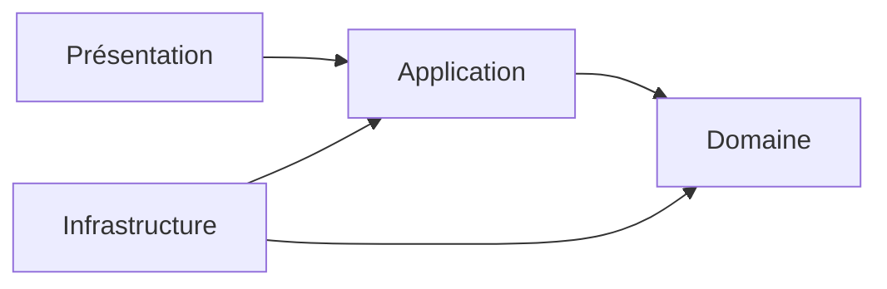
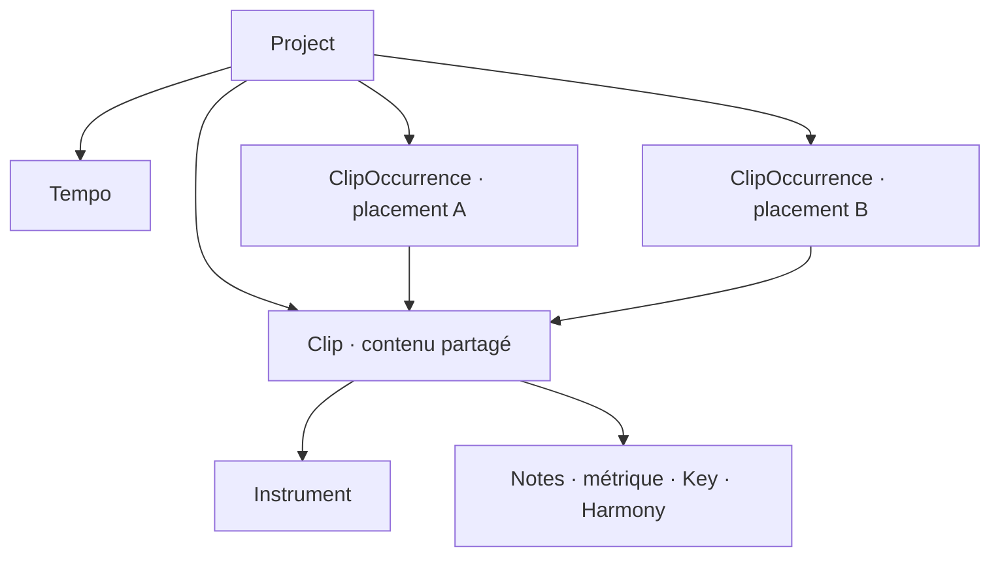
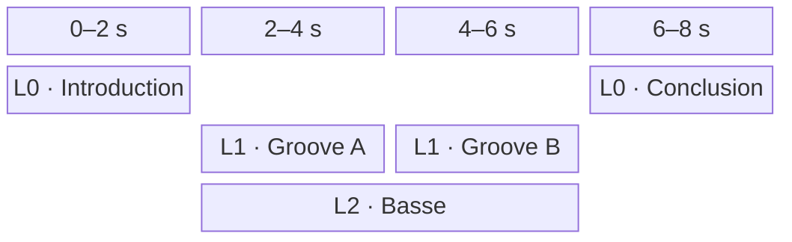
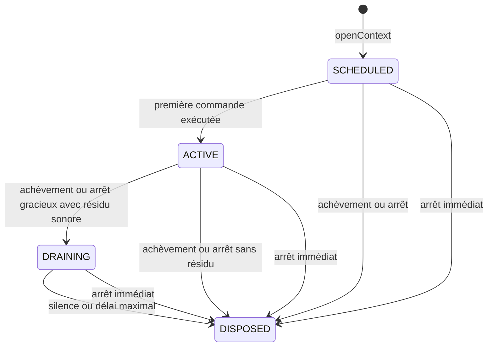

# Architecture

Ce document décrit l'architecture de Pianola, une application de piano roll avec rendu audio intégré.

Il fixe le vocabulaire courant, les responsabilités des couches et leurs dépendances. Les scénarios détaillés sont regroupés dans [etudes-de-cas.md](etudes-de-cas.md).

## Navigation

- [Vue d'ensemble](#vue-densemble)
- [Périmètre fonctionnel](#périmètre-fonctionnel)
- [Domaine](#domaine)
- [Application](#application)
- [Présentation](#présentation)
- [Infrastructure](#infrastructure)
- [Dépendances architecturales](#dépendances-architecturales)
- [Questions ouvertes](#questions-ouvertes)
- [Arborescence cible](#arborescence-cible)

## Vue d'ensemble

Pianola sépare quatre responsabilités :

| Couche | Responsabilité | Exemples |
| --- | --- | --- |
| Domaine | Représenter la composition, garantir ses invariants et expliciter ses échecs attendus. | `Project`, `Clip`, `Note`, `Result`, temps musical et pitch |
| Application | Orchestrer l'édition et la lecture à partir du domaine. | état de l'éditeur, cas d'usage, ports |
| Infrastructure | Réaliser les capacités techniques demandées par l'application. | Web Audio, catalogue concret, persistance |
| Présentation | Afficher la grille et traduire les gestes utilisateur. | blocs de clips, piano roll, inspecteur |



Le sens des dépendances de code pointe vers l'intérieur :

- le domaine ne connaît aucune autre couche ;
- l'application dépend du domaine et définit les ports dont elle a besoin ;
- l'infrastructure dépend du domaine et des ports applicatifs qu'elle implémente ;
- la présentation déclenche les cas d'usage et observe leur résultat.

## Périmètre fonctionnel

Pianola est destiné à l'écriture et au processus initial de composition, pas à la production audio.

Le premier périmètre comprend :

- une grille bidimensionnelle de clips ;
- un axe horizontal représentant un temps global continu ;
- des lignes d'organisation réparties sur l'axe vertical, sans instrument, routage ni comportement musical associé ;
- un placement horizontal et une ligne persistants pour chaque occurrence de clip ;
- des occurrences référençant par défaut un contenu `Clip` partagé : modifier ce contenu modifie toutes ses occurrences ;
- un tempo unique appartenant au projet ;
- un instrument associé à chaque clip et partagé par toutes ses notes ;
- l'absence de chevauchement entre notes de même hauteur dans un clip, avec résolution explicite `SLICE` ou `MERGE` ;
- des chronologies de métrique, de tonalité et d'harmonie locales à chaque clip ;
- la lecture simultanée de tous les clips dont les intervalles globaux se chevauchent ;
- l'édition du contenu d'un clip dans un piano roll ;
- la lecture du projet depuis sa tête globale ou depuis un tick global explicite ;
- la lecture isolée du clip édité depuis sa tête locale ou depuis un tick local explicite ;
- la préécoute ponctuelle d'une note du clip édité ;
- un catalogue d'instruments échantillonnés intégrés et non éditables, rendus par `smplr`.

Il ne comprend pas :

- des pistes instrumentales : une ligne n'impose aucun instrument aux clips qu'elle contient ;
- une chronologie de tempo : une seule valeur s'applique au projet entier ;
- les contrôles globaux d'audibilité par instrument ;
- les automations et événements de contrôle ;
- la création, l'import ou l'édition d'instruments par l'utilisateur ;
- un état audio transitoire sauvegardé dans le projet.

Les `Note` sont le seul contenu sonore des clips. La métrique, la tonalité et l'harmonie sont des données structurelles locales, et non des automations.

---

## Domaine

Le domaine représente les intentions musicales indépendamment de React, Zustand, du stockage et du moteur Web Audio.

### Modèle de composition

Le `Project` possède d'une part des `Clip`, contenus musicaux éditables dans le piano roll, et d'autre part des `ClipOccurrence`, blocs persistants placés dans l'espace temporel bidimensionnel. Chaque occurrence référence exactement un clip par son `ClipId`.



La coordonnée horizontale d'une occurrence est son instant de départ global. Sa coordonnée verticale est un indice de ligne. La durée du bloc est dérivée de la durée locale du clip référencé et du `repeatCount` de l'occurrence.

Les lignes ne sont ni des pistes, ni des conteneurs, ni des canaux audio. Dans le premier périmètre, elles sont de simples indices bornés par une limite fixe de sécurité et ne font l'objet d'aucune commande d'ajout ou de suppression. Deux occurrences placées sur des lignes différentes peuvent se chevaucher et sont alors lues simultanément. Deux blocs ne peuvent en revanche pas occuper des intervalles qui se chevauchent sur une même ligne.

### Vue des concepts

| Concept | Nature | Rôle principal |
| --- | --- | --- |
| `Project` | Entity et racine d'agrégat | Posséder le document musical, le tempo, les clips et leurs occurrences |
| `Clip` | Entity interne | Porter un instrument et un contenu musical local partagé et éditable |
| `ClipOccurrence` | Entity interne | Référencer un clip et porter son placement global dans la grille |
| `Note` | Entity interne | Représenter une note persistante dont l'instrument est hérité du clip |
| `Instrument` | Entity de référence | Décrire publiquement un instrument intégré |
| `Tempo` | Value Object | Définir la vitesse unique du projet |
| `MeterChange` | Entity interne | Placer une métrique sur la chronologie locale d'un clip |
| `HarmonyChange` | Entity interne | Placer un accord ou une gamme sur la chronologie locale d'un clip |
| `KeyChange` | Entity interne | Placer une tonalité sur la chronologie locale d'un clip |

### Result et validation du domaine

Le domaine représente toute validation attendue par un `Result<T, E>` explicite :

```ts
type Result<T, E> =
  | { ok: true; value: T }
  | { ok: false; error: E };

type ValidationError<
  Code extends string,
  Details extends object
> = {
  kind: "VALIDATION_ERROR";
  code: Code;
  details: Details;
};
```

Les branches sont discriminées par `ok`. Des helpers purs `ok(value)` et `err(error)` peuvent construire les deux variantes ; `map` et `flatMap` peuvent les composer sans extraire prématurément une valeur.

Chaque module déclare près de ses invariants ses propres codes et détails, puis compose les unions nécessaires. Il n'existe pas d'erreur générique contenant seulement un texte. Exemples :

```ts
type TempoValidationError = ValidationError<
  "TEMPO_OUT_OF_RANGE" | "TEMPO_PRECISION_EXCEEDED",
  { received: number; min: number; max: number; decimals: number }
>;

type NoteCollision = {
  manipulatedNoteId: NoteId;
  conflictingNoteIds: readonly NoteId[];
};

type NoteCollisionError = ValidationError<"NOTE_OVERLAP", NoteCollision>;
```

Les `code` sont stables et indépendants de la langue. `details` contient uniquement les données structurées nécessaires pour comprendre et traiter l'échec ; le domaine ne produit aucun message destiné à l'utilisateur.

Les constructeurs capables de créer un état invalide restent privés. Les factories de Value Objects et d'entités, la reconstitution d'un agrégat et les opérations qui peuvent violer un invariant retournent un `Result` :

```ts
Tempo.create(bpm: number): Result<Tempo, TempoValidationError>;
Clip.create(input: CreateClipInput): Result<Clip, ClipValidationError>;
Project.create(input: CreateProjectInput): Result<Project, ProjectValidationError>;
project.moveClipOccurrences(command: MoveClipOccurrencesCommand): Result<Project, ProjectEditError>;
clip.editNote(command: EditNoteCommand): Result<Clip, NoteEditError>;
```

Une branche `ok: false` ne modifie jamais l'objet d'origine et ne publie aucun état partiel. Dans le premier périmètre, une opération retourne la première erreur selon un ordre de validation déterministe ; l'accumulation de plusieurs erreurs pourra être ajoutée sans changer la forme de `Result`.

Les violations prévisibles d'une règle métier ne lèvent pas d'exception. Les exceptions restent réservées aux défauts de programmation et aux défaillances techniques inattendues ; elles ne sont pas converties artificiellement en `ValidationError`.

### Project

`Project` représente le document musical complet ouvert dans l'application.

Attributs possibles :

- `id` ;
- `name` ;
- `tempo` ;
- `clips` ;
- `clipOccurrences` ;
- `createdAt` ;
- `updatedAt`.

Responsabilités et invariants :

- servir de racine de sauvegarde ;
- posséder directement tous les clips et toutes leurs occurrences ;
- posséder exactement un `Tempo` ;
- garantir l'unicité des `ClipId` et des `ClipOccurrenceId` ;
- garantir que chaque `ClipOccurrence.clipId` référence un clip existant ;
- garantir que les intervalles de deux occurrences d'une même ligne ne se chevauchent pas ;
- permettre la création et l'édition des clips ainsi que l'ajout, le déplacement, la duplication et la suppression de leurs occurrences ;
- interdire la suppression d'un clip encore référencé par une occurrence ;
- accepter un projet vide et les clips temporairement sans occurrence.

Supprimer la dernière occurrence d'un clip ne supprime jamais implicitement sa source. Le clip reste disponible pour être replacé et ne disparaît que par une commande manuelle de suppression, valide uniquement lorsqu'aucune occurrence ne le référence.

Le tempo ne possède ni position, ni changement programmé. Il s'applique uniformément à toute la timeline et convertit les ticks globaux ou locaux en secondes.

La durée structurelle du projet est dérivée de la fin globale la plus tardive parmi ses occurrences. Elle vaut zéro lorsque le projet ne contient aucune occurrence.

### Clip

`Clip` représente un contenu musical local éditable dans le piano roll, associé à un instrument et partageable par plusieurs occurrences.

Attributs possibles :

- `id` ;
- `name` ;
- `duration` ;
- `instrumentId` ;
- `notes` ;
- `meterChanges` ;
- `keyChanges` ;
- `harmonyChanges`.

Responsabilités et invariants :

- définir sa durée canonique locale en ticks ;
- référencer exactement un `InstrumentId` ;
- contenir des notes positionnées relativement à son début local, toutes jouées par l'instrument du clip ;
- empêcher le chevauchement temporel de deux notes de même hauteur ;
- contenir et ordonner ses trois chronologies locales ;
- fournir la métrique, la tonalité et l'harmonie actives à une position locale ;
- garantir la cohérence locale de ses notes et changements.

Un `Clip` ne possède ni début global, ni ligne, ni nombre de répétitions. Modifier son contenu ou sa durée modifie la source commune observée et jouée par toutes les `ClipOccurrence` qui le référencent.

### ClipOccurrence

`ClipOccurrence` représente un bloc persistant placé dans la grille globale.

Attributs possibles :

- `id` ;
- `clipId` ;
- `start` ;
- `line` ;
- `repeatCount`.

`start` est un `Tick` interprété depuis le début du projet. `line` est un `LineIndex` compris entre `0` inclus et la limite fixe de sécurité exclue. Les lignes n'ont dans le premier périmètre ni identité, ni métadonnées, ni cycle de vie propre. Une occurrence référence exactement un `Clip` existant et ne duplique jamais son contenu local.

`repeatCount` vaut `1` par défaut. Il accepte uniquement un entier strictement positif et indique le nombre total de lectures contiguës du clip référencé. Chaque répétition recommence au tick local `0`.

La fin globale structurelle est calculée ainsi :

```text
occurrenceEnd = occurrence.start
              + clip.duration * occurrence.repeatCount
```

Déplacer une occurrence modifie seulement son `start` ou sa `line`. Dupliquer un bloc crée une nouvelle `ClipOccurrenceId` qui conserve le même `clipId` ; les deux blocs restent donc liés au même contenu. Le premier périmètre ne permet ni de délier une occurrence, ni de transformer une occurrence liée en copie indépendante.

Les intervalles de deux occurrences d'une même ligne sont semi-ouverts et ne peuvent pas se chevaucher avec une durée strictement positive ; des bornes contiguës restent valides. La ligne n'intervient toutefois jamais dans la planification audio : les occurrences qui se chevauchent sur des lignes différentes sont lues simultanément.

### Note

`Note` représente une note placée dans un clip. Son instrument est celui du clip qui la contient.

Attributs possibles :

- `id` ;
- `pitch` ;
- `range` ;
- `velocity`.

Une note possède une identité afin de conserver sa continuité lorsqu'elle est déplacée, redimensionnée, transposée ou modifiée. Une copie ou une duplication reçoit une nouvelle identité.

Invariants :

- la position locale de début est positive ou nulle ;
- la durée est strictement positive ;
- la note se termine au plus tard à la fin locale du clip ;
- la hauteur et la vélocité restent dans leurs plages valides ;
- deux notes de même `Pitch` ne se chevauchent jamais avec une durée strictement positive dans un même clip ;
- sa relation à la `Key` et à l'`Harmony` actives est dérivée et n'est pas sauvegardée ;
- une note extérieure à la tonalité, à l'accord ou à la gamme active reste valide.

Les intervalles sont semi-ouverts : deux notes de même hauteur peuvent être contiguës lorsque la fin de l'une est égale au début de l'autre. Des notes de hauteurs différentes peuvent se chevaucher ; cet invariant préserve donc la polyphonie et les accords.

Une création, un déplacement, un redimensionnement ou une transposition qui produirait un chevauchement de même hauteur n'est jamais appliqué implicitement. Le domaine signale la collision à l'application, qui doit obtenir de la présentation un mode de résolution `SLICE` ou `MERGE` avant de soumettre une nouvelle tentative explicite.

Modifier le tempo du projet ou la métrique locale ne déplace pas la note : sa position et sa durée restent exprimées dans les ticks canoniques du clip.

Lorsqu'une note traverse un `KeyChange` ou un `HarmonyChange`, son `TimeRange` est analysé par portions délimitées par ces changements ainsi que par le début et la fin de la note. Chaque portion utilise la tonalité et l'harmonie alors actives. Cette segmentation est une vue dérivée : elle ne découpe ni ne modifie la `Note` persistante.

Les événements instantanés `NoteOn` et `NoteOff` ne sont pas des objets persistants du domaine. Ils sont produits par le service de lecture.

`Velocity` ne possède actuellement aucun usage indépendant de `Note`. Son type et ses règles sont déclarés dans `domain/Note.ts`.

### Instrument

`Instrument` est la représentation publique, stable et minimale d'un instrument intégré.

Attributs possibles :

- `id` ;
- `name`.

`InstrumentId` est un type stable et opaque déclaré avec `Instrument` dans `domain/Instrument.ts`.

Un `Clip` sauvegarde uniquement cet identifiant, et non une référence directe vers l'objet `Instrument`. Il référence exactement un instrument, dont héritent toutes ses notes. Plusieurs clips peuvent référencer le même instrument. Le placement d'une occurrence sur une ligne ne modifie jamais cette association.

`Instrument` appartient à un modèle de référence distinct de l'agrégat `Project`. Il ne contient ni configuration d'échantillons, ni état de voix, ni objet du moteur audio.

Les instruments sont définis avant la compilation et ne sont pas éditables par l'utilisateur. La politique de chargement d'un `InstrumentId` devenu indisponible sera définie avec la persistance.

### Temps musical

Le temps musical canonique utilise des ticks entiers avec une résolution fixe de 960 ticks par noire.

Les battements, mesures et secondes sont des représentations dérivées. La grille visible peut quantifier un geste, mais ne réduit pas les positions valides du domaine à ses subdivisions affichées.

| Value Object | Représentation | Règles principales |
| --- | --- | --- |
| `Tick` | entier | Entier positif ou nul ; son contexte d'emploi détermine s'il est global ou local |
| `Duration` | `ticks` | Entier strictement positif |
| `TimeRange` | `start`, `duration` | Intervalle local dont `start` est un `Tick`, utilisé notamment par une note |
| `Tempo` | `bpm` | Une décimale, de `20.0` à `999.9` BPM inclus |
| `Meter` | `beatsPerMeasure`, `beatUnit` | Permet de calculer les frontières de mesure locales |

Avec une résolution de 960 ticks par noire :

```text
ticksPerMeasure = beatsPerMeasure * (4 / beatUnit) * 960
durationSeconds = (durationTicks / 960) * (60 / project.tempo.bpm)
```

Pour la répétition d'indice `i`, commençant à zéro, la position globale d'une note est :

```text
noteGlobalStart = occurrence.start
                + i * clip.duration
                + note.range.start
```

La métrique du clip n'intervient pas dans cette conversion. Elle structure les mesures et les repères locaux sans créer une horloge indépendante.

`TimeRange` facilite notamment la détection des chevauchements ainsi que les opérations de déplacement et de redimensionnement.

### Hauteur, tonalité et harmonie

Ces objets décrivent la hauteur des notes et leur contexte tonal ou harmonique. Ils n'appartiennent pas au calcul du temps musical.

| Value Object | Représentation | Règles principales |
| --- | --- | --- |
| `Pitch` | `midiNumber` | Le nom et l'octave peuvent être dérivés |
| `Tonic` | `letter`, `accidental` | Centre tonal orthographié sans octave |
| `Key` | `tonic`, `mode` | Tonalité active |
| `ChordRoot` | `letter`, `accidental` | Fondamentale orthographiée d'un accord |
| `ScaleRoot` | `letter`, `accidental` | Tonique orthographiée d'une gamme |
| `TonalDegree` | `value`, `accidental` | Degré éventuellement altéré dans la tonalité active |
| `Chord` | `reference`, `typeId` | Accord défini par une fondamentale ou un degré |
| `Scale` | `reference`, `typeId` | Gamme définie par une tonique ou un degré |
| `Harmony` | `kind`, `chord` ou `scale` | Matériau harmonique actif, accord ou gamme |

`Tonic` conserve l'orthographe du centre tonal sous la forme d'une lettre et d'une altération, sans octave. Sa classe de hauteur chromatique est dérivée et n'est pas sauvegardée séparément : `C_SHARP` et `D_FLAT` sont enharmoniquement équivalents, mais restent deux valeurs distinctes. `Key` associe une `Tonic` à un mode tonal. Elle fournit un contexte d'analyse et de présentation sans déplacer ni invalider les notes.

`Harmony` exprime le matériau harmonique actif. Ses variantes `CHORD` et `SCALE` sont exclusives : une section contient soit un `Chord`, soit une `Scale`, jamais les deux simultanément.

```ts
type Chord =
  | { reference: "ROOT"; root: ChordRoot; typeId: ChordTypeId }
  | { reference: "DEGREE"; degree: TonalDegree; typeId: ChordTypeId };

type Scale =
  | { reference: "ROOT"; root: ScaleRoot; typeId: ScaleTypeId }
  | { reference: "DEGREE"; degree: TonalDegree; typeId: ScaleTypeId };

type Harmony =
  | { kind: "CHORD"; chord: Chord }
  | { kind: "SCALE"; scale: Scale };
```

Une référence `ROOT` sauvegarde une fondamentale ou une tonique orthographiée et reste inchangée lors d'un `KeyChange`. Une référence `DEGREE` sauvegarde seulement un `TonalDegree` ; sa hauteur effective est résolue depuis la `Key` active et évolue donc avec elle. La hauteur résolue n'est jamais sauvegardée parallèlement au degré.

Le `typeId` reste explicite dans les deux représentations. Un degré ne détermine donc pas automatiquement la qualité d'un accord ni le type d'une gamme. `ScaleTypeId` peut notamment désigner des gammes diatoniques modales, pentatoniques ou d'autres collections prises en charge.

Une `Harmony` fondée sur `DEGREE` exige une `Key` active. Si un `KeyChange` et un `HarmonyChange` se trouvent au même tick local, leurs nouvelles valeurs s'appliquent ensemble à partir de ce tick.

Une `Harmony` de variante `CHORD` peut permettre de dériver des gammes compatibles, tandis qu'une variante `SCALE` peut permettre de dériver des accords compatibles. Ces propositions ne constituent jamais une seconde `Harmony` active et ne sont pas sauvegardées tant que l'utilisateur ne remplace pas explicitement la valeur courante.

### Chronologies locales du clip

Un clip possède trois collections ordonnées de changements :

| Changement | Valeur | Changement initial au tick `0` | Positions suivantes |
| --- | --- | --- | --- |
| `MeterChange` | `Meter` | Obligatoire | Frontière de mesure locale |
| `KeyChange` | `Key` ou `null` | Facultatif | N'importe quel tick local du clip |
| `HarmonyChange` | `Harmony` | Facultatif | N'importe quel tick local du clip |

Chaque changement possède une identité, une position locale et sa nouvelle valeur. Les règles communes sont :

- un seul changement d'un même type peut exister à une position ;
- la nouvelle valeur s'applique à partir de la position du changement, incluse ;
- un changement peut être déplacé ou modifié sans perdre son identité ;
- un changement ferme la section précédente et commence la suivante ;
- un changement reste compris dans les bornes locales du clip.

Avant le premier `KeyChange`, aucune tonalité n'est active. Un `KeyChange` portant `null` interrompt explicitement la tonalité active jusqu'au prochain changement portant une `Key`. Avant le premier `HarmonyChange`, aucune harmonie n'est active. Un changement de chaque type peut exister au même tick. Un `HarmonyChange` utilisant `DEGREE` ne peut toutefois exister qu'à une position où une `Key` est active, et aucune section de cette harmonie ne peut traverser un intervalle sans tonalité.

Les marqueurs visibles dans l'éditeur sont la représentation des changements existants. Ils ne forment pas un type métier générique supplémentaire.

### Sections dérivées

`MeterSection`, `KeySection` et `HarmonySection` sont des vues locales dérivées. Chacune couvre l'intervalle entre un changement et le changement suivant du même type, ou entre ce changement et la fin du clip.

Elles ne sont pas sauvegardées comme des objets autonomes.

| Section | Valeurs dérivées | Usage principal |
| --- | --- | --- |
| `MeterSection` | `start`, `end`, `meter`, découpage en mesures | Repères métriques et frontières de mesure |
| `KeySection` | `start`, `end`, `key` | Recherche de la `Key` active ou de la valeur `null` qui l'interrompt |
| `HarmonySection` | `start`, `end`, `harmony` | Recherche de l'accord ou de la gamme active |

Pour une `MeterSection` :

```text
fullMeasureCount = floor(sectionDuration / ticksPerMeasure)
trailingMeasureDuration = sectionDuration % ticksPerMeasure
```

Une valeur non nulle de `trailingMeasureDuration` représente une dernière mesure incomplète. Le changement suivant constitue alors une frontière explicite et commence une nouvelle mesure.

Une `HarmonySection` dont le `Chord` ou la `Scale` utilise `DEGREE` peut produire plusieurs résolutions successives lorsqu'elle traverse des `KeySection`. Pour l'analyse d'une note, les intervalles pertinents sont donc dérivés de l'union des frontières de `KeySection`, d'`HarmonySection` et du `TimeRange` de la note.

### Frontière de l'agrégat

`Project` est la racine de l'unique agrégat constituant le document de composition sauvegardé.

Il possède :

- son tempo unique ;
- tous ses clips et toutes leurs occurrences ;
- les notes appartenant à chaque clip ;
- les changements appartenant à chaque chronologie locale ;
- ses informations de sauvegarde.

Les entités internes conservent des identifiants stables afin d'être ciblées par l'éditeur et les cas d'usage. Elles ne possèdent cependant ni repository ni cycle de persistance autonomes.

Une opération peut être déléguée à un `Clip` pour préserver ses invariants locaux, mais l'entité est toujours atteinte depuis le `Project` chargé.

Les `Instrument` sont extérieurs à cet agrégat et sont fournis par un catalogue.

---

## Application

La couche applicative traduit les intentions de l'utilisateur en opérations sur le domaine et orchestre les interactions avec l'extérieur à travers des ports.

Elle possède l'état transitoire de l'éditeur et les états d'orchestration nécessaires à la lecture. Elle ne contient ni configuration `smplr`, ni banque d'échantillons, ni `AudioNode`, ni détail de stockage.

### État de l'éditeur

#### Sélections

Deux sélections indépendantes correspondent à deux espaces d'édition distincts.

```ts
type ClipContentRef =
  | { kind: "NOTE"; noteId: NoteId }
  | { kind: "METER_CHANGE"; meterChangeId: MeterChangeId }
  | { kind: "KEY_CHANGE"; keyChangeId: KeyChangeId }
  | { kind: "HARMONY_CHANGE"; harmonyChangeId: HarmonyChangeId };

interface ClipContentSelection {
  items: readonly ClipContentRef[];
}

interface ClipOccurrenceSelection {
  occurrenceIds: readonly ClipOccurrenceId[];
}
```

`ClipContentSelection` contient les notes et changements du clip source actuellement édité. Elle est portée par le même `ClipEditorState` que l'identité et la tête de lecture locale du clip. Elle est vidée lorsque ce clip change ou est fermé.

`ClipOccurrenceSelection` contient les blocs sélectionnés dans la grille de composition. Elle sert notamment à leur déplacement temporel ou vertical, à leur duplication et à leur suppression. Dupliquer cette sélection crée par défaut de nouvelles occurrences référençant les mêmes clips.

```ts
interface ClipEditorState {
  clipId: ClipId;
  playhead: Tick;
  gridResolution: GridResolution;
  selection: ClipContentSelection;
}

interface EditorState {
  projectPlayhead: Tick;
  projectGridResolution: GridResolution;
  clipEditor?: ClipEditorState;
  clipOccurrenceSelection: ClipOccurrenceSelection;
}
```

Le clip source édité et la sélection d'occurrences expriment des faits différents. Un geste d'interface peut les mettre à jour ensemble, mais aucun lien implicite n'est imposé entre eux. Regrouper `clipId`, la tête locale et la sélection empêche qu'un état local subsiste sans clip édité.

La couche applicative choisit explicitement la sélection correspondant à l'action, résout ses références et transmet au domaine les identifiants concernés. Le domaine ne connaît jamais la notion de sélection.

#### GridResolution

`GridResolution` représente une précision de quantification utilisée pendant l'édition.

Attribut possible :

- `snapStepTicks`.

Elle permet de convertir un geste en position ou durée quantifiée avant l'appel au domaine. Le déplacement et le redimensionnement global des occurrences utilisent obligatoirement `EditorState.projectGridResolution`, dans le référentiel global et sans dépendre d'une métrique. Le piano roll utilise séparément `ClipEditorState.gridResolution`, dans le référentiel local du clip. Les deux instances emploient la même unité `Tick`, mais aucune égalité de pas ni dépendance structurelle n'est imposée entre elles.

Les sélections et la résolution ne sont pas sauvegardées comme des données musicales. Leur persistance éventuelle relève des préférences ou de la restauration de session.

#### Têtes de lecture

Les deux espaces d'édition possèdent des têtes de lecture applicatives, transitoires et non sauvegardées dans l'agrégat :

| Tête | État | Référentiel |
| --- | --- | --- |
| Projet | `EditorState.projectPlayhead` | Tick global depuis le début du projet |
| Clip | `EditorState.clipEditor.playhead` | Tick local depuis le début du clip édité |

Leur position initiale est le tick `0`. Seule la tête correspondant au transport actif avance tant que son espace d'édition reste ouvert ; l'autre conserve sa position. Fournir un tick à `playProject` ou `playClip` déplace la tête correspondante avant de démarrer la lecture.

Les deux têtes restent indépendantes. Une position globale ne détermine pas implicitement une position locale, car un même clip peut être utilisé par plusieurs occurrences et répétitions. Une éventuelle synchronisation visuelle lors de l'ouverture d'une occurrence relève d'une action explicite de présentation.

Déplacer la tête correspondant au transport actif est un seek : le `PlaybackService` remplace gracieusement la session courante par une nouvelle session de même portée au tick demandé. Déplacer la tête inactive modifie seulement le point de départ du prochain transport de cette portée. `stop(GRACEFUL)` et `stop(IMMEDIATE)` immobilisent la tête active à sa position courante sans réinitialiser aucune tête.

Une session `CLIP` reste attachée au `clipId` avec lequel elle a été ouverte. Fermer le piano roll ou ouvrir un autre clip ne l'arrête pas. Si son `ClipEditorState` disparaît ou change de clip, sa position courante reste un curseur d'exécution interne à l'`ActiveTransport` et ne déplace pas la tête locale du nouvel éditeur.

#### Projet transitoire

L'application distingue le projet courant validé d'un éventuel projet transitoire produit pendant une manipulation.

```ts
interface ProjectState {
  project: Project;
  transientProject?: Project;
}

const effectiveProject = state.transientProject ?? state.project;
```

`project` est la version courante faisant autorité dans l'éditeur. Elle peut comporter des modifications validées qui n'ont pas encore été sauvegardées. Le terme ne doit donc pas être remplacé par `persistedProject`.

`transientProject` est le résultat provisoire de la manipulation en cours. Il remplace temporairement `project` pour tous les usages interactifs, sans le modifier. Il reste un `Project` ordinaire soumis aux mêmes invariants : aucun type `TransientProject` n'est introduit dans le domaine.

`effectiveProject` est une valeur dérivée, jamais un troisième projet stocké :

- il vaut `transientProject` lorsqu'il existe ;
- il vaut sinon `project` ;
- il constitue la source commune de la présentation et de la lecture audio ;
- il n'est jamais transmis tel quel à la persistance.

Un seul projet transitoire peut exister à la fois. Chaque actualisation est recalculée depuis `project`, et non depuis la version transitoire précédente, afin d'éviter l'accumulation d'arrondis au cours d'un geste continu.

Le cycle de substitution expose conceptuellement trois opérations :

```ts
setTransientProject(project: Project): void;
applyTransientProject(): void;
discardTransientProject(): void;
```

`setTransientProject` crée ou remplace le résultat provisoire. `applyTransientProject` en fait atomiquement le nouveau `project`, puis supprime l'état transitoire. `discardTransientProject` l'abandonne et rétablit immédiatement le projet précédent comme projet effectif.

Appliquer un projet transitoire ne le sauvegarde pas. Une application du projet transitoire formera également une seule unité dans un futur historique d'annulation, quels que soient le nombre de mises à jour produites pendant le geste.

### Cas d'usage d'édition

Les cas d'usage d'édition :

- traduisent les gestes en commandes explicites ;
- construisent et composent les Value Objects par leurs `Result` sans forcer une valeur invalide ;
- choisissent la sélection adaptée à la portée de l'action ;
- résolvent les références vers les entités du projet ;
- appliquent si nécessaire la quantification ;
- délèguent au domaine les mutations qui protègent ses invariants ;
- chargent et sauvegardent le projet à travers des ports.

Exemples :

- déplacer ensemble des notes et des changements appartenant à un même clip ;
- transposer ou redimensionner des notes ;
- ajouter, déplacer ou supprimer un changement local ;
- redimensionner le contenu d'un clip, ce qui redimensionne toutes ses occurrences ;
- déplacer une ou plusieurs occurrences sur l'axe temporel ou entre les lignes ;
- créer ou supprimer un clip source ;
- créer, dupliquer ou supprimer des occurrences liées à des clips existants ;
- modifier le tempo unique du projet ;
- modifier le `repeatCount` d'une occurrence ;
- associer un instrument disponible à un clip.

La substitution du projet transitoire est commune à tous les gestes d'édition. Chaque geste reste porté par un cas d'usage explicite, qui peut transformer atomiquement plusieurs types d'éléments lorsqu'ils participent à une même intention utilisateur.

Un cas d'usage propage explicitement une erreur de domaine ou la traduit vers une erreur applicative plus contextuelle. Il ne la remplace jamais par une exception et ne met à jour `ProjectState` que depuis la branche `ok: true`.

Un déplacement d'occurrences reçoit par exemple un delta temporel global et un delta de ligne. Les occurrences sélectionnées conservent leurs positions relatives :

```ts
interface MoveClipOccurrencesCommand {
  occurrenceIds: readonly ClipOccurrenceId[];
  deltaTicks: number;
  deltaLines: number;
}
```

Un déplacement temporel du contenu local peut recevoir une autre commande :

```ts
interface MoveClipContentCommand {
  clipId: ClipId;
  items: readonly ClipContentRef[];
  deltaTicks: number;
  collisionResolution?: NoteCollisionResolution;
}
```

Les références peuvent désigner simultanément des notes et des changements de métrique, de tonalité et d'harmonie. La transformation est atomique : si un élément ne peut pas atteindre la position proposée sans violer un invariant, aucun résultat partiel n'est publié.

Les identifiants des entités déplacées sont conservés. Lorsqu'une transformation provisoire crée des entités, leurs identifiants sont générés une seule fois pour le geste, restent stables pendant ses actualisations et sont conservés si le projet transitoire est appliqué.

#### Résolution des collisions de notes

Les cas d'usage qui créent ou modifient une note acceptent un mode facultatif :

```ts
type NoteCollisionResolution = "SLICE" | "MERGE";

type NoteEditError = NoteValidationError | NoteCollisionError;
type NoteEditResult = Result<Project, NoteEditError>;
```

La première tentative est effectuée sans `NoteCollisionResolution`. Si le résultat quantifié ferait chevaucher la note manipulée avec une ou plusieurs notes de même hauteur, le cas d'usage retourne `err(noteCollisionError)` avec le code `NOTE_OVERLAP`, sans publier de `transientProject`. La présentation demande alors à l'utilisateur `SLICE` ou `MERGE`, puis rejoue la même intention avec le mode choisi. Le domaine ne dépend donc d'aucune interaction utilisateur et aucun état intermédiaire invalide n'est créé.

`SLICE` donne priorité à la note manipulée et conserve son identité, son intervalle et sa vélocité. Chaque note existante de même hauteur est remplacée par la différence entre son intervalle et celui de la note manipulée :

- une partie entièrement couverte est supprimée ;
- un chevauchement sur un bord raccourcit la note existante ;
- une note existante qui contient entièrement la note manipulée est scindée en deux fragments ; le fragment gauche conserve son `NoteId` et sa vélocité, tandis que le fragment droit reçoit un nouveau `NoteId` avec la même vélocité.

`MERGE` calcule l'union de l'intervalle de la note manipulée et de toutes les notes de même hauteur qui entrent en collision, transitivement. La note résultante conserve le `NoteId`, le `Pitch` et la `Velocity` de la note manipulée ; les notes existantes absorbées sont supprimées. Deux notes seulement contiguës ne sont ni en collision ni fusionnées automatiquement.

Après résolution, le `Clip` valide de nouveau l'ensemble de ses notes. Il retourne `ok(clip)` lorsque le résultat satisfait tous les invariants, ou une erreur typée sans modifier le clip d'origine. `SLICE` comme `MERGE` forme une seule transformation atomique et une seule future unité d'annulation.

Les services seront nommés et ajoutés dans `application/use-cases/` lorsque leurs responsabilités précises seront établies.

#### Modification de la métrique

Changer une métrique exprime explicitement l'une de deux intentions :

| Politique | Effet |
| --- | --- |
| `PRESERVE_DURATION` | Conserve les ticks des notes, des changements et de la fin de section. Le nombre de mesures est recalculé. |
| `PRESERVE_MEASURE_COUNT` | Recalcule la borne de fin selon la nouvelle longueur de mesure. |

Dans le premier périmètre, `PRESERVE_MEASURE_COUNT` s'applique à un clip vide ou à une section terminale vide, afin de ne pas imposer de déplacement en cascade aux sections suivantes.

Lors de la création d'un clip, le cas d'usage reçoit un nombre de mesures et une métrique, puis calcule sa durée canonique locale en ticks. L'ajout initial à la grille crée séparément une première occurrence qui le référence. Le tempo est déjà fourni par le projet et n'intervient pas dans ce calcul. Un clip vide conserve par défaut son nombre de mesures. Une section contenant des notes ou suivie d'autres sections conserve par défaut sa durée.

### PlaybackService

`PlaybackService` orchestre le transport global du projet, le transport local du clip édité et les préécoutes de notes, puis produit les commandes audio correspondantes.

#### Projet effectif et modification en temps réel

Le service lit le même `effectiveProject` que la présentation. Une lecture ou une préécoute déclenchée pendant une manipulation utilise donc immédiatement le projet transitoire lorsqu'il existe.

Lorsqu'un transport est déjà actif, chaque remplacement de `transientProject` susceptible d'affecter sa portée invalide la portion future de la planification construite depuis l'ancien projet effectif. Le service la recalcule depuis le nouvel `effectiveProject` et transmet les changements au moteur lors du prochain cycle de planification sûr. Une modification extérieure au clip d'un transport `CLIP` ne provoque aucune replanification.

Appliquer le projet transitoire ne change pas le contenu d'`effectiveProject` et ne doit donc provoquer ni nouvelle planification ni rupture sonore. L'abandonner entraîne la même réconciliation que toute autre modification transitoire.

La réconciliation dépend de la portée du transport actif. Pour un transport `PROJECT`, elle compare chaque couple `(ClipOccurrence, Note)` à la tête globale. Pour un transport `CLIP`, elle compare directement les notes du clip édité à sa tête locale :

| Avant | Après | Comportement |
| --- | --- | --- |
| L'occurrence de note est audible | La note couvre toujours la tête dans la portée active | Conserver l'occurrence de note et replanifier son `NOTE_OFF` |
| L'occurrence de note est audible | La note ne couvre plus la tête dans la portée active | Produire un `NOTE_OFF` à la borne de replanification |
| La note n'est pas audible dans la portée active | Elle couvre désormais la tête | Créer une occurrence de note et produire un `NOTE_ON` à la borne |
| La note n'est pas audible dans la portée active | Elle ne couvre toujours pas la tête | Replanifier uniquement ses éventuelles commandes futures |

Cette règle vaut autant pour une modification locale de la note que pour le déplacement global d'une `ClipOccurrence`. Déplacer le début d'une note ou d'une occurrence de clip sans faire franchir la tête à l'attaque ne redéclenche pas une occurrence de note déjà audible. Dans un transport `PROJECT`, modifier un `Clip` source déclenche la réconciliation séparément pour chacune de ses occurrences actives ou planifiées. Dans un transport `CLIP`, la même modification est réconciliée une seule fois dans le contexte local du clip édité.

Si la note reste couverte mais que sa hauteur, sa vélocité ou une autre propriété sonore d'attaque change, l'occurrence de note existante est relâchée puis remplacée par une nouvelle occurrence de note. Changer le `Clip.instrumentId` applique la même règle à toutes ses notes audibles : dans toutes ses occurrences actives pour `PROJECT`, ou dans son unique contexte local pour `CLIP`. Un changement du tempo unique conserve cette occurrence de note et replanifie ses commandes temporelles : il ne modifie aucune donnée d'attaque.

Une résolution `SLICE` ou `MERGE` devient audible seulement après production de son projet valide. Elle est réconciliée comme une unique modification atomique : les notes supprimées sont relâchées si nécessaire, les fragments nouvellement créés sont planifiés selon leur position, et la note manipulée suit les règles ordinaires de modification de son attaque et de son `NOTE_OFF`. Aucune planification n'est produite pour la tentative en collision qui a précédé le choix utilisateur.

Cette replanification est une conséquence applicative du geste d'édition, pas une nouvelle commande publique de la présentation.

#### Interface publique

```ts
type StopMode = "GRACEFUL" | "IMMEDIATE";

interface NotePreviewHandle {
  release(): void;
}

playProject(tick?: Tick): Promise<void>;
playClip(tick?: Tick): Promise<void>;
setProjectPlayhead(tick: Tick): void;
setClipPlayhead(tick: Tick): void;
preview(noteId: NoteId): NotePreviewHandle;
stop(mode?: StopMode): void;
```

`Tick` est un entier positif ou nul validé à sa création. Il représente seulement l'unité temporelle ; la méthode ou le champ qui le reçoit fixe son référentiel global ou local.

#### Lecture du projet

`playProject()` prépare puis ouvre une session `PROJECT` depuis `EditorState.projectPlayhead`.
`playProject(tick)` valide le tick dans le référentiel global, place la tête du projet à cette position, puis prépare la même lecture globale.

#### Lecture du clip édité

`playClip()` exige un `clipEditor`, puis prépare une session `CLIP` pour son `clipId` depuis la tête locale conservée dans `clipEditor.playhead`.
`playClip(tick)` valide le tick dans les bornes locales du clip, place cette tête, puis prépare la lecture. Ce transport :

- lit uniquement le contenu du clip édité ;
- ignore ses `ClipOccurrence`, leurs positions, leurs lignes et leurs `repeatCount` ;
- utilise le tempo unique du projet ;
- s'arrête structurellement à `clip.duration` ;
- ouvre un seul `PlaybackContext` pour ce clip.

`PROJECT` et `CLIP` sont deux portées d'un même transport exclusif. Démarrer l'une remplace gracieusement l'autre sans modifier la tête inactive.

Avant d'ouvrir la session et de faire avancer sa tête, le service résout tous les `InstrumentId` nécessaires à la portée demandée et attend le chargement de leurs échantillons. Pour `PROJECT`, il considère les occurrences susceptibles d'être lues entre le tick de départ et la fin du projet ; pour `CLIP`, seulement l'instrument du clip ciblé. La promesse se résout lorsque le transport a effectivement démarré. Aucun transport ne commence avec une banque requise manquante.

`setProjectPlayhead(tick)` et `setClipPlayhead(tick)` valident et déplacent la tête correspondante. Si cette tête appartient au transport actif — et, pour `CLIP`, au même `clipId` — le déplacement remplace immédiatement la session par une nouvelle session de même portée au tick demandé. Sinon, il prépare seulement le prochain appel à `playProject()` ou `playClip()`.

#### Préécoute d'une note

`preview(noteId)` résout exclusivement la note dans `clipEditor.clipId`, utilise le `Clip.instrumentId` correspondant, déclenche immédiatement une audition soutenue et retourne un `NotePreviewHandle`. L'appel est invalide sans clip édité ou si la note n'appartient pas à ce clip. La durée persistante de la note ne détermine pas celle de cette audition : celle-ci se poursuit jusqu'au relâchement du handle ou jusqu'à une durée maximale de sécurité.

Cette opération :

- ne déplace ni la tête globale ni la tête locale ;
- ne parcourt aucun autre clip ;
- ouvre en interne une session `NOTE_PREVIEW` indépendante ;
- peut coexister avec le transport et avec d'autres préécoutes de notes.

`NotePreviewHandle.release()` relâche uniquement l'occurrence de note créée par l'appel correspondant. L'opération est idempotente. La release et le tail peuvent ensuite se terminer naturellement.

Pour une touche du piano roll, la présentation appelle `preview(noteId)` au début du geste, conserve le handle, puis appelle `release()` à sa fin, notamment lors de `pointerup` ou `pointercancel`. Elle ne reçoit aucun identifiant de session ou de contexte audio.

#### Planification selon la portée

Pour un transport `PROJECT`, le service obtient directement l'intervalle global de chaque occurrence depuis son `start`, son `repeatCount` et la durée du clip référencé :

```text
occurrenceInterval = [occurrence.start,
                      occurrence.start + clip.duration * occurrence.repeatCount)
projectEnd = max(occurrenceInterval.end)
```

Les intervalles sont semi-ouverts. Tous ceux qui se recouvrent sont planifiés simultanément ; l'invariant de grille garantit simplement qu'ils se trouvent alors sur des lignes différentes. Chaque répétition recommence au tick local `0` avec les valeurs initiales de métrique, de tonalité et d'harmonie du clip.

Pour un transport `CLIP`, le service parcourt directement les événements locaux du seul clip édité entre la tête locale et `clip.duration`. Aucun placement global ni `repeatCount` n'intervient.

Le tempo unique du projet convertit les ticks en secondes dans les deux portées :

```text
PROJECT:
command.at = ((eventGlobalTick - sessionStartProjectTick) / 960)
           * (60 / project.tempo.bpm)

CLIP:
command.at = ((eventLocalTick - sessionStartClipTick) / 960)
           * (60 / project.tempo.bpm)
```

La planification peut rester glissante et bornée pour limiter le volume de commandes préparées.

Si le tempo est modifié pendant le transport, le service ancre la nouvelle conversion à la borne de replanification. Le temps déjà écoulé n'est pas recalculé et aucune chronologie de tempo n'est créée :

```text
command.at = replanAt
           + ((eventTick - replanTick) / 960)
           * (60 / effectiveProject.tempo.bpm)
```

`eventTick` et `replanTick` sont interprétés dans le référentiel du transport actif. La borne conserve donc le tick global atteint pour `PROJECT`, ou le tick local atteint pour `CLIP`.

Lorsqu'un transport commence au milieu d'une occurrence ou d'un clip, le service applique une note chase minimale : toute note dont l'intervalle couvre la tête est réattaquée à l'ouverture de la session, puis relâchée à sa fin restante. Il ne tente pas de reconstruire une enveloppe ou un état de voix antérieur. Pour `PROJECT`, le service calcule d'abord la position locale dans chaque occurrence en tenant compte de sa répétition.

#### Identités d'exécution

La lecture utilise trois niveaux d'identité opaques et transitoires :

| Identité | Portée |
| --- | --- |
| `PlaybackSessionId` | Un transport de projet, un transport de clip ou une préécoute de note |
| `PlaybackContextId` | Une unité audio isolée appartenant à une session |
| `NoteOccurrenceId` | Une attaque précise dans un contexte |

Une nouvelle occurrence de note est créée à chaque attaque, y compris lors des répétitions. Deux notes issues de clips associés au même instrument, avec la même hauteur et le même instant, restent ainsi indépendantes.

Un nouveau contexte est créé à chaque activation d'une occurrence dans un transport `PROJECT`, pour le clip isolé d'un transport `CLIP`, et pour chaque préécoute de note. Les répétitions d'une même occurrence réutilisent son contexte et son instance d'instrument, mais produisent de nouvelles occurrences de notes. Deux occurrences simultanées référençant le même `ClipId` possèdent toujours des contextes distincts.

Les identifiants persistants `ClipId`, `ClipOccurrenceId` et `NoteId` restent connus du domaine et du service. Ils ne sont pas transmis au moteur audio.

Ces identités d'exécution appartiennent au langage interne du port `AudioEngine` et ne sont jamais exposées à la présentation. Le `NotePreviewHandle` public n'est pas une identité audio : il expose uniquement la capacité de relâcher l'audition qui l'a créé.

#### Sessions et concurrence

```ts
type PlaybackSessionKind = "PROJECT" | "CLIP" | "NOTE_PREVIEW";

type ActiveTransport =
  | { kind: "PROJECT"; sessionId: PlaybackSessionId; playhead: Tick }
  | { kind: "CLIP"; sessionId: PlaybackSessionId; clipId: ClipId; playhead: Tick };
```

| Catégorie | Kind | Règle de concurrence |
| --- | --- | --- |
| Transport global | `PROJECT` | Mutuellement exclusif avec `CLIP` |
| Transport local | `CLIP` | Mutuellement exclusif avec `PROJECT` |
| Audition | `NOTE_PREVIEW` | Plusieurs sessions peuvent coexister entre elles et avec le transport |

Le service conserve au plus un `ActiveTransport`. Démarrer `playProject` ou `playClip` retire ce rôle au transport précédent et annule ses attaques futures lorsque la nouvelle portée est prête à démarrer. Ses contextes peuvent néanmoins subsister jusqu'à la fin de leurs releases et tails ; cela ne constitue pas un second transport actif. Les deux têtes de lecture restent indépendantes.

Fermer le piano roll ou ouvrir un autre clip ne modifie pas une session `CLIP` active : son `clipId`, son contexte et son curseur d'exécution restent ceux de l'ouverture. Le nouvel éditeur local possède sa propre tête. Un nouvel appel à `playClip()` remplace alors l'ancienne session par une lecture du clip désormais édité.

`preview(noteId)` ne remplace jamais le transport. Relâcher son handle produit le `NOTE_OFF` de son occurrence, termine structurellement son contexte et laisse ses releases et tails se drainer. Si le handle n'est pas relâché par la fin du geste, la durée maximale de sécurité applique automatiquement le même comportement.

`stop(mode)` arrête l'unique transport actif, qu'il soit `PROJECT` ou `CLIP`, immobilise sa tête à la position courante et n'affecte aucune préécoute de note. Ni `GRACEFUL` ni `IMMEDIATE` ne réinitialise l'une des deux têtes. Le service transmet au moteur l'identifiant de la session correspondante. S'il n'existe aucun transport actif, l'opération est sans effet.

Le mode par défaut est `GRACEFUL` :

- les attaques futures sont annulées ;
- les occurrences actives sont relâchées immédiatement ;
- les contextes laissent leurs releases et tails se terminer.

`IMMEDIATE` détruit sans délai les contextes ciblés et leur sortie sonore. Le remplacement d'un transport suit la politique `GRACEFUL`.

### Ports applicatifs

#### AudioEngine

`AudioEngine` accepte des identités d'exécution et des commandes audio sans exposer `smplr`, les définitions ou instances techniques d'instrument, ni les objets Web Audio. Le `PlaybackService` copie le `Clip.instrumentId` dans chaque commande `NOTE_ON` ; la commande reste ainsi autonome au moment de son exécution sans attribuer l'instrument à la note persistante.

```ts
type AudioCommand = {
  contextId: PlaybackContextId;
  at: number;
} & (
  | {
      kind: "NOTE_ON";
      occurrenceId: NoteOccurrenceId;
      instrumentId: InstrumentId;
      pitch: Pitch;
      velocity: Velocity;
    }
  | {
      kind: "NOTE_OFF";
      occurrenceId: NoteOccurrenceId;
    }
);

interface AudioEngine {
  prepareInstruments(instrumentIds: readonly InstrumentId[]): Promise<void>;

  openSession(
    sessionId: PlaybackSessionId,
    kind: PlaybackSessionKind
  ): void;

  openContext(
    sessionId: PlaybackSessionId,
    contextId: PlaybackContextId
  ): void;

  schedule(commands: readonly AudioCommand[]): void;

  replaceScheduledCommands(
    sessionId: PlaybackSessionId,
    from: number,
    commands: readonly AudioCommand[]
  ): void;

  completeContext(contextId: PlaybackContextId): void;
  stopContext(contextId: PlaybackContextId, mode: StopMode): void;
  stopSession(sessionId: PlaybackSessionId, mode: StopMode): void;
}
```

`prepareInstruments` résout et charge toutes les ressources demandées. `PlaybackService` attend sa réussite avant `openSession` ; le chargement reste ainsi technique sans déplacer dans l'application les définitions `smplr`.

`openContext` enregistre une seule fois la relation entre le contexte et sa session propriétaire. Chaque `AudioCommand` transporte donc uniquement son `contextId`.

`replaceScheduledCommands` retire, pour la session ciblée, toutes les commandes non encore exécutées dont `at >= from`, puis installe atomiquement la nouvelle séquence. `from` et les `AudioCommand.at` sont exprimés en secondes relativement au début de la session. Son identité, son origine temporelle et la continuité du transport restent inchangées.

Cette opération ne relâche aucune occurrence active et ne détruit aucun contexte par elle-même. Le `PlaybackService` exprime ces effets par les nouvelles commandes. Les nouveaux contextes nécessaires sont ouverts avant le remplacement ; ceux devenus inutiles sont ensuite achevés ou arrêtés selon leur cycle de vie.

`completeContext` signale la fin structurelle et autorise le drainage naturel. `stopContext` et `stopSession` demandent un arrêt selon le `StopMode` indiqué. Ces opérations ne servent pas à replanifier un transport qui continue.

`InstrumentDefinition`, `InstrumentInstance`, `AudioNode` et `AudioContext` ne traversent jamais ce port.

#### InstrumentCatalog

`InstrumentCatalog` est un port de consultation permettant :

- de lister les `Instrument` disponibles ;
- d'obtenir un `Instrument` à partir de son `InstrumentId` ;
- de vérifier si un identifiant peut être résolu.

Il retourne directement les objets `Instrument` du domaine. Aucune configuration `smplr`, banque d'échantillons, instance technique ou donnée de chargement ne traverse ce port.

Les futurs ports de persistance seront définis avec les cas d'usage correspondants.

---

## Présentation

La présentation offre une grille temporelle bidimensionnelle qui affiche directement les `ClipOccurrence` persistantes.

### Grille globale

L'axe horizontal représente des `Tick` depuis le début du projet. Il est commun à tous les clips et continu sur toute la composition. L'axe vertical est formé de lignes d'organisation numérotées.



Dans cette représentation :

| Élément visuel | Signification |
| --- | --- |
| Position horizontale | `ClipOccurrence.start` sauvegardé |
| Longueur d'un bloc | `clip.duration * occurrence.repeatCount`, convertie par le tempo du projet |
| Position verticale | `ClipOccurrence.line` sauvegardé |
| Blocs chevauchants sur des lignes différentes | Occurrences lues simultanément |
| Tête globale verticale | `EditorState.projectPlayhead`, utilisée par `playProject()` |

Une ligne ne possède aucun instrument implicite. Deux occurrences successives d'une même ligne peuvent référencer des clips associés à des instruments différents. Chaque clip conserve toutefois un seul instrument pour toutes ses notes. Déplacer une occurrence verticalement ne change donc jamais le son, mais le geste est refusé si le bloc chevaucherait un autre bloc de la ligne cible.

La grille applique directement la sémantique du transport :

- `playProject()` commence à la tête globale affichée ;
- `playProject(tick)` déplace cette tête au tick global demandé puis démarre la lecture globale ;
- tous les clips traversés par la tête globale appartiennent au même instant de lecture ;
- `playClip()` utilise la tête locale du piano roll et ignore les placements de la grille ;
- `preview(noteId)` ne déplace aucune tête.

La présentation affiche toujours l'`effectiveProject`. Ouvrir un bloc dans le piano roll résout son `clipId`, crée le `ClipEditorState` avec une tête locale au tick `0` et édite le contenu source partagé ; toutes les occurrences correspondantes reflètent immédiatement la modification. Pendant un geste, le déplacement global ou vertical provisoire d'une occurrence est quantifié par la grille globale, puis immédiatement visible et audible s'il respecte l'absence de chevauchement sur la ligne cible. Les coordonnées validées appartiennent au domaine ; le pointeur brut, les pixels, le zoom et le défilement restent des états de présentation.

### Piano roll et collisions

Le piano roll peut afficher simultanément des notes de hauteurs différentes. Après quantification d'une création ou d'une transformation, une collision n'existe que si deux notes de même hauteur se chevauchent avec une durée strictement positive.

Lorsque le cas d'usage retourne `ok: false` avec le code `NOTE_OVERLAP`, la présentation conserve le projet effectif précédent, lit les identifiants conflictuels dans `error.details` et affiche les deux choix `SLICE` et `MERGE`. Aucun mode n'est choisi par défaut ni mémorisé implicitement : l'utilisateur décide pour cette collision. La réponse rejoue la commande initiale avec la résolution explicite ; l'éditeur affiche ensuite uniquement la valeur d'un `Result` réussi.

Pour les autres erreurs de validation, la présentation effectue une correspondance exhaustive sur `error.code` et construit elle-même le message localisé. Elle ne reçoit jamais une chaîne métier déjà formatée par le domaine.

---

## Infrastructure

L'infrastructure contient les implémentations techniques des ports applicatifs. Elle peut être remplacée sans modifier le cœur de la composition.

### Infrastructure audio

L'infrastructure audio possède :

- le catalogue concret des instruments intégrés ;
- leurs définitions techniques et leurs sources `smplr` ;
- le chargeur et les échantillons partagés ;
- les sessions et contextes d'exécution ;
- les instances d'instrument ;
- le moteur Web Audio concret.

Le moteur et son `AudioContext` Web Audio sont globaux. Un `PlaybackContext` constitue un périmètre logique et une chaîne audio isolée, pas un nouvel `AudioContext` natif.

### StaticInstrumentCatalog

`StaticInstrumentCatalog` est l'implémentation concrète du port `InstrumentCatalog` et la source de vérité des instruments intégrés.

Il conserve une collection immuable d'`InstrumentDefinition` :

- la couche applicative le manipule à travers `InstrumentCatalog`, qui n'expose que les `Instrument` publics ;
- le moteur audio concret l'utilise directement pour résoudre un `InstrumentId` vers sa définition technique.

Cette résolution interne à l'infrastructure ne nécessite pas de second port ni de registre parallèle.

### InstrumentDefinition

`InstrumentDefinition` est la définition technique immuable d'un instrument intégré.

Attributs possibles :

- `instrument` ;
- `createInstance`.

`createInstance` est une factory interne à l'infrastructure. Elle reçoit l'`AudioContext` global, le bus de sortie du `PlaybackContext` et le chargeur d'échantillons partagé, puis crée une `InstrumentInstance` fondée sur [`smplr`](https://github.com/danigb/smplr).

La définition choisit l'instrument ou le preset `smplr` employé. Elle ne décrit aucune chaîne de traitement ni politique d'allocation des voix propre à Pianola. Ces détails ne traversent jamais le port `InstrumentCatalog`.

### PlaybackSession

`PlaybackSession` est l'état technique transitoire d'un transport de projet, d'un transport de clip ou d'une préécoute de note. Elle possède les contextes ouverts pour cette opération et permet leur arrêt collectif.

Une session remplacée ne devient pas elle-même `DRAINING`. Elle subsiste uniquement comme propriétaire de contextes éventuellement en drainage, puis est détruite lorsqu'ils sont tous `DISPOSED`.

### PlaybackContext

`PlaybackContext` est une unité de lecture audio isolée dans une session.

Il possède notamment :

- un bus de sortie propre ;
- l'`InstrumentId` du clip joué et son unique `InstrumentInstance`, créés paresseusement au premier `NOTE_ON` ;
- une table `NoteOccurrenceId -> VoiceHandle` ;
- les commandes programmées qui doivent pouvoir être annulées ;
- un état `SCHEDULED`, `ACTIVE`, `DRAINING` ou `DISPOSED`.

`DRAINING` appartient exclusivement au cycle de vie du contexte. Il commence après la fin structurelle ou un arrêt gracieux, lorsque des releases ou tails restent audibles.

#### Propriétaire et transitions d'état

La machine d'état de `PlaybackContext` appartient au moteur audio concret. Le `PlaybackService` reste l'autorité temporelle : il décide de la fin structurelle, de la replanification et des arrêts, puis les exprime à travers `AudioEngine`.



| État | Signification | Nouvelles commandes |
| --- | --- | --- |
| `SCHEDULED` | Le contexte est ouvert, mais aucune de ses commandes n'a encore été exécutée. | Acceptées. |
| `ACTIVE` | Au moins une commande a été exécutée et la lecture structurelle peut encore produire des attaques. | Acceptées. |
| `DRAINING` | La lecture structurelle est terminée ; seules les occurrences relâchées et les tails subsistent. | Toute nouvelle attaque est refusée. |
| `DISPOSED` | La chaîne audio, les instances et les références du contexte ont été libérées. | Toute commande devient sans effet. |

`completeContext` exprime la fin structurelle décidée par le `PlaybackService`. Le moteur annule les commandes encore futures du contexte, relâche ses occurrences actives et passe à `DRAINING` si un signal peut encore être produit ; sinon il passe directement à `DISPOSED`.

Un arrêt `GRACEFUL` suit la même sortie vers `DRAINING`, mais peut survenir avant la fin structurelle. Un arrêt `IMMEDIATE` annule les commandes futures, coupe la sortie et conduit directement à `DISPOSED` depuis tout état non détruit.

Le moteur réalise seul la transition `DRAINING -> DISPOSED`, lorsqu'aucune voix ni aucun tail ne peut encore produire de signal, ou lorsque la durée maximale de sécurité est atteinte. Il notifie alors la session propriétaire, qui est elle-même détruite dès que tous ses contextes sont `DISPOSED`.

Les opérations de cycle de vie sont idempotentes. Un contexte `DRAINING` ne peut pas redevenir `ACTIVE` : si une replanification exige de nouvelles attaques après son achèvement, le `PlaybackService` doit ouvrir un nouveau contexte. `replaceScheduledCommands` ne change en revanche pas l'état d'un contexte encore `SCHEDULED` ou `ACTIVE`.

Si une occurrence est déplacée au-delà de la tête alors que son ancien contexte est déjà `DRAINING`, ce contexte conserve uniquement ses releases et tails jusqu'au silence. Il n'est ni réactivé ni coupé. Si le nouveau placement requiert des attaques futures, le service ouvre un autre contexte indépendant.

Un contexte de clip correspond soit à l'activation audio d'une `ClipOccurrence` dans un transport `PROJECT`, soit à la lecture isolée du clip édité dans un transport `CLIP`. Dans le premier cas, le `ClipOccurrenceId`, le `ClipId` référencé et leur correspondance avec le contexte restent une connaissance du `PlaybackService`. Dans le second, le service conserve seulement l'association entre le `ClipId` édité et l'unique contexte de la session. Deux occurrences du même clip ouvertes simultanément reçoivent toujours des contextes et des instances d'instrument indépendants.

Une préécoute de note utilise le même type de contexte. Le `PlaybackService` conserve l'association interne entre le `NotePreviewHandle`, la session, le contexte et l'occurrence correspondants ; aucun descripteur supplémentaire n'est nécessaire.

### InstrumentInstance

`InstrumentInstance` adapte une instance `smplr` au cycle de vie audio de Pianola.

Une instance appartient exclusivement à un `PlaybackContext` et dirige sa sortie vers le bus propre à ce contexte. Comme toutes les notes d'un clip partagent son `InstrumentId`, un contexte de lecture de clip crée au plus une instance, paresseusement. Deux contextes jouant des clips associés au même instrument possèdent néanmoins des instances indépendantes.

Lors d'un `NOTE_ON`, l'instance déclenche la note à l'instant `at`. Le contrôle d'arrêt retourné par `smplr` est associé au `NoteOccurrenceId` par le contexte, afin qu'un `NOTE_OFF` puisse relâcher exactement la bonne occurrence.

`smplr` prend en charge la lecture et le cycle de vie interne de ses voix. Pianola ne modélise ni oscillateurs, ni enveloppes, ni allocation de voix propre à l'instrument.

### Ressources d'échantillons partagées

Le moteur possède un chargeur `smplr` partagé. Les échantillons téléchargés et décodés sont ainsi mutualisés entre les instances, tandis que leurs voix et leurs connexions de sortie restent isolées par contexte.

Le chargeur travaille à la demande d'un transport, mais son préchargement constitue une barrière de démarrage : toutes les banques nécessaires à la portée sont téléchargées et décodées avant l'ouverture de la session. Le cache partagé évite de recommencer ce travail lors des lectures suivantes. Le premier périmètre n'ajoute aucun effet nécessitant un `AudioWorklet`.

### WebAudioEngine

Le moteur audio concret implémente `AudioEngine`, crée les instances `smplr` propres aux contextes et produit leur mixage dans l'`AudioContext` global.

Il assure :

- la gestion des sessions et contextes ;
- le préchargement complet des instruments demandés avant le démarrage d'un transport ;
- la résolution des instruments auprès de `StaticInstrumentCatalog` ;
- la création d'une unique instance pour l'`InstrumentId` associé au clip de chaque `PlaybackContext` ;
- la planification des commandes sur l'horloge de l'`AudioContext` ;
- le remplacement atomique des commandes futures d'une session ;
- l'association de chaque `NoteOccurrenceId` au contrôle d'arrêt de sa voix ;
- l'annulation des commandes d'un contexte ou d'une session ;
- le drainage puis la destruction des contextes ;
- la mutualisation du chargement et du décodage des échantillons ;
- les limites globales de sécurité et la sortie audio.

`smplr` est utilisé uniquement comme moteur d'instrument. Son séquenceur n'est pas utilisé : le `PlaybackService` reste l'unique autorité qui transforme soit les occurrences placées, soit le contenu local du clip édité, en commandes horodatées.

Le premier périmètre repose sur les nœuds Web Audio natifs employés par `smplr` et ne nécessite aucun `AudioWorklet`. Tout l'état du moteur est transitoire et n'est jamais sauvegardé dans le `Project`.

### Persistance

L'infrastructure de persistance chargera et sauvegardera l'agrégat `Project` complet à travers les futurs ports applicatifs dédiés.

La reconstitution depuis des données sauvegardées passe par les mêmes factories que la création interactive. Un document syntaxiquement lisible mais contraire aux invariants produit donc un `Result` en erreur de validation plutôt qu'un agrégat partiellement valide. Les erreurs d'accès, de décodage ou de stockage restent des erreurs techniques du port de persistance et ne sont pas déguisées en erreurs métier.

La sauvegarde contient notamment le tempo unique du projet, les contenus `Clip`, ainsi que le `clipId`, le `start`, la `line` et le `repeatCount` de chaque `ClipOccurrence`. Les secondes affichées restent dérivées et ne sont pas sauvegardées parallèlement aux ticks.

Seul le `project` courant validé peut être sauvegardé. `transientProject` et `effectiveProject` appartiennent à l'orchestration applicative et ne traversent jamais le port de persistance. Une demande de sauvegarde effectuée pendant une manipulation enregistre donc le dernier `project` validé, sans adopter implicitement le projet transitoire.

La stratégie applicable lorsqu'un `Clip.instrumentId` sauvegardé ne peut plus être résolu n'est pas encore définie. Elle sera traitée avec la conception de la persistance.

---

## Dépendances architecturales

| Depuis | Dépend de | Ne connaît pas |
| --- | --- | --- |
| Domaine | Aucun élément extérieur | sélection, pixels, cas d'usage, ports, Web Audio, stockage |
| Application | Domaine et ports qu'elle définit | implémentations concrètes, `smplr`, banques d'échantillons, `AudioNode` |
| Infrastructure | Domaine et ports applicatifs | composants et état de présentation |
| Présentation | API applicative et modèles d'affichage | définitions et instances audio internes |

Quelques relations structurantes :

- `Project.tempo` fournit l'unique tempo de la composition ;
- `Result` transporte explicitement la valeur valide ou l'erreur typée produite par le domaine ;
- `Project.clips` possède les contenus musicaux partagés ;
- `Project.clipOccurrences` possède les blocs placés dans la grille ;
- `ClipOccurrence.clipId` référence son contenu, tandis que `start`, `line` et `repeatCount` décrivent uniquement son emploi global ;
- `Clip.instrumentId` référence l'unique instrument de toutes les notes du clip sans importer sa définition technique ;
- `transientProject` remplace provisoirement `project` sans constituer un type du domaine ;
- `effectiveProject` résout cette substitution pour la présentation et le `PlaybackService` ;
- seule la valeur `project` est proposée à la persistance ;
- `PlaybackService` transforme les occurrences placées pour `PROJECT`, ou le contenu local du clip édité pour `CLIP`, en commandes pour `AudioEngine` ;
- `InstrumentCatalog` expose les instruments disponibles à l'application ;
- `StaticInstrumentCatalog` implémente ce port et fournit au moteur les définitions capables de créer les instances `smplr` ;
- `PlaybackSession` possède des `PlaybackContext` ;
- chaque contexte de lecture de clip possède au plus une `InstrumentInstance`, correspondant au `Clip.instrumentId`.

## Questions ouvertes

- Lorsqu'un même geste manipule plusieurs notes de même hauteur qui entrent en collision entre elles, quelle note doit être prioritaire pour `SLICE` et quelle identité doit survivre à `MERGE` ?
- Les résolutions des grilles globale et locale doivent-elles être configurées indépendamment, partager une valeur par défaut ou être reliées par une règle explicite ?
- Quels `ChordTypeId` et `ScaleTypeId` appartiennent au premier périmètre, et selon quelles règles la `Key` active classe-t-elle les accords ou gammes compatibles proposés à l'utilisateur ?
- Les banques d'échantillons utilisées par `smplr` doivent-elles être distribuées avec l'application ou chargées depuis une source distante puis mises en cache localement ?
- Comment signaler à la présentation l'échec du préchargement d'un ou plusieurs instruments avant un transport ?
- Que devient la tête active après la fin naturelle d'un transport : reste-t-elle à la fin ou revient-elle à son point de départ ?

## Arborescence cible

Cette arborescence documente les frontières actuelles. Elle exprime des responsabilités et non l'obligation de créer un fichier autonome pour chaque type.

```text
src/
├── domain/
│   ├── common/
│   │   ├── Result.ts
│   │   └── ValidationError.ts
│   ├── Project.ts
│   ├── Clip.ts
│   ├── Instrument.ts
│   ├── Note.ts
│   ├── time/
│   │   ├── Tick.ts
│   │   ├── Duration.ts
│   │   ├── TimeRange.ts
│   │   ├── Tempo.ts
│   │   └── Meter.ts
│   └── pitch/
│       ├── Pitch.ts
│       ├── Key.ts
│       └── Harmony.ts
├── application/
│   ├── editor/
│   │   ├── EditorState.ts
│   │   ├── ProjectState.ts
│   │   ├── Selection.ts
│   │   └── GridResolution.ts
│   ├── use-cases/
│   │   └── PlaybackService.ts
│   └── ports/
│       ├── AudioEngine.ts
│       └── InstrumentCatalog.ts
├── infrastructure/
│   ├── audio/
│   │   ├── catalog/
│   │   │   ├── StaticInstrumentCatalog.ts
│   │   │   └── InstrumentDefinition.ts
│   │   └── engine/
│   │       ├── WebAudioEngine.ts
│   │       ├── PlaybackSession.ts
│   │       ├── PlaybackContext.ts
│   │       └── InstrumentInstance.ts
│   └── persistence/
└── presentation/
    ├── components/
    └── stores/
```

`Tempo.ts` déclare uniquement le value object global `Tempo`. `Meter.ts` déclare ensemble `Meter`, `MeterChange` et `MeterSection`. `Key.ts` déclare `Tonic`, `Key`, `KeyChange` et `KeySection`. `Harmony.ts` déclare `ChordRoot`, `ScaleRoot`, `TonalDegree`, `Chord`, `Scale`, `Harmony`, `HarmonyChange` et `HarmonySection`.

`domain/common/Result.ts` déclare `Result` et ses helpers génériques. `domain/common/ValidationError.ts` déclare seulement la forme générique d'une erreur de validation. Les codes, les détails et leurs unions restent placés près des invariants qu'ils décrivent afin d'éviter un catalogue central dépendant de tout le domaine.

`Tick.ts` déclare l'unité entière positive ou nulle commune aux positions globales et locales. Leur référentiel est fixé par le champ ou l'opération qui reçoit le tick. `Clip.ts` regroupe `Clip`, `ClipId`, `ClipOccurrence`, `ClipOccurrenceId` et `LineIndex`. Cette colocalisation ne change pas leur responsabilité : `ClipOccurrence` reste une entité de placement possédée par `Project` et ne devient pas une partie du contenu local du clip.

`Instrument` et `InstrumentId` sont déclarés ensemble dans `domain/Instrument.ts`. `Velocity`, `NoteCollisionResolution` et les faits de collision restent déclarés avec `Note` ; les résultats d'un cas d'usage d'édition appartiennent à l'application. `Tonic` reste un value object distinct déclaré dans `domain/pitch/Key.ts`.

`ClipContentSelection`, `ClipOccurrenceSelection` et leurs références peuvent rester réunies dans `application/editor/Selection.ts`.

`ProjectState` conserve le `project` validé et son éventuel `transientProject`. `effectiveProject` est une résolution dérivée de cet état et ne nécessite ni fichier ni type autonome.

`PlaybackSessionId`, `PlaybackContextId`, `NoteOccurrenceId`, `PlaybackSessionKind`, `AudioCommand` et `StopMode` forment le langage du port `AudioEngine` et peuvent être déclarés avec lui.

Un module `application/playback/` ne deviendra utile que si ce vocabulaire acquiert plusieurs consommateurs ou des comportements indépendants.
