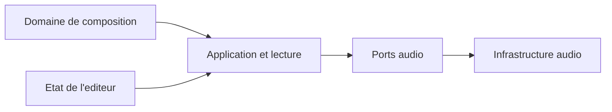

# Domaines

Ce document recense les premiers objets fondamentaux de Pianola, une application de piano roll avec instruments modulaires.

L'objectif est de poser un vocabulaire metier stable et de rendre visibles les frontieres architecturales avant de penser stockage, Web Audio API ou implementation React.

## Navigation

- [Vision generale](#vision-generale)
- [Decisions actees](#decisions-actees)
- [Domaine de composition](#domaine-de-composition)
  - [Entities](#entities)
  - [Value Objects de la composition](#value-objects-de-la-composition)
  - [Agregats](#agregats)
- [Etat applicatif de l'editeur](#etat-applicatif-de-lediteur)
- [Couche applicative et lecture](#couche-applicative-et-lecture)
- [Infrastructure audio](#infrastructure-audio)
- [Relations architecturales](#relations-architecturales)
- [Arborescence cible](#arborescence-cible)
- [Questions ouvertes](#questions-ouvertes)
- [Principes directeurs](#principes-directeurs)

## Vision generale

L'application est centree sur un domaine de composition. Le `Project` y organise une sequence de clips necessairement consecutifs.

Le projet exprime des intentions musicales sous forme de clips et de notes. Chaque note reference l'instrument qui doit l'interpreter. Le projet ne contient ni les patchs des instruments, ni l'etat d'execution du moteur audio, ni l'etat transitoire de l'editeur.

Il n'existe pas de vue d'arrangement multipiste dans laquelle des clips seraient places librement sur plusieurs pistes instrumentales. Les moyens necessaires a l'ecoute sont places autour du domaine :

- une couche applicative qui interprete la sequence de clips ;
- des ports qui definissent ce dont l'application a besoin pour produire du son ;
- une infrastructure audio qui contient le catalogue d'instruments integre, leurs patchs et le moteur audio.



## Decisions actees

- Le `Project` organise directement une sequence ordonnee de clips.
- Les clips sont necessairement consecutifs : ils ne possedent pas de position dans une timeline globale et leur ordre determine l'ordre de lecture.
- Un clip peut etre contourne pendant la lecture. Cet etat est conserve dans le clip afin que la sauvegarde preserve la structure courante de la sequence.
- Chaque `Clip` porte son propre tempo et sa propre metrique.
- Un `Clip` contient uniquement des `NoteEvent` dans le premier perimetre fonctionnel.
- Une `NoteEvent` est une entity appartenant a un `Clip`. Elle conserve son identite lorsqu'elle est modifiee et recoit une nouvelle identite lorsqu'elle est copiee.
- Chaque `NoteEvent` reference l'instrument qui doit l'interpreter au moyen d'un `InstrumentId`. Un meme clip peut donc contenir plusieurs instruments.
- Le temps musical canonique est represente par des ticks entiers, avec une resolution fixe de 960 ticks par noire.
- Les positions des notes sont locales au clip et restent libres a l'echelle de ces ticks : une position n'a pas besoin d'etre alignee sur la grille visible.
- La quantification appartient d'abord a l'experience d'edition : elle guide les gestes de l'utilisateur sans transformer le modele musical en grille rigide.
- La selection appartient a l'etat applicatif de l'editeur. Elle reference temporairement des objets du domaine sans faire partie de la composition.
- L'application est destinee a l'ecriture et au processus initial de composition, pas a la production audio.
- Les instruments et leurs patchs sont definis dans le code avant la compilation. L'utilisateur choisit un instrument pour les notes, mais ne peut ni creer ni modifier son patch.
- Le catalogue d'instruments fait partie de l'infrastructure audio.
- Le moteur audio est indispensable a l'ecoute, mais il appartient a l'infrastructure et non au modele metier editable.
- Les automations, les evenements de controle et l'exposition de parametres audio ne font pas partie du premier perimetre fonctionnel.
- Le domaine ne connait de l'audio que les `InstrumentId` stables associes aux notes. Les ports audio appartiennent a la couche applicative.
- Les services applicatifs sont ranges dans `application/use-cases/`. Aucun service d'edition generique n'est cree avant que ses responsabilites soient definies.
- Aucun dossier generique `application/contracts/` n'est necessaire : les ports portent leurs propres modeles d'echange et les types metier restent dans le domaine.

## Domaine de composition

Le domaine de composition decrit une succession de sections musicales. Le `Project` ordonne directement les clips et repond a des questions comme :

- quels clips composent la sequence ?
- dans quel ordre doivent-ils etre lus ?
- quels clips doivent etre contournes ?
- quelles notes existent dans un clip ?
- quel instrument doit interpreter chaque note ?
- a quel moment relatif du clip chaque note doit-elle etre jouee ?

Il reste independant de la maniere dont le son est produit et de la maniere dont l'utilisateur manipule visuellement les objets.

### Entities

Une entity possede une identite propre. Elle peut changer au cours du temps tout en restant le meme objet du point de vue du domaine.

#### Project

Represente le document musical complet ouvert dans l'application et la sequence de clips qui le compose.

Attributs possibles :

- `id`
- `name`
- `clips`
- `createdAt`
- `updatedAt`

Responsabilites :

- servir de racine de sauvegarde ;
- contenir et ordonner la sequence de clips ;
- garantir que les clips sont lus consecutivement ;
- permettre de reorganiser la composition sans recourir a des pistes ni a une timeline libre.

Le projet ne porte ni tempo ni metrique globaux : ces proprietes appartiennent a chaque clip.

#### Clip

Represente une section musicale editable, copiable, reordonnable et potentiellement bouclable.

Un clip ne possede pas de position globale. Il commence lorsque le clip precedent se termine, sauf s'il est contourne pendant la lecture.

Attributs possibles :

- `id`
- `name`
- `duration`
- `tempo`
- `timeSignature`
- `isBypassed`
- `loop`
- `notes`

Responsabilites :

- contenir et ordonner des notes selon leur position locale ;
- definir la duree et le contexte rythmique d'une section ;
- conserver son etat de bypass dans la sauvegarde ;
- permettre l'edition locale d'un motif, d'une phrase ou d'une section musicale ;
- permettre a plusieurs instruments de coexister dans une meme section par l'intermediaire des notes.

#### NoteEvent

Represente une note placee dans un clip et associee a un instrument. Elle possede une identite propre afin de conserver sa continuite lorsqu'elle est deplacee, redimensionnee, transposee ou modifiee.

Une `NoteEvent` n'est pas une racine d'agregat : elle appartient a un `Clip`, qui controle sa creation, sa modification et sa suppression.

Attributs possibles :

- `id`
- `pitch`
- `range`
- `velocity`
- `instrumentId`

Responsabilites :

- definir une hauteur ;
- definir une position temporelle relative au clip ;
- definir une duree ;
- porter des parametres d'interpretation simples ;
- identifier l'instrument charge de l'interpreter ;
- conserver son identite au fil de ses modifications.

### Value Objects de la composition

Un Value Object ne possede pas d'identite propre. Il est defini par ses valeurs et appartient a un contexte precis, plutot qu'a une categorie transversale commune a toute l'application.

#### Pitch

Represente une hauteur musicale.

Attributs possibles :

- `midiNumber`
- `name`
- `octave`

Regles possibles :

- le numero MIDI doit rester dans une plage valide ;
- le nom et l'octave peuvent etre derives du numero MIDI.

#### TimePosition

Represente une position dans le temps musical.

Representation canonique :

- `ticks`, sous la forme d'un entier positif ou nul ;
- 960 ticks representent une noire.

Responsabilites :

- positionner une note dans le temps musical local d'un clip ;
- accepter toute position en ticks, y compris lorsqu'elle n'est pas alignee sur la grille d'edition ;
- rester independant du temps reel.

Les battements et les secondes sont des representations derivees. Les secondes sont calculees par le service de lecture a partir du tempo du clip courant.

#### Duration

Represente une duree musicale exprimee en ticks entiers.

Regles possibles :

- une duree doit etre strictement positive ;
- 960 ticks representent une noire ;
- une duree peut utiliser toute valeur entiere, independamment de la grille ;
- une duree peut etre quantifiee par une operation d'edition.

Comme pour `TimePosition`, les battements et les secondes sont derives de la valeur canonique en ticks.

#### InstrumentId

Represente l'identifiant stable et opaque de l'instrument associe a une `NoteEvent`.

Responsabilites :

- permettre au domaine de conserver et comparer l'instrument choisi ;
- ne reveler aucune information sur la definition technique ou le patch de l'instrument ;
- rester exploitable par les couches applicative et d'infrastructure sans inverser le sens des dependances.

La disparition d'un instrument entre deux versions de l'application est traitee au chargement par la couche applicative.

#### TimeRange

Represente un intervalle musical entre un debut et une duree.

Attributs possibles :

- `start`
- `duration`

Responsabilites :

- decrire l'emplacement temporel d'une note dans son clip ;
- detecter les chevauchements ;
- faciliter les operations de deplacement et de redimensionnement.

#### Velocity

Represente l'intensite d'une note.

Attributs possibles :

- `value`

Regles possibles :

- valeur comprise entre 0 et 127 si l'on suit le modele MIDI ;
- valeur par defaut possible : 100.

#### Tempo

Represente la vitesse propre a un clip.

Attributs possibles :

- `bpm`

Regles possibles :

- le BPM doit rester dans une plage musicalement exploitable ;
- le tempo permet au service de lecture de convertir le temps musical local du clip en temps reel ;
- un changement de tempo intervient uniquement a la frontiere entre deux clips.

#### TimeSignature

Represente la metrique propre a un clip.

Attributs possibles :

- `beatsPerMeasure`
- `beatUnit`

Exemples :

- 4/4
- 3/4
- 6/8

Responsabilites :

- organiser les reperes en mesures a l'interieur du clip ;
- influencer les reperes temporels proposes par l'editeur ;
- permettre un changement de metrique a la frontiere entre deux clips.

#### Loop

Represente le comportement de repetition d'un clip.

Attributs possibles :

- `enabled`
- `length`

Responsabilites :

- definir si un clip boucle ;
- distinguer la duree visible du clip et la duree du motif repete.

### Agregats

#### Project comme aggregate root

`Project` est la racine principale. Il garantit la coherence globale du document musical et de sa sequence.

Il contient :

- une collection ordonnee de clips ;
- des informations de sauvegarde.

Regles possibles :

- un clip appartient a un seul projet ;
- l'ordre des clips definit integralement leur ordre de lecture ;
- les clips sont consecutifs et ne possedent pas de position temporelle globale ;
- reordonner un clip modifie la structure de la sequence ;
- un clip contourne reste present a sa place dans la sequence et son etat est sauvegarde ;
- pendant la lecture, un clip contourne est ignore et le clip suivant commence immediatement ;
- le contexte de tempo et de metrique change aux frontieres entre clips.

#### Clip comme aggregate secondaire

`Clip` garantit la coherence de ses propres notes et de son contexte rythmique.

Regles possibles :

- une note appartient a un seul clip et ne possede pas de cycle de vie autonome ;
- une note modifiee conserve son identite ;
- une note copiee ou dupliquee recoit une nouvelle identite ;
- les notes sont positionnees relativement au debut du clip ;
- une note reference exactement un instrument ;
- plusieurs notes d'un meme clip peuvent referencer des instruments differents ;
- les positions et durees peuvent rester continues dans le modele ;
- la quantification est appliquee par les operations d'edition ;
- selon le choix musical, les chevauchements sur une meme hauteur peuvent etre autorises ou interdits.

## Etat applicatif de l'editeur

L'etat applicatif de l'editeur decrit le contexte transitoire dans lequel l'utilisateur manipule la composition. Sa modification ne change pas, a elle seule, le contenu musical du projet.

### Selection

Represente l'ensemble courant des objets selectionnes. Elle ne possede pas d'identite propre et n'est ni une entity metier ni un agregat du domaine.

Attributs possibles :

- `selectedClipIds`
- `selectedNoteIds`
- `selectionAnchor`

Des informations comme `activeClipId` ou `focusedNoteId` permettent de distinguer l'objet actif de l'ensemble des objets selectionnes.

Responsabilites :

- conserver l'intention d'edition courante ;
- permettre les operations de groupe ;
- porter la logique de selection independamment de sa representation graphique ;
- transmettre aux cas d'usage les identifiants des objets concernes.

Lorsqu'une action est executee, la couche applicative transforme la selection en une commande explicite. Le domaine recoit les identifiants des objets a modifier et applique l'operation sans connaitre la notion de selection.

### GridResolution

Represente la precision de la grille utilisee pendant l'edition.

Attributs possibles :

- `snapStepTicks`

Responsabilites :

- definir les pas de quantification proposes a l'utilisateur ;
- controler la finesse du placement et du redimensionnement ;
- convertir un geste utilisateur vers une position ou une duree quantifiee.

La selection et la resolution de grille sont des donnees transitoires de l'editeur. Elles ne sont pas sauvegardees comme des donnees musicales du projet. Leur persistance eventuelle relevera des preferences ou de la restauration de session.

## Couche applicative et lecture

La couche applicative orchestre les actions de l'utilisateur et la lecture sans contenir les regles internes du moteur audio.

### Cas d'usage d'edition

Responsabilites :

- traduire les gestes de l'editeur en commandes explicites ;
- resoudre la selection vers les identifiants des objets concernes ;
- appliquer si necessaire la quantification avant d'appeler le domaine ;
- charger et sauvegarder le projet a travers des ports.

Exemples :

- deplacer des notes ;
- redimensionner un clip ;
- reordonner ou bypasser un clip ;
- transposer plusieurs notes ;
- associer un instrument disponible a une ou plusieurs notes.

Aucun `EditorService` generique n'est introduit. Les futurs services d'edition seront nommes et ajoutes dans `application/use-cases/` lorsque leurs responsabilites precises seront etablies.

### PlaybackService

Le service de lecture fait le lien entre la composition et l'infrastructure audio.

Responsabilites :

- parcourir la sequence de clips dans son ordre ;
- ignorer les clips contournes ;
- convertir le temps musical de chaque clip en temps reel selon son propre tempo ;
- transformer les notes en commandes audio ;
- transmettre ces commandes a un `AudioEngine` abstrait.

### Ports

Les ports decrivent les capacites attendues par l'application sans imposer leur implementation.

#### AudioEngine

Port minimal permettant notamment :

- d'initialiser et d'arreter la lecture ;
- de planifier des commandes audio ;
- de controler le cycle de lecture ;
- de transmettre un `InstrumentId` sans connaitre le patch correspondant.

#### InstrumentCatalog

Port de consultation permettant notamment :

- de lister les instruments disponibles ;
- d'obtenir pour chacun un `InstrumentSummary` ;
- de verifier qu'un `InstrumentId` peut etre resolu.

`InstrumentSummary` est un modele de sortie minimal declare a cote du port :

- `id`, de type `InstrumentId` ;
- `name`.

Il ne contient aucune definition de patch ni aucun parametre audio. L'implementation concrete du port appartient a l'infrastructure audio.

## Infrastructure audio

L'infrastructure audio regroupe le catalogue integre, les definitions techniques des instruments et le moteur qui produit le son.

Les instruments et leurs patchs sont ecrits dans le code avant la compilation. Ils ne sont ni editables par l'utilisateur ni sauvegardes dans le projet.

### BuiltInInstrumentCatalog

Implementation concrete du port `InstrumentCatalog`. Il expose en lecture seule les instruments disponibles et resout leurs identifiants stables.

### InstrumentDefinition

Represente la definition technique complete d'un instrument integre.

Attributs possibles :

- `id`
- `name`
- `patch`

Responsabilites :

- associer un identifiant stable a une implementation sonore ;
- fournir le patch necessaire a l'instanciation.

### ModularPatch

Represente le graphe interne statique d'un instrument.

Attributs possibles :

- `modules`
- `connections`
- `outputModuleId`

Responsabilites :

- organiser les modules audio ;
- garantir la coherence technique des connexions ;
- decrire le parcours du signal et des modulations.

### AudioModule

Represente la definition d'un module audio ou de controle, comme un `VCO`, une enveloppe, un filtre, un `LFO`, un `VCA`, un mixer ou une sortie.

Attributs possibles :

- `id`
- `type`
- `parameters`
- `inputs`
- `outputs`

### ModuleConnection

Represente une connexion statique entre deux ports de modules.

Attributs possibles :

- `sourcePort`
- `targetPort`

### ModulePort

Value Object propre a l'infrastructure audio.

Attributs possibles :

- `moduleId`
- `portName`
- `signalType`

Types de signal possibles :

- `audio`
- `control`
- `gate`
- `trigger`

Responsabilites :

- identifier un point de connexion ;
- permettre la validation des connexions entre modules.

### Moteur audio concret

Le moteur audio instancie les definitions d'instruments et produit le son.

Il gere notamment :

- la resolution des `InstrumentId` dans le catalogue integre ;
- l'execution des patchs modulaires ;
- la planification temporelle des commandes ;
- le cycle de vie des voix sonores ;
- la sortie audio.

Son etat d'execution est transitoire et n'est pas sauvegarde dans le projet.

## Relations architecturales

| Depuis | Vers | Nature du lien |
| --- | --- | --- |
| `Project.clips` | `Clip` | Le projet conserve l'ordre persistant des sections musicales. |
| `NoteEvent.instrumentId` | `InstrumentId` | Chaque note conserve l'identifiant opaque de l'instrument qui doit l'interpreter. |
| Etat de l'editeur | Cas d'usage | La selection et la grille sont transformees en commandes explicites. |
| `PlaybackService` | `AudioEngine` | Le service transmet des commandes a travers un port abstrait. |
| `InstrumentCatalog` | `BuiltInInstrumentCatalog` | L'infrastructure implemente le port de consultation attendu par l'application. |
| Moteur audio concret | `InstrumentDefinition` | Le moteur resout l'identifiant, instancie le patch et produit le son. |

Le sens des dependances de code doit pointer vers l'interieur : l'application depend du domaine, et l'infrastructure depend des ports applicatifs ainsi que du domaine, jamais l'inverse.

## Arborescence cible

Cette arborescence est une cible de travail provisoire. Elle documente les frontieres actuellement retenues et evoluera avec les prochaines decisions.

```text
src/
├── domain/
│   ├── Project.ts
│   ├── Clip.ts
│   ├── NoteEvent.ts
│   ├── Pitch.ts
│   ├── TimePosition.ts
│   ├── Duration.ts
│   ├── InstrumentId.ts
│   ├── TimeRange.ts
│   ├── Velocity.ts
│   ├── Tempo.ts
│   ├── TimeSignature.ts
│   └── Loop.ts
├── application/
│   ├── editor/
│   │   ├── EditorState.ts
│   │   ├── Selection.ts
│   │   └── GridResolution.ts
│   ├── use-cases/
│   │   └── PlaybackService.ts
│   └── ports/
│       ├── AudioEngine.ts
│       └── InstrumentCatalog.ts
├── infrastructure/
│   ├── audio/
│   │   ├── catalog/
│   │   │   ├── BuiltInInstrumentCatalog.ts
│   │   │   └── InstrumentDefinition.ts
│   │   ├── modular/
│   │   │   ├── ModularPatch.ts
│   │   │   ├── AudioModule.ts
│   │   │   ├── ModuleConnection.ts
│   │   │   └── ModulePort.ts
│   │   └── engine/
│   └── persistence/
└── presentation/
    ├── components/
    └── stores/
```

Le domaine adopte pour commencer une architecture plate : ses entites et ses Value Objects sont exposes directement dans `domain/`. Des sous-dossiers ne seront introduits que lorsque des groupes de concepts suffisamment coherents le justifieront.

Cette structure exprime des responsabilites plutot qu'un decoupage definitif fichier par fichier. Elle ne doit pas conduire a creer prematurement un fichier pour chaque type si plusieurs concepts restent plus coherents dans un meme module.

## Questions ouvertes

Aucune pour le moment.

## Principes directeurs

Pour une architecture clean, le domaine doit rester independant de l'interface graphique, du moteur Web Audio et du stockage.

Les objets du domaine de composition comme `Project`, `Clip`, `NoteEvent` ou `TimeRange` doivent pouvoir exister sans connaitre React, canvas, Zustand ou Web Audio.

L'etat de l'editeur peut connaitre les identifiants du domaine, mais le domaine ne connait ni la selection, ni la grille, ni les outils de l'interface.

La couche applicative orchestre les cas d'usage et depend de ports abstraits. L'infrastructure audio implemente ces ports, contient le catalogue d'instruments et peut etre remplacee sans modifier le coeur de la composition.
