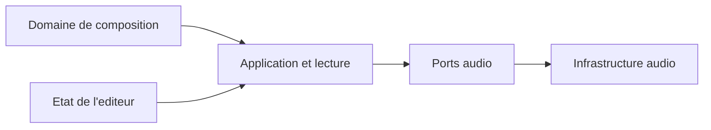

# Domaines

Ce document recense les premiers objets fondamentaux de Pianola, une application de piano roll avec instruments modulaires.

L'objectif est de poser un vocabulaire metier stable et de rendre visibles les frontieres architecturales avant de penser stockage, Web Audio API ou implementation React.

## Navigation

- [Vision generale](#vision-generale)
- [Decisions actees](#decisions-actees)
- [Domaine de composition](#domaine-de-composition)
  - [Entities](#entities)
  - [Value Objects de la composition](#value-objects-de-la-composition)
  - [Frontiere d'agregat](#frontiere-dagregat)
- [Etat applicatif de l'editeur](#etat-applicatif-de-lediteur)
- [Couche applicative et lecture](#couche-applicative-et-lecture)
- [Infrastructure audio](#infrastructure-audio)
- [Relations architecturales](#relations-architecturales)
- [Etudes de cas](etudes-de-cas.md)
- [Arborescence cible](#arborescence-cible)
- [Questions ouvertes](#questions-ouvertes)
- [Principes directeurs](#principes-directeurs)

## Vision generale

L'application est centree sur un domaine de composition. Le `Project` possede un unique `rootGroup`, qui constitue la racine d'un arbre compose de `Group` et de `Clip`.

Chaque groupe ordonne ses enfants et definit leur mode de lecture : les lire les uns apres les autres ou les faire commencer simultanement. Les feuilles de cet arbre sont les clips. Chaque clip conserve sa propre chronologie, son tempo, sa metrique et ses contextes de hauteurs.

Le projet exprime des intentions musicales sous forme de groupes, de clips et de notes. Chaque note reference l'instrument qui doit l'interpreter. Le projet ne contient ni les patchs des instruments, ni l'etat d'execution du moteur audio, ni l'etat transitoire de l'editeur.

Il n'existe pas de vue d'arrangement multipiste dans laquelle des clips seraient places librement sur plusieurs pistes instrumentales. Les moyens necessaires a l'ecoute sont places autour du domaine :

- une couche applicative qui interprete l'arbre de composition ;
- des ports qui definissent ce dont l'application a besoin pour produire du son ;
- une infrastructure audio qui contient le catalogue d'instruments integre, leurs patchs et le moteur audio.



## Decisions actees

Cette section synthetise les choix structurants. Les invariants et responsabilites propres a chaque objet sont detailles dans les sections suivantes.

### Structure de la composition

- Le `Project` possede un unique `rootGroup`. La composition forme un arbre dont les noeuds sont des `Group` et les feuilles des `Clip`.
- `Project` est la racine de l'unique agregat constituant le document de composition sauvegarde. Les `Group`, `Clip`, `Note` et changements temporels sont des entites internes de cet agregat, meme lorsqu'ils encapsulent leurs propres invariants locaux. Les `Instrument` appartiennent a un modele de reference distinct, fourni par le catalogue.
- Un `Group` contient une collection ordonnee de `GroupItem`, union de `Clip` et de `Group`. Les groupes peuvent donc etre imbriques.
- `PlaybackMode` represente le mode de lecture d'un groupe. Pianola prend initialement en charge `SEQUENTIAL` et `SIMULTANEOUS`, mais cette liste pourra etre enrichie.
- Chaque mode definit trois aspects : la planification temporelle des enfants, les points d'entree autorises pour `play(itemId?)` et la condition de fin du groupe.
- En mode `SEQUENTIAL`, chaque enfant commence a la fin du precedent. En mode `SIMULTANEOUS`, tous les enfants commencent au meme instant.
- Le `playbackMode` gouverne la lecture structurelle du groupe, mais ne limite jamais la preecoute individuelle de ses descendants.
- `play(itemId?)` lance une lecture structurelle du projet. Sans identifiant, la lecture commence au debut du `rootGroup`. Avec un identifiant, elle commence au point d'entree indique puis poursuit le parcours du projet jusqu'a la fin.
- Dans un groupe `SEQUENTIAL`, chacun de ses enfants constitue un point d'entree local possible. Un element n'est toutefois un point d'entree global valide que si tous ses groupes ancetres, de son parent jusqu'au `rootGroup`, utilisent le mode `SEQUENTIAL`.
- Dans un groupe `SIMULTANEOUS`, aucun enfant ni descendant ne peut etre lance comme point d'entree isole : ses branches doivent commencer ensemble. Le groupe simultane lui-meme peut constituer un point d'entree si tous ses propres ancetres sont `SEQUENTIAL`.
- L'interface n'affiche le bouton `play` que pour les points d'entree valides. Elle obtient cette information du `PlaybackService`, qui applique egalement la validation lors de l'execution de la commande. `preview(target)` reste disponible pour auditionner individuellement un element invalide pour `play`.
- `preview(target)` accepte une cible strictement typee `GROUP`, `CLIP` ou `NOTE`. Une preecoute de groupe ou de clip est bornee au sous-arbre choisi et ne passe jamais au noeud suivant situe hors de cette racine. Une preecoute de groupe respecte le bypass de ses clips descendants. Une preecoute de clip ignore le bypass du clip cible, et une preecoute de note ignore celui de son clip parent.
- Les clips ne possedent pas de position dans une timeline globale. Leur instant de depart est derive de leur place dans l'arbre et des modes de lecture de leurs groupes ancetres.
- `isBypassed` permet de contourner un clip sans le retirer de son groupe. Cet etat est sauvegarde et reste independant de `repeatCount`.
- Si `isBypassed` passe a `true` avant l'activation d'un clip, celui-ci est ignore. Si l'iteration du clip a deja commence, elle atteint sa fin structurelle, aucune repetition supplementaire n'est lancee, puis le parcours se poursuit si l'arbre le permet. Les notes deja attaquees suivent leur relachement naturel et leurs tails ne prolongent pas la duree structurelle.
- `repeatCount` indique le nombre total de lectures du clip. Il accepte un entier strictement positif ou `infinite` ; chaque repetition recommence au tick `0` avec les chronologies locales du clip.
- Dans le premier perimetre, les groupes ne portent ni `repeatCount` ni `isBypassed` : ils organisent la lecture sans ajouter une seconde couche de repetition ou de contournement.

### Temps musical et contextes

- Le temps musical canonique utilise des ticks entiers, avec une resolution fixe de 960 ticks par noire. Les positions sont locales au clip, libres et independantes de la grille visible.
- Chaque `Clip` contient trois chronologies structurelles : `tempoChanges`, `meterChanges` et `pitchContextChanges`. Les chronologies de tempo et de metrique commencent obligatoirement au tick `0`.
- Un changement de tempo ou de contexte de hauteurs peut intervenir sur n'importe quel tick. Un changement de metrique est insere sur une frontiere de mesure ; un changement deja place peut fermer une mesure devenue incomplete apres la modification de la metrique precedente.
- Les `TempoSection`, `MeterSection` et `PitchContextSection` sont des vues derivees des intervalles entre les changements. Elles ne sont pas sauvegardees directement.
- Modifier une metrique exprime explicitement l'une de deux intentions : conserver la duree en ticks ou conserver le nombre de mesures. Un clip vide conserve par defaut son nombre de mesures ; une section contenant des notes ou suivie d'autres sections conserve par defaut sa duree.

### Notes et edition

- Les `Note` constituent le seul contenu musical des clips dans le premier perimetre fonctionnel. Les changements de contexte sont des donnees structurelles, et non des automations ou des evenements de controle.
- Une `Note` est une entity appartenant a un `Clip`. Elle conserve son identite lorsqu'elle est modifiee et en recoit une nouvelle lorsqu'elle est copiee.
- Chaque note reference exactement un `InstrumentId`. Plusieurs instruments peuvent ainsi coexister dans un meme clip.
- Plusieurs clips lus simultanement peuvent utiliser le meme instrument, y compris a la meme hauteur et au meme instant. Leurs notes restent des intentions distinctes et ne sont jamais fusionnees implicitement.
- Le contexte de hauteurs est descriptif : il met en evidence l'appartenance des notes a un ensemble de hauteurs sans interdire les notes exterieures.
- La quantification et la selection appartiennent a l'experience d'edition. Elles guident les actions de l'utilisateur sans transformer le modele musical en grille rigide ni devenir des donnees de composition.

### Perimetre audio

- Pianola est destine a l'ecriture et au processus initial de composition, pas a la production audio. Les automations, les evenements de controle et l'edition de patchs ne font pas partie du premier perimetre fonctionnel.
- Les instruments et leurs patchs sont definis dans le code avant la compilation. L'utilisateur choisit un instrument pour ses notes, mais ne peut ni creer ni modifier son patch.
- Le domaine definit la representation publique minimale `Instrument` ainsi que son `InstrumentId`. Les notes ne sauvegardent que cet identifiant.
- Le catalogue et le moteur audio appartiennent a l'infrastructure. Les patchs, les politiques d'allocation des voix et les autres details techniques restent dans `InstrumentDefinition`.
- Chaque lecture d'une note produit une occurrence sonore distincte. Son identite d'execution permet de relacher cette voix sans interrompre les autres notes utilisant le meme instrument et la meme hauteur.
- Une operation globale de lecture est identifiee par un `PlaybackSessionId` et qualifiee par un `PlaybackSessionKind` : `PROJECT`, `GROUP_PREVIEW`, `CLIP_PREVIEW` ou `NOTE_PREVIEW`.
- Les sessions `PROJECT`, `GROUP_PREVIEW` et `CLIP_PREVIEW` sont des sessions de transport. Une seule session de transport peut etre active et planifier de nouvelles commandes a un instant donne.
- Une session `PROJECT` provient de `play(itemId?)` : l'identifiant optionnel modifie son point de depart, mais pas sa racine structurelle, qui reste le projet.
- Une session `GROUP_PREVIEW`, `CLIP_PREVIEW` ou `NOTE_PREVIEW` provient de `preview(target)` selon le type de la cible et reste bornee a cet element.
- Demarrer une nouvelle session de transport remplace la precedente. L'ancienne cesse immediatement de planifier de nouvelles attaques, mais ses contextes peuvent subsister en `DRAINING` jusqu'a l'extinction de leurs tails.
- Les sessions `NOTE_PREVIEW` sont des sessions d'audition independantes. Plusieurs peuvent coexister entre elles et avec l'unique session de transport active ; leur arret n'affecte aucune autre session.
- Chaque unite de lecture audio isolee est identifiee par un `PlaybackContextId` opaque et transitoire. Un nouvel identifiant est attribue a chaque activation d'un clip et a chaque preecoute de note.
- Lors de l'ouverture d'un contexte, l'`AudioEngine` rattache une fois son `PlaybackContextId` a la `PlaybackSession` qui le possede.
- Chaque `AudioCommand` porte le `contextId` auquel elle appartient. Elle ne repete pas le `PlaybackSessionId`, que le moteur retrouve par l'intermediaire du contexte.
- Pour chaque `InstrumentId` effectivement utilise dans un contexte de clip, l'infrastructure cree une `InstrumentInstance` exclusive a partir de l'`InstrumentDefinition` partagee.
- Les repetitions d'une meme activation reutilisent le meme contexte et les memes instances, mais produisent de nouvelles occurrences de notes.
- Le moteur et son `AudioContext` Web Audio restent globaux : un `PlaybackContext` est un perimetre logique et un sous-graphe audio, non un `AudioContext` natif supplementaire.

### Conventions architecturales

- Les ports audio appartiennent a la couche applicative et sont implementes par l'infrastructure.
- Les services applicatifs sont ranges dans `application/use-cases/`. Aucun service d'edition generique n'est introduit avant que ses responsabilites soient clairement definies.
- Aucun dossier generique `application/contracts/` n'est necessaire : les ports portent leurs propres modeles d'echange et les types metier restent dans le domaine.

## Domaine de composition

Le domaine de composition decrit un arbre de sections musicales. Le `Project` en possede le groupe racine et repond a des questions comme :

- quels groupes et quels clips composent la structure ?
- quels elements doivent etre lus en sequence ou simultanement ?
- dans quel ordre les enfants d'un groupe doivent-ils etre lus ?
- quels clips doivent etre contournes ?
- quelles notes existent dans un clip ?
- quel instrument doit interpreter chaque note ?
- a quel moment relatif du clip chaque note doit-elle etre jouee ?
- quels tempo, quelle metrique et quel contexte de hauteurs sont actifs a un tick donne ?
- comment le clip est-il decoupe en sections temporelles, metriques et de hauteurs ?
- quelles notes appartiennent au contexte de hauteurs actif ?

Il reste independant de la maniere dont le son est produit et de la maniere dont l'utilisateur manipule visuellement les objets.

### Entities

Une entity possede une identite propre. Elle peut changer au cours du temps tout en restant le meme objet du point de vue du domaine.

#### Project

Represente le document musical complet ouvert dans l'application et l'arbre de groupes et de clips qui le compose.

Attributs possibles :

- `id`
- `name`
- `rootGroup`
- `createdAt`
- `updatedAt`

Responsabilites :

- servir de racine de sauvegarde ;
- posseder l'unique groupe racine de la composition ;
- garantir la coherence de l'arbre de groupes et de clips ;
- permettre de reorganiser la composition sans recourir a des pistes ni a une timeline libre.

Le projet ne porte ni tempo ni metrique globaux : ces proprietes appartiennent a chaque clip.

#### Group

Represente un ensemble ordonne de clips ou d'autres groupes dont il definit le mode de lecture.

`GroupItem` designe l'union `Clip | Group`. Cette union et `PlaybackMode` peuvent etre declares dans le meme module que `Group`, sans introduire prematurement un fichier pour chaque type.

Attributs possibles :

- `id`
- `name`
- `playbackMode`
- `items`

Modes initialement pris en charge :

| Mode | Planification | Points d'entree structurels | Fin du groupe |
| --- | --- | --- | --- |
| `SEQUENTIAL` | Les enfants sont lus dans leur ordre. | Chaque enfant constitue un candidat local. | Fin du dernier enfant lu. |
| `SIMULTANEOUS` | Tous les enfants commencent au meme instant. | Aucun enfant isole ; seul le groupe complet peut etre cible. | Fin de l'enfant le plus long. |

`PlaybackMode` est un vocabulaire metier extensible. Ajouter un mode impose de definir explicitement ces trois comportements dans le `PlaybackService`. La validite globale d'un point d'entree est calculee sur toute sa chaine d'ancetres, et non uniquement a partir de son parent direct. La preecoute reste independante de cette politique : tout `Group`, `Clip` ou `Note` peut toujours etre cible individuellement par `preview(target)`.

Responsabilites :

- contenir et ordonner ses enfants ;
- exprimer leur relation temporelle sans leur attribuer de position globale ;
- permettre l'imbrication de sequences et de superpositions ;
- garantir qu'un element n'apparait qu'a un seul endroit de l'arbre ;
- interdire les cycles.

Un groupe ne possede ni tempo, ni metrique, ni chronologie locale. Il ne possede pas non plus de duree canonique en ticks, car ses enfants simultanes peuvent convertir leurs ticks en temps reel avec des tempos differents. Sa duree de lecture est derivee par le `PlaybackService`.

#### Clip

Represente une section musicale editable, copiable, reordonnable et repetable.

Un clip ne possede pas de position globale. Son instant de depart est determine par sa place dans l'arbre : apres l'enfant precedent d'un groupe sequentiel, ou au meme instant que les autres enfants d'un groupe simultane. S'il est contourne, il ne contribue pas a la duree de son groupe parent.

Attributs possibles :

- `id`
- `name`
- `duration`
- `isBypassed`
- `repeatCount`
- `notes`
- `tempoChanges`
- `meterChanges`
- `pitchContextChanges`

Responsabilites :

- contenir et ordonner des notes selon leur position locale ;
- definir sa duree canonique en ticks ;
- contenir et ordonner les changements locaux de tempo, de metrique et de contexte de hauteurs ;
- fournir le contexte musical actif a n'importe quelle position ;
- conserver son etat de bypass et son nombre de lectures dans la sauvegarde ;
- permettre l'edition locale d'un motif, d'une phrase ou d'une section musicale ;
- permettre a plusieurs instruments de coexister dans une meme section par l'intermediaire des notes.

#### Note

Represente une note placee dans un clip et associee a un instrument. Elle possede une identite propre afin de conserver sa continuite lorsqu'elle est deplacee, redimensionnee, transposee ou modifiee.

Une `Note` n'est pas une racine d'agregat : elle appartient a un `Clip`, qui controle sa creation, sa modification et sa suppression. Le nom `Note` est retenu parce que cet objet occupe un intervalle musical ; les evenements instantanes `NoteOn` et `NoteOff` seront produits plus tard par le service de lecture.

Attributs possibles :

- `id`
- `pitch`
- `range`
- `velocity`
- `instrumentId`

Responsabilites :

- definir une hauteur ;
- definir une position temporelle relative au clip ;
- definir une duree ;
- porter des parametres d'interpretation simples ;
- identifier l'instrument charge de l'interpreter ;
- conserver son identite au fil de ses modifications.

Regles possibles :

- la position de debut est positive ou nulle ;
- la duree est strictement positive ;
- la note doit se terminer au plus tard a la fin du clip ;
- la hauteur et la velocite doivent rester dans leurs plages valides ;
- un `InstrumentId` est toujours present ;
- modifier une note conserve son identite, tandis que la copier ou la dupliquer en cree une nouvelle ;
- modifier le tempo ou la metrique ne deplace pas la note : sa position et sa duree restent exprimees dans les ticks canoniques du clip ;
- l'appartenance au `PitchContext` actif est calculee a partir de la position de debut et n'est pas stockee dans la note ;
- une note exterieure au contexte de hauteurs actif reste valide.

#### Instrument

Represente la description publique, stable et minimale d'un instrument integre. L'instrument est une entity de reference identifiee par son `InstrumentId` ; il n'appartient pas a l'agregat `Project` et n'est pas sauvegarde avec la composition.

Attributs possibles :

- `id`
- `name`

Responsabilites :

- fournir l'identite stable utilisee par les notes ;
- permettre a l'application de presenter les instruments disponibles ;
- rester independant du patch, de l'allocation des voix et du moteur audio ;
- servir de representation retournee par le port `InstrumentCatalog`.

`InstrumentId` est un type stable et opaque declare dans le meme module `domain/Instrument.ts`. Une `Note` conserve uniquement cet identifiant, et non une reference directe vers l'objet `Instrument`.

Les instruments sont definis avant la compilation et ne sont pas editables par l'utilisateur. La disparition d'un instrument entre deux versions de l'application est traitee au chargement par la couche applicative.

#### TempoChange

Represente un changement de tempo place sur la chronologie locale d'un clip.

Attributs possibles :

- `id`
- `position`
- `tempo`

Regles possibles :

- le premier changement est obligatoirement place au tick `0` ;
- un changement peut etre place sur n'importe quel tick compris dans le clip ;
- un seul changement de tempo peut exister a une meme position ;
- le nouveau tempo s'applique a partir du tick du changement, inclus ;
- la position et le tempo peuvent etre modifies sans changer l'identite du changement.

#### MeterChange

Represente un changement de metrique place sur la chronologie locale d'un clip.

Attributs possibles :

- `id`
- `position`
- `meter`

Regles possibles :

- le premier changement est obligatoirement place au tick `0` ;
- un nouveau changement est insere sur une frontiere de mesure ;
- un seul changement de metrique peut exister a une meme position ;
- la nouvelle metrique s'applique a partir du tick du changement, inclus ;
- un changement ferme la section metrique precedente et commence la suivante.

#### PitchContextChange

Represente un changement de contexte de hauteurs place sur la chronologie locale d'un clip.

Attributs possibles :

- `id`
- `position`
- `context`

Regles possibles :

- un changement peut etre place sur n'importe quel tick compris dans le clip ;
- un seul changement de contexte de hauteurs peut exister a une meme position ;
- le nouveau contexte s'applique a partir du tick du changement, inclus ;
- un changement ferme la section de hauteurs precedente et commence la suivante ;
- avant le premier changement, aucun contexte de hauteurs n'est actif.

Les marqueurs visibles dans l'editeur sont la representation des `TempoChange`, des `MeterChange` et des `PitchContextChange`. Un changement de chaque type peut exister au meme tick.

### Value Objects de la composition

Un Value Object ne possede pas d'identite propre. Il est defini par ses valeurs et appartient a un contexte precis, plutot qu'a une categorie transversale commune a toute l'application.

#### Pitch

Represente une hauteur musicale.

Attributs possibles :

- `midiNumber`
- `name`
- `octave`

Regles possibles :

- le numero MIDI doit rester dans une plage valide ;
- le nom et l'octave peuvent etre derives du numero MIDI.

#### TimePosition

Represente une position dans le temps musical.

Representation canonique :

- `ticks`, sous la forme d'un entier positif ou nul ;
- 960 ticks representent une noire.

Responsabilites :

- positionner une note dans le temps musical local d'un clip ;
- accepter toute position en ticks, y compris lorsqu'elle n'est pas alignee sur la grille d'edition ;
- rester independant du temps reel.

Les battements, les mesures et les secondes sont des representations derivees. Les secondes sont calculees par le service de lecture en integrant les changements de tempo rencontres dans le clip.

#### Duration

Represente une duree musicale exprimee en ticks entiers.

Regles possibles :

- une duree doit etre strictement positive ;
- 960 ticks representent une noire ;
- une duree peut utiliser toute valeur entiere, independamment de la grille ;
- une duree peut etre quantifiee par une operation d'edition.

Comme pour `TimePosition`, les battements et les secondes sont derives de la valeur canonique en ticks.

#### TimeRange

Represente un intervalle musical entre un debut et une duree.

Attributs possibles :

- `start`
- `duration`

Responsabilites :

- decrire l'emplacement temporel d'une note dans son clip ;
- detecter les chevauchements ;
- faciliter les operations de deplacement et de redimensionnement.

#### Velocity

Represente l'intensite d'une note sous la forme d'une valeur numerique.

Regles possibles :

- valeur entiere comprise entre 0 et 127 si l'on suit le modele MIDI ;
- valeur par defaut possible : 100.

`Velocity` ne possede actuellement ni cycle de vie ni usage independant de `Note`. Le type et ses regles sont donc declares directement dans `domain/Note.ts`, qui garantit leur validite. Un fichier autonome ne sera introduit que si ce concept acquiert plus tard des comportements ou des usages propres.

#### Tempo

Represente une valeur de vitesse musicale.

Attributs possibles :

- `bpm`

Regles possibles :

- le BPM doit rester dans une plage musicalement exploitable ;
- le tempo permet au service de lecture de convertir un intervalle de temps musical en temps reel ;
- sa periode de validite est determinee par les `TempoChange` du clip.

#### TempoSection

Represente une vue derivee de l'intervalle compris entre un `TempoChange` et le changement suivant, ou la fin du clip.

Attributs derives possibles :

- `start`
- `end`
- `tempo`

La section n'est pas sauvegardee comme un objet autonome. Elle permet notamment au `PlaybackService` de convertir chaque intervalle de ticks en temps reel avec le tempo qui lui est propre.

#### Meter

Represente une valeur de metrique.

Attributs possibles :

- `beatsPerMeasure`
- `beatUnit`

Exemples :

- 4/4
- 3/4
- 6/8

Responsabilites :

- organiser les reperes en mesures a l'interieur d'une section metrique ;
- influencer les reperes temporels proposes par l'editeur ;
- permettre de calculer la longueur d'une mesure en ticks.

Avec une resolution de 960 ticks par noire :

```text
ticksPerMeasure = beatsPerMeasure * (4 / beatUnit) * 960
```

#### MeterSection

Represente une vue derivee de l'intervalle compris entre un `MeterChange` et le changement suivant, ou la fin du clip.

Attributs derives possibles :

- `start`
- `end`
- `meter`
- `fullMeasureCount`
- `trailingMeasureDuration`

La section n'est pas sauvegardee comme un objet autonome. Sa duree est imposee par ses bornes en ticks, puis son decoupage est calcule :

```text
fullMeasureCount = floor(sectionDuration / ticksPerMeasure)
trailingMeasureDuration = sectionDuration % ticksPerMeasure
```

Une valeur non nulle de `trailingMeasureDuration` represente une derniere mesure incomplete. Le changement suivant constitue alors une frontiere explicite et commence une nouvelle mesure.

#### PitchContext

Represente un ensemble de classes de hauteurs utilise comme reference harmonique ou melodique dans une partie du clip.

Attributs possibles :

- `label`
- `pitchClasses`

Exemples :

- `Re dorien` : re, mi, fa, sol, la, si, do ;
- `Fa majeur 7` : fa, la, do, mi ;
- une gamme ou un ensemble de hauteurs libre defini par le programme.

Responsabilites :

- determiner si la hauteur d'une note appartient au contexte ;
- permettre a l'editeur de mettre visuellement en evidence les hauteurs interieures et exterieures ;
- representer indifferemment une gamme, un mode, un accord ou un ensemble arbitraire de classes de hauteurs.

Le contexte ne valide ni ne refuse les notes. Une note exterieure reste une `Note` parfaitement valide.

#### PitchContextSection

Represente une vue derivee de l'intervalle compris entre un `PitchContextChange` et le changement suivant, ou la fin du clip.

Attributs derives possibles :

- `start`
- `end`
- `context`

La section n'est pas sauvegardee comme un objet autonome. Elle sert a retrouver le contexte de hauteurs actif pour une note ou une position donnee.

### Frontiere d'agregat

#### Project comme racine de l'agregat de composition

`Project` est la racine de l'unique agregat constituant le document de composition sauvegarde. Il possede l'arbre complet et garantit la coherence globale du document musical. Le modele de reference des instruments reste exterieur a cet agregat.

Il contient :

- un unique `rootGroup` et tous ses descendants `Group` et `Clip` ;
- les `Note`, `TempoChange`, `MeterChange` et `PitchContextChange` appartenant a chaque clip ;
- des informations de sauvegarde.

Le chargement et la sauvegarde portent sur le `Project` complet. Les entites internes conservent des identifiants stables afin d'etre ciblees par l'editeur et les cas d'usage, mais elles ne possedent ni repository ni cycle de persistance autonomes. Une modification peut etre executee par une methode d'un `Clip` ou d'un `Group`, mais toujours apres avoir atteint cette entite depuis le `Project` charge.

Regles possibles :

- le groupe racine est un `Group` ordinaire et peut utiliser l'un ou l'autre mode de lecture ;
- un clip ou un groupe non racine appartient a un seul groupe parent ;
- un groupe ne peut pas se contenir lui-meme, directement ou indirectement ;
- reordonner un enfant modifie la structure de son groupe ;
- dans un groupe sequentiel, l'ordre des enfants determine leur ordre de lecture ;
- dans un groupe simultane, l'ordre reste significatif pour l'organisation et l'affichage, mais tous les enfants commencent ensemble ;
- un groupe vide est valide et possede une duree de lecture nulle ;
- un clip contourne reste present a sa place dans l'arbre et son etat est sauvegarde ;
- pendant la lecture, un clip contourne est ignore et ne contribue pas a la duree de son groupe parent, quel que soit son `repeatCount` ;
- un `repeatCount` fini indique le nombre total de lectures du clip ;
- un `repeatCount` egal a `infinite` rend infinie la branche qui le contient ; dans un groupe sequentiel, les enfants places apres cette branche deviennent inaccessibles par progression automatique ;
- chaque repetition recommence au tick `0` avec les changements initiaux de tempo, de metrique et de contexte de hauteurs du clip.

#### Clip comme entite a invariants locaux

`Clip` est une entite interne de l'agregat `Project`. Il garantit localement la coherence de ses notes, de sa duree et de ses chronologies, sans devenir pour autant une racine d'agregat autonome.

Son `ClipId` permet de le retrouver et de le cibler, mais un clip n'est ni charge, ni sauvegarde, ni supprime independamment de son `Project`. Les cas d'usage d'edition obtiennent d'abord le projet concerne, puis deleguent au clip les operations qui relevent de ses invariants locaux.

Regles possibles :

- un clip appartient a un seul groupe parent ;
- une note appartient a un seul clip et ne possede pas de cycle de vie autonome ;
- une note modifiee conserve son identite ;
- une note copiee ou dupliquee recoit une nouvelle identite ;
- les notes sont positionnees relativement au debut du clip ;
- une note reference exactement un instrument ;
- plusieurs notes d'un meme clip peuvent referencer des instruments differents ;
- `repeatCount` vaut par defaut `1` ; une valeur finie est un entier strictement positif et `infinite` represente une repetition sans fin ;
- `isBypassed` reste independant de `repeatCount`, afin de pouvoir contourner puis reactiver un clip sans perdre son nombre de lectures ;
- les positions et durees ne sont pas contraintes par la grille d'edition et peuvent utiliser toute valeur entiere en ticks ;
- les changements de tempo, de metrique et de contexte de hauteurs sont ordonnes par position ;
- les chronologies de tempo et de metrique contiennent exactement un changement initial au tick `0` ;
- la chronologie de contexte de hauteurs peut etre vide ; avant son premier changement, aucun contexte n'est actif ;
- un changement s'applique a partir de sa position, incluse, jusqu'au changement suivant ;
- modifier une metrique en conservant la duree ne deplace ni les notes, ni les marqueurs, ni la fin du clip ;
- la quantification est appliquee par les operations d'edition ;
- selon le choix musical, les chevauchements sur une meme hauteur peuvent etre autorises ou interdits.

## Etat applicatif de l'editeur

L'etat applicatif de l'editeur decrit le contexte transitoire dans lequel l'utilisateur manipule la composition. Sa modification ne change pas, a elle seule, le contenu musical du projet.

### Selection

Represente l'ensemble courant des objets selectionnes. Elle ne possede pas d'identite propre et n'est ni une entity metier ni un agregat du domaine.

Attributs possibles :

- `selectedClipIds`
- `selectedNoteIds`
- `selectionAnchor`

Des informations comme `activeClipId` ou `focusedNoteId` permettent de distinguer l'objet actif de l'ensemble des objets selectionnes.

Responsabilites :

- conserver l'intention d'edition courante ;
- permettre les operations de groupe ;
- porter la logique de selection independamment de sa representation graphique ;
- transmettre aux cas d'usage les identifiants des objets concernes.

Lorsqu'une action est executee, la couche applicative transforme la selection en une commande explicite. Le domaine recoit les identifiants des objets a modifier et applique l'operation sans connaitre la notion de selection.

### GridResolution

Represente la precision de la grille utilisee pendant l'edition.

Attributs possibles :

- `snapStepTicks`

Responsabilites :

- definir les pas de quantification proposes a l'utilisateur ;
- controler la finesse du placement et du redimensionnement ;
- convertir un geste utilisateur vers une position ou une duree quantifiee.

La selection et la resolution de grille sont des donnees transitoires de l'editeur. Elles ne sont pas sauvegardees comme des donnees musicales du projet. Leur persistance eventuelle relevera des preferences ou de la restauration de session.

## Couche applicative et lecture

La couche applicative orchestre les actions de l'utilisateur et la lecture sans contenir les regles internes du moteur audio.

### Cas d'usage d'edition

Responsabilites :

- traduire les gestes de l'editeur en commandes explicites ;
- resoudre la selection vers les identifiants des objets concernes ;
- appliquer si necessaire la quantification avant d'appeler le domaine ;
- charger et sauvegarder le projet a travers des ports.

Exemples :

- deplacer des notes ;
- redimensionner un clip ;
- ajouter, deplacer ou supprimer un changement de tempo, de metrique ou de contexte de hauteurs ;
- modifier une metrique en indiquant explicitement s'il faut conserver la duree ou le nombre de mesures ;
- associer un contexte de hauteurs a une partie du clip sans contraindre les notes ;
- creer, supprimer, imbriquer ou reordonner un groupe ;
- choisir le mode de lecture sequentiel ou simultane d'un groupe ;
- deplacer un clip ou un groupe dans l'arbre ;
- modifier le `repeatCount` ou l'etat de bypass d'un clip ;
- transposer plusieurs notes ;
- associer un instrument disponible a une ou plusieurs notes.

Le changement de metrique utilise une politique explicite, par exemple `PRESERVE_DURATION` ou `PRESERVE_MEASURE_COUNT`.

- `PRESERVE_DURATION` conserve les ticks des notes, des marqueurs et de la fin du clip. Le nombre de mesures est recalcule et la section peut se terminer par une mesure incomplete.
- `PRESERVE_MEASURE_COUNT` recalcule la borne de fin de la section selon la nouvelle longueur de mesure. Dans le premier perimetre, ce mode est utilise pour un clip vide ou une section terminale vide, afin de ne pas imposer de deplacement en cascade aux sections suivantes.

Lors de la creation d'un clip, le cas d'usage recoit un nombre de mesures, une metrique et un tempo, puis calcule immediatement la duree canonique en ticks. Pour un nouveau clip vide, modifier la metrique conserve par defaut le nombre de mesures. Des que la section contient des notes ou que d'autres sections la suivent, l'editeur propose par defaut de conserver la duree.

Aucun `EditorService` generique n'est introduit. Les futurs services d'edition seront nommes et ajoutes dans `application/use-cases/` lorsque leurs responsabilites precises seront etablies.

### PlaybackService

Le service de lecture fait le lien entre la composition et l'infrastructure audio.

Responsabilites :

- exposer `play(itemId?)` pour la lecture structurelle du projet et `preview(target)` pour l'audition bornee d'un groupe, d'un clip ou d'une note ;
- exposer `stop(sessionId, mode)` pour arreter une session precise et `stopTransport(mode)` pour arreter uniquement le transport actif ;
- faire de `play()` et de `play(rootGroup.id)` deux expressions equivalentes d'une lecture depuis le debut du projet ;
- valider qu'un `itemId` est un point d'entree structurel en examinant toute sa chaine d'ancetres : chacun de ses groupes ancetres doit etre `SEQUENTIAL` ;
- refuser la commande si un groupe `SIMULTANEOUS` apparait parmi ces ancetres, meme lorsque le parent direct de l'element est `SEQUENTIAL` ;
- exposer les capacites de lecture d'une cible afin que l'interface n'affiche le bouton `play` que lorsque cette commande est valide ;
- poursuivre, apres la fin du point de depart, vers les freres suivants et les groupes sequentiels englobants jusqu'a la fin du projet ;
- arreter une preecoute a la fin structurelle du `Group`, du `Clip` ou de la `Note` cible sans remonter vers son parent ;
- parcourir recursivement l'arbre a partir du `rootGroup` ;
- planifier successivement les enfants d'un groupe `SEQUENTIAL` ;
- donner le meme instant de depart aux enfants d'un groupe `SIMULTANEOUS` ;
- calculer la fin d'un groupe sequentiel par la somme des durees reelles de ses enfants ;
- calculer la fin d'un groupe simultane par la duree reelle maximale de ses enfants ;
- ignorer les clips contournes sans modifier leur `repeatCount` ;
- repeter chaque clip selon son `repeatCount` ;
- recommencer les chronologies locales au tick `0` a chaque repetition ;
- construire les `TempoSection` de chaque clip ;
- convertir independamment la chronologie en ticks de chaque clip en temps reel selon son propre tempo ;
- transformer chaque lecture d'une note en une occurrence sonore possedant une identite d'execution propre ;
- produire des commandes d'attaque et de relachement ciblant cette occurrence, afin que deux notes utilisant le meme instrument et la meme hauteur restent independantes ;
- transmettre ces commandes a un `AudioEngine` abstrait ;
- ouvrir une `PlaybackSession` pour chaque operation globale de lecture ;
- conserver au plus une session de transport active parmi `PROJECT`, `GROUP_PREVIEW` et `CLIP_PREVIEW` ;
- remplacer la session de transport courante lorsqu'une nouvelle lecture structurelle commence, en empechant immediatement toute nouvelle attaque de l'ancienne session ;
- attribuer un nouveau `PlaybackContextId` a chaque activation d'un clip, y compris lorsque la nouvelle activation remplace une session dont certains contextes sont encore en `DRAINING` ;
- attribuer egalement un nouveau `PlaybackContextId` a chaque preecoute de note et isoler celle-ci dans sa propre session ;
- permettre a plusieurs sessions `NOTE_PREVIEW` de coexister entre elles et avec l'unique session de transport active ;
- attribuer un nouveau `NoteOccurrenceId` a chaque attaque, y compris a chaque repetition d'une meme `Note` ;
- distinguer la fin structurelle d'un clip de la fin audible de ses releases et de ses effets ;
- lorsque `isBypassed` passe a `true` pendant une iteration, laisser celle-ci atteindre sa fin structurelle, ne lancer aucune repetition supplementaire, puis poursuivre le parcours si l'arbre le permet ;
- lors d'un arret `GRACEFUL`, empecher toute nouvelle attaque, relacher immediatement les occurrences actives et laisser leurs releases et tails se terminer ;
- lors d'un arret `IMMEDIATE`, detruire sans delai les contextes cibles et leur sortie sonore ;
- planifier les repetitions infinies dans une fenetre d'anticipation bornee.

L'interface applicative peut etre conceptualisee ainsi :

```ts
type PreviewTarget =
  | { kind: "GROUP"; id: GroupId }
  | { kind: "CLIP"; id: ClipId }
  | { kind: "NOTE"; id: NoteId };

type PlaybackCapabilities = {
  canPlay: boolean;
  canPreview: boolean;
};

type StopMode = "GRACEFUL" | "IMMEDIATE";

getPlaybackCapabilities(target: PreviewTarget): PlaybackCapabilities;
play(itemId?: GroupId | ClipId): PlaybackSessionId;
preview(target: PreviewTarget): PlaybackSessionId;
stop(sessionId: PlaybackSessionId, mode?: StopMode): void;
stopTransport(mode?: StopMode): void;
```

`play` ouvre toujours une session `PROJECT`. Le parametre `itemId` est un curseur initial conserve par le `PlaybackService` ; il ne transforme pas l'element en racine de preecoute et n'a pas a traverser le port `AudioEngine`. Un `itemId` invalide est refuse, et n'est jamais remonte implicitement vers un groupe simultane ancetre.

`getPlaybackCapabilities` applique exactement la meme regle structurelle que `play`. Pour une `Note`, `canPlay` vaut toujours `false`; pour un `Group` ou un `Clip`, il vaut `true` uniquement lorsque tous les groupes ancetres sont `SEQUENTIAL`. `canPreview` indique que les trois types de cible sont structurellement preecoutables. La politique a appliquer lorsqu'un instrument sauvegarde n'est plus disponible reste a definir.

`preview` ouvre une session `GROUP_PREVIEW`, `CLIP_PREVIEW` ou `NOTE_PREVIEW` selon le discriminant de la cible. Pour un groupe ou un clip, la racine de cette preecoute constitue une frontiere : le planificateur peut parcourir tout son sous-arbre, mais ne peut pas atteindre ses freres ni ses ancetres. Une preecoute de groupe respecte le bypass des clips descendants, tandis qu'une preecoute de clip ignore le bypass de sa cible. Ces deux preecoutes sont des lectures structurelles et remplacent donc la session de transport courante. Pour une note, le `PlaybackService` resout la note persistante et son instrument, ignore le bypass eventuel de son clip parent, puis cree un contexte `NOTE_PREVIEW` sans transmettre le `NoteId` au moteur audio. Cette audition s'ajoute au transport existant sans le remplacer.

Le service conserve un `activeTransportSessionId` optionnel et un ensemble de `notePreviewSessionIds`. Une session de transport remplacee perd immediatement le statut actif et ne planifie plus aucune attaque. Elle peut toutefois subsister comme proprietaire de contextes en `DRAINING`; cela ne constitue pas une seconde session de transport active. La session est detruite lorsque tous ses contextes sont `DISPOSED`.

`stop(sessionId, mode)` arrete exactement la session indiquee, qu'il s'agisse du transport ou d'une preecoute de note. `stopTransport(mode)` cible le transport actif sans affecter les sessions `NOTE_PREVIEW`. Le mode par defaut est `GRACEFUL` : les attaques futures sont annulees, les occurrences deja actives sont relachees immediatement, puis les contextes drainent leurs releases et leurs tails. `IMMEDIATE` detruit les contextes sans delai. Le remplacement d'un transport utilise le meme comportement qu'un arret `GRACEFUL`.

Le parcours peut etre conceptualise par une operation recursive de calcul `calculateDuration(item): duration`, puis par une planification glissante des evenements. Une operation qui tenterait de programmer immediatement tout l'arbre ne pourrait pas traiter un `repeatCount` infini.

Pour une portion finie, la relation reste equivalente a `schedule(item, startTime): endTime`. Un groupe simultane transmet le meme `startTime` a tous ses enfants et retourne le plus grand `endTime`. Un groupe sequentiel transmet le `endTime` de chaque enfant comme `startTime` du suivant.

Les scenarios detailles, notamment les repetitions, le bypass, les superpositions a tempos differents et les branches infinies, sont presentes dans [les etudes de cas](etudes-de-cas.md).

### Ports

Les ports decrivent les capacites attendues par l'application sans imposer leur implementation.

#### AudioEngine

Port minimal permettant notamment :

- d'initialiser et d'arreter la lecture ;
- de planifier des commandes audio ;
- de controler le cycle de lecture ;
- de transmettre un `InstrumentId` sans connaitre le patch correspondant ;
- d'associer chaque attaque a une identite d'occurrence ;
- de relacher une occurrence precise sans interrompre les autres voix du meme instrument ;
- d'ouvrir une session, puis de lui rattacher un contexte identifie par un `PlaybackContextId` ;
- de router chaque `AudioCommand` vers son contexte grace au `contextId` qu'elle porte ;
- d'annuler les attaques futures d'un contexte ou d'une session sans perdre le suivi des occurrences deja actives ;
- de terminer un contexte a sa fin structurelle, puis de laisser l'infrastructure gerer son drainage sonore ;
- de demander un arret `GRACEFUL` ou `IMMEDIATE` sans exposer la maniere dont les noeuds audio sont relaches.

Modeles d'echange possibles, declares avec le port :

```ts
type PlaybackSessionKind =
  | "PROJECT"
  | "GROUP_PREVIEW"
  | "CLIP_PREVIEW"
  | "NOTE_PREVIEW";

type AudioCommand = {
  contextId: PlaybackContextId;
  at: number;
} & (
  | {
      kind: "NOTE_ON";
      occurrenceId: NoteOccurrenceId;
      instrumentId: InstrumentId;
      pitch: Pitch;
      velocity: Velocity;
    }
  | {
      kind: "NOTE_OFF";
      occurrenceId: NoteOccurrenceId;
    }
);

interface AudioEngine {
  openSession(
    sessionId: PlaybackSessionId,
    kind: PlaybackSessionKind
  ): void;

  openContext(
    sessionId: PlaybackSessionId,
    contextId: PlaybackContextId
  ): void;

  schedule(commands: readonly AudioCommand[]): void;
  completeContext(contextId: PlaybackContextId): void;
  stopContext(contextId: PlaybackContextId, mode: StopMode): void;
  stopSession(sessionId: PlaybackSessionId, mode: StopMode): void;
}
```

Les identifiants d'execution sont opaques et transitoires. Ils forment trois niveaux sans se recouvrir : `PlaybackSessionId` identifie l'operation globale, `PlaybackContextId` une unite audio isolee de cette operation et `NoteOccurrenceId` une attaque precise dans ce contexte.

La relation entre session et contexte est enregistree une seule fois par `openContext`. Une commande transporte donc uniquement le `contextId` necessaire a son routage. Ce champ est declare dans la partie commune d'`AudioCommand`, plutot que repete dans chacune de ses variantes. La commande reste ainsi autonome lorsqu'elle est mise en file, triee ou transmise a un processeur audio.

`completeContext` signale une fin structurelle et autorise le drainage naturel des releases et des tails. `stopContext` ou `stopSession` interrompent la planification selon le `StopMode` demande. Le moteur peut retrouver la session proprietaire de toute commande en remontant depuis son contexte ; repeter le `PlaybackSessionId` dans chaque commande serait donc inutile.

Le `ClipId` et le `NoteId` persistants restent connus du domaine et du `PlaybackService`, mais ne traversent pas le port `AudioEngine`. La correspondance entre un clip et son contexte appartient a l'orchestration applicative. `InstrumentDefinition`, `InstrumentInstance`, `AudioNode` et `AudioContext` ne traversent jamais non plus ce port.

#### InstrumentCatalog

Port de consultation permettant notamment :

- de lister les `Instrument` disponibles ;
- d'obtenir un `Instrument` a partir de son `InstrumentId` ;
- de verifier qu'un `InstrumentId` peut etre resolu.

Le port retourne directement les objets `Instrument` du domaine. Aucun modele de sortie intermediaire n'est necessaire. Aucun patch, parametre audio ou detail d'allocation des voix ne traverse ce port. L'implementation concrete appartient a l'infrastructure audio.

## Infrastructure audio

L'infrastructure audio regroupe le catalogue integre, les definitions techniques des instruments et le moteur qui produit le son.

Les instruments et leurs patchs sont ecrits dans le code avant la compilation. Ils ne sont ni editables par l'utilisateur ni sauvegardes dans le projet.

### StaticInstrumentCatalog

Implementation concrete du port `InstrumentCatalog` et source de verite unique des instruments integres. Il conserve en interne la collection immuable des `InstrumentDefinition`.

La couche applicative le manipule uniquement a travers le port `InstrumentCatalog`, qui expose en lecture seule les objets `Instrument` disponibles et permet de resoudre leurs identifiants stables. Aucun patch ni aucune `InstrumentDefinition` ne traverse ce port.

Le moteur audio, situe dans la meme couche d'infrastructure que le catalogue concret, utilise directement `StaticInstrumentCatalog` pour resoudre un `InstrumentId` vers son `InstrumentDefinition`. Cette capacite technique reste propre a l'implementation concrete et ne necessite pas de port supplementaire.

### PlaybackSession

Represente l'etat transitoire d'une operation globale de lecture. Une session regroupe les contextes crees pour une lecture du projet ou une preecoute et permet leur arret collectif.

Une session `PROJECT` est ouverte par `play(itemId?)`. Sans point de depart, le `PlaybackService` commence au debut du `rootGroup`. Avec un point de depart valide, il rejoint cet element dans l'arbre puis poursuit la lecture vers les noeuds suivants jusqu'a la fin du projet. Le curseur initial appartient a l'orchestration applicative et n'ajoute aucun etat persistant au domaine.

Une session `CLIP_PREVIEW` est bornee au clip cible. Une session `GROUP_PREVIEW` est bornee au groupe cible et peut contenir plusieurs contextes de clips, ordonnes ou superposes selon les modes du sous-arbre. Une session `NOTE_PREVIEW` est bornee a une seule note et possede son propre contexte audio. Lorsque sa cible atteint sa fin structurelle, aucune preecoute ne poursuit vers un frere ou un ancetre. Les contextes audio peuvent toutefois rester en `DRAINING` jusqu'a l'extinction de leurs releases et de leurs tails.

Les sessions `PROJECT`, `GROUP_PREVIEW` et `CLIP_PREVIEW` se partagent un transport exclusif : une seule d'entre elles peut rester active et planifier de nouvelles commandes. En demarrer une nouvelle retire immediatement ce role a la precedente. La session remplacee ne devient pas elle-meme `DRAINING` : elle subsiste seulement comme proprietaire de contextes eventuellement `DRAINING`, puis elle est detruite lorsque tous sont `DISPOSED`.

Les sessions `NOTE_PREVIEW` n'utilisent pas ce transport exclusif. Une note peut donc etre preecoutee pendant une session `PROJECT`, `GROUP_PREVIEW` ou `CLIP_PREVIEW`, et plusieurs auditions peuvent se chevaucher. `stop(sessionId, mode)` cible une seule session et ne relache aucune occurrence appartenant aux autres sessions. `stopTransport(mode)` n'affecte aucune session `NOTE_PREVIEW`.

### PlaybackContext

Represente une unite de lecture audio isolee dans une session. Il est cree avec un `PlaybackContextId`, que le moteur rattache a sa session proprietaire lors de `openContext`, et possede notamment :

- un bus de sortie propre ;
- une table `InstrumentId -> InstrumentInstance` ;
- une table `NoteOccurrenceId -> VoiceHandle` ;
- les commandes programmees qui doivent pouvoir etre annulees ;
- un etat de cycle de vie : `SCHEDULED`, `ACTIVE`, `DRAINING` ou `DISPOSED`.

Un contexte ouvert pour un clip correspond a une seule activation audio. Son clip persistant d'origine reste une connaissance du `PlaybackService`. Une preecoute de note utilise le meme type de contexte technique ; sa session `NOTE_PREVIEW` exprime deja la nature de l'operation, et l'`InstrumentId` necessaire est porte par sa commande `NOTE_ON`. Aucun descripteur de contexte supplementaire n'est donc necessaire.

Les groupes ne possedent pas de contexte audio dans le premier perimetre : ils organisent la lecture sans gain, bus ni effet propre. Une session `GROUP_PREVIEW` contient donc les `PlaybackContext` des clips effectivement actives dans son sous-arbre, et non un `PlaybackContext` du groupe. Un tel contexte de groupe ne deviendrait pertinent que si les groupes acqueraient plus tard un comportement audio.

### InstrumentInstance

Represente l'etat audio mutable cree a partir d'une `InstrumentDefinition`. Une instance appartient exclusivement a un `PlaybackContext` et possede ses voix, ses phases, ses enveloppes, ses filtres, ses effets et son allocateur de voix.

Pour un contexte de clip, une seule instance est creee paresseusement par `InstrumentId`. Deux contextes utilisant le meme instrument possedent deux instances independantes, mais partagent la meme definition et les memes ressources statiques immuables.

### InstrumentDefinition

Represente la definition technique complete, immuable et partagee d'un instrument integre.

Attributs possibles :

- `instrument`
- `patch`
- `voiceAllocation`

Responsabilites :

- associer un `Instrument` public a son implementation sonore ;
- fournir le patch necessaire a l'instanciation ;
- definir comment les occurrences concurrentes d'une meme instance sont affectees aux voix du moteur ;
- fournir, si necessaire, une duree maximale de tail ou les informations permettant au moteur de borner la destruction.

`voiceAllocation` peut notamment preciser :

- un mode `MONOPHONIC` ou `POLYPHONIC` ;
- un nombre maximal de voix ;
- une politique de vol de voix lorsque cette limite est atteinte ;
- une politique de priorite ou de retrigger pour un instrument monophonique.

Ces informations sont des details d'interpretation et d'execution. Elles peuvent etre declarees a cote de `InstrumentDefinition` sans introduire immediatement un fichier autonome. La monophonie, la limite de polyphonie et le vol de voix s'appliquent par `InstrumentInstance`, donc a l'interieur d'un seul contexte. Une limite globale du moteur peut proteger les ressources, mais ne constitue pas la politique musicale de l'instrument.

### ModularPatch

Represente le graphe interne statique d'un instrument.

Attributs possibles :

- `modules`
- `connections`
- `outputModuleId`

Responsabilites :

- organiser les modules audio ;
- garantir la coherence technique des connexions ;
- decrire le parcours du signal et des modulations.

### AudioModule

Represente la definition d'un module audio ou de controle, comme un `VCO`, une enveloppe, un filtre, un `LFO`, un `VCA`, un mixer ou une sortie.

Attributs possibles :

- `id`
- `type`
- `parameters`
- `inputs`
- `outputs`

### ModuleConnection

Represente une connexion statique entre deux ports de modules.

Attributs possibles :

- `sourcePort`
- `targetPort`

### ModulePort

Value Object propre a l'infrastructure audio.

Attributs possibles :

- `moduleId`
- `portName`
- `signalType`

Types de signal possibles :

- `audio`
- `control`
- `gate`
- `trigger`

Responsabilites :

- identifier un point de connexion ;
- permettre la validation des connexions entre modules.

### Ressources audio partagees

Les donnees immuables couteuses sont mutualisees entre les instances : echantillons decodes, tables d'ondes, reponses impulsionnelles, descriptions de patch et code des processeurs audio. Les objets possedant un etat temporel, comme les enveloppes, filtres, oscillateurs, effets et allocateurs de voix, restent propres a chaque instance.

La creation des instances est paresseuse, mais peut etre anticipee dans la fenetre de planification avant le premier `NoteOn`. Une instance terminee peut etre remise dans un pool uniquement si elle est completement reinitialisable et n'est plus utilisee par aucun contexte.

### Moteur audio concret

Le moteur audio conserve un moteur et un `AudioContext` Web Audio globaux. Il instancie des sous-graphes propres aux contextes de lecture et produit leur mixage.

Il gere notamment :

- la gestion des `PlaybackSession` et de leurs `PlaybackContext` ;
- la resolution des `InstrumentId` vers les `InstrumentDefinition` du `StaticInstrumentCatalog` ;
- la creation paresseuse d'une `InstrumentInstance` par couple `(PlaybackContext, InstrumentId)` ;
- l'execution des patchs modulaires ;
- la planification temporelle des commandes ;
- la creation d'une voix pour chaque occurrence de note ;
- le relachement cible d'une occurrence sans interrompre les autres voix du meme instrument ;
- l'application par instance des politiques de monophonie, de polyphonie et de vol de voix ;
- l'annulation ciblee des commandes et occurrences d'un contexte ;
- le passage d'un contexte termine en `DRAINING` pendant les releases et les tails ;
- sa destruction apres silence ou apres une duree maximale de securite ;
- la mutualisation des ressources statiques ;
- la sortie audio et les limites globales de securite.

Son etat d'execution est transitoire et n'est pas sauvegarde dans le projet.

## Relations architecturales

| Depuis | Vers | Nature du lien |
| --- | --- | --- |
| `Project.rootGroup` | `Group` | Le projet possede la racine persistante de l'arbre de composition. |
| `Group.items` | `GroupItem` | Le groupe ordonne des clips ou d'autres groupes et definit leur mode de lecture. |
| `GroupItem` | `Clip \| Group` | L'union rend possible un parcours recursif de la composition. |
| `Note.instrumentId` | `InstrumentId` | Chaque note conserve l'identifiant opaque de l'instrument qui doit l'interpreter. |
| `InstrumentCatalog` | `Instrument` | Le port expose la representation publique minimale des instruments disponibles. |
| `InstrumentDefinition.instrument` | `Instrument` | La definition technique associe l'instrument public a son patch et a sa politique d'allocation des voix. |
| `Clip.tempoChanges` | `TempoChange` | Les changements delimitent les `TempoSection` derivees du clip. |
| `Clip.meterChanges` | `MeterChange` | Les changements delimitent les `MeterSection` derivees du clip. |
| `Clip.pitchContextChanges` | `PitchContextChange` | Les changements delimitent les `PitchContextSection` utilisees pour analyser visuellement les notes. |
| Etat de l'editeur | Cas d'usage | La selection et la grille sont transformees en commandes explicites. |
| `PlaybackService.getPlaybackCapabilities(target)` | `PreviewTarget` | Le service fournit a l'interface les actions valides sans lui faire dupliquer les regles de parcours. |
| `PlaybackService.play(itemId?)` | `Project.rootGroup` et `GroupItem` | Le service commence au debut du projet ou a un point d'entree dont tous les ancetres sont `SEQUENTIAL`, puis poursuit le parcours structurel. |
| `PlaybackService.preview(target)` | `PreviewTarget` | Le service borne la lecture au groupe, au clip ou a la note cible sans atteindre les noeuds exterieurs. |
| `PlaybackService` | Session de transport active | Le service conserve au plus un transport actif et le remplace lors d'une nouvelle lecture structurelle. |
| `PlaybackService` | Sessions `NOTE_PREVIEW` | Les auditions de notes peuvent coexister entre elles et avec le transport actif. |
| `PlaybackService.stop` | `PlaybackSessionId` | L'arret cible une session precise ; `stopTransport` ne cible que le transport actif. |
| `PlaybackService` | `AudioEngine` | Le service transmet des commandes et des identites d'execution a travers un port abstrait. |
| `PlaybackSession` | `PlaybackContext` | Une operation globale de lecture possede plusieurs unites audio isolees. |
| `PlaybackContext` | `InstrumentInstance` | Le contexte possede au plus une instance exclusive par `InstrumentId`. |
| `InstrumentInstance` | `InstrumentDefinition` | L'instance mutable est creee a partir d'une definition immuable partagee. |
| `InstrumentCatalog` | `StaticInstrumentCatalog` | L'infrastructure implemente le port de consultation attendu par l'application. |
| Moteur audio concret | `InstrumentDefinition` | Le moteur resout l'identifiant, instancie le patch et produit le son. |

Le sens des dependances de code doit pointer vers l'interieur : l'application depend du domaine, et l'infrastructure depend des ports applicatifs ainsi que du domaine, jamais l'inverse.

## Arborescence cible

Cette arborescence est une cible de travail provisoire. Elle documente les frontieres actuellement retenues et evoluera avec les prochaines decisions.

```text
src/
├── domain/
│   ├── Project.ts 
│   ├── Instrument.ts
│   ├── Group.ts
│   ├── Clip.ts
│   ├── Note.ts
│   ├── time/
│   │   ├── TimePosition.ts
│   │   ├── Duration.ts
│   │   ├── TimeRange.ts
│   │   ├── Tempo.ts
│   │   ├── TempoChange.ts
│   │   ├── TempoSection.ts
│   │   ├── Meter.ts
│   │   ├── MeterChange.ts
│   │   └── MeterSection.ts
│   └── pitch/
│       ├── Pitch.ts
│       ├── PitchContext.ts
│       ├── PitchContextChange.ts
│       └── PitchContextSection.ts
├── application/
│   ├── editor/
│   │   ├── EditorState.ts
│   │   ├── Selection.ts
│   │   └── GridResolution.ts
│   ├── use-cases/
│   │   └── PlaybackService.ts
│   └── ports/
│       ├── AudioEngine.ts
│       └── InstrumentCatalog.ts
├── infrastructure/
│   ├── audio/
│   │   ├── catalog/
│   │   │   ├── StaticInstrumentCatalog.ts
│   │   │   └── InstrumentDefinition.ts
│   │   ├── modular/
│   │   │   ├── ModularPatch.ts
│   │   │   ├── AudioModule.ts
│   │   │   ├── ModuleConnection.ts
│   │   │   └── ModulePort.ts
│   │   └── engine/
│   │       ├── WebAudioEngine.ts
│   │       ├── PlaybackSession.ts
│   │       ├── PlaybackContext.ts
│   │       ├── InstrumentInstance.ts
│   │       ├── InstrumentInstanceFactory.ts
│   │       └── SharedAudioResources.ts
│   └── persistence/
└── presentation/
    ├── components/
    └── stores/
```

Les objets centraux `Project`, `Group`, `Clip`, `Note` et `Instrument` restent directement a la racine de `domain/`. Les concepts qui forment deja des ensembles suffisamment coherents sont regroupes :

- `time/` contient les positions, les durees, le tempo et la metrique ;
- `pitch/` contient les hauteurs et leurs contextes.

Les dependances doivent principalement partir de `Project`, `Group`, `Clip` et `Note` vers `time/` et `pitch/`. Ces deux sous-domaines restent independants de l'agregat de composition : par exemple, `Clip` peut connaitre `MeterChange`, mais `MeterChange` ne connait pas `Clip`.

`Instrument` et `InstrumentId` sont declares ensemble dans `domain/Instrument.ts`. Le premier constitue la representation publique minimale de l'instrument ; le second reste l'identifiant sauvegarde par les notes et partage avec les ports applicatifs et l'infrastructure audio. `Velocity` est declare a cote de `Note` dans `domain/Note.ts`, puisqu'il ne possede pas encore d'usage independant.

`PreviewTarget` et `PlaybackCapabilities` appartiennent a l'interface du cas d'usage et peuvent etre declares avec `application/use-cases/PlaybackService.ts`. Les types `PlaybackSessionId`, `PlaybackContextId`, `NoteOccurrenceId`, `PlaybackSessionKind`, `AudioCommand` et `StopMode` peuvent d'abord etre declares avec `application/ports/AudioEngine.ts`. Ils forment le langage d'echange du port et ne doivent pas etre places dans `domain/`. Un module `application/playback/` ne deviendra utile que si ce vocabulaire acquiert plusieurs consommateurs ou comportements independants.

Cette structure exprime des responsabilites plutot qu'un decoupage definitif fichier par fichier. Elle ne doit pas conduire a creer prematurement un fichier pour chaque type si plusieurs concepts restent plus coherents dans un meme module.

## Questions ouvertes

- Quelle politique appliquer lorsqu'un `InstrumentId` sauvegarde ne peut plus etre resolu par le catalogue : refuser le chargement, utiliser un instrument de remplacement ou conserver une reference indisponible affichee par l'editeur ?
- Les `Group` doivent-ils devenir selectionnables dans l'editeur et, dans ce cas, faut-il ajouter `selectedGroupIds` a `Selection` ?
- Le rendu hors ligne appartient-il au premier perimetre fonctionnel ? S'il est retenu plus tard, il faudra definir son cas d'usage, son contexte d'execution et sa relation avec les sessions temps reel avant d'ajouter `OFFLINE_RENDER` a `PlaybackSessionKind`.

## Principes directeurs

Pour une architecture clean, le domaine doit rester independant de l'interface graphique, du moteur Web Audio et du stockage.

Les objets du domaine de composition comme `Project`, `Group`, `Clip`, `Note`, `Instrument`, `PitchContext` ou `TimeRange` doivent pouvoir exister sans connaitre React, canvas, Zustand ou Web Audio.

L'etat de l'editeur peut connaitre les identifiants du domaine, mais le domaine ne connait ni la selection, ni la grille, ni les outils de l'interface.

La couche applicative orchestre les cas d'usage et depend de ports abstraits. L'infrastructure audio implemente ces ports, contient le catalogue d'instruments et peut etre remplacee sans modifier le coeur de la composition.
