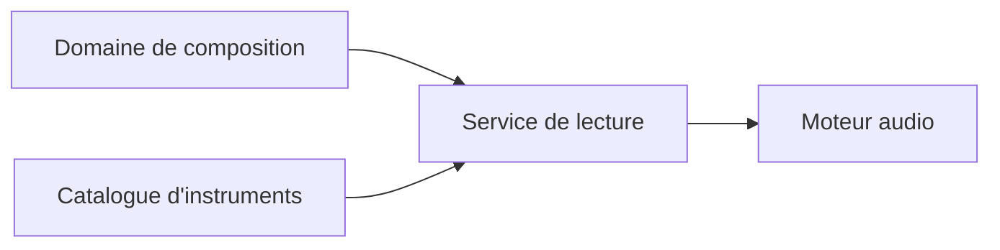

# Domaines

Ce document recense les premiers objets fondamentaux du domaine pour une application de piano roll avec instruments modulaires.

L'objectif est de poser un vocabulaire metier stable avant de penser interface, stockage, Web Audio API ou implementation React.

## Vision generale

L'application est centree sur un domaine de composition qui decrit l'organisation musicale dans le temps.

Les moyens necessaires a l'ecoute sont places autour de ce domaine :

- un catalogue d'instruments en lecture seule, defini dans le code avant la compilation ;
- un service de lecture qui interprete l'arrangement ;
- un moteur audio qui instancie les instruments et produit le son.

Le projet exprime des intentions musicales sous forme de pistes, clips et evenements. Il ne contient ni les patchs des instruments ni l'etat d'execution du moteur audio.

## Decisions actees

- Un `Arrangement` est l'ensemble ordonne des pistes du projet.
- Une `Track` est un conteneur de clips ordonnes dans le temps, lie a un instrument arbitraire par son identifiant.
- Le temps du domaine est pense comme un espace continu. L'utilisateur pourra toutefois placer, deplacer et redimensionner des evenements a l'aide d'une grille quantifiee (la quantification appartient d'abord a l'experience d'edition : elle guide les gestes de l'utilisateur sans obliger le modele musical a devenir une grille rigide).

- L'application est destinee a l'ecriture et au processus initial de composition, pas a la production audio.
- Les instruments et leurs patchs sont definis dans le code avant la compilation. L'utilisateur choisit un instrument pour une piste, mais ne peut ni creer ni modifier son patch.
- Le moteur audio est indispensable a l'ecoute, mais il appartient a l'infrastructure et non au modele metier editable.

## Domaine d'arrangement

Le domaine d'arrangement decrit la structure musicale du projet dans le temps. Il repond a des questions comme :

- quelles pistes existent ?
- quels clips sont places sur ces pistes ?
- quels evenements musicaux existent dans un clip ?
- a quel moment ces evenements doivent-ils etre joues ?

Il reste independant de la maniere dont le son est produit.

### Entities

Une entity possede une identite propre. Elle peut changer au cours du temps tout en restant le meme objet du point de vue du domaine.

### Project

Represente le document musical complet ouvert dans l'application.

Attributs possibles :

- `id`
- `name`
- `arrangement`
- `tempo`
- `timeSignature`
- `createdAt`
- `updatedAt`

Responsabilites :

- servir de racine de sauvegarde ;
- contenir l'arrangement et les donnees propres a la composition ;
- porter les reglages globaux du morceau.

### Arrangement

Represente l'organisation musicale globale du projet.

Attributs possibles :

- `id`
- `tracks`
- `length`
- `gridResolution`

Responsabilites :

- organiser les pistes dans le temps ;
- definir la duree globale editable ;
- fournir le cadre temporel commun aux clips.

### Track

Represente un conteneur de clips ordonnes dans le temps.

Une piste peut etre associee a un instrument, mais elle ne contient pas l'instrument lui-meme. Elle reference l'instrument qui interpretera ses evenements.

Attributs possibles :

- `id`
- `name`
- `instrumentId`
- `color`
- `isMuted`
- `isSolo`
- `clips`

Responsabilites :

- contenir et ordonner des clips selon leur position temporelle ;
- porter les reglages propres a la piste ;
- faire le lien entre des intentions musicales et un instrument audio sans fusionner avec lui.

### Clip

Represente une unite musicale editable, deplacable, copiable et potentiellement bouclable.

Attributs possibles :

- `id`
- `name`
- `range`
- `loop`
- `events`

Responsabilites :

- contenir des evenements musicaux ;
- definir une region temporelle sur une piste ;
- permettre l'edition locale d'un motif, d'une phrase ou d'une cellule musicale.

### MusicalEvent

Represente un evenement musical abstrait contenu dans un clip.

`MusicalEvent` peut etre pense comme une famille d'evenements plus specialises.

Types possibles :

- `NoteEvent`
- `AutomationEvent`
- `ControlEvent`

Responsabilites :

- decrire ce qui doit arriver musicalement ;
- rester independant du moteur audio ;
- etre interpretable par un instrument ou par le systeme de lecture.

### NoteEvent

Represente une note placee dans un clip. Elle possede une identite propre afin de pouvoir etre selectionnee et modifiee individuellement tout en restant la meme note.

Une `NoteEvent` n'est toutefois pas une racine d'agregat : elle appartient a un `Clip`, qui controle sa creation, sa modification et sa suppression.

Attributs possibles :

- `id`
- `pitch`
- `range`
- `velocity`

Responsabilites :

- definir une hauteur ;
- definir une position temporelle relative au clip ;
- definir une duree ;
- porter des parametres d'interpretation simples ;
- conserver son identite lors d'un deplacement, d'un redimensionnement ou d'une transposition.

### AutomationEvent

Represente une variation de parametre dans le temps.

Attributs possibles :

- `id`
- `target`
- `time`
- `value`
- `curve`

Responsabilites :

- exprimer une modulation composee ou dessinee ;
- permettre au domaine d'arrangement d'agir sur des parametres audio sans connaitre leur implementation ;
- decrire des changements reproductibles dans le temps musical.

### Selection

Represente l'ensemble courant des objets selectionnes par l'utilisateur.

Question ouverte : `Selection` appartient peut-etre davantage a l'etat applicatif de l'editeur qu'au domaine metier pur.

Attributs possibles :

- `id`
- `selectedTrackId`
- `selectedClipIds`
- `selectedEventIds`

Responsabilites :

- conserver l'intention d'edition courante ;
- permettre les operations de groupe ;
- separer la logique de selection de la representation graphique.

## Catalogue d'instruments

Le catalogue expose en lecture seule les instruments disponibles dans l'application. Ses definitions sont ecrites dans le code et integrees avant la compilation.

L'utilisateur peut choisir un instrument pour une piste, mais ne peut ni ajouter un instrument au catalogue ni modifier son patch. Le catalogue n'appartient donc pas au projet sauvegarde.

### InstrumentDefinition

Represente la definition statique d'un instrument disponible.

Attributs possibles :

- `id`
- `name`
- `patch`
- `exposedParameters`

Responsabilites :

- fournir un identifiant stable reference par les pistes ;
- decrire le patch necessaire a l'instanciation de l'instrument ;
- declarer les parametres que la composition peut eventuellement controler.

### ModularPatch

Represente le graphe interne statique d'un instrument.

Attributs possibles :

- `modules`
- `connections`
- `outputModuleId`

Responsabilites :

- organiser les modules audio ;
- garantir la coherence des connexions ;
- decrire le parcours du signal et des modulations.

### AudioModule

Represente une definition de module audio ou de controle, comme un `VCO`, une enveloppe, un filtre, un `LFO`, un `VCA`, un mixer ou une sortie.

Attributs possibles :

- `id`
- `type`
- `parameters`
- `inputs`
- `outputs`

### ModuleConnection

Represente une connexion statique entre deux ports de modules.

Attributs possibles :

- `sourcePort`
- `targetPort`

Les `ModularPatch`, `AudioModule` et `ModuleConnection` ne sont pas des objets editables par l'utilisateur et ne sont pas sauvegardes dans le projet.

## Lecture et infrastructure audio

### PlaybackService

Le service de lecture fait le lien entre la composition et l'infrastructure audio.

Responsabilites :

- parcourir l'arrangement selon le tempo ;
- resoudre l'`InstrumentId` associe a chaque piste dans le catalogue ;
- transformer les evenements musicaux en commandes audio ;
- transmettre ces commandes au moteur audio.

### AudioEngine

Le moteur audio instancie les definitions d'instruments et produit le son.

Il gere notamment :

- l'execution des patchs modulaires ;
- la planification temporelle des commandes ;
- le cycle de vie des voix sonores ;
- la sortie audio.

Le moteur audio ne fait pas partie du modele metier editable. Son etat d'execution est transitoire et n'est pas sauvegarde dans le projet.

## Value Objects

Un value object ne possede pas d'identite propre. Il est defini par ses valeurs. Deux value objects ayant les memes valeurs sont equivalents.

### Pitch

Represente une hauteur musicale.

Attributs possibles :

- `midiNumber`
- `name`
- `octave`

Exemples :

- C4
- F#3
- MIDI 60

Regles possibles :

- le numero MIDI doit rester dans une plage valide ;
- le nom de note peut etre derive du numero MIDI.

### TimePosition

Represente une position dans le temps musical continu.

Attributs possibles :

- `ticks`
- `beats`
- `seconds`

Responsabilites :

- positionner un evenement dans le temps musical ;
- permettre les conversions entre temps musical et temps reel ;
- accepter des valeurs non quantifiees lorsque l'edition ou l'import le necessite.

### Duration

Represente une duree musicale.

Attributs possibles :

- `ticks`
- `beats`
- `seconds`

Regles possibles :

- une duree doit etre strictement positive ;
- une duree peut etre libre dans le domaine ;
- une duree peut etre quantifiee lors d'une operation d'edition.

### TimeRange

Represente un intervalle musical entre un debut et une duree.

Attributs possibles :

- `start`
- `duration`

Responsabilites :

- decrire l'emplacement temporel d'un clip ou d'un evenement ;
- detecter les chevauchements ;
- faciliter les operations de deplacement et de redimensionnement.

### Velocity

Represente l'intensite d'une note.

Attributs possibles :

- `value`

Regles possibles :

- valeur comprise entre 0 et 127 si l'on suit le modele MIDI ;
- valeur par defaut possible : 100.

### Tempo

Represente la vitesse globale du projet.

Attributs possibles :

- `bpm`

Regles possibles :

- le BPM doit rester dans une plage musicalement exploitable ;
- le tempo permet de convertir le temps musical en temps reel.

### TimeSignature

Represente la mesure musicale.

Attributs possibles :

- `beatsPerMeasure`
- `beatUnit`

Exemples :

- 4/4
- 3/4
- 6/8

Responsabilites :

- organiser les reperes en mesures ;
- influencer l'affichage et les reperes visuels.

### GridResolution

Represente la precision de la grille utilisee pendant l'edition.

Attributs possibles :

- `ticksPerBeat`
- `snapStep`

Responsabilites :

- definir les pas de quantification proposes a l'utilisateur ;
- controler la finesse du placement et du redimensionnement pendant l'edition ;
- convertir un geste utilisateur vers une position ou une duree quantifiee.

### Loop

Represente le comportement de repetition d'un clip.

Attributs possibles :

- `enabled`
- `length`

Responsabilites :

- definir si un clip boucle ;
- distinguer la duree visible du clip et la duree du motif repete.

### ParameterId

Represente l'identifiant stable d'un parametre controlable.

Exemples :

- `filter.cutoff`
- `vco.frequency`
- `envelope.attack`

Responsabilites :

- permettre a l'arrangement de cibler un parametre sans connaitre l'objet technique qui l'implemente ;
- stabiliser les liens entre automation et instrument.

### ParameterValue

Represente la valeur d'un parametre audio ou de controle.

Attributs possibles :

- `value`
- `unit`
- `min`
- `max`

Responsabilites :

- encapsuler une valeur controlable ;
- permettre la validation d'une plage ;
- exprimer des unites differentes comme Hz, dB, pourcentage ou temps.

### ModulePort

Represente une entree ou une sortie de module.

Attributs possibles :

- `moduleId`
- `portName`
- `signalType`

Types de signal possibles :

- `audio`
- `control`
- `gate`
- `trigger`

Responsabilites :

- identifier un point de connexion ;
- permettre la validation des connexions entre modules.

## Relations entre les domaines

Le couplage entre arrangement et audio doit rester minimal.

| Depuis | Vers | Nature du lien |
| --- | --- | --- |
| `Track.instrumentId` | `InstrumentDefinition.id` | Une piste choisit un instrument disponible dans le catalogue. |
| `NoteEvent` | `PlaybackService` | Le service de lecture transforme une note en commandes pour l'instrument de la piste. |
| `AutomationEvent.target` | `ParameterId` | Une automation cible un parametre expose par un instrument. |
| `PlaybackService` | `AudioEngine` | Le service transmet au moteur les commandes necessaires a l'ecoute. |

## Premiers agregats possibles

### Project comme aggregate root

`Project` peut etre considere comme la racine principale. Il garantit la coherence globale du document musical.

Il contient :

- un `Arrangement` ;
- des reglages globaux comme `Tempo` et `TimeSignature` ;
- des informations de sauvegarde.

### Arrangement comme aggregate

`Arrangement` garantit la coherence temporelle des pistes et des clips.

Regles possibles :

- une piste appartient a un seul arrangement ;
- l'arrangement definit l'ordre de ses pistes ;
- une piste ordonne ses clips selon leur position temporelle ;
- une piste reference un instrument arbitraire sans le contenir ;
- un clip appartient a une seule piste ;
- les clips peuvent se chevaucher ou non selon le choix d'edition ;
- les positions des clips sont exprimees dans le temps global du projet.

### Clip comme aggregate secondaire

`Clip` garantit la coherence de ses propres evenements.

Regles possibles :

- un evenement appartient a un seul clip et ne possede pas de cycle de vie autonome ;
- une note modifiee conserve son identite ;
- une note copiee ou dupliquee recoit une nouvelle identite ;
- les evenements sont positionnes relativement au debut du clip ;
- les notes peuvent etre triees par position ;
- les positions et durees peuvent rester continues dans le modele ;
- la quantification est appliquee par les operations d'edition quand l'utilisateur active ou utilise la grille ;
- selon le choix musical, on peut autoriser ou interdire les chevauchements sur une meme hauteur.

### Definitions d'instruments hors du projet

Les definitions d'instruments appartiennent au catalogue statique de l'application. Elles ne constituent pas un agregat editable du projet.

Regles possibles :

- chaque instrument possede un identifiant stable ;
- une piste ne peut referencer qu'un instrument present dans le catalogue ;
- un patch doit posseder une sortie audio valide ;
- une connexion relie deux ports compatibles ;
- les parametres exposes doivent avoir des identifiants stables.

## Questions ouvertes

- Le terme `Arrangement` convient-il pour nommer le domaine temporel, ou faut-il preferer `Composition`, `Timeline`, `Score` ou `Session` ?
- Les clips doivent-ils etre uniquement des conteneurs de notes, ou peuvent-ils contenir d'autres types d'evenements comme des automations et des controles ?
- La selection appartient-elle vraiment au domaine, ou plutot a l'etat applicatif de l'editeur ?

## Intuition de depart

Pour une architecture clean, le domaine devrait rester independant de l'interface graphique, du moteur Web Audio et du stockage.

Les objets d'arrangement comme `Track`, `Clip`, `NoteEvent`, `TimeRange` ou `GridResolution` doivent pouvoir exister sans connaitre React, canvas ou Web Audio.

Le catalogue d'instruments, le service de lecture et le moteur audio doivent rester remplacables sans modifier le coeur de la composition. Le domaine ne connait que les identifiants des instruments et, si necessaire, ceux des parametres exposes.