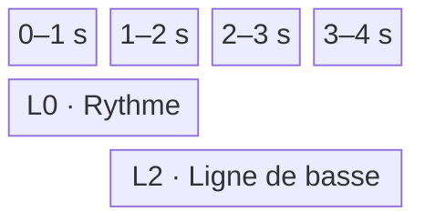
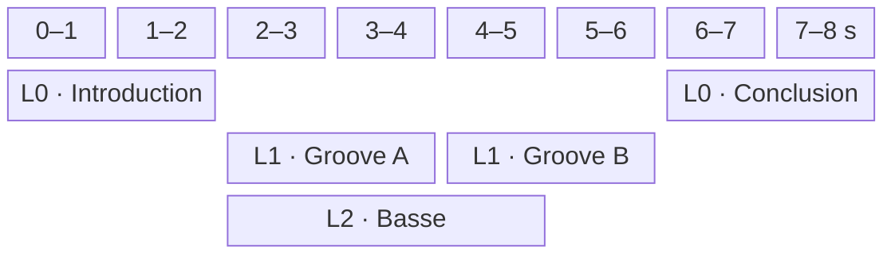
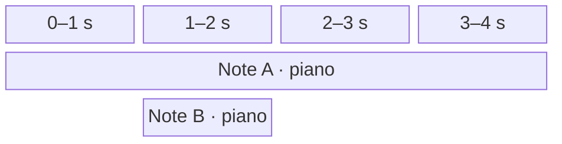

# Études de cas

Ce document illustre les règles de composition et de lecture définies dans [architecture.md](architecture.md). Un `Clip` désigne un contenu musical local éditable dans le piano roll ; un bloc de la grille est une `ClipOccurrence` persistante qui référence ce contenu. Sauf indication contraire, chaque occurrence nommée dans les exemples référence un clip source de même nom.

## Conventions de calcul

Sauf indication contraire, le projet utilise un tempo unique de 120,0 BPM et une résolution de 960 ticks par noire. Un `Tempo` accepte une décimale entre 20,0 et 999,9 BPM inclus :

```text
durationSeconds = (durationTicks / 960) * (60 / 120)
```

La métrique et la chronologie harmonique restent locales à chaque clip. La métrique fournit des repères de mesures, mais ne modifie pas la conversion des ticks en secondes.

La durée structurelle d'une occurrence et celle du projet suivent les règles suivantes :

```text
occurrenceEnd = occurrence.start + clip.duration * occurrence.repeatCount
projectEnd    = maximum des occurrenceEnd, ou 0 si le projet ne contient aucune occurrence
```

Les intervalles sont semi-ouverts. Deux occurrences sont simultanées si leurs intervalles globaux se recouvrent avec une durée strictement positive. Le premier périmètre interdit ce recouvrement sur une même ligne ; des occurrences situées sur des lignes différentes restent simultanées. La ligne n'intervient jamais dans le calcul audio.

## Cas 1 — Placement explicite, espace vide et répétition

Trois occurrences sont placées sur la ligne `0` :

| Occurrence | Début global | Durée du clip référencé | `repeatCount` | Fin globale |
| --- | ---: | ---: | ---: | ---: |
| `Ouverture` | 0 | 3840 ticks | 1 | 3840 |
| `Motif` | 5760 | 1920 ticks | 2 | 9600 |
| `Conclusion` | 11520 | 3840 ticks | 1 | 15360 |

La position de `Motif` n'est pas calculée depuis la fin d'`Ouverture`. L'intervalle `[3840, 5760)` reste silencieux, puis les deux lectures contiguës du motif occupent `[5760, 9600)`. Un second silence sépare le motif de la conclusion.


Déplacer ou supprimer une occurrence ne rapproche jamais automatiquement les autres occurrences. Leurs coordonnées persistantes restent inchangées. Supprimer l'occurrence ne supprime pas son clip source, même s'il s'agissait de sa dernière occurrence : seule une suppression manuelle distincte peut ensuite supprimer ce clip non référencé.

## Cas 2 — Chevauchement de clips aux métriques indépendantes

Deux occurrences référencent des clips soumis au même tempo de projet, mais possédant des métriques locales différentes :

| Occurrence | Ligne | Début | Durée du clip | Métrique locale | Intervalle réel |
| --- | ---: | ---: | ---: | ---: | ---: |
| `Rythme` | 0 | 0 | 3840 ticks | 4/4 | 0 à 2 s |
| `Ligne de basse` | 2 | 1920 ticks | 5760 ticks | 3/4 | 1 à 4 s |

Les deux clips jouent simultanément entre une et deux secondes. La basse continue seule jusqu'à quatre secondes.



La basse conserve ses mesures en 3/4, mais elle n'utilise ni tempo propre ni horloge indépendante. Son décalage provient uniquement de son début global sauvegardé.

## Cas 3 — Composition sur plusieurs lignes

La grille contient des occurrences d'introduction, de deux grooves consécutifs, d'une basse superposée et d'une conclusion :

| Occurrence | Ligne | Début global | Durée du clip | Intervalle réel |
| --- | ---: | ---: | ---: | ---: |
| `Introduction` | 0 | 0 | 3840 ticks | 0 à 2 s |
| `Groove A` | 1 | 3840 | 3840 ticks | 2 à 4 s |
| `Groove B` | 1 | 7680 | 3840 ticks | 4 à 6 s |
| `Ligne de basse` | 2 | 3840 | 5760 ticks | 2 à 5 s |
| `Conclusion` | 0 | 11520 | 3840 ticks | 6 à 8 s |



`Groove A` et `Groove B` partagent une ligne, mais leur succession résulte exclusivement de leurs placements. `Ligne de basse` chevauche les deux grooves, puis s'arrête une seconde avant `Groove B`. La conclusion commence au tick `11520` parce que cette valeur est sauvegardée, non parce qu'un élément précédent la déclenche.

## Cas 4 — Lignes sans association instrumentale

L'occurrence `Couplet`, ligne `0`, référence un clip associé au piano. L'occurrence `Contrechant`, ligne `3`, référence un clip associé aux cordes. Leurs intervalles globaux se chevauchent et les deux parties peuvent donc être audibles simultanément.

Tenter de déplacer `Contrechant` sur la ligne `0` sans modifier son intervalle est refusé, car il chevaucherait `Couplet` sur la même ligne. Le même déplacement devient valide si `Contrechant` est d'abord décalé après la fin de `Couplet`. Dans les deux cas, changer sa ligne ne modifierait ni ses notes ni le `Clip.instrumentId` de sa source et n'aurait, à placement temporel égal, aucun effet audio.

Une ligne est uniquement une coordonnée d'organisation bornée par une limite fixe de sécurité. Elle n'impose pas d'instrument, ne crée ni bus, ni filtre, ni contexte audio commun et ne fait l'objet d'aucune commande utilisateur d'ajout ou de suppression.

## Cas 5 — Deux clips utilisent le même instrument

Deux occurrences qui se chevauchent référencent chacune un clip associé au piano et contenant une note de même hauteur.

| Occurrence | Source | Instrument | Hauteur | Début | Fin |
| --- | --- | --- | --- | ---: | ---: |
| `occurrence-a` | clip A · note A | piano | do | 0 s | 4 s |
| `occurrence-b` | clip B · note B | piano | do | 1 s | 2 s |

À deux secondes, le moteur relâche uniquement `occurrence-b`. La voix correspondant à `occurrence-a` continue jusqu'à quatre secondes. Une commande identifiée seulement par l'instrument et la hauteur serait insuffisante.

Chaque occurrence active possède son propre `PlaybackContext` et sa propre `InstrumentInstance` `smplr` du piano. Lors de chaque `NOTE_ON`, le moteur associe au `NoteOccurrenceId` le contrôle d'arrêt retourné par l'instance concernée. Les occurrences ne sont jamais fusionnées implicitement.



## Cas 6 — Transports et deux formes de préécoute

Le projet est lu depuis sa tête globale dans une session `PROJECT`. Le clip source `Motif` est parallèlement ouvert dans le piano roll ; sa tête locale est restée au tick `960`.

Lorsque l'utilisateur appelle `playClip()`, le `PlaybackService` prépare l’instrument de `Motif`, puis, une fois celui-ci disponible, retire le rôle de transport à `project-session-a`, annule ses attaques futures et relâche ses occurrences actives selon le mode `GRACEFUL`. Il ouvre ensuite `clip-session-b` de type `CLIP` au tick local `960`. La tête globale conserve sa position.

| Étape | Session | Type | État |
| --- | --- | --- | --- |
| Lecture de l'arrangement | `project-session-a` | `PROJECT` | transport actif |
| Appel à `playClip()` | `project-session-a` | `PROJECT` | inactive ; contextes éventuellement `DRAINING` |
| Appel à `playClip()` | `clip-session-b` | `CLIP` | nouveau transport actif |

La session `CLIP` lit directement le contenu local de `Motif` jusqu'à sa durée structurelle. Elle ignore toutes ses occurrences, leurs positions globales et leurs répétitions.

Pendant ce transport, l’utilisateur maintient la touche `F♯4` du piano roll, même si aucune note de cette hauteur n’existe dans le clip :

```ts
const pitchPreview = previewPitch(Pitch.F_SHARP_4);

pitchPreview.release(); // pointerup ou pointercancel
```

`previewPitch` utilise l’instrument de `Motif`, ouvre une session `PITCH_PREVIEW` sans remplacer `clip-session-b` et soutient la voix jusqu’à `release()`. Si la banque est encore en chargement, le handle est retourné immédiatement ; un relâchement antérieur empêche toute attaque tardive.

L’utilisateur commence ensuite une transposition de quatre notes sélectionnées, dont deux possèdent initialement la même hauteur :

```ts
const selectionPreview = previewSelection(selectedNoteIds);
```

Le service ignore leurs positions et leurs durées, déduplique leurs hauteurs et produit une attaque brève simultanée. Lorsqu’une seule des quatre notes change de hauteur, l’attaque précédente encore active est relâchée et toutes les hauteurs actuelles de la sélection sont dédupliquées puis réattaquées. Les hauteurs restées identiques sont donc elles aussi rejouées. Un déplacement seulement temporel ne provoque aucune nouvelle attaque.

`selectionPreview.stop()` cesse de suivre le geste, annule les attaques en attente et relâche les voix brèves encore actives. La session `SELECTION_PREVIEW` n’a jamais remplacé le transport `CLIP`.

Un appel ultérieur à `playProject(5760)` remplace à son tour le transport `CLIP`, déplace uniquement la tête globale au tick demandé et reprend la lecture de l'arrangement. La tête locale conserve son dernier tick.

## Cas 7 — Répétitions et occurrences de notes

Un clip contient une note `note-a` et possède une durée locale de 1920 ticks. Une occurrence qui le référence possède un `repeatCount` de `3` et occupe donc 5760 ticks globaux à partir de son `start`.

| Répétition | Note persistante | Occurrence d'exécution |
| ---: | --- | --- |
| 1 | `note-a` | `occurrence-a-1` |
| 2 | `note-a` | `occurrence-a-2` |
| 3 | `note-a` | `occurrence-a-3` |

Les trois répétitions de cette même occurrence de clip réutilisent le même `PlaybackContextId` et la même `InstrumentInstance`, mais chaque attaque reçoit un `NoteOccurrenceId` distinct. Une release peut continuer au début de la répétition suivante sans confondre les deux occurrences de note.

Si une voix a déjà été volée, le `NOTE_OFF` programmé pour son ancienne occurrence devient une opération sans effet. Les relâchements sont donc idempotents.

## Cas 8 — Fin structurelle et tail audio

L'occurrence `Nappe` occupe `[0, 3840)`, soit deux secondes. Le clip qu'elle référence produit une release et une réverbération qui restent audibles une seconde supplémentaire. L'occurrence `Conclusion` est placée explicitement au tick `3840`.

| Temps réel | Événement structurel | État audio de `Nappe` |
| --- | --- | --- |
| 0 s | début de `Nappe` | `ACTIVE` |
| 2 s | fin de `Nappe`, début de `Conclusion` | `DRAINING` |
| 3 s | aucun changement de placement | `DISPOSED` après extinction du tail |

Le tail ne modifie ni la fin globale de l'occurrence `Nappe`, ni le `start` de l'occurrence `Conclusion`. Il peut se superposer à l'occurrence suivante. Le contexte de `Nappe` refuse toute nouvelle attaque après deux secondes, mais conserve ses instances jusqu'au silence ou jusqu'à une durée maximale de sécurité.

## Cas 9 — Lecture globale depuis un tick explicite

La grille contient les occurrences suivantes :

| Occurrence | Ligne | Intervalle réel |
| --- | ---: | ---: |
| `Introduction` | 0 | 0 à 2 s |
| `Piano` | 1 | 2 à 6 s |
| `Basse` | 2 | 2 à 5 s |
| `Percussions` | 3 | 1 à 4 s |
| `Conclusion` | 0 | 6 à 8 s |

Les commandes suivantes choisissent une position sans changer la portée du transport :

| Commande | Résultat |
| --- | --- |
| `playProject()`, tête globale à 0 | Lit tout le projet depuis son début. |
| `playProject(3840)` | Place la tête globale à 2 s ; `Piano`, `Basse` et la partie encore active de `Percussions` participent au transport. |
| `playProject(11520)` | Place la tête globale à 6 s et lit la fin du projet. |

`playProject` reçoit directement un `Tick` global et aucune identité d'occurrence. `playClip(tick?)` utilise au contraire un tick local au clip édité. `previewPitch` et `previewSelection` ne déplacent aucune tête et ne modifient pas le transport.

Si une note de `Percussions` a commencé avant deux secondes mais couvre encore cette position, la note chase minimale la réattaque au démarrage et programme son relâchement pour sa durée restante. Aucun état antérieur d'enveloppe ou de voix n'est reconstruit.

## Cas 10 — Alternance exclusive entre gamme et accord

Un clip de 7680 ticks possède les changements harmoniques suivants :

| Tick local | `Harmony` |
| --- | --- |
| `0` | `SCALE · C IONIAN` |
| `1920` | `CHORD · D MINOR_SEVENTH` |
| `3840` | `SCALE · A MINOR_PENTATONIC` |

| Intervalle local | Harmonie active |
| --- | --- |
| `[0, 1920)` | do ionien |
| `[1920, 3840)` | `Dm7` |
| `[3840, 7680)` | la pentatonique mineure |

Chaque `HarmonyChange` remplace la variante précédente. Aucun accord et aucune gamme ne sont actifs simultanément.

Le placement global des occurrences et le tempo du projet n’affectent pas cette chronologie locale.

## Cas 11 — Suggestions lors d’un remplacement harmonique

La section active contient `SCALE · C IONIAN`. Lorsque l’utilisateur choisit de la remplacer par un accord, l’éditeur compare les classes de hauteur de chaque accord du catalogue avec celles de cette gamme.

Les accords dont toutes les notes appartiennent à `C IONIAN`, notamment `C MAJOR`, `D MINOR`, `E MINOR`, `F MAJOR`, `G MAJOR`, `A MINOR` et `B DIMINISHED`, sont proposés avant les accords extérieurs. À compatibilité égale, l’ordre stable du catalogue s’applique.

Cette suggestion ne constitue pas une contrainte. L’utilisateur peut choisir `D♭ MAJOR`. Le même mécanisme permet de proposer des gammes compatibles lorsqu’une section d’accord est remplacée par une section de gamme.

Le remplacement modifie la variante du `HarmonyChange` ciblé ; il ne crée jamais un second contexte simultané.

## Cas 12 — Gammes modales et pentatoniques

Un clip possède successivement les changements harmoniques suivants :

| Tick local | `Harmony` |
| --- | --- |
| `0` | `SCALE · D DORIAN` |
| `3840` | `SCALE · A MINOR_PENTATONIC` |

Les deux gammes sauvegardent une `RootNote` explicite. Leur résolution ne dépend d’aucun contexte supérieur implicite. La première `HarmonySection` couvre `[0, 3840)` et la seconde `[3840, clip.duration)`.

Les occurrences du clip peuvent être placées n’importe où dans la grille. Leur ligne et leur éventuel chevauchement avec d’autres occurrences ne changent pas ces analyses locales.

## Cas 13 — Note tenue à travers plusieurs variantes d’harmonie

Une note `E4` commence au tick local `960` et se termine au tick `5280`. Le clip possède `SCALE · C IONIAN` au tick `0`, `CHORD · C MAJOR` au tick `1920`, puis `SCALE · A MINOR_PENTATONIC` au tick `3840`.

| Intervalle analysé | Harmonie active | Rôle de `E4` |
| --- | --- | --- |
| `[960, 1920)` | do ionien | `SCALE_TONE` |
| `[1920, 3840)` | do majeur | `CHORD_TONE` |
| `[3840, 5280)` | la pentatonique mineure | `SCALE_TONE` |

Les frontières des `HarmonySection` sont réunies avec celles du `TimeRange` pour produire ces portions. La note persistante conserve néanmoins un seul intervalle et n’est jamais découpée.

Si une occurrence du clip commence au tick global `10000`, ces bornes locales correspondent aux ticks globaux `10960`, `11920`, `13840` et `15280`. Les objets locaux ne sont pas réécrits pour autant.

## Cas 14 — Replanification du projet transitoire

Un transport `PROJECT` est actif. À cinq secondes depuis le début de sa session, un même geste déplace globalement une occurrence déjà active et déplace un changement local situé plus loin dans le clip qu'elle référence. Le nouveau `transientProject`, projection applicative du geste, devient immédiatement l’`effectiveProject` et alimente simultanément la présentation et l’audio.

Le `PlaybackService` consulte l’horloge de la session :

```ts
const { now, safeAt } = audioEngine.getClock(transportSessionId);
```

Si `safeAt` vaut `5.04` secondes, il recalcule le transport depuis cette borne sans ouvrir une nouvelle session, puis demande :

```ts
replaceSchedule(transportSessionId, {
  from: safeAt,
  audioCommands: replacementCommands,
  contextCompletions: replacementCompletions
});
```

Le moteur conserve les événements antérieurs à `safeAt`, retire atomiquement les commandes et fins de contexte remplaçables à partir de cette borne, puis installe les deux nouvelles collections.

Si l'ancien et le nouveau début global de la note restent avant la tête, tandis que sa fin reste après, l'occurrence de note audible est conservée et seul son `NOTE_OFF` est replanifié. Si le déplacement de la `ClipOccurrence` place l'attaque après la tête, l'occurrence de note reçoit un `NOTE_OFF` à la borne et sa future attaque est replanifiée. Une note auparavant inactive qui couvre désormais la tête reçoit un `NOTE_ON` à cette borne.

Une modification de hauteur ou de vélocité de la note impose une relâche puis une réattaque lorsqu'elle reste couverte. Un changement d’instrument suit une préparation distincte : l’ancien instrument continue de jouer jusqu’à ce que la nouvelle banque soit prête, puis chaque occurrence active bascule vers un nouveau contexte tandis que l’ancien se draine. Un changement du tempo du projet replanifie les instants futurs sans réattaquer une note dont les données sonores sont inchangées.

Le déplacement du changement local participe au même recalcul atomique. Le `PlaybackSessionId`, l'origine temporelle et le tick global du transport ne changent pas.

Si le transport actif était `CLIP` sur ce même clip, le service ignorerait le déplacement de la `ClipOccurrence` et réconcilierait uniquement le contenu local depuis la tête du clip. Une modification d’un autre clip n’affecterait pas cette session ; le tempo du projet continuerait en revanche à s’y appliquer. La portée reste le clip attaché à la session, même si le piano roll en affiche un autre.

## Cas 15 — Plusieurs occurrences liées au même clip

Le clip source `Ostinato` possède une durée de 1920 ticks et contient `note-a`. Deux blocs de la grille le référencent :

| `ClipOccurrence` | `clipId` | Ligne | Début | `repeatCount` |
| --- | --- | ---: | ---: | ---: |
| `ostinato-a` | `ostinato` | 0 | 0 | 2 |
| `ostinato-b` | `ostinato` | 2 | 960 | 1 |

Les deux occurrences se chevauchent et sont planifiées dans deux `PlaybackContext` distincts. Les attaques issues de `note-a` reçoivent des `NoteOccurrenceId` distincts ; elles ne partagent ni voix ni instance audio malgré leur `ClipId` commun.

Ouvrir l'un ou l'autre bloc dans le piano roll édite le même clip `Ostinato`. Transposer `note-a`, modifier sa vélocité, déplacer un changement local ou redimensionner le clip met immédiatement à jour les deux occurrences. Un changement d’instrument ne devient effectif pour aucune des deux avant la préparation réussie de sa banque ; elles basculent ensuite ensemble dans le projet, et le `PlaybackService` réconcilie séparément leurs contextes actifs et leurs commandes futures.

Déplacer `ostinato-b`, changer sa ligne ou son `repeatCount` ne modifie pas `ostinato-a`, car ces propriétés appartiennent à chaque `ClipOccurrence`. Dupliquer `ostinato-a` crée une troisième occurrence liée au même `clipId`. Le premier périmètre ne propose aucune commande pour rendre cette occurrence unique ou la délier.

## Cas 16 — Harmonie chromatique initiale

À sa création, un clip possède obligatoirement un `HarmonyChange` au tick `0` dont la valeur est `SCALE · C CHROMATIC`. Ce changement initial ne peut être ni supprimé ni déplacé, mais il peut être remplacé par une autre gamme ou par un accord.

Si un changement `CHORD · F MAJOR_SEVENTH` est ajouté au tick `3840` :

| Intervalle local | Harmonie active |
| --- | --- |
| `[0, 3840)` | do chromatique |
| `[3840, clip.duration)` | `Fmaj7` |

Dans la première section, toute note est `SCALE_TONE`. Dans la seconde, une note de l’accord est `CHORD_TONE` et toute autre note est `OUTSIDE_TONE`.

Aucun marqueur n’accepte `null` ou `CLEAR`. La dernière harmonie déclarée reste active jusqu’à la fin du clip.

## Cas 17 — Préchargement, seek et fermeture du piano roll

Le projet est arrêté avec une tête globale au tick `1920`. `playProject()` recense les instruments nécessaires entre ce tick et la fin du projet, demande leur préparation au moteur, puis attend leur chargement. La session `PROJECT` et l'avancement de la tête ne commencent qu'après la disponibilité de toutes les banques requises.

Pendant la lecture, `setProjectPlayhead(7680)` prépare les instruments requis à partir du tick `7680`, puis remplace gracieusement la session par une nouvelle session `PROJECT` à ce tick lorsque les banques sont disponibles. Un `stop(IMMEDIATE)` ultérieur coupe le son mais laisse la tête globale au tick atteint ; la tête locale n'est pas modifiée.

Dans un autre scénario, `playClip()` démarre le clip `Motif`, puis l'utilisateur ferme le piano roll ou ouvre `Couplet`. La session `CLIP` continue sur `Motif` avec son propre curseur d'exécution. La tête locale du nouvel éditeur ne suit pas ce transport. Un nouvel appel à `playClip()` remplace la session et cible alors `Couplet`.

## Cas 18 — Collision de notes de même hauteur

Un clip contient une note existante `note-a`, de hauteur `C4`, vélocité `70` et intervalle `[0, 1920)`. Une note `note-m`, de même hauteur et de vélocité `100`, est manipulée jusqu'à l'intervalle quantifié `[960, 1440)`. Une note `E4` recouvre également cette zone, mais sa hauteur différente l'exclut de la collision.

Pendant le geste, `transientProject` montre et fait entendre `note-m` et `note-a` simultanément dans leur position provisoire. Aucun fragment n’est encore créé. Au relâchement, la tentative ne modifie pas `project` et retourne `{ ok: false, error }` avec le code `NOTE_OVERLAP`. `error.details.collisions` associe `note-m` à `note-a`. Le brouillon final reste affiché et audible tandis que la présentation demande `SLICE`, `MERGE` ou l’annulation.

Avec `SLICE`, `note-m` reste inchangée et `note-a` est soustraite autour d'elle :

| Note résultante | Hauteur | Intervalle | Identité | Vélocité |
| --- | --- | --- | --- | ---: |
| Fragment gauche | `C4` | `[0, 960)` | conserve `note-a` | 70 |
| Note manipulée | `C4` | `[960, 1440)` | conserve `note-m` | 100 |
| Fragment droit | `C4` | `[1440, 1920)` | nouveau `NoteId` | 70 |

Avec `MERGE`, `note-a` est absorbée et supprimée. `note-m` devient `[0, 1920)` tout en conservant son identité et sa vélocité `100`. Dans les deux modes, la note `E4` reste intacte et le résultat complet est appliqué comme une seule transformation. Le nouveau `NoteId` du fragment droit de `SLICE` est généré seulement à cet instant. Une annulation aurait simplement supprimé `transientProject` et restauré `project` à l’écran comme dans l’audio.

Une note `C4` commençant exactement au tick `1920` serait seulement contiguë au résultat : les intervalles semi-ouverts ne déclenchent alors ni question ni résolution automatique.

## Cas 19 — Validation par `Result`

Une tentative de création de tempo à `1000.0` BPM appelle la factory du Value Object :

```ts
const result = Tempo.create(1000.0);
// {
//   ok: false,
//   error: {
//     kind: "VALIDATION_ERROR",
//     code: "TEMPO_OUT_OF_RANGE",
//     details: { received: 1000.0, min: 20.0, max: 999.9, decimals: 1 }
//   }
// }
```

Aucun `Tempo` invalide n'est construit. Le cas d'usage conserve le tempo précédent et la présentation traduit le code stable vers son propre message.

De même, valider le déplacement d’une occurrence sur une ligne où elle en chevaucherait une autre retourne un `ProjectEditError`. Le `Project` d'origine reste intact. Un éventuel `transientProject` utilisé pendant le geste demeure une projection applicative non sauvegardable et ne peut jamais remplacer l’état courant après cet échec. Une opération valide retourne au contraire `{ ok: true, value: updatedProject }` ; seule cette valeur peut remplacer `project`.

La lecture d'une sauvegarde suit le même chemin de validation. Une référence vers un clip absent produit une erreur métier typée, tandis qu'un échec d'accès au stockage reste une erreur technique distincte.

## Cas 20 — Changement d’instrument pendant la lecture

Un transport `PROJECT` joue deux occurrences actives du même clip `Ostinato`, actuellement associé au piano. L’utilisateur choisit un vibraphone dont la banque n’est pas encore chargée.

L’application crée une demande identifiée de changement d’instrument et lance :

```ts
await audioEngine.prepareInstruments([vibraphoneId]);
```

Pendant le chargement :

- `project` et `effectiveProject` conservent le piano ;
- les deux contextes actifs continuent leurs attaques avec le piano ;
- la présentation indique que le vibraphone est en préparation ;
- une annulation ou un autre choix rend cette demande obsolète.

Lorsque la banque est prête, le changement devient effectif à une même borne sûre pour les deux occurrences. Pour chacune, le service ouvre un nouveau contexte de vibraphone dans la session `PROJECT`, relâche les voix du contexte de piano et laisse celui-ci passer à `DRAINING`. Les notes couvrant encore la tête sont réattaquées au vibraphone et les attaques futures sont planifiées dans les nouveaux contextes.

Les releases et tails du piano peuvent donc coexister temporairement avec les nouvelles voix de vibraphone. Aucun nouveau transport n’est créé et la tête globale ne se déplace pas.

Si la préparation échoue, aucun contexte n’est remplacé et l’`InstrumentId` du clip reste celui du piano.

## Cas 21 — Réconciliation après modification d’une répétition

Une occurrence commence au tick global `0`, référence un clip de `3840` ticks et possède un `repeatCount` de `3`.

| `repeatIndex` | Intervalle initial |
| ---: | --- |
| 0 | `[0, 3840)` |
| 1 | `[3840, 7680)` |
| 2 | `[7680, 11520)` |

À la tête globale `7000`, les voix en cours appartiennent à la répétition `1`. La durée du clip est ensuite réduite à `3000` ticks :

| `repeatIndex` | Intervalle recalculé |
| ---: | --- |
| 0 | `[0, 3000)` |
| 1 | `[3000, 6000)` |
| 2 | `[6000, 9000)` |

Les voix de la répétition `1` ne sont jamais renommées en répétition `2`. Elles sont conservées uniquement si leur propre intervalle de note recalculé couvre encore la tête ; sinon elles sont relâchées. Les notes de la répétition `2` qui couvrent désormais le tick `7000` produisent de nouvelles occurrences sonores identifiées par `(occurrenceId, 2, noteId)`.

Si seul `repeatCount` passe ensuite de `3` à `2`, les répétitions `0` et `1` ne changent ni de frontière ni d’indice. La répétition terminale `2` est supprimée, ses commandes futures sont annulées et ses éventuelles voix actives sont relâchées.

Une augmentation ultérieure de `repeatCount` ajoute au contraire de nouveaux indices terminaux sans modifier ceux qui existent déjà.

## Cas 22 — Horloge sûre et fin simultanée d’un contexte

Une session est en cours à `now = 4.98` secondes. Le moteur retourne `safeAt = 5.04` : les événements antérieurs à cette borne sont déjà engagés et ne peuvent plus être remplacés de façon fiable.

Le service fournit une mise à jour contenant :

```ts
{
  from: 5.04,
  audioCommands: [
    { kind: "NOTE_OFF", contextId: oldContext, at: 6.0, occurrenceId: oldVoice },
    { kind: "NOTE_ON", contextId: newContext, at: 6.0, occurrenceId: newVoice, /* … */ }
  ],
  contextCompletions: [
    { contextId: oldContext, at: 6.0 }
  ]
}
```

À `6.0` secondes, le moteur exécute dans cet ordre :

1. le `NOTE_OFF` de `oldVoice` ;
2. la fin structurelle de `oldContext`, qui peut alors passer à `DRAINING` ;
3. le `NOTE_ON` de `newVoice` dans `newContext`.

Un `NOTE_ON` visant `oldContext` au même instant serait refusé, puisque sa fin structurelle précède les attaques. Le nouveau contexte reste en revanche indépendant et son attaque est valide.

Si une édition déplace ultérieurement cette fin et que son ancienne borne est toujours supérieure ou égale au nouveau `safeAt`, `replaceSchedule` remplace atomiquement l’ancienne `ContextCompletion`. Si cette borne est déjà engagée ou exécutée, le contexte ne peut pas être réactivé : le service ouvre un nouveau contexte.

## Référence des contrats

Les règles communes, les signatures des ports et les questions encore ouvertes sont centralisées dans [architecture.md](architecture.md#playbackservice). Les cas ci-dessus illustrent ces règles sans constituer une seconde spécification.
