# Etudes de cas

Ce document illustre les règles de composition et de lecture définies dans [architecture.md](architecture.md). Les exemples ne décrivent aucune position globale sauvegardée : tous les instants de départ et de fin sont dérivés de l'arbre de `Group` et de `Clip`.

## Conventions de calcul

Chaque clip utilise sa propre chronologie de tempo. Pour un intervalle dont le tempo est constant :

```text
durationSeconds = (durationTicks / 960) * (60 / bpm)
```

Lorsque le tempo change dans le clip, sa duree reelle correspond a la somme des durees de ses `TempoSection`.

Chaque cas présente une projection chronologique Mermaid. Les diagrammes utilisent des intervalles proportionnels lorsque les durées sont connues. Lorsqu'un scénario décrit surtout des états d'exécution sans fournir de durée, le diagramme représente leur ordre sans imposer d'échelle temporelle.

La duree de lecture d'un element suit les regles suivantes :

```text
clip contourne                    = absent de la projection, contribution 0
clip                              = duree d'une lecture * repeatCount
groupe SEQUENTIAL                 = somme des durees de ses enfants
groupe SIMULTANEOUS               = maximum des durees de ses enfants
groupe vide                       = 0
```

## Cas 1 - Sequence, repetition et bypass

Le groupe racine contient trois clips et utilise le mode `SEQUENTIAL`.

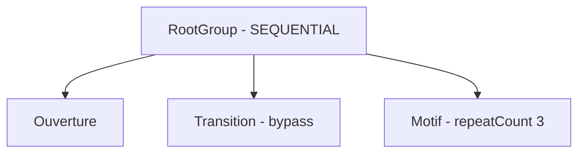

| Clip | Duree d'une lecture | Etat | Contribution |
| --- | ---: | --- | ---: |
| `Ouverture` | 2 s | actif, `repeatCount = 1` | 2 s |
| `Transition` | 2 s | `isBypassed = true` | 0 s |
| `Motif` | 1 s | actif, `repeatCount = 3` | 3 s |

La lecture obtenue est la suivante :

| Temps reel | Lecture |
| --- | --- |
| 0 a 2 s | `Ouverture` |
| 2 a 3 s | premiere lecture de `Motif` |
| 3 a 4 s | deuxieme lecture de `Motif` |
| 4 a 5 s | troisieme lecture de `Motif` |

Le clip `Transition` reste dans l'arbre. Son `repeatCount` est conserve, mais il ne produit aucun son et ne retarde pas le clip suivant tant qu'il est contourne.


### Chronologie dérivée

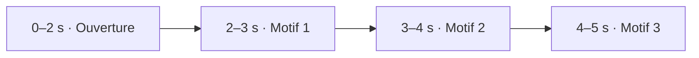

`Transition` reste visible dans le graphe structurel présenté plus haut, mais n'apparaît pas dans cette chronologie dérivée.

## Cas 2 - Deux clips simultanes aux horloges independantes

Le groupe racine utilise le mode `SIMULTANEOUS`.

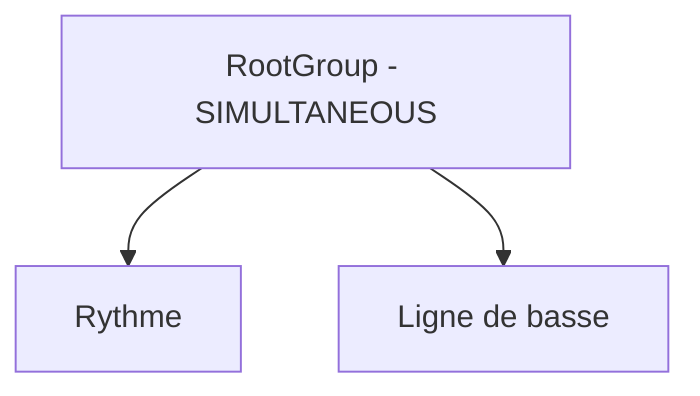

| Clip | Duree | Metrique | Tempo | Duree reelle |
| --- | ---: | ---: | ---: | ---: |
| `Rythme` | 3840 ticks | 4/4 | 120 BPM | 2 s |
| `Ligne de basse` | 5760 ticks | 3/4 | 90 BPM | 4 s |

Les deux clips commencent a l'instant zero. `Rythme` se termine apres deux secondes, tandis que `Ligne de basse` continue jusqu'a quatre secondes. Le groupe dure donc quatre secondes.

La metrique 3/4 et le tempo de 90 BPM de la basse ne modifient ni les reperes ni la chronologie du rythme en 4/4 a 120 BPM. Les clips partagent uniquement leur instant de depart reel.


### Chronologie dérivée

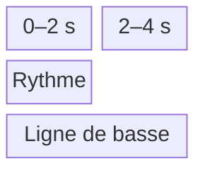

## Cas 3 - Imbrication d'une sequence dans une superposition

La composition comporte une introduction, un ensemble simultane, puis une conclusion. A l'interieur de l'ensemble, deux clips rythmiques sont lus en sequence pendant qu'une ligne de basse suit sa propre chronologie.

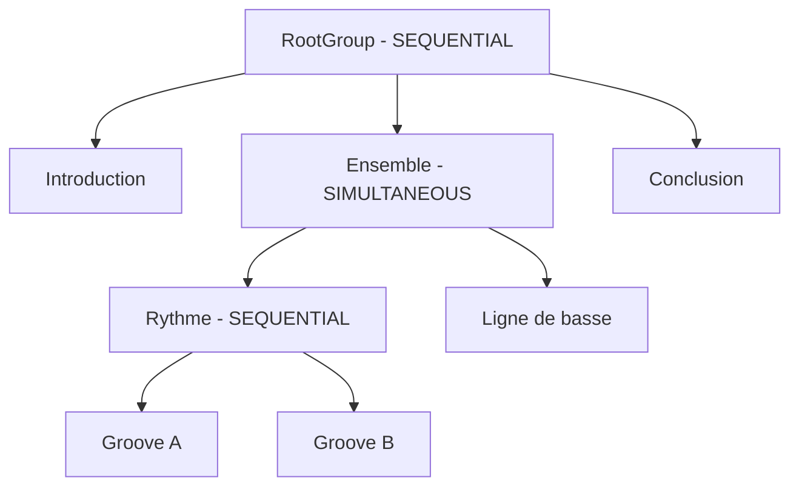

| Clip | Duree | Metrique | Tempo | Duree reelle |
| --- | ---: | ---: | ---: | ---: |
| `Introduction` | 3840 ticks | 4/4 | 120 BPM | 2 s |
| `Groove A` | 3840 ticks | 4/4 | 120 BPM | 2 s |
| `Groove B` | 3840 ticks | 4/4 | 120 BPM | 2 s |
| `Ligne de basse` | 5760 ticks | 3/4 | 90 BPM | 4 s |
| `Conclusion` | 2880 ticks | 3/4 | 90 BPM | 2 s |

Les nombres de ticks ne sont comparables qu'apres conversion par le tempo propre a chaque clip. Les deux grooves totalisent bien davantage de ticks que la basse, mais leur tempo plus rapide compense exactement cette difference :

```text
dureeRythme = ((3840 + 3840) / 960) * (60 / 120) = 4 s
dureeBasse  = (5760 / 960) * (60 / 90)            = 4 s
```

Les deux branches de l'ensemble ont donc la meme duree reelle, malgre leurs nombres de ticks differents.

La lecture se deroule comme suit :

| Temps reel | Lecture |
| --- | --- |
| 0 a 2 s | `Introduction` |
| 2 a 4 s | `Groove A` et premiere partie de `Ligne de basse` |
| 4 a 6 s | `Groove B` et seconde partie de `Ligne de basse` |
| 6 a 8 s | `Conclusion` |

Le groupe `Rythme` dure quatre secondes, car il additionne deux clips de deux secondes. Le groupe `Ensemble` dure egalement quatre secondes : ses deux enfants commencent a deux secondes et se terminent a six secondes.

Le debut de `Conclusion` a six secondes est entierement derive du parcours de l'arbre : deux secondes pour l'introduction, puis quatre secondes pour l'enfant le plus long du groupe simultane.


### Chronologie dérivée

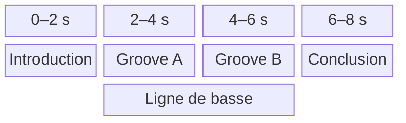

## Cas 4 - Mute et solo par instrument

Deux clips simultanes utilisent plusieurs instruments. Des notes de piano apparaissent dans les deux clips.

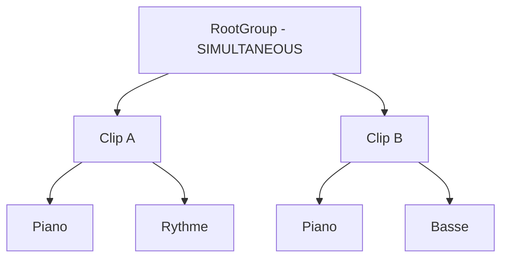

Lorsque `piano` est mute, ses notes sont silencieuses dans les deux clips. Les notes de rythme et de basse restent audibles. Lorsque `piano` est le seul instrument solo, ses notes restent audibles dans les deux clips et les autres instruments sont silencieux.

Dans les deux cas, les clips conservent leurs positions, leurs durees et leurs contextes. Le groupe se termine donc au meme instant qu'en l'absence de mute ou de solo. Ces reglages appartiennent au projet et ciblent l'`InstrumentId`, non un clip ou une instance particuliere.

Si `piano` est a la fois mute et solo, le mute est prioritaire. Une preecoute de note utilisant cet instrument applique la meme regle d'audibilite.


### Chronologie dérivée

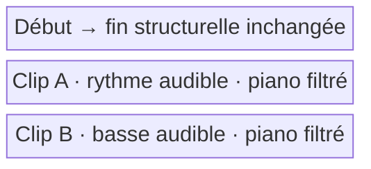

Cette projection illustre le cas où `piano` est muté. Un solo utilise exactement la même géométrie et change seulement les instruments audibles.

## Cas 5 - Deux clips utilisent le meme instrument

Deux clips lus simultanement contiennent chacun une note de meme hauteur jouee par le meme instrument.

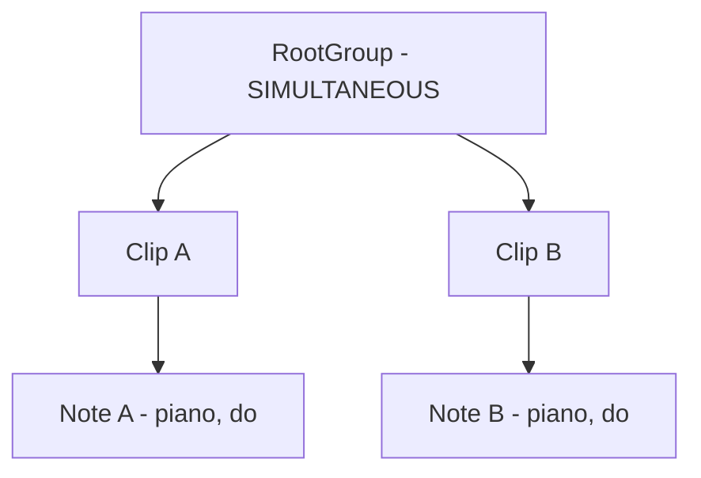

La note A commence a zero seconde et se termine a quatre secondes. La note B commence a une seconde et se termine a deux secondes. Le `PlaybackService` produit deux occurrences distinctes :

| Occurrence | Source | Instrument | Hauteur | Debut | Fin |
| --- | --- | --- | --- | ---: | ---: |
| `occurrence-a` | note A du clip A | piano | do | 0 s | 4 s |
| `occurrence-b` | note B du clip B | piano | do | 1 s | 2 s |

A deux secondes, le moteur relache uniquement `occurrence-b`. La voix correspondant a `occurrence-a` continue jusqu'a quatre secondes. Une commande de relachement identifiee seulement par l'instrument et la hauteur serait insuffisante, car elle risquerait d'interrompre les deux voix.

Les deux notes ne sont jamais fusionnees implicitement. Chaque activation de clip possede son propre `PlaybackContext` et sa propre `InstrumentInstance` `smplr` du piano.

Lors de chaque `NOTE_ON`, le moteur associe au `NoteOccurrenceId` le contrôle d'arrêt retourné par l'instance concernée. Les occurrences restent donc indépendantes même lorsqu'elles possèdent le même `InstrumentId` et la même hauteur. Aucune politique de voix globale aux différents clips n'est introduite.


### Chronologie dérivée

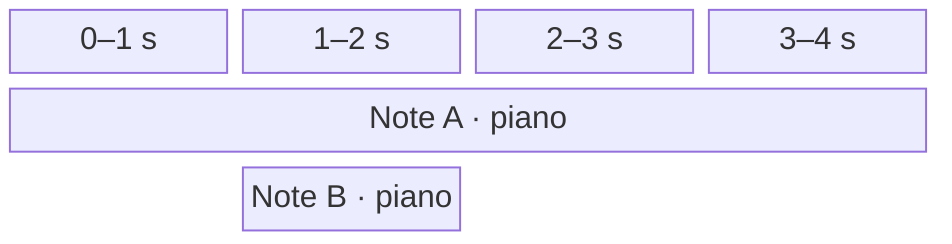

## Cas 6 - Remplacement du transport et preecoute concurrente

Le clip `Motif` est actif dans une session `PROJECT` lorsque l'utilisateur relance la lecture avec `play(motif.id)`.

Le nouvel appel place la tete au debut global derive de `Motif` et ouvre une nouvelle session `PROJECT`. Le `PlaybackService` retire immediatement le role de transport a `project-session-a`, annule ses attaques futures, relache ses occurrences actives selon le mode `GRACEFUL` et ouvre `project-session-b`. Il n'existe jamais deux transports actifs.

| Etape | Session | Type | Etat |
| --- | --- | --- | --- |
| Lecture initiale | `project-session-a` | `PROJECT` | transport actif |
| Nouvel appel a `play` | `project-session-a` | `PROJECT` | inactive ; contextes eventuellement `DRAINING` |
| Nouvel appel a `play` | `project-session-b` | `PROJECT` | nouveau transport actif |

Les deux activations successives du meme `ClipId` recoivent des `PlaybackContextId` differents. L'ancienne session reste inactive tandis que ses contextes passent eventuellement en `DRAINING` : leurs releases peuvent rester audibles pendant le debut de la nouvelle session, mais aucune nouvelle attaque n'est planifiee. La session est detruite lorsque tous ses contextes sont `DISPOSED`. Avec un arret `IMMEDIATE`, ses contextes sont detruits sans delai.

Pendant ce transport, l'utilisateur maintient une touche du piano roll pour preecouter une note independamment :

```ts
const notePreview = preview(noteId);

// A la fin du geste : pointerup ou pointercancel
notePreview.release();
```

`preview(noteId)` ouvre en interne une session `NOTE_PREVIEW` sans remplacer `project-session-b`, puis lui rattache un contexte possedant son propre `PlaybackContextId`. La presentation recoit seulement un `NotePreviewHandle` : aucun `PlaybackSessionId`, `PlaybackContextId` ou `NoteOccurrenceId` ne lui est expose.

La commande `NOTE_ON` porte le `contextId` ainsi que l'`InstrumentId` resolu par le `PlaybackService`. `release()` produit le `NOTE_OFF` de l'occurrence correspondante, termine structurellement son contexte et laisse sa release et son tail se drainer sans affecter le transport actif.

Si la fin du geste n'est pas recue, une duree maximale de securite applique automatiquement le meme relachement. `release()` est idempotente et reste donc sans effet apres cet arret automatique. Chaque appel possede son propre handle : plusieurs preecoutes, y compris plusieurs occurrences de la meme note, peuvent se chevaucher et etre relachees independamment. Le mute et le solo de l'instrument restent applicables.


### Chronologie dérivée

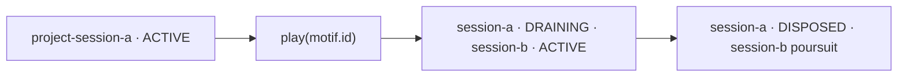

Des sessions `NOTE_PREVIEW` internes peuvent apparaître pendant la troisième phase sans modifier cette succession du transport. La présentation ne conserve que leurs `NotePreviewHandle` respectifs.

## Cas 7 - Repetitions et occurrences de notes

Un clip contient une note `note-a` et possede `repeatCount = 3`. Les trois lectures reutilisent le meme `PlaybackContextId` et la meme `InstrumentInstance`, mais elles produisent trois occurrences distinctes.

| Repetition | Note persistante | Occurrence d'execution |
| ---: | --- | --- |
| 1 | `note-a` | `occurrence-a-1` |
| 2 | `note-a` | `occurrence-a-2` |
| 3 | `note-a` | `occurrence-a-3` |

Chaque `NoteOff` cible son `NoteOccurrenceId`. Une release de la premiere repetition peut donc continuer au debut de la deuxieme. Si l'instrument est monophonique, la nouvelle attaque peut appliquer sa politique de retrigger ou de vol de voix a l'occurrence precedente, puisqu'elles appartiennent a la meme instance.

Si une voix a deja ete volee, le `NoteOff` programme pour son ancienne occurrence devient une operation sans effet. Le moteur doit donc traiter les relachements comme des commandes idempotentes.


### Chronologie dérivée

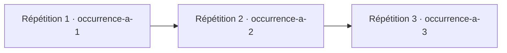

Les trois phases utilisent le même `PlaybackContextId`, mais chaque attaque reçoit son propre `NoteOccurrenceId`.

## Cas 8 - Fin structurelle et tail audio

Un clip `Nappe` possede une duree structurelle de deux secondes, mais son instrument produit une release et une reverberation qui restent audibles une seconde supplementaire. `Nappe` est suivi du clip `Conclusion` dans un groupe sequentiel.

| Temps reel | Evenement structurel | Etat audio de `Nappe` |
| --- | --- | --- |
| 0 s | debut de `Nappe` | `ACTIVE` |
| 2 s | fin de `Nappe`, debut de `Conclusion` | `DRAINING` |
| 3 s | aucune modification de la structure | `DISPOSED` apres extinction du tail |

La fin structurelle, calculee a partir des ticks et du tempo, determine le depart de `Conclusion`. Le tail ne rallonge donc pas le groupe et peut se superposer au clip suivant. Le contexte de `Nappe` refuse toute nouvelle attaque apres deux secondes, mais conserve ses instances jusqu'au silence ou jusqu'a une duree maximale de securite.


### Chronologie dérivée

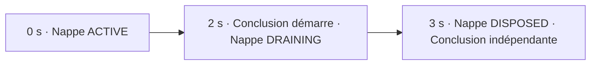

## Cas 9 - Lecture globale depuis un noeud

Le groupe racine est sequentiel. Son deuxieme enfant, `Ensemble`, est un groupe simultane.

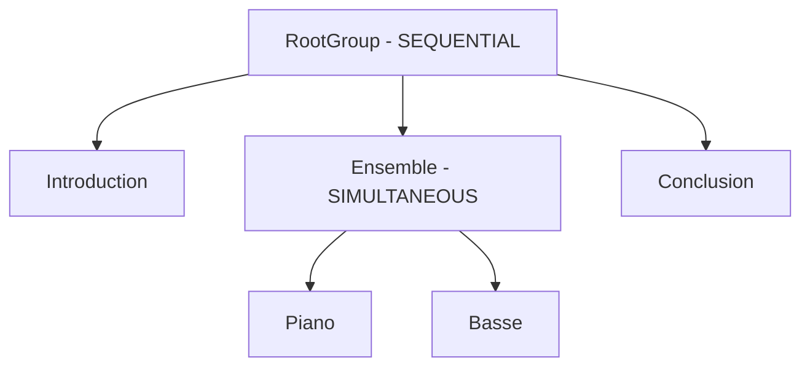

`Piano`, `Basse` et leur groupe parent possedent le meme instant de depart global derive. Les commandes suivantes expriment les positions choisies sans changer la portee du transport :

| Commande | Resultat |
| --- | --- |
| `play()`, tete au debut | `Introduction`, puis `Piano` et `Basse` ensemble, puis `Conclusion`. |
| `play(rootGroup.id)` | Replace la tete au debut et produit le meme parcours complet. |
| `play(ensemble.id)` | Place la tete au debut d'`Ensemble`, lit `Piano` et `Basse` ensemble, puis `Conclusion`. |
| `play(piano.id)` | Meme position globale et meme resultat que `play(ensemble.id)`. |
| `play(basse.id)` | Meme position globale et meme resultat que `play(ensemble.id)`. |
| `play(conclusion.id)` | Place la tete au debut de `Conclusion` et lit la fin du projet. |

Dans l'interface, chaque `Group` et chaque `Clip` peut donc presenter un bouton `play`. Une note possede uniquement une action `preview(noteId)`, qui ne deplace pas la tete et ne modifie pas le transport.

L'identifiant passe a `play` sert uniquement a resoudre une position. La racine de la session reste toujours le projet et aucune frontiere de preecoute structurelle n'est creee.

Dans une structure simultanee plus complexe, un element peut commencer alors qu'une autre branche est deja en cours. Demarrer depuis cet element reprend toutes les branches actives a cette position globale. Le traitement des notes commencees avant cette position est laisse ouvert.


### Chronologie dérivée

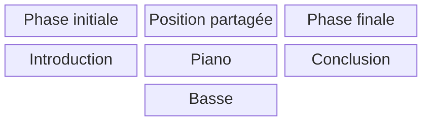

`play(piano.id)`, `play(basse.id)` et `play(ensemble.id)` placent tous la tête dans la colonne centrale.

## Cas 10 - Accord `ROOT` et changement de tonalité

Un clip de 7680 ticks contient un unique `HarmonyChange` au tick `0`. Son `Harmony` est un accord défini par `ROOT D` et `MINOR_SEVENTH`. La `Key` est do majeur au tick `0`, puis fa majeur au tick `3840`.

| Intervalle | `Key` active | `Harmony` persistante | Accord résolu |
| --- | --- | --- | --- |
| 0 à 3840 | do majeur | `CHORD · ROOT D · MINOR_SEVENTH` | `Dm7` |
| 3840 à 7680 | fa majeur | `CHORD · ROOT D · MINOR_SEVENTH` | `Dm7` |

La référence `ROOT` conserve la fondamentale orthographiée. Le `KeyChange` ne modifie donc ni l'accord sauvegardé ni l'accord résolu. Il modifie seulement leur relation : `Dm7` est le deuxième degré diatonique de do majeur, puis le sixième degré diatonique de fa majeur.

Cette différence affecte également l'analyse des hauteurs qui ne constituent pas l'accord. Par exemple, `B` appartient à do majeur mais pas à fa majeur, tandis que les notes `D`, `F`, `A` et `C` restent les notes constitutives de `Dm7` dans les deux intervalles.

### Chronologie dérivée

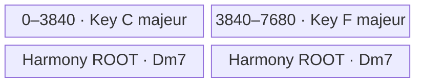

## Cas 11 - Accord `DEGREE` résolu par la tonalité

Le clip possède la même chronologie de tonalité que le cas précédent, mais son unique `Harmony` est définie par `DEGREE II` et `MINOR_SEVENTH`.

| Intervalle | `Key` active | Intention persistante | Accord résolu |
| --- | --- | --- | --- |
| 0 à 3840 | do majeur | `CHORD · DEGREE II · MINOR_SEVENTH` | `Dm7` |
| 3840 à 7680 | fa majeur | `CHORD · DEGREE II · MINOR_SEVENTH` | `Gm7` |

`Dm7` n'est jamais sauvegardé dans cette `Harmony`. L'intention persistante est le deuxième degré mineur septième. Au tick `3840`, le `KeyChange` suffit donc à faire évoluer l'accord résolu et le marqueur visible de `Dm7` vers `Gm7`, sans créer de nouvel `HarmonyChange`.

Le `ChordTypeId` reste inchangé. La tonalité détermine uniquement la fondamentale correspondant au degré ; elle ne déduit ni ne remplace automatiquement la qualité choisie.

### Chronologie dérivée

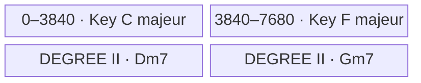

## Cas 12 - Gammes modales et pentatoniques

Deux clips indépendants illustrent les deux références possibles d'une `Harmony` de variante `SCALE`. Leur `Key` passe de do majeur à fa majeur au tick `3840`.

| Clip | `Harmony` persistante | Sous do majeur | Sous fa majeur |
| --- | --- | --- | --- |
| `Modal fixe` | `SCALE · ROOT D · DORIAN` | ré dorien | ré dorien |
| `Pentatonique relative` | `SCALE · DEGREE VI · MINOR_PENTATONIC` | la pentatonique mineure | ré pentatonique mineure |

Dans `Modal fixe`, la collection `D–E–F–G–A–B–C` reste inchangée. Le passage à fa majeur peut modifier son analyse contextuelle, notamment parce que `B` est extérieur à la nouvelle tonalité, mais il ne transforme pas la gamme.

Dans `Pentatonique relative`, aucune tonique de gamme n'est sauvegardée. Le sixième degré de do majeur produit `A–C–D–E–G`, puis le sixième degré de fa majeur produit `D–F–G–A–C`. Cette nouvelle résolution apparaît sans `HarmonyChange` supplémentaire.

### Chronologie dérivée

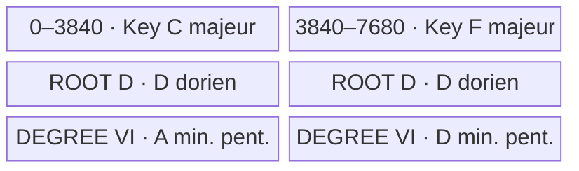

## Cas 13 - Note tenue à travers `KeyChange` et `HarmonyChange`

Une note `E4` commence au tick `960` et se termine au tick `5280`. Elle traverse un changement d'harmonie au tick `1920`, puis un changement simultané de tonalité et d'harmonie au tick `3840`.

| Intervalle analysé | `Key` active | `Harmony` active | Résolution | Rôle de `E4` |
| --- | --- | --- | --- | --- |
| 960 à 1920 | do majeur | `CHORD · ROOT C · MAJOR_TRIAD` | `C` majeur | tierce de l'accord |
| 1920 à 3840 | do majeur | `SCALE · DEGREE II · DORIAN` | ré dorien | deuxième degré de la gamme |
| 3840 à 5280 | fa majeur | `CHORD · DEGREE V · DOMINANT_SEVENTH` | `C7` | tierce de l'accord |

Au tick `3840`, les nouvelles valeurs de `Key` et d'`Harmony` s'appliquent ensemble. L'accord `DEGREE V` est donc résolu dans la nouvelle tonalité de fa majeur, ce qui produit `C7` ; il n'est jamais résolu temporairement dans l'ancienne tonalité de do majeur.

La note persistante conserve un seul `TimeRange`. Les trois intervalles ci-dessus sont uniquement des vues d'analyse dérivées de l'union de ses bornes, des `HarmonyChange` et des `KeyChange`. Aucun changement ne découpe, ne déplace ou n'invalide `E4`.

### Chronologie dérivée

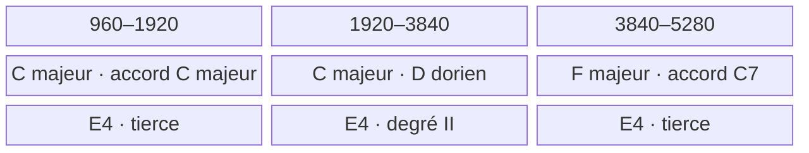
## Consequences pour le PlaybackService

Le calcul structurel peut etre interprete par une operation recursive :

```ts
calculateDuration(item: GroupItem): number
```

La projection temporelle associe ensuite chaque element a un intervalle global derive et chaque clip actif a une activation. Elle peut etre planifiee par fenetres pour limiter le volume de commandes preparees, meme si toutes les durees sont finies.

- un `Clip` calcule ses evenements depuis son instant de depart en utilisant ses propres `TempoSection` et possede une fin structurelle ;
- un groupe `SEQUENTIAL` transmet la fin de chaque enfant comme debut du suivant ;
- un groupe `SIMULTANEOUS` transmet le meme debut a tous ses enfants et retourne la fin la plus tardive ;
- `repeatCount` est toujours un entier strictement positif, de sorte que toutes les positions et durees derivees sont finies ;
- `play()` commence a la position actuelle de la tete de lecture ;
- `play(itemId)` place la tete au debut global derive du groupe ou du clip, puis lit le projet depuis cette position ;
- `play(rootGroup.id)` constitue le redemarrage explicite depuis le debut ;
- tout groupe ou clip peut servir de repere, y compris sous un ancetre `SIMULTANEOUS` ;
- toutes les branches actives a la position choisie participent au transport ;
- `preview(noteId)` auditionne uniquement une note, sans deplacer la tete ni remplacer le transport ;
- chaque lecture globale ouvre une session `PROJECT` transitoire ;
- une seule session `PROJECT` peut constituer le transport actif ; une nouvelle lecture remplace la precedente, qui ne subsiste que comme proprietaire de contextes eventuellement `DRAINING` ;
- les sessions `NOTE_PREVIEW` peuvent coexister entre elles et avec le transport actif ;
- les mute et solo persistants filtrent les notes par `InstrumentId` dans tous les contextes, sans modifier la timeline ;
- un clip bypassé avant son activation n'apparaît pas dans la projection et ne contribue pas a la duree ; s'il est bypassé pendant une iteration, celle-ci se termine et aucune repetition supplementaire n'est lancee ;
- `stop(mode)` arrete uniquement le transport actif et n'affecte aucune preecoute de note ; le service transmet au moteur le `PlaybackSessionId` correspondant et l'operation est sans effet en l'absence de transport actif ;
- un arret `GRACEFUL` relache les occurrences actives et conserve leurs tails, tandis qu'un arret `IMMEDIATE` detruit les contextes sans delai ;
- chaque activation de clip et chaque preecoute de note recoivent un `PlaybackContextId` transitoire distinct des identifiants persistants ;
- chaque `AudioCommand` porte ce `contextId`, tandis que la relation entre contexte et session n'est enregistree qu'une fois, a l'ouverture du contexte ;
- chaque attaque, y compris lors d'une repetition, recoit un `NoteOccurrenceId` unique ;
- la fin structurelle permet au parcours de continuer pendant que l'infrastructure conserve eventuellement le contexte en `DRAINING` ;
- aucune position globale ni aucun identifiant d'execution n'est ajoute au modele sauvegarde.
