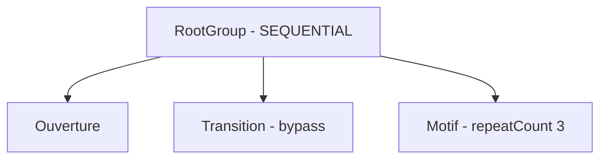
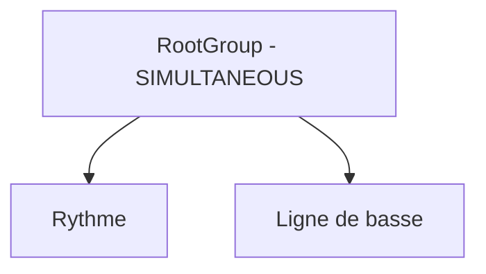
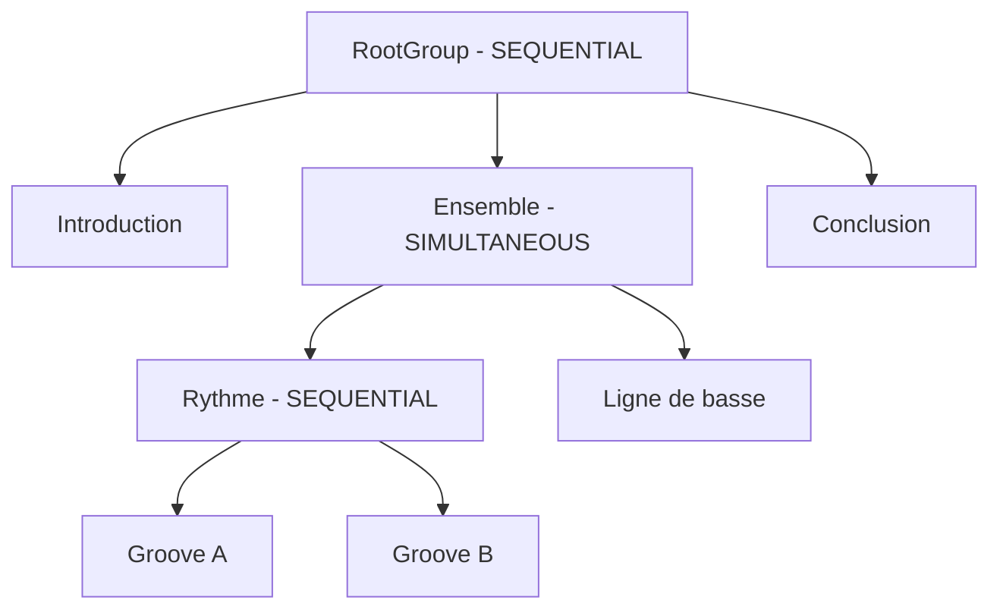
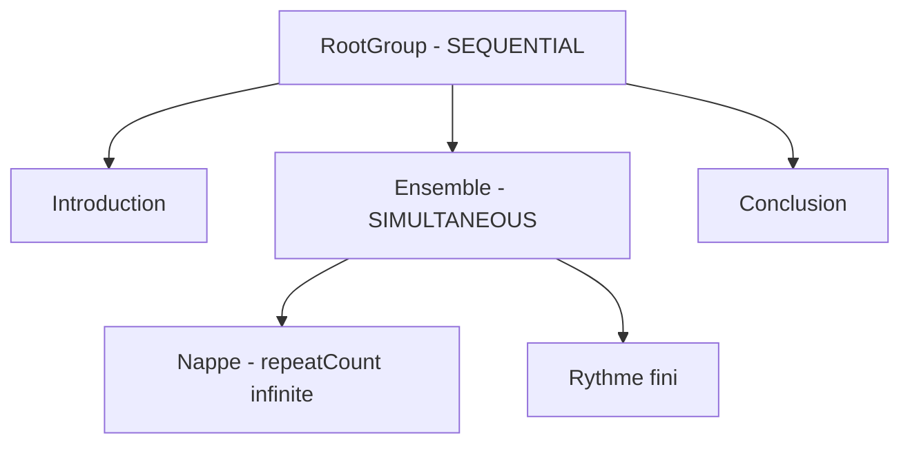
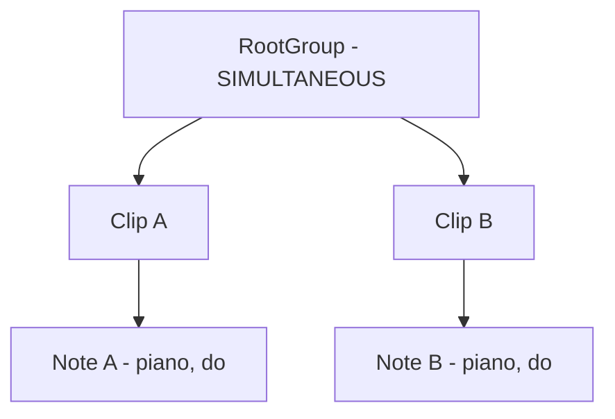
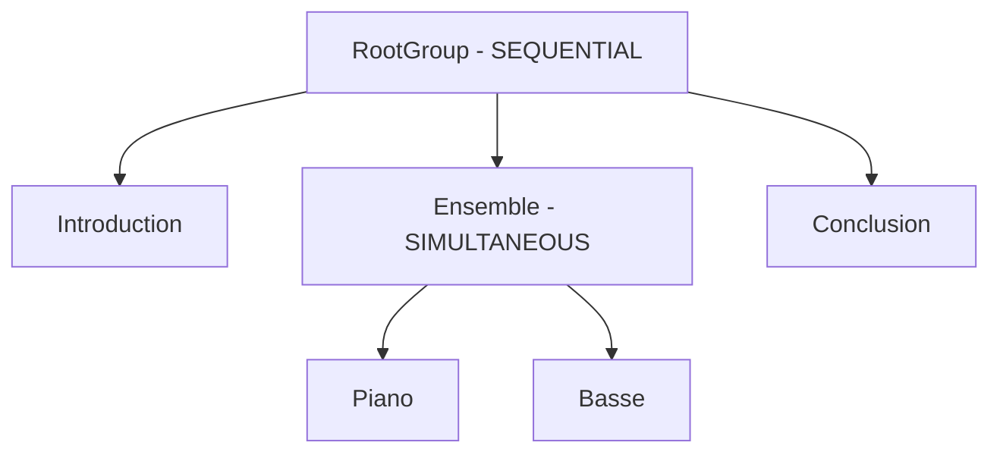

# Etudes de cas

Ce document illustre les regles de composition et de lecture definies dans [domaines.md](domaines.md). Les exemples ne decrivent aucune position globale sauvegardee : tous les instants de depart et de fin sont derives de l'arbre de `Group` et de `Clip`.

## Conventions de calcul

Chaque clip utilise sa propre chronologie de tempo. Pour un intervalle dont le tempo est constant :

```text
durationSeconds = (durationTicks / 960) * (60 / bpm)
```

Lorsque le tempo change dans le clip, sa duree reelle correspond a la somme des durees de ses `TempoSection`.

La duree de lecture d'un element suit les regles suivantes :

```text
clip contourne                    = 0
clip fini                         = duree d'une lecture * repeatCount
clip avec repeatCount = infinite  = infinite
groupe SEQUENTIAL                 = somme des durees de ses enfants
groupe SIMULTANEOUS               = maximum des durees de ses enfants
groupe vide                       = 0
```

## Cas 1 - Sequence, repetition et bypass

Le groupe racine contient trois clips et utilise le mode `SEQUENTIAL`.



| Clip | Duree d'une lecture | Etat | Contribution |
| --- | ---: | --- | ---: |
| `Ouverture` | 2 s | actif, `repeatCount = 1` | 2 s |
| `Transition` | 2 s | `isBypassed = true` | 0 s |
| `Motif` | 1 s | actif, `repeatCount = 3` | 3 s |

La lecture obtenue est la suivante :

| Temps reel | Lecture |
| --- | --- |
| 0 a 2 s | `Ouverture` |
| 2 a 3 s | premiere lecture de `Motif` |
| 3 a 4 s | deuxieme lecture de `Motif` |
| 4 a 5 s | troisieme lecture de `Motif` |

Le clip `Transition` reste dans l'arbre. Son `repeatCount` est conserve, mais il ne produit aucun son et ne retarde pas le clip suivant tant qu'il est contourne.

## Cas 2 - Deux clips simultanes aux horloges independantes

Le groupe racine utilise le mode `SIMULTANEOUS`.



| Clip | Duree | Metrique | Tempo | Duree reelle |
| --- | ---: | ---: | ---: | ---: |
| `Rythme` | 3840 ticks | 4/4 | 120 BPM | 2 s |
| `Ligne de basse` | 5760 ticks | 3/4 | 90 BPM | 4 s |

Les deux clips commencent a l'instant zero. `Rythme` se termine apres deux secondes, tandis que `Ligne de basse` continue jusqu'a quatre secondes. Le groupe dure donc quatre secondes.

La metrique 3/4 et le tempo de 90 BPM de la basse ne modifient ni les reperes ni la chronologie du rythme en 4/4 a 120 BPM. Les clips partagent uniquement leur instant de depart reel.

## Cas 3 - Imbrication d'une sequence dans une superposition

La composition comporte une introduction, un ensemble simultane, puis une conclusion. A l'interieur de l'ensemble, deux clips rythmiques sont lus en sequence pendant qu'une ligne de basse suit sa propre chronologie.



| Clip | Duree | Metrique | Tempo | Duree reelle |
| --- | ---: | ---: | ---: | ---: |
| `Introduction` | 3840 ticks | 4/4 | 120 BPM | 2 s |
| `Groove A` | 3840 ticks | 4/4 | 120 BPM | 2 s |
| `Groove B` | 3840 ticks | 4/4 | 120 BPM | 2 s |
| `Ligne de basse` | 5760 ticks | 3/4 | 90 BPM | 4 s |
| `Conclusion` | 2880 ticks | 3/4 | 90 BPM | 2 s |

La lecture se deroule comme suit :

| Temps reel | Lecture |
| --- | --- |
| 0 a 2 s | `Introduction` |
| 2 a 4 s | `Groove A` et premiere partie de `Ligne de basse` |
| 4 a 6 s | `Groove B` et seconde partie de `Ligne de basse` |
| 6 a 8 s | `Conclusion` |

Le groupe `Rythme` dure quatre secondes, car il additionne deux clips de deux secondes. Le groupe `Ensemble` dure egalement quatre secondes : ses deux enfants commencent a deux secondes et se terminent a six secondes.

Le debut de `Conclusion` a six secondes est entierement derive du parcours de l'arbre : deux secondes pour l'introduction, puis quatre secondes pour l'enfant le plus long du groupe simultane.

## Cas 4 - Repetition infinie dans une branche simultanee

Une nappe repetee indefiniment joue en meme temps qu'une sequence rythmique finie. Une conclusion est placee apres leur groupe parent.



Apres l'introduction, la nappe et le rythme commencent ensemble. Le rythme peut se terminer, mais la branche de la nappe n'a jamais d'instant de fin. La duree du groupe `Ensemble` est donc `infinite` et la `Conclusion` est inaccessible par progression automatique.

Si la nappe est contournee, sa contribution devient nulle. Le groupe se termine alors avec le rythme fini et la lecture peut atteindre la conclusion. Arreter la lecture ou deplacer manuellement la tete de lecture permet egalement de quitter la repetition infinie.


## Cas 5 - Deux clips utilisent le meme instrument

Deux clips lus simultanement contiennent chacun une note de meme hauteur jouee par le meme instrument.



La note A commence a zero seconde et se termine a quatre secondes. La note B commence a une seconde et se termine a deux secondes. Le `PlaybackService` produit deux occurrences distinctes :

| Occurrence | Source | Instrument | Hauteur | Debut | Fin |
| --- | --- | --- | --- | ---: | ---: |
| `occurrence-a` | note A du clip A | piano | do | 0 s | 4 s |
| `occurrence-b` | note B du clip B | piano | do | 1 s | 2 s |

A deux secondes, le moteur relache uniquement `occurrence-b`. La voix correspondant a `occurrence-a` continue jusqu'a quatre secondes. Une commande de relachement identifiee seulement par l'instrument et la hauteur serait insuffisante, car elle risquerait d'interrompre les deux voix.

Les deux notes ne sont jamais fusionnees implicitement. Chaque activation de clip possede son propre `PlaybackContext` et sa propre `InstrumentInstance` du piano. La politique `InstrumentDefinition.voiceAllocation` s'applique donc separement dans chaque instance.

Meme si le piano est monophonique, la note du clip B n'interrompt pas celle du clip A. La monophonie limite les notes concurrentes a l'interieur d'un meme contexte ; elle n'est pas globale a tous les clips utilisant le meme `InstrumentId`.

## Cas 6 - Remplacement du transport et audition concurrente

Le clip `Motif` est actif dans une session `PROJECT` lorsque l'utilisateur lance la preecoute de ce meme clip.

La preecoute de clip est une nouvelle session de transport. Le `PlaybackService` retire donc immediatement ce role a `project-session`, annule ses commandes futures et ouvre `clip-preview-session`. Il n'existe jamais deux transports actifs.

| Etape | Session | Type | Etat |
| --- | --- | --- | --- |
| Lecture initiale | `project-session` | `PROJECT` | transport actif |
| Lancement de la preecoute | `project-session` | `PROJECT` | remplacee, puis eventuellement `DRAINING` |
| Lancement de la preecoute | `clip-preview-session` | `CLIP_PREVIEW` | nouveau transport actif |

Les deux activations successives du meme `ClipId` recoivent des `ClipPlaybackId` differents. Si l'ancienne session passe en `DRAINING`, ses releases peuvent rester audibles pendant le debut de la nouvelle session, mais elle ne planifie plus aucune attaque et ne fait plus progresser le parcours du projet. Avec un arret `IMMEDIATE`, ses contextes sont detruits sans delai.

Pendant la preecoute du clip, une note peut etre auditionnee independamment :

```ts
const notePreviewSession = preview({ kind: "NOTE", id: noteId });
```

Cette operation ouvre une session `NOTE_PREVIEW` sans remplacer `clip-preview-session`. Elle utilise un descripteur portant un `NotePreviewPlaybackId` et un `InstrumentId`. Le `PlaybackService` resout le `NoteId`, mais aucun identifiant de source persistante ne traverse le port audio. Plusieurs auditions de notes peuvent se chevaucher, et arreter `notePreviewSession` n'affecte pas le transport actif.

## Cas 7 - Repetitions et occurrences de notes

Un clip contient une note `note-a` et possede `repeatCount = 3`. Les trois lectures reutilisent le meme `ClipPlaybackId` et la meme `InstrumentInstance`, mais elles produisent trois occurrences distinctes.

| Repetition | Note persistante | Occurrence d'execution |
| ---: | --- | --- |
| 1 | `note-a` | `occurrence-a-1` |
| 2 | `note-a` | `occurrence-a-2` |
| 3 | `note-a` | `occurrence-a-3` |

Chaque `NoteOff` cible son `NoteOccurrenceId`. Une release de la premiere repetition peut donc continuer au debut de la deuxieme. Si l'instrument est monophonique, la nouvelle attaque peut appliquer sa politique de retrigger ou de vol de voix a l'occurrence precedente, puisqu'elles appartiennent a la meme instance.

Si une voix a deja ete volee, le `NoteOff` programme pour son ancienne occurrence devient une operation sans effet. Le moteur doit donc traiter les relachements comme des commandes idempotentes.

## Cas 8 - Fin structurelle et tail audio

Un clip `Nappe` possede une duree structurelle de deux secondes, mais son instrument produit une release et une reverberation qui restent audibles une seconde supplementaire. `Nappe` est suivi du clip `Conclusion` dans un groupe sequentiel.

| Temps reel | Evenement structurel | Etat audio de `Nappe` |
| --- | --- | --- |
| 0 s | debut de `Nappe` | `ACTIVE` |
| 2 s | fin de `Nappe`, debut de `Conclusion` | `DRAINING` |
| 3 s | aucune modification de la structure | `DISPOSED` apres extinction du tail |

La fin structurelle, calculee a partir des ticks et du tempo, determine le depart de `Conclusion`. Le tail ne rallonge donc pas le groupe et peut se superposer au clip suivant. Le contexte de `Nappe` refuse toute nouvelle attaque apres deux secondes, mais conserve ses instances jusqu'au silence ou jusqu'a une duree maximale de securite.

## Cas 9 - Lecture depuis un noeud et preecoute bornee

Le groupe racine est sequentiel. Son deuxieme enfant, `Ensemble`, est un groupe simultane.



Les commandes suivantes expriment des intentions differentes :

| Commande | Resultat |
| --- | --- |
| `play()` | `Introduction`, puis `Piano` et `Basse` ensemble, puis `Conclusion`. |
| `play(ensemble.id)` | `Piano` et `Basse` ensemble, puis `Conclusion`. |
| `preview({ kind: "GROUP", id: ensemble.id })` | `Piano` et `Basse` ensemble, puis arret a la fin du groupe. |
| `preview({ kind: "CLIP", id: piano.id })` | `Piano` seul, puis arret a la fin du clip. |
| `play(piano.id)` | Commande invalide : `Piano` ne constitue pas un point d'entree structurel isole dans son groupe simultane. |

Dans l'interface, les enfants d'un groupe sequentiel peuvent donc proposer un bouton de lecture structurelle. Un groupe simultane propose ce bouton pour l'ensemble du groupe, tandis que chacun de ses descendants reste accessible par une action de preecoute.

Le point de depart optionnel de `play` ne change pas la racine de la session : il s'agit toujours d'une session `PROJECT`, capable de poursuivre jusqu'a la fin du projet. Une preecoute de groupe ou de clip cree une session `GROUP_PREVIEW` ou `CLIP_PREVIEW` dont la racine est une frontiere infranchissable et remplace le transport courant. Une preecoute de note cree au contraire une session `NOTE_PREVIEW` concurrente qui ne remplace pas le transport.

## Consequences pour le PlaybackService

Le calcul structurel peut etre interprete par une operation recursive :

```ts
calculateDuration(item: GroupItem): number
```

Une portion finie peut ensuite etre planifiee a partir d'un instant de depart. La planification effective utilise une fenetre d'anticipation bornee afin de ne jamais tenter de developper entierement une repetition infinie.

- un `Clip` calcule ses evenements depuis son instant de depart en utilisant ses propres `TempoSection` et possede une fin structurelle ;
- un groupe `SEQUENTIAL` transmet la fin de chaque enfant comme debut du suivant ;
- un groupe `SIMULTANEOUS` transmet le meme debut a tous ses enfants et retourne la fin la plus tardive ;
- une duree `infinite` se propage aux groupes ancetres selon les memes regles ;
- `play()` commence au debut du `rootGroup`, tandis que `play(itemId)` utilise un point d'entree structurel valide et poursuit ensuite jusqu'a la fin du projet ;
- un enfant isole d'un groupe `SIMULTANEOUS` ne peut pas servir de point de depart structurel, car ses freres devraient commencer au meme instant ;
- `preview(target)` borne le parcours au groupe, au clip ou a la note cible et ne rejoint jamais un noeud exterieur a cette racine ;
- chaque operation globale ouvre une `PlaybackSession` transitoire ;
- une seule session `PROJECT`, `GROUP_PREVIEW` ou `CLIP_PREVIEW` peut constituer le transport actif ; une nouvelle lecture structurelle remplace la precedente ;
- les sessions `NOTE_PREVIEW` peuvent coexister entre elles et avec le transport actif ;
- chaque activation de clip recoit un `ClipPlaybackId` distinct de son `ClipId` ;
- chaque attaque, y compris lors d'une repetition, recoit un `NoteOccurrenceId` unique ;
- la fin structurelle permet au parcours de continuer pendant que l'infrastructure conserve eventuellement le contexte en `DRAINING` ;
- aucun de ces calculs ni identifiants d'execution n'ajoute de position temporelle globale ou d'etat audio au modele sauvegarde.
