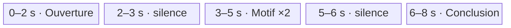
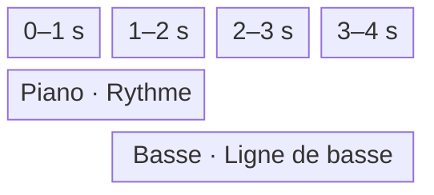
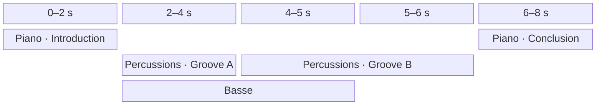
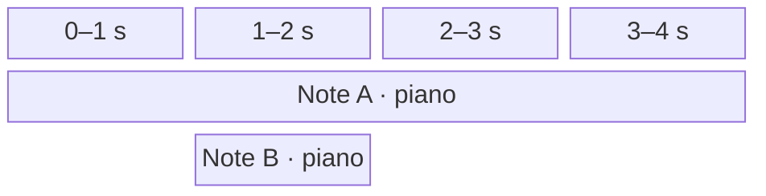

# Études de cas

Ce document illustre les règles de composition et de lecture définies dans [architecture.md](architecture.md). Un `Score` désigne un contenu musical indépendant, éditable et partageable dans le piano roll ; un bloc de la grille est un `Clip` persistant qui référence obligatoirement ce contenu par `scoreId`. Sauf indication contraire, chaque clip nommé dans les exemples référence un score de même nom. Un clip référence aussi une piste existante par `trackId` ; le score ne possède aucun instrument. Le partage découle uniquement de l’utilisation du même `ScoreId`, tandis qu’une duplication indépendante crée un nouveau score.

## Conventions de calcul

Sauf indication contraire, le projet utilise un tempo unique de 120,0 BPM et une résolution de 960 ticks par noire. Un `Tempo` accepte une décimale entre 20,0 et 999,9 BPM inclus :

```text
durationSeconds = (durationTicks / 960) * (60 / 120)
```

Les exemples utilisant les identifiants `track-piano`, `track-drums`, `track-bass` et `track-strings` supposent des pistes existantes associées respectivement au piano, aux percussions, à la basse et aux cordes, dans cet ordre d’affichage. Ces noms sont des identifiants stables illustratifs, pas des indices. Les exemples d’écoute isolée supposent une piste d’écoute explicitement choisie, sauf lorsque son absence est le sujet du cas.

La métrique et la chronologie harmonique restent locales à chaque score. La métrique fournit des repères de mesures, mais ne modifie pas la conversion des ticks en secondes.

La durée structurelle d’un clip et celle du projet suivent les règles suivantes :

```text
clipEnd = clip.start + score.duration * clip.repeatCount
projectEnd    = maximum des valeurs `clipEnd`, ou 0 si le projet ne contient aucun clip
```

Les intervalles sont semi-ouverts. Deux clips sont simultanés si leurs intervalles globaux se recouvrent avec une durée strictement positive. Ce recouvrement est valide sur une même piste comme sur des pistes différentes. La piste détermine l’instrument ; elle ne modifie pas le calcul des intervalles temporels.

## Cas 1 — Placement explicite, espace vide et répétition

Trois clips sont placés sur la piste `track-piano` :

| Clip | Début global | Durée du score référencé | `repeatCount` | Fin globale |
| --- | ---: | ---: | ---: | ---: |
| `Ouverture` | 0 | 3840 ticks | 1 | 3840 |
| `Motif` | 5760 | 1920 ticks | 2 | 9600 |
| `Conclusion` | 11520 | 3840 ticks | 1 | 15360 |

La position de `Motif` n'est pas calculée depuis la fin d'`Ouverture`. L'intervalle `[3840, 5760)` reste silencieux, puis les deux lectures contiguës du motif occupent `[5760, 9600)`. Un second silence sépare le motif de la conclusion.



Les blocs du schéma indiquent leurs intervalles exacts ; leurs largeurs ne sont pas proportionnelles aux durées.

Déplacer ou supprimer un clip ne rapproche jamais automatiquement les autres clips. Leurs coordonnées persistantes restent inchangées. Supprimer le clip ne supprime pas son score source, même s'il s'agissait de son dernier clip : seule une suppression manuelle distincte peut ensuite supprimer ce score non référencé.

## Cas 2 — Chevauchement de clips aux métriques indépendantes

Deux clips référencent des scores soumis au même tempo de projet, mais possédant des métriques locales différentes :

| Clip | `trackId` | Début | Durée du score | Métrique locale | Intervalle réel |
| --- | --- | ---: | ---: | ---: | ---: |
| `Rythme` | `track-piano` | 0 | 3840 ticks | 4/4 | 0 à 2 s |
| `Ligne de basse` | `track-bass` | 1920 ticks | 5760 ticks | 3/4 | 1 à 4 s |

Les deux clips jouent simultanément entre une et deux secondes. La basse continue seule jusqu'à quatre secondes.



La basse conserve ses mesures en 3/4, mais elle n'utilise ni tempo propre ni horloge indépendante. Son décalage provient uniquement de son début global sauvegardé.

## Cas 3 — Composition sur plusieurs pistes

La grille contient des clips d’introduction, de deux grooves consécutifs, d'une basse superposée et d'une conclusion :

| Clip | `trackId` | Début global | Durée du score | Intervalle réel |
| --- | --- | ---: | ---: | ---: |
| `Introduction` | `track-piano` | 0 | 3840 ticks | 0 à 2 s |
| `Groove A` | `track-drums` | 3840 | 3840 ticks | 2 à 4 s |
| `Groove B` | `track-drums` | 7680 | 3840 ticks | 4 à 6 s |
| `Ligne de basse` | `track-bass` | 3840 | 5760 ticks | 2 à 5 s |
| `Conclusion` | `track-piano` | 11520 | 3840 ticks | 6 à 8 s |



Les colonnes du schéma couvrent des durées différentes ; les valeurs du tableau donnent les intervalles exacts.

`Groove A` et `Groove B` partagent la piste de percussions, mais leur succession résulte exclusivement de leurs placements. `Ligne de basse` chevauche les deux grooves, puis s'arrête une seconde avant `Groove B`. La conclusion commence au tick `11520` parce que cette valeur est sauvegardée, non parce qu'un élément précédent la déclenche.

## Cas 4 — Déplacement vers une autre piste

Le clip `Couplet` appartient à `track-piano`. Le clip `Contrechant` appartient à `track-strings`. Leurs intervalles globaux se chevauchent : leurs notes jouent simultanément au piano et aux cordes.

Déplacer `Contrechant` vers `track-piano` conserve son `scoreId`, son début et ses répétitions, mais change son `trackId`. Les deux blocs peuvent se superposer sur cette piste et sont désormais joués au piano. Le contenu des deux scores reste intact ; les éventuels autres clips de `Contrechant` sur `track-strings` continuent aux cordes.

Pendant un transport `PROJECT`, si les notes de `Contrechant` couvrent la borne de replanification, le service attend la disponibilité du piano, remplace uniquement le contexte de ce clip et réattaque ces notes au nouvel instrument. Les cordes peuvent finir leurs tails ; `Couplet` conserve ses voix. Un déplacement vers une autre piste utilisant déjà les cordes conserve au contraire les voix lorsque les données temporelles sont inchangées.

La piste d’écoute d’un piano roll déjà ouvert n’est pas automatiquement déplacée avec ce bloc. Rouvrir explicitement le clip y applique sa nouvelle piste ; un transport `SCORE` existant conserve autrement son couple score/piste.

## Cas 5 — Deux clips sur une même piste instrumentale

Deux clips qui se chevauchent sur `track-piano` référencent chacun un score contenant une note de même hauteur. Ils utilisent tous deux l’instrument de cette piste.

| Clip | Source | Instrument | Hauteur | Début | Fin |
| --- | --- | --- | --- | ---: | ---: |
| `clip-a` | score A · note A | piano | do | 0 s | 4 s |
| `clip-b` | score B · note B | piano | do | 1 s | 2 s |

À deux secondes, le moteur relâche uniquement `clip-b`. La voix correspondant à `clip-a` continue jusqu'à quatre secondes. Une commande identifiée seulement par l'instrument et la hauteur serait insuffisante.

Chaque clip actif possède son propre `PlaybackContext` et sa propre `InstrumentInstance` `smplr` du piano. Lors de chaque `NOTE_ON`, le moteur associe au `NoteOccurrenceId` le contrôle d'arrêt retourné par l'instance concernée. Les clips ne sont jamais fusionnés implicitement.



## Cas 6 — Transports et deux formes de préécoute

Le projet est lu depuis sa tête globale dans une session `PROJECT`. Le score source `Motif` est parallèlement ouvert dans le piano roll ; sa piste d’écoute est `track-piano` et sa tête locale est restée au tick `960`.

Lorsque l'utilisateur appelle `playScore()`, le `PlaybackService` prépare l’instrument de la piste d’écoute de `Motif`, puis, une fois celui-ci disponible, retire le rôle de transport à `project-session-a`, annule ses attaques futures et relâche ses notes actives selon le mode `GRACEFUL`. Il ouvre ensuite `score-session-b` de type `SCORE`, attachée au couple `Motif` / `track-piano`, au tick local `960`. La tête globale conserve sa position.

| Étape | Session | Type | État |
| --- | --- | --- | --- |
| Lecture de l'arrangement | `project-session-a` | `PROJECT` | transport actif |
| Appel à `playScore()` | `project-session-a` | `PROJECT` | inactive ; contextes éventuellement `DRAINING` |
| Appel à `playScore()` | `score-session-b` | `SCORE` | nouveau transport actif |

La session `SCORE` lit directement le contenu local de `Motif` jusqu'à sa durée structurelle. Elle ignore tous les clips qui référencent ce score, leurs positions globales et leurs répétitions.

Pendant ce transport, l’utilisateur maintient la touche `F♯4` du piano roll, même si aucune note de cette hauteur n’existe dans le score :

```ts
const pitchResult = previewPitch(Pitch.F_SHARP_4);

if (pitchResult.ok) {
  const pitchPreview = pitchResult.value;
  pitchPreview.release(); // pointerup ou pointercancel
}
```

`previewPitch` valide immédiatement l’entrée. Lorsque son `Result` contient un handle, celui-ci est disponible avant la banque et sa propriété `ready` décrit ensuite `STARTED`, `CANCELLED` ou un échec de préparation. La session `PITCH_PREVIEW` ne remplace jamais `score-session-b` et soutient la voix jusqu’à `release()`. Un relâchement antérieur au chargement fait résoudre `ready` avec `ok("CANCELLED")` et empêche toute attaque tardive.

L’utilisateur commence ensuite une transposition de quatre notes sélectionnées, dont deux possèdent initialement la même hauteur :

```ts
const selectionResult = previewSelection(selectedNoteIds);

if (!selectionResult.ok) {
  // La présentation traduit PreviewValidationError.
}

const selectionPreview =
  selectionResult.ok ? selectionResult.value : undefined;
```

Le service ignore leurs positions et leurs durées, déduplique leurs hauteurs et produit une attaque brève simultanée lorsque `selectionPreview.ready` peut démarrer l’audition. Lorsqu’une seule des quatre notes change de hauteur, l’attaque précédente encore active est relâchée et toutes les hauteurs actuelles de la sélection sont dédupliquées puis réattaquées. Les hauteurs restées identiques sont donc elles aussi rejouées. Un déplacement seulement temporel ne provoque aucune nouvelle attaque.

`selectionPreview?.stop()` cesse de suivre le geste, fait résoudre une préparation encore en attente avec `ok("CANCELLED")`, annule les attaques futures et relâche les voix brèves encore actives. La session `SELECTION_PREVIEW` n’a jamais remplacé le transport `SCORE`.

Un appel ultérieur à `playProject(5760)` remplace à son tour le transport `SCORE`, déplace uniquement la tête globale au tick demandé et reprend la lecture de l'arrangement. La tête locale conserve son dernier tick.

## Cas 7 — Répétitions et occurrences de notes

Un score contient une note `note-a` et possède une durée locale de 1920 ticks. Un clip qui le référence possède un `repeatCount` de `3` et occupe donc 5760 ticks globaux à partir de son `start`.

| Répétition | Note persistante | Occurrence d'exécution |
| ---: | --- | --- |
| 1 | `note-a` | `occurrence-a-1` |
| 2 | `note-a` | `occurrence-a-2` |
| 3 | `note-a` | `occurrence-a-3` |

Les trois répétitions de ce même clip réutilisent le même `PlaybackContextId` et la même `InstrumentInstance`, mais chaque attaque reçoit un `NoteOccurrenceId` distinct. Une release peut continuer au début de la répétition suivante sans confondre les deux occurrences de note.

Si une voix a déjà été volée, le `NOTE_OFF` programmé pour son ancienne occurrence devient une opération sans effet. Les relâchements sont donc idempotents.

## Cas 8 — Fin structurelle et tail audio

Le clip `Nappe` occupe `[0, 3840)`, soit deux secondes. L’instrument de sa piste produit une release et une réverbération qui restent audibles une seconde supplémentaire. Le clip `Conclusion` est placé explicitement au tick `3840`.

| Temps réel | Événement structurel | État audio de `Nappe` |
| --- | --- | --- |
| 0 s | début de `Nappe` | `ACTIVE` |
| 2 s | fin de `Nappe`, début de `Conclusion` | `DRAINING` |
| 3 s | aucun changement de placement | `DISPOSED` après extinction du tail |

Le tail ne modifie ni la fin globale du clip `Nappe`, ni le `start` du clip `Conclusion`. Il peut se superposer au clip suivant. Le contexte de `Nappe` refuse toute nouvelle attaque après deux secondes, mais conserve ses instances jusqu'au silence ou jusqu'à une durée maximale de sécurité.

## Cas 9 — Lecture globale depuis un tick explicite

La grille contient les clips suivants :

| Clip | `trackId` | Intervalle réel |
| --- | --- | ---: |
| `Introduction` | `track-piano` | 0 à 2 s |
| `Piano` | `track-piano` | 2 à 6 s |
| `Basse` | `track-bass` | 2 à 5 s |
| `Percussions` | `track-drums` | 1 à 4 s |
| `Conclusion` | `track-piano` | 6 à 8 s |

Les commandes suivantes choisissent une position sans changer la portée du transport :

| Commande | Résultat |
| --- | --- |
| `playProject()`, tête globale à 0 | Lit tout le projet depuis son début. |
| `playProject(3840)` | Place la tête globale à 2 s ; `Piano`, `Basse` et la partie encore active de `Percussions` participent au transport. |
| `playProject(11520)` | Place la tête globale à 6 s et lit la fin du projet. |

`playProject` reçoit directement un `Tick` global et aucun `ClipId`. `playScore(tick?)` utilise au contraire un tick local au score édité. `previewPitch` et `previewSelection` ne déplacent aucune tête et ne modifient pas le transport.

Si une note de `Percussions` a commencé avant deux secondes mais couvre encore cette position, la note chase minimale la réattaque au démarrage et programme son relâchement pour sa durée restante. Aucun état antérieur d'enveloppe ou de voix n'est reconstruit.

## Cas 10 — Alternance exclusive entre gamme et accord

Un score de 7680 ticks possède les changements harmoniques suivants :

| Tick local | `Harmony` |
| --- | --- |
| `0` | `SCALE · C IONIAN` |
| `1920` | `CHORD · D MINOR_SEVENTH` |
| `3840` | `SCALE · A MINOR_PENTATONIC` |

| Intervalle local | Harmonie active |
| --- | --- |
| `[0, 1920)` | do ionien |
| `[1920, 3840)` | `Dm7` |
| `[3840, 7680)` | la pentatonique mineure |

Chaque `HarmonyChange` remplace la variante précédente. Aucun accord et aucune gamme ne sont actifs simultanément.

Le placement global des clips et le tempo du projet n’affectent pas cette chronologie locale.

## Cas 11 — Remplacement harmonique explicite

La section active contient `SCALE · C IONIAN`. L’utilisateur remplace cette valeur par `CHORD · D♭ MAJOR` : la transformation est valide, même si les notes de cet accord ne sont pas toutes dans la gamme précédente.

Le premier périmètre présente le catalogue pour un choix explicite, sans suggestion ni classement par compatibilité. Le remplacement modifie la variante du même `HarmonyChange` ; il ne crée aucun contexte harmonique simultané et ne transforme aucune note.

## Cas 12 — Gammes modales et pentatoniques

Un score possède successivement les changements harmoniques suivants :

| Tick local | `Harmony` |
| --- | --- |
| `0` | `SCALE · D DORIAN` |
| `3840` | `SCALE · A MINOR_PENTATONIC` |

Les deux gammes sauvegardent une `RootNote` explicite. Leur résolution ne dépend d’aucun contexte supérieur implicite. La première `HarmonySection` couvre `[0, 3840)` et la seconde `[3840, score.duration)`.

Les clips du score peuvent être placés n’importe où dans la grille. Leur piste et leur éventuel chevauchement avec d’autres clips ne changent pas ces analyses locales.

## Cas 13 — Note tenue à travers plusieurs variantes d’harmonie

Une note `E4` commence au tick local `960` et se termine au tick `5280`. Le score possède `SCALE · C IONIAN` au tick `0`, `CHORD · C MAJOR` au tick `1920`, puis `SCALE · A MINOR_PENTATONIC` au tick `3840`.

| Intervalle analysé | Harmonie active | Rôle de `E4` |
| --- | --- | --- |
| `[960, 1920)` | do ionien | `SCALE_TONE` |
| `[1920, 3840)` | do majeur | `CHORD_TONE` |
| `[3840, 5280)` | la pentatonique mineure | `SCALE_TONE` |

Les frontières des `HarmonySection` sont réunies avec celles du `TimeRange` pour produire ces portions. La note persistante conserve néanmoins un seul intervalle et n’est jamais découpée.

Si un clip du score commence au tick global `10000`, ces bornes locales correspondent aux ticks globaux `10960`, `11920`, `13840` et `15280`. Les objets locaux ne sont pas réécrits pour autant.

## Cas 14 — Projection immédiate et convergence audio

Un transport `PROJECT` est actif. À cinq secondes depuis le début de sa session, un même geste déplace globalement un clip déjà actif et déplace un changement local situé plus loin dans le score qu’il référence. La commande fournit une nouvelle projection candidate dans `EditSession.draft`. Elle devient immédiatement la `projectProjection` affichée, tandis que le plan sonore précédent continue jusqu’à l’acceptation de sa replanification.

Le `PlaybackService` consulte l’horloge de la session :

```ts
const { now, safeAt } = audioEngine.getClock(transportSessionId);
```

Si `safeAt` vaut `5.04` secondes, il calcule le tick de réconciliation avec l’ancien ancrage et l’état des voix prévu par l’ancien plan à cette borne. Il recalcule alors le transport sans ouvrir une nouvelle session, puis demande :

```ts
const updateResult = audioEngine.replaceSchedule(transportSessionId, {
  from: safeAt,
  audioCommands: replacementCommands,
  contextCompletions: replacementCompletions
});
```

Si la borne est encore sûre, le moteur conserve les événements antérieurs, remplace atomiquement les commandes et fins de contexte à partir de cette borne et retourne `ok(undefined)`. Si elle est dépassée, `updateResult` contient `SCHEDULE_TOO_LATE` et aucune collection audio n’est modifiée ; le service recalcule depuis une nouvelle borne sans revenir sur la projection déjà affichée. Dans la suite de ce cas, « tête » désigne le tick de cette borne acceptée.

Si l'ancien et le nouveau début global de la note restent avant la tête, tandis que sa fin reste après, l'occurrence de note audible est conservée et seul son `NOTE_OFF` est replanifié. Si le déplacement d’un `Clip` place l'attaque après la tête, l'occurrence de note reçoit un `NOTE_OFF` à la borne et sa future attaque est replanifiée. Une note auparavant inactive qui couvre désormais la tête reçoit un `NOTE_ON` à cette borne.

Une modification de hauteur ou de vélocité de la note impose une relâche puis une réattaque lorsqu'elle reste couverte. Un changement d’instrument rend immédiatement le nouvel instrument visible dans la projection ; l’ancien instrument continue toutefois de jouer jusqu’à ce que la nouvelle banque soit prête, puis chaque clip actif concerné de cette piste bascule vers un nouveau contexte tandis que l’ancien se draine. Un changement du tempo du projet replanifie les instants futurs sans réattaquer une note dont les données sonores sont inchangées.

Le changement local appartient à la même édition atomique, mais ne produit aucun événement sonore en lui-même. Le `PlaybackSessionId` et l’origine temporelle ne changent pas ; la position poursuit son avance continue. Le document est déjà projeté visuellement ; seul le son le rejoint à la borne sûre.

Si le transport actif était `SCORE` sur ce même score, le service ignorerait le déplacement d’un `Clip` et réconcilierait uniquement le contenu local depuis la tête du score. Une modification d’un autre score n’affecterait pas cette session ; le tempo du projet et l’instrument de sa piste d’écoute continueraient en revanche à s’y appliquer. La portée reste le score attaché à la session, même si le piano roll en affiche un autre.

## Cas 15 — Un score partagé entre plusieurs instruments

Le score source `Ostinato` possède une durée de 1920 ticks et contient `note-a`. Deux blocs de la grille le référencent. Une piste `track-vibes` utilise le vibraphone :

| `Clip` | `scoreId` | `trackId` | Début | `repeatCount` |
| --- | --- | --- | ---: | ---: |
| `ostinato-a` | `ostinato` | `track-piano` | 0 | 2 |
| `ostinato-b` | `ostinato` | `track-vibes` | 960 | 1 |

Les deux clips se chevauchent. Le premier joue au piano, le second au vibraphone, dans deux `PlaybackContext` distincts. Les attaques issues de `note-a` reçoivent des `NoteOccurrenceId` distincts ; elles ne partagent ni voix ni instance audio malgré leur `ScoreId` commun.

Ouvrir l’un ou l’autre bloc édite le même score `Ostinato`, avec la piste d’écoute du bloc ouvert. Transposer `note-a`, modifier sa vélocité, déplacer un changement local ou redimensionner le score met à jour les deux clips, chacun avec son instrument propre.

Changer l’instrument de `track-piano` affecte seulement `ostinato-a` et les autres clips de cette piste. `ostinato-b` conserve le vibraphone. La préparation puis la réconciliation suivent les règles communes de changement d’instrument.

Déplacer `ostinato-b`, changer son `trackId` ou son `repeatCount` ne modifie pas `ostinato-a`. Dupliquer `ostinato-a` par référence conserve son `scoreId` et, par défaut, son `trackId` : le nouveau bloc partage le contenu et utilise le piano. Choisir une duplication indépendante crée un nouveau score pour le nouveau bloc, comme dans le cas 38. Rendre `ostinato-b` indépendant conserve ce clip mais lui attribue une copie du score, comme dans le cas 39.

## Cas 16 — Harmonie chromatique initiale

À sa création, un score possède obligatoirement un `HarmonyChange` au tick `0` dont la valeur est `SCALE · C CHROMATIC`. Ce changement initial ne peut être ni supprimé ni déplacé, mais il peut être remplacé par une autre gamme ou par un accord.

Si un changement `CHORD · F MAJOR_SEVENTH` est ajouté au tick `3840` :

| Intervalle local | Harmonie active |
| --- | --- |
| `[0, 3840)` | do chromatique |
| `[3840, score.duration)` | `Fmaj7` |

Dans la première section, toute note est `SCALE_TONE`. Dans la seconde, une note de l’accord est `CHORD_TONE` et toute autre note est `OUTSIDE_TONE`.

Aucun marqueur n’accepte `null` ou `CLEAR`. La dernière harmonie déclarée reste active jusqu’à la fin du score.

## Cas 17 — Préchargement, seek et fermeture du piano roll

Le projet est arrêté avec une tête globale au tick `1920`. `playProject()` recense les instruments nécessaires entre ce tick et la fin du projet, demande leur préparation au moteur, puis attend leur chargement. La session `PROJECT` et l'avancement de la tête ne commencent qu'après la disponibilité de toutes les banques requises.

Pendant la lecture, `seekProject(7680)` crée une requête identifiée, prépare les instruments requis à partir du tick `7680`, puis remplace gracieusement la session par une nouvelle session `PROJECT` à ce tick lorsque les banques sont disponibles. Un `stop(IMMEDIATE)` ultérieur coupe le son mais laisse la tête globale au tick atteint ; la tête locale n'est pas modifiée.

Dans un autre scénario, `playScore()` démarre le score `Motif`, puis l'utilisateur ferme le piano roll ou ouvre `Couplet`. La session `SCORE` continue sur `Motif` avec sa piste d’écoute capturée et son propre curseur d’exécution. La tête locale du nouvel éditeur ne suit pas ce transport. Un nouvel appel à `playScore()` remplace la session et cible alors `Couplet`.

## Cas 18 — Collision de notes de même hauteur

Un score contient une note existante `note-a`, de hauteur `C4`, vélocité `70` et intervalle `[0, 1920)`. Une note `note-m`, de même hauteur et de vélocité `100`, est manipulée jusqu'à l'intervalle quantifié `[960, 1440)`. Une note `E4` recouvre également cette zone, mais sa hauteur différente l'exclut de la collision.

Pendant le geste, le `ProjectCandidate` conservé dans `EditSession.draft.candidate` montre immédiatement `note-m` et `note-a` dans leur position provisoire. L’audio peut les faire entendre simultanément dès qu’il a rejoint cette révision. Aucun fragment n’est encore créé. Au relâchement, la progression commune consulte la violation `NOTE_OVERLAP` déjà portée par le candidat. `EditService` traduit ce constat en une variante `NOTE_OVERLAP` d’`EditDecisionRequest`, conserve le score concerné dans `details.scoreId`, place les conflits dans `details.overlaps`, passe `EditSession.phase` à `AWAITING_DECISION` et fait retourner `ok("DECISION_REQUIRED")` par `commitEdit(sessionId)`. Le brouillon final reste affiché tandis que la présentation demande `SLICE`, `MERGE` ou l’annulation ; le son peut encore converger vers cette projection.

Avec `submitEditDecision(sessionId, { decisionId, kind: "NOTE_OVERLAP", choice: "SLICE" })`, `note-m` reste inchangée et `note-a` est soustraite autour d'elle :

| Note résultante | Hauteur | Intervalle | Identité | Vélocité |
| --- | --- | --- | --- | ---: |
| Fragment gauche | `C4` | `[0, 960)` | conserve `note-a` | 70 |
| Note manipulée | `C4` | `[960, 1440)` | conserve `note-m` | 100 |
| Fragment droit | `C4` | `[1440, 1920)` | nouveau `NoteId` | 70 |

Avec le choix `MERGE` soumis à la même décision, `note-a` est absorbée et supprimée. `note-m` devient `[0, 1920)` tout en conservant son identité et sa vélocité `100`. Dans les deux modes, la note `E4` reste intacte et le résultat complet est appliqué comme une seule transformation. Le nouveau `NoteId` du fragment droit de `SLICE` est généré seulement à cet instant. Une annulation aurait simplement supprimé `EditSession` et restauré immédiatement `project` à l’écran ; l’audio aurait ensuite convergé vers cette nouvelle projection.

Une note `C4` commençant exactement au tick `1920` serait seulement contiguë au résultat : les intervalles semi-ouverts ne déclenchent alors ni question ni résolution automatique.

## Cas 19 — Validation par `Result`

Une tentative de création de tempo à `1000.0` BPM appelle la factory du Value Object :

```ts
const result = Tempo.create(1000.0);
// {
//   ok: false,
//   error: {
//     kind: "VALIDATION_ERROR",
//     code: "TEMPO_OUT_OF_RANGE",
//     details: { received: 1000.0, min: 20.0, max: 999.9, decimals: 1 }
//   }
// }
```

Aucun `Tempo` invalide n'est construit. Le cas d'usage conserve le tempo précédent et la présentation traduit le code stable vers son propre message.

De même, déplacer un clip vers un `trackId` absent retourne un `ProjectEditError` de code `TRACK_NOT_FOUND`. Créer une 129e piste produit `TRACK_LIMIT_EXCEEDED`. Cette intention ne remplace ni le `Project` d’origine ni la dernière projection transitoire admissible. En revanche, un déplacement valide qui superpose deux clips sur la même piste est accepté sans résolution de collision. Une opération valide du domaine retourne `{ ok: true, value: updatedProject }` ; seule cette valeur peut remplacer `project`.

La lecture d'une sauvegarde suit le même chemin de validation. Un clip dont `scoreId` est absent ou nul produit `INVALID_SCORE_ID` ; un identifiant valide mais absent de `Project.scores` produit `SCORE_NOT_FOUND`. Deux entrées de scores avec la même identité produisent `DUPLICATE_SCORE_ID`. Supprimer un score encore utilisé produit `SCORE_IN_USE`, avec les identifiants des clips concernés. Ces échecs ne publient aucune partie du document ; un échec d’accès au stockage reste une erreur technique distincte.

## Cas 20 — Changement d’instrument pendant la lecture

Un transport `PROJECT` joue deux clips actifs sur `track-piano` : le premier référence `Ostinato`, le second `Contrechant`. L’utilisateur choisit un vibraphone pour cette piste ; sa banque n’est pas encore chargée. Un autre clip d’`Ostinato` sur `track-strings` reste joué aux cordes.

`EditService` publie immédiatement le nouveau brouillon. La grille et l’inspecteur lisent donc le vibraphone dans `projectProjection`, sans attendre l’audio. `PlaybackService` observe la nouvelle `projectionRevision`, place son `AudioProjectionState` en `CONVERGING` et demande seul la préparation au moteur :

```ts
const preparation = await audioEngine.prepareInstruments([vibraphoneId]);
// Result<"READY", InstrumentPreparationError>
```

Pendant le chargement :

- la présentation montre déjà le vibraphone ;
- le plan audio accepté et les deux contextes actifs continuent avec le piano ;
- `appliedRevision` reste antérieure à `targetRevision` ;
- une actualisation ou une annulation du geste produit une nouvelle cible et rend cette continuation obsolète.

Lorsque la banque est prête et la révision toujours ciblée, le service calcule un plan commun aux deux clips à la même borne sûre. Il ouvre leurs nouveaux contextes de vibraphone et inclut les relâchements et fins des anciens contextes dans `replaceSchedule`. À la borne acceptée, les pianos passent à `DRAINING`, les notes couvrant cette borne sont réattaquées au vibraphone et `appliedRevision` rejoint `targetRevision`. Les attaques futures sont planifiées dans les nouveaux contextes. Un refus temporel conserve l’ancien plan et provoque un nouveau calcul sans revenir sur la projection visuelle.

Les releases et tails du piano peuvent donc coexister temporairement avec les nouvelles voix de vibraphone. Aucun nouveau transport n’est créé et la tête globale ne se déplace pas.

Si la préparation retourne `err(InstrumentPreparationError)`, aucun contexte n’est remplacé. `AudioProjectionState` passe à `FAILED`, mais le brouillon ou le projet validé conserve bien le vibraphone : l’échec technique ne révoque pas l’édition. Les clips sur `track-strings` ne sont jamais affectés.

## Cas 21 — Réconciliation après modification d’une répétition

Un clip commence au tick global `0`, référence un score de `3840` ticks et possède un `repeatCount` de `3`.

| `repeatIndex` | Intervalle initial |
| ---: | --- |
| 0 | `[0, 3840)` |
| 1 | `[3840, 7680)` |
| 2 | `[7680, 11520)` |

À la tête globale `7000`, les voix en cours appartiennent à la répétition `1`. La durée du score est ensuite réduite à `3000` ticks :

| `repeatIndex` | Intervalle recalculé |
| ---: | --- |
| 0 | `[0, 3000)` |
| 1 | `[3000, 6000)` |
| 2 | `[6000, 9000)` |

Les voix de la répétition `1` ne sont jamais renommées en répétition `2`. Elles sont conservées uniquement si leur propre intervalle de note recalculé couvre encore la tête ; sinon elles sont relâchées. Les notes de la répétition `2` qui couvrent désormais le tick `7000` produisent de nouvelles occurrences sonores identifiées par `(clipId, scoreId, 2, noteId)`.

Si seul `repeatCount` passe ensuite de `3` à `2`, les répétitions `0` et `1` ne changent ni de frontière ni d’indice. La répétition terminale `2` est supprimée, ses commandes futures sont annulées et ses éventuelles voix actives sont relâchées.

Une augmentation ultérieure de `repeatCount` ajoute au contraire de nouveaux indices terminaux sans modifier ceux qui existent déjà.

## Cas 22 — Horloge sûre et fin simultanée d’un contexte

Une session est en cours à `now = 4.98` secondes. Le moteur retourne `safeAt = 5.04` : les événements antérieurs à cette borne sont déjà engagés et ne peuvent plus être remplacés de façon fiable.

Le service fournit une mise à jour contenant :

```ts
{
  from: 5.04,
  audioCommands: [
    { kind: "NOTE_OFF", contextId: oldContext, at: 6.0, occurrenceId: oldVoice },
    { kind: "NOTE_ON", contextId: newContext, at: 6.0, occurrenceId: newVoice, /* … */ }
  ],
  contextCompletions: [
    { contextId: oldContext, at: 6.0 }
  ]
}
```

À `6.0` secondes, le moteur exécute dans cet ordre :

1. le `NOTE_OFF` de `oldVoice` ;
2. la fin structurelle de `oldContext`, qui peut alors passer à `DRAINING` ;
3. le `NOTE_ON` de `newVoice` dans `newContext`.

Un `NOTE_ON` visant `oldContext` au même instant serait refusé, puisque sa fin structurelle précède les attaques. Le nouveau contexte reste en revanche indépendant et son attaque est valide.

Si une édition déplace ultérieurement cette fin et que son ancienne borne est toujours supérieure ou égale au nouveau `safeAt`, `replaceSchedule` remplace atomiquement l’ancienne `ContextCompletion`. Si cette borne est déjà engagée ou exécutée, le contexte ne peut pas être réactivé : le service ouvre un nouveau contexte.

## Cas 23 — Fin naturelle et départ aux bornes

Un projet possède une fin structurelle au tick `11520`. Lorsque sa session atteint cette borne, la position dérivée vaut exactement `11520` et est mémorisée dans la tête globale. Le service appelle `closeSession`, l’`ActiveTransport` disparaît et les contextes peuvent continuer en `DRAINING` pendant leurs tails. La session n’est libérée qu’après leur destruction.

- `playProject()` sans argument replace alors la tête à `0` et redémarre la lecture ;
- `playProject(11520)` conserve la tête à la fin et n’ouvre aucune session ;
- `playProject(11521)` retourne une erreur de validation ;
- un projet vide conserve sa tête à `0` et n’ouvre aucune session.

Le même comportement s’applique à `playScore()` et `playScore(tick)` avec `score.duration`, à l’exception qu’un score possède toujours une durée strictement positive.

## Cas 24 — Raccourcissement derrière la tête

Un transport `SCORE` se trouve au tick local `6000`. Une édition valide réduit `score.duration` de `7680` à `4800` ticks.

L’application affiche immédiatement la nouvelle durée et ramène la tête locale à `4800`. `PlaybackService` prépare ensuite la fin du plan à une borne sûre : il annule les attaques futures remplaçables, relâche les voix actives à la borne acceptée puis supprime l’`ActiveTransport`. La session est fermée à cette borne et libérée après drainage ; les contextes possédant encore des releases ou tails passent à `DRAINING`.

Si la nouvelle durée avait été `7000`, la tête serait restée à `6000` et le transport aurait continué jusqu’à sa nouvelle fin replanifiée. Sans transport actif, le bornage serait seulement visuel pendant le brouillon ; la position mémorisée ne serait bornée qu’au commit, comme dans le cas 46.

## Cas 25 — Suppression du score lu isolément

Le score non placé `Esquisse` est ouvert dans le piano roll et joué par une session `SCORE` utilisant explicitement `track-piano`. Comme aucun `Clip` ne le référence, l’utilisateur peut demander sa suppression.

Le cas d’usage valide le candidat puis publie immédiatement la suppression : `ScoreEditorState` est fermé, sa tête locale disparaît et les préécoutes liées à `Esquisse` sont terminées. `PlaybackService` fait ensuite converger le son :

1. il invalide les préparations devenues sans objet ;
2. annule les attaques futures de la session `SCORE` ;
3. relâche ses voix actives à la borne sûre ;
4. supprime l’`ActiveTransport` lorsque l’arrêt gracieux est accepté.

Le score a déjà disparu du projet pendant cette convergence.

Les contextes peuvent terminer leurs tails en `DRAINING`, mais la session ne continue pas à lire une copie orpheline du score. Une tête locale n’est jamais transférée au prochain score ouvert.

Supprimer un score non placé pendant un transport `PROJECT` n’affecte pas ce transport, car aucun clip de ce score ne participe à sa portée.

## Cas 26 — Bornes du domaine et changement au tick final

Le premier périmètre accepte notamment :

- jusqu’à `128` pistes, mais refuse la création d’une 129e ; un `trackId` absent est refusé quel que soit le nombre de pistes ;
- les hauteurs MIDI `0` et `127`, mais refuse `-1` et `128` ;
- les vélocités `1` et `127`, mais refuse `0` et `128` ;
- une métrique `32/64`, mais refuse `0/4`, `33/4` et `4/3` ;
- `FLAT`, `NATURAL` et `SHARP`, mais pas encore les doubles altérations ;
- un `repeatCount` de `65_535`, sous réserve que la fin globale calculée ne dépasse pas `MAX_TICK`.

Un clip est refusé même lorsque ses valeurs individuelles sont valides si le calcul suivant dépasse `2_147_483_647` :

```text
clip.start + score.duration * clip.repeatCount
```

Un score se termine au tick `7680`. L’utilisateur ajoute un `HarmonyChange` exactement à cette position. Le changement est valide et sauvegardé, mais sa section vaut `[7680, 7680)` : elle n’affecte aucune note et ne produit aucun événement audio.

Si le score est ensuite allongé jusqu’au tick `11520`, ce même changement devient le début de la section `[7680, 11520)` sans être déplacé ni recréé.

Un `MeterChange` placé à la fin suit la même règle. À l’inverse, raccourcir le score en dessous d’un changement existant est refusé, sauf si le même geste déplace ou supprime également ce changement.

## Cas 27 — Préparation remplacée et projet modifié

Le projet est arrêté au tick `1920`. Un premier `playProject()` crée la requête `request-a` et commence à préparer le piano nécessaire à cette portée.

Avant la fin du chargement, l’utilisateur appelle `playProject(7680)`. Le service crée `request-b`, rend `request-a` obsolète et résout sa promesse avec `ok("SUPERSEDED")`. Même si le piano termine ensuite son chargement pour `request-a`, cette ancienne requête ne peut ouvrir aucune session.

Pendant la préparation de `request-b`, l’utilisateur modifie `projectProjection` et ajoute après le tick `7680` un clip sur une piste utilisant un vibraphone. `projectionRevision` change. Lorsque la préparation courante se termine, le service détecte cette différence, recalcule la portée, réutilise le piano déjà prêt et prépare en plus le vibraphone. Il ne planifie la session qu’après un nouveau contrôle sur la dernière révision.

Si `stop()` intervient pendant cette seconde préparation :

- `request-b` se résout avec `ok("CANCELLED")` ;
- aucun résultat tardif ne peut démarrer le transport ;
- l’éventuel transport déjà actif est arrêté selon le `StopMode` demandé.

Dans une variante avec un transport déjà actif, `seekProject(7680)` laisse la tête sonore continuer à avancer et affiche le tick `7680` comme destination provisoire en chargement. La tête effective ne saute à cette position qu’au remplacement effectif de la session. Un échec de banque retourne `err(InstrumentPreparationError)` et conserve l’ancien transport.

Les préécoutes suivent une forme différente parce que leur contrôle doit être immédiat : `previewPitch` ou `previewSelection` retourne synchroniquement un `Result` contenant éventuellement un handle, tandis que `handle.ready` porte l’issue asynchrone du chargement.

## Cas 28 — Intention unique, préparation et annulation

Un geste déplace une note et un changement harmonique. `EditService.beginEdit` capture le projet validé dans `EditSession.baseProject`. Chaque `updateEdit` remplace le delta total de la commande ; les transformations sont recalculées depuis cette base avec les mêmes fonctions pures que la validation finale.

Un delta qui placerait une note avant `0` est refusé sans changer la dernière projection admissible. Un delta qui crée seulement un chevauchement de même hauteur peut être prévisualisé ; au commit, `NOTE_OVERLAP` est traduit en décision `NOTE_OVERLAP`, le brouillon est conservé et la commande reste figée. Une seconde édition ou `undo()` pendant cette attente retourne `EDIT_IN_PROGRESS`.

La présentation soumet le choix `SLICE` avec l’identité de la décision. Il produit un seul nouveau projet et une seule entrée d’historique. Une réponse portant une ancienne identité est refusée. Une annulation aurait supprimé le brouillon sans rien inscrire. Si l’audio convergait vers le brouillon, `cancelEdit` aurait publié une nouvelle `projectionRevision` ciblant le projet validé ; une réponse tardive de l’ancienne convergence n’aurait pu appliquer aucun plan obsolète.

## Cas 29 — Placement sur une piste dont la banque n’est pas prête

Le transport `PROJECT` lit les clips de `track-piano`. Une piste vide `track-vibes` utilise le vibraphone ; sa banque n’a pas été requise au démarrage. Un score existe sans clip. L’utilisateur le place sur `track-vibes`, dans la portée encore à lire, avec un intervalle qui peut recouvrir celui d’un clip de piano.

La superposition est valide et le nouveau placement apparaît immédiatement dans `projectProjection`. La banque manquante place l’audio en `CONVERGING` ; l’ancien plan continue de jouer et aucun `NOTE_ON` de vibraphone n’est envoyé prématurément.

À la fin du chargement, le service vérifie la révision ciblée et la portée actuelle, puis recalcule depuis une nouvelle borne sûre. Les notes du score qui couvrent cette borne sont poursuivies par une attaque minimale ; celles déjà entièrement passées ne sont pas rejouées. Annuler ou modifier le geste publie une nouvelle cible et rend la convergence précédente obsolète. Un échec place l’audio en `FAILED`, mais conserve la projection affichée et, si le geste a été validé, son entrée d’historique.

## Cas 30 — Note terminée avant la borne de réconciliation

À `now = 4.98`, une note joue encore, mais son `NOTE_OFF` à `5.00` est déjà engagé. Le moteur annonce `safeAt = 5.04`. L’utilisateur allonge la note jusqu’à `6.00`.

L’ancienne voix n’est plus active à `5.04`. Le service ne prétend donc pas prolonger son arrêt déjà engagé : le nouvel intervalle couvrant cette borne produit une nouvelle attaque à `5.04`, avec un nouveau `NoteOccurrenceId`, puis un arrêt à `6.00`.

Si le calcul arrive trop tard et que le moteur exige désormais `from >= 5.08`, `replaceSchedule` retourne `SCHEDULE_TOO_LATE` sans modification partielle. Le service recalcule l’état des voix et les intersections à `5.08` ; il ne se contente pas de décaler les commandes du plan refusé.

## Cas 31 — Silence sans destruction du transport

Un clip se termine à deux secondes et le suivant commence à dix secondes. La planification glissante n’a pas encore ouvert le contexte du second. Après extinction des tails, la session peut n’avoir aucun contexte vivant entre ces deux blocs.

Elle reste ouverte : son horloge continue d’avancer et le service peut programmer le contexte suivant. Seule la fin structurelle du projet ou un arrêt ferme cette session. Sa destruction exige alors que tous ses contextes soient également détruits.

## Cas 32 — Historique et fichier de projet

Une transposition collective puis un déplacement de clip produisent deux versions validées. `undo()` restaure la version avant le déplacement et réconcilie la lecture ; un second undo restaure les notes avant transposition. `redo()` avance dans ces mêmes versions, sans recréer leurs identifiants. Les têtes de transport ne reviennent pas à leur position historique.

L’arrangement utilise une grille de `480` ticks et `score-a` une grille locale de `120` ticks. Une sauvegarde pendant un nouveau geste capture le dernier projet validé et ces réglages dans `ProjectFileData.settings`, sous une enveloppe `schemaVersion: 1`. Le brouillon, les têtes, les sélections et l’historique en sont absents. Une édition validée ou une modification de réglage survenue pendant cette écriture demeure une modification non sauvegardée.

Rouvrir ce fichier reconstitue et valide les pistes ordonnées, les scores, les références `scoreId` / `trackId` de chaque clip et la correspondance exacte entre les réglages locaux et les `ScoreId`. Les résolutions de `480` et `120` ticks sont restaurées ; aucun des trois états d’éditeur ne l’est. Les scores ne contiennent aucun instrument et les `instrumentId` des pistes sont contrôlés auprès du catalogue. Si tous les instruments sont connus, le remplacement publie ensemble le projet et ses réglages, ferme les anciennes auditions et l’ancien `ScoreEditorState`, crée un nouvel `ArrangementEditorState` avec sa tête à `0` et sa sélection vide, puis vide l’historique. Le `GlobalEditorState`, toujours présent, reste inchangé. Un instrument absent, des réglages incohérents, un format invalide ou une version non prise en charge laisse au contraire le projet, ses réglages et les trois états courants intacts.

Si `clip-a` et `clip-b` référencent `score-a`, tandis que `clip-c` référence sa copie indépendante `score-b`, le fichier contient exactement deux entrées dans `scores` pour ces contenus. Après réouverture, modifier `score-a` affecte encore `clip-a` et `clip-b`, jamais `clip-c`. Même si les deux scores contiennent les mêmes valeurs musicales, le décodage ne les fusionne pas. Un troisième score sans clip reste également sauvegardé et éditable.

## Cas 33 — Durée partagée et superpositions

Un score `Motif` de `1920` ticks possède deux clips sur la piste `track-piano`, commençant respectivement à `0` et `1920`, avec `repeatCount = 1`. Allonger le score à `2880` ticks produit les intervalles `[0, 2880)` et `[1920, 4800)`.

Cette édition est valide : les deux clips se superposent pendant `960` ticks, conservent leurs débuts et jouent simultanément dans des contextes indépendants. Aucun déplacement en cascade ni choix `SLICE`/`MERGE` n’est demandé. Ces modes concernent exclusivement les collisions de notes de même hauteur à l’intérieur d’un score.

Changer ensuite la métrique de `4/4` en `3/4` conserve cette durée de `2880` ticks. Elle représente désormais une mesure complète ; ni les notes ni les placements ne bougent. Le résultat est identique si le score est vide : seule une commande explicite change sa durée.

## Cas 34 — Réordonner et supprimer des pistes

Le projet contient les pistes ordonnées `[track-piano, track-vibes, track-bass]`. Réordonner cette collection en `[track-bass, track-piano, track-vibes]` déplace leurs rangées à l’écran. Les `trackId` des clips, leurs instruments, les voix actives et la piste d’écoute du piano roll restent inchangés. L’opération est persistante et annulable, sans replanification audio.

Supprimer `track-piano` tant qu’un clip la référence retourne `TRACK_IN_USE`. Aucun bloc ni score n’est supprimé implicitement. L’utilisateur peut déplacer ou supprimer explicitement les clips, puis supprimer la piste ; une commande collective réalise aussi ces actions atomiquement.

Une piste vide `track-vibes` sert à jouer `Esquisse` dans une session `SCORE`. Sa suppression est valide : l’application arrête cette session gracieusement, termine les préécoutes associées et invalide leurs préparations. Le score reste ouvert, avec sa tête et sa sélection, mais sans `auditionTrackId`. Un undo restaure la piste et son identité sans redémarrer la lecture ni rétablir automatiquement ce choix d’écoute.

## Cas 35 — Éditer et écouter un score sans clip

Un projet contient un score `Esquisse`, sans piste ni clip. Son `ArrangementEditorState` existe malgré l’absence de blocs ; son `GlobalEditorState` était déjà présent avant l’ouverture du projet. Ouvrir ce score crée séparément un `ScoreEditorState`, permet de modifier ses notes et de déplacer sa tête locale. La quantification utilise la résolution persistante associée à `Esquisse` dans `Settings.scores`, sans la copier dans cet état d’éditeur. `playScore()` et `previewPitch()` retournent `NO_AUDITION_TRACK` ; aucun instrument arbitraire n’est utilisé.

L’utilisateur crée une piste vide `track-piano`, puis appelle `setAuditionTrack(trackPianoId)`. Le service prépare le piano et retourne `ok("APPLIED")` lorsque le choix devient effectif. `ScoreEditorState.auditionTrackId` référence alors cette piste. `playScore()` et les préécoutes peuvent jouer `Esquisse` au piano, sans créer de clip.

Le projet garde une durée structurelle de zéro. La piste, son instrument et la résolution de grille d’`Esquisse` sont sauvegardés, mais le choix de piste d’écoute du piano roll ne l’est pas.

## Cas 36 — Changer la piste d’écoute pendant la lecture

`Motif` est joué isolément via `track-piano`, au tick local `1200`. L’utilisateur choisit `track-vibes` avec `setAuditionTrack`. Le vibraphone est encore en préparation : le piano continue et l’ancienne piste d’écoute reste effective.

Une fois la banque prête, la demande toujours courante et le plan accepté, la session conserve son identité et son avance locale, mais son `trackId` et l’`auditionTrackId` de l’éditeur deviennent `track-vibes`. Les notes couvrant la borne sûre sont réattaquées au vibraphone dans un nouveau contexte ; le piano termine ses tails. Les handles de préécoute du choix précédent sont terminés. Aucun clip n’est déplacé, aucun score n’est modifié et aucune entrée d’historique n’est créée.

Si l’utilisateur choisit une troisième piste pendant le chargement, la demande précédente retourne `SUPERSEDED`. Si le piano roll ferme, elle retourne `CANCELLED` et la session déjà active poursuit sa lecture avec sa piste précédente. Si le chargement échoue, l’erreur conserve le contexte précédent. Une bascule entre deux pistes utilisant le même instrument ne réattaque pas les notes.

## Cas 37 — Déplacement collectif entre pistes

Les pistes sont ordonnées `[track-piano, track-vibes, track-bass]`. Deux clips sélectionnés appartiennent respectivement à `track-piano` et `track-vibes`. Un geste les descend d’un rang et les décale de `960` ticks.

L’application produit `MoveClipsCommand` avec un `deltaTicks` de `960` et deux destinations explicites : le premier vers `track-vibes`, le second vers `track-bass`. Leurs débuts restent espacés comme avant ; chaque clip utilise désormais l’instrument de sa destination. Les identifiants de clip et de score sont conservés.

Un déplacement supplémentaire qui placerait le second clip après la dernière piste est refusé pour l’ensemble du geste. Aucun bloc n’est déplacé partiellement et aucune piste n’est créée automatiquement. Si une banque cible manque pendant un transport actif, la projection précédente reste effective jusqu’à la préparation et à l’acceptation du plan commun.

## Cas 38 — Duplication indépendante d’un clip

Le score `score-a`, nommé `Ostinato`, dure `1920` ticks. Il contient `note-a` (`C4`, vélocité `90`, intervalle `[0, 960)`), `meter-a` au tick `0` et `harmony-a` au tick `0`. Deux clips le référencent :

| Clip | `scoreId` | Piste | Début | `repeatCount` | Fin |
| --- | --- | --- | ---: | ---: | ---: |
| `clip-a` | `score-a` | `track-piano` | 0 | 2 | 3840 |
| `clip-b` | `score-a` | `track-vibes` | 960 | 1 | 2880 |

L’utilisateur demande une copie indépendante de `clip-a` au tick `3840`, sur `track-piano`. L’application alloue une fois les identités de la commande ; `duplicateClips` délègue la copie locale à `duplicateScore`, puis publie ensemble :

| Création | Identité | Contenu ou référence |
| --- | --- | --- |
| Score copié | `score-c` | Même durée et mêmes valeurs musicales ; nouveaux `note-c`, `meter-c`, `harmony-c` |
| Clip copié | `clip-c` | `scoreId: score-c`, `trackId: track-piano`, `start: 3840`, `repeatCount: 2` |

`clip-c` occupe `[3840, 7680)`, soit de deux à quatre secondes. Les clips d’origine conservent `score-a`. Allonger ensuite `score-c` à `2880` ticks porte uniquement la fin de `clip-c` à `9600` ; transposer `note-c` n’affecte pas `note-a`. Aucune référence ne peut synchroniser ces deux contenus.

Dupliquer ultérieurement `clip-c` par référence créerait un nouveau bloc référençant `score-c`. Ce nouveau partage découlerait seulement de leurs `scoreId` identiques.

La duplication indépendante constitue une seule entrée d’historique. Un undo immédiat retire `clip-c` et `score-c` ensemble ; redo restaure leurs identités ainsi que `note-c`, `meter-c` et `harmony-c`. Annuler le geste avant sa validation ne laisse aucune création. Si le score copié est ensuite ouvert dans le piano roll, il reçoit un `ScoreEditorState` propre, sans réutiliser la sélection de `score-a`.

## Cas 39 — Rendre un clip indépendant pendant la lecture

Deux clips `clip-a` et `clip-b` référencent `score-a`, de durée `3840`, et commencent au tick `0` sur `track-piano`. Ce score contient une note tenue `note-a` sur `[0, 3840)`. Le transport `PROJECT` est actif ; la borne de réconciliation acceptée correspond au tick global `960`.

L’utilisateur rend `clip-b` indépendant. `makeClipIndependent` crée `score-b` avec une copie `note-b` et de nouvelles identités pour les changements, puis remplace uniquement `clip-b.scoreId`. Le clip conserve son identité, sa piste, son début et ses répétitions.

| Clé de réconciliation | À la borne acceptée |
| --- | --- |
| `(clip-a, score-a, 0, note-a)` | La voix continue sans réattaque |
| `(clip-b, score-a, 0, note-a)` | L’ancienne voix est relâchée |
| `(clip-b, score-b, 0, note-b)` | Une nouvelle voix joue la durée restante jusqu’au tick `3840` |

Les valeurs musicales sont identiques, mais les nouvelles identités représentent un autre contenu. Les `NOTE_OFF` précèdent les `NOTE_ON` à la même borne. Le contexte de `clip-b` encore actif peut être conservé puisque son instrument ne change pas ; les occurrences de notes restent distinctes. La session et sa tête globale continuent, sans changement pour `clip-a`.

Le piano roll déjà ouvert sur `score-a` conserve ce score et sa sélection. Ouvrir ensuite `clip-b` cible explicitement `score-b`. Dans une variante où le transport actif serait `SCORE` sur `score-a`, rendre `clip-b` indépendant n’affecterait pas ce transport : il continuerait à lire `score-a`, sans suivre la nouvelle référence du clip. Les préécoutes existantes resteraient elles aussi attachées au score ouvert jusqu’à un changement explicite d’éditeur.

## Cas 40 — Copies collectives et score sans placement

Une sélection contient deux clips `clip-a` et `clip-b` référençant `score-a`. Les placements des copies sont explicitement fournis et valides.

| Choix de duplication | Premier clip copié | Second clip copié | Scores ajoutés |
| --- | --- | --- | ---: |
| `REFERENCE` | Référence `score-a` | Référence `score-a` | 0 |
| `INDEPENDENT` | Référence un nouveau `score-c` | Référence un nouveau `score-d` | 2 |

Dans le second cas, modifier `score-c` n’affecte ni `score-d` ni `score-a`. Le choix ne crée aucun indicateur persistant : les clips ont tous la même structure, avec un `scoreId` obligatoire. Pour obtenir deux nouveaux clips partageant une copie commune, l’utilisateur duplique un score une fois puis place cette copie deux fois.

Dupliquer `score-a` seul crée un nouveau score éditable sans ajouter de clip. Le contenu est enregistré dans `Project.scores` et sauvegardé, mais la durée structurelle du projet et son transport global restent inchangés. L’écoute isolée de cette copie passe par `playScore()` après son ouverture et le choix explicite d’une piste d’écoute, comme au cas 35.

Une destination de clip invalide ou une identité de score déjà utilisée fait échouer toute la transaction. Aucun clip et aucun score partiel ne sont publiés, et aucune entrée d’historique n’est créée.

## Cas 41 — Réglages d’un score transitoire

Le projet validé contient `score-a`, dont la résolution locale persistante vaut `120` ticks. Un geste crée un nouveau `score-b`. Tant que le geste n’est pas validé, `score-b` existe uniquement dans `editSession.draft.candidate` : `ProjectState.settings` reste associé au projet validé et ne contient aucune entrée pour `score-b`. L’édition provisoire de ce nouveau score utilise la valeur par défaut de `240` ticks.

Si une sauvegarde intervient pendant le geste, le fichier contient seulement `score-a` et son réglage de `120` ticks. Le score et le réglage transitoires n’y apparaissent pas.

Lorsque le geste est validé, `score-b` et son réglage de `240` ticks sont publiés atomiquement. Si le geste est annulé, aucun des deux ne subsiste.

Dans une variante où `score-b` est une duplication indépendante de `score-a`, sa résolution de geste puis sa résolution publiée valent `120` ticks, valeur capturée depuis le score source dans `EditSession.context` au début du geste. Une modification persistante de résolution ne peut cibler `score-b` qu’après son commit.

## Cas 42 — Transformation collective et violations différées

Un score contient deux notes de même hauteur qui ne se chevauchent pas :

| Note | Intervalle initial | Intervalle final demandé |
| --- | --- | --- |
| `note-a` | `[0, 960)` | `[1920, 2880)` |
| `note-b` | `[1920, 2880)` | `[0, 960)` |

Le geste demande leur échange dans une seule commande. Les deux placements finaux sont exprimés relativement au même `baseProject`. `buildProjectCandidate` les applique collectivement, puis inspecte la collection obtenue. Il ne déplace jamais `note-a` et ne valide jamais cet état intermédiaire avant de déplacer `note-b`. Le candidat final ne contient aucun chevauchement ; `finalizeProjectCandidate` construit donc directement le nouveau `Project`.

Si les intervalles finaux se recouvrent, la même inspection produit une `DeferredViolation` de type `NOTE_OVERLAP`. Le `ProjectCandidate` reste immédiatement affichable et devient la cible de convergence audio pendant le geste, mais ne peut pas être fourni à une opération exigeant un `Project`. Au commit, la progression commune demande une `DeferredResolution` `SLICE` ou `MERGE`. Après les décisions requises, `finalizeProjectCandidate` applique les résolutions puis relance les mêmes inspections avant de construire le projet validé.

Une durée nulle, une référence de score absente ou un dépassement de `MAX_TICK` produit au contraire une erreur bloquante : aucun candidat ne remplace la dernière projection admissible. Ajouter à l’avenir une autre violation différable nécessitera une nouvelle variante de `DeferredViolation`, sa variante de `DeferredResolution` et son résolveur métier ; le cycle générique de candidature et de finalisation restera inchangé.

## Cas 43 — Action atomique avec confirmation

L’utilisateur demande une suppression explicite de contenu avec confirmation. La présentation appelle `beginEdit`, conserve le `sessionId` retourné puis appelle `commitEdit(sessionId)`, sans `updateEdit`. Le candidat valide est immédiatement visible ; le projet validé et son historique n’ont pas changé. La progression finalise le résultat, vérifie qu’il change le projet puis détecte la confirmation requise et publie une décision `CONFIRMATION`, de code `DELETE_CONTENT`, avec le choix `CONFIRM`. Le brouillon reste figé dans `AWAITING_DECISION`.

Avant la demande de confirmation, la progression a déjà finalisé le résultat et l’a conservé dans `phase.preparedProject`. Une réponse valide publie exactement ce résultat avec une seule entrée d’historique, sans relancer les calculs du domaine. La confirmation n’a produit aucune `DeferredViolation`, aucune résolution métier et aucun nouveau candidat. Sans différence musicale entre le candidat et le projet final, cette publication n’incrémente pas `projectionRevision`.

Refuser appelle `cancelEdit(sessionId)` : les données réapparaissent, aucune entrée d’historique n’est créée et les auditions déjà arrêtées ne redémarrent pas. Une seconde soumission de l’ancienne décision est refusée. Une action atomique sans confirmation ni violation parcourt le même circuit et se termine immédiatement.

## Cas 44 — Plusieurs décisions pour un même brouillon

Une commande collective déplace des notes dans deux scores et demande une suppression explicite avec confirmation. Le candidat contient un chevauchement dans chaque score. `commitEdit` demande d’abord la résolution du premier score selon l’ordre du domaine.

L’utilisateur choisit `SLICE`. L’application conserve la résolution et les identités des nouveaux fragments dans `EditSession.resolutions`. La progression demande ensuite le choix du second score, avec un nouveau `decisionId`. Les fragments du premier score ne sont pas encore publiés dans la projection et leurs identités ne sont pas réallouées. Une réponse visant la première décision est désormais périmée.

Après un choix `MERGE` pour le second score, la progression finalise les deux résolutions, obtient un projet valide et le conserve avant de demander `CONFIRMATION` pour la suppression explicite. Cette confirmation couvre la commande figée et les résolutions acceptées. Elle ne concerne pas les suppressions induites par `SLICE` ou `MERGE`, déjà approuvées par leur choix. Une réponse `CONFIRM` publie atomiquement le projet déjà finalisé, sans recalculer les résolutions. Une annulation à n’importe laquelle de ces attentes retire toute la session, sans résultat partiel ni historique.

## Cas 45 — Suppression provisoire et conservation de l’éditeur

Le piano roll affiche un score sans clip, avec une sélection et une tête mémorisée. Une suppression avec confirmation retire ce score du candidat. Son état d’éditeur demeure présent, mais indisponible ; la sélection n’est pas effacée. Une commande exigeant ce score dans la projection est refusée. Si un transport `SCORE` le joue, sa disparition provisoire provoque l’arrêt selon la politique audio ordinaire.

Annuler la décision rétablit le score et la disponibilité de l’éditeur avec ses références conservées. Un transport déjà arrêté ne redémarre pas. Si l’utilisateur avait explicitement ouvert un autre score pendant l’attente, ce choix reste acquis : l’annulation ne restaure pas une capture globale de l’interface.

Confirmer ferme définitivement l’éditeur si son score reste absent, nettoie les références et crée une seule entrée d’historique. Un undo ultérieur restaure le score, mais ne rouvre pas son ancien éditeur. La suppression provisoire d’une piste d’écoute suit la même distinction : sa référence est temporairement indisponible, puis réactivée à l’annulation ou effacée au commit ; aucune audition arrêtée n’est relancée.

## Cas 46 — Bornage provisoire et références créées par le geste

Une tête inactive est mémorisée au tick `7000`. Un brouillon raccourcit sa portée à `4800` ticks : la tête affichée vaut `4800`, mais la valeur mémorisée reste `7000`. Annuler rend de nouveau visible `7000` si la portée rétablie le permet. Valider borne définitivement la position mémorisée à `4800`.

Si l’utilisateur déplace explicitement la tête à `2400` pendant le brouillon, annuler conserve ce choix. Si un transport actif se termine à cause du raccourcissement et mémorise sa position d’arrêt, cette écriture réelle est également conservée ; annuler ne reprend pas la lecture.

Dans une autre variante, le brouillon crée un score que l’utilisateur ouvre. Annuler retire ce score et ferme l’éditeur devenu sans référence valide. Aucune configuration persistante du score annulé ne subsiste. Cette règle complète la conservation des références préexistantes sans restaurer un état d’interface complet.

## Cas 47 — Contexte stable et actualisation depuis la base

Un déplacement commence avec deux notes sélectionnées et un pas de grille de `120` ticks. `EditSession.context` capture leurs identifiants ordonnés et ce pas. Une sélection ultérieure différente ou un réglage persistant passé à `240` ticks ne change pas les cibles ou la quantification de ce geste. Les actualisations restent des deltas cumulés depuis `baseProject`. Le prochain geste utilisera les nouveaux réglages.

Une actualisation incompatible avec la famille ou les cibles capturées est refusée et conserve le dernier brouillon admissible. Les identifiants d’une duplication sont également alloués une seule fois et réutilisés. Il n’existe aucun `EditDraft.revision` ; les changements effectifs de projection sont identifiés par `projectionRevision`, et chaque demande de décision possède son propre `decisionId`.

Les scores non concernés peuvent conserver leurs objets immuables et leurs analyses. Le résultat doit rester identique à celui d’un calcul complet depuis la base, y compris les contrôles des références et des invariants collectifs.

## Cas 48 — Événement retardé d’une ancienne session

`beginEdit` ouvre le geste A et retourne `session-a`. L’utilisateur l’annule, puis commence le geste B, identifié par `session-b`. Un callback retardé de A appelle `cancelEdit(session-a)` : il ne produit aucun effet sur B. Un ancien `updateEdit(session-a, intent)` ou `commitEdit(session-a)` retourne une erreur sans toucher au brouillon de B.

Une réponse de décision doit correspondre à la fois à la session et à sa décision courante. Le gestionnaire conserve donc l’identité de son geste ; il ne récupère pas celle de B depuis l’état courant au moment de son exécution. Après fermeture du document, ces mêmes callbacks ne peuvent pas atteindre une édition du document suivant.

## Cas 49 — Résultat inchangé et erreur avant confirmation

Une édition prévoit une confirmation, mais la finalisation retourne un projet identique au projet validé selon l’égalité retenue. La progression ferme la session avec `NO_CHANGE`, sans poser de question, sans entrée d’historique et sans effacer la branche redo. Si le candidat affiché différait du résultat final, la fermeture publie la projection rétablie avec une nouvelle révision.

Dans une autre branche, la finalisation retourne une erreur bloquante. Aucun projet ni historique n’est publié. La session conserve son contexte et son brouillon, retire les résolutions et retourne en `EDITING` pour correction ou annulation. Cette transition applicative est autorisée même si l’appel retourne une erreur. Une réponse périmée, au contraire, conserve toute la session sans transition. Aucune confirmation n’a encore été demandée.

## Cas 50 — Confirmation d’un résultat déjà validé

Une commande résout une collision et demande une suppression avec confirmation. Après les résolutions, le domaine produit un `Project` valide, conservé dans `phase.preparedProject`. Le projet courant reste inchangé et l’affichage principal continue de montrer le candidat figé ; l’interface de confirmation peut consulter le résultat préparé pour expliquer ce qui sera publié.

Une réponse valide publie exactement ce résultat, avec les identités de fragments déjà allouées, sans appeler de nouveau `finalizeProjectCandidate`. Un refus retire la session et son résultat préparé. Une tentative d’actualisation pendant cette attente est refusée ; changer l’opération demande une nouvelle session et une nouvelle confirmation. Aucune collection de confirmations acceptées n’est conservée.

## Référence des contrats

Les règles communes, les signatures des services et ports et les questions encore ouvertes sont centralisées dans [architecture.md](architecture.md). Les cas ci-dessus illustrent ces règles sans constituer une seconde spécification.
