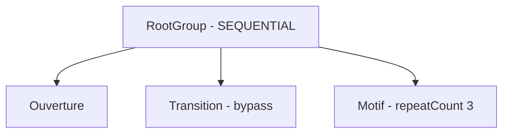
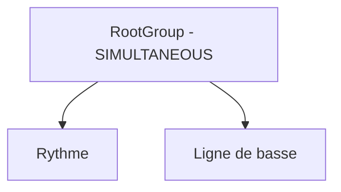
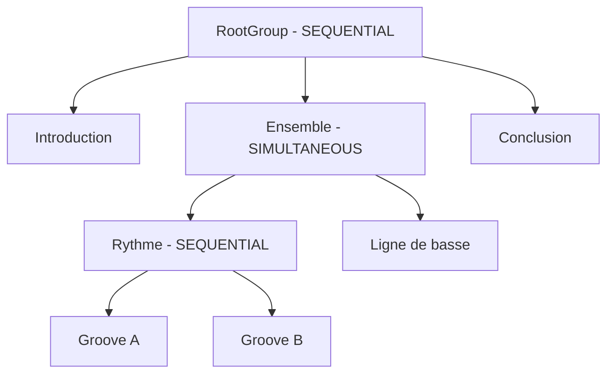
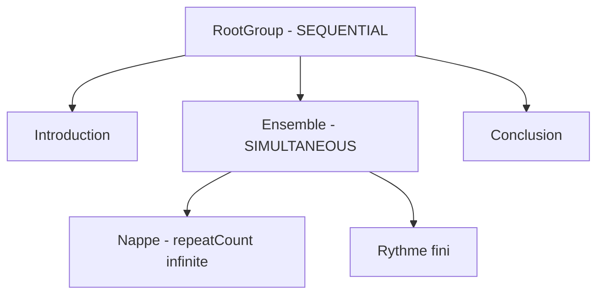
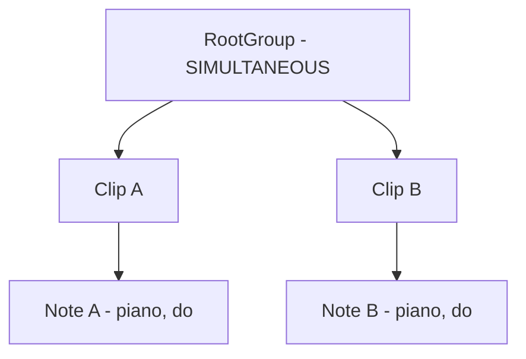

# Etudes de cas

Ce document illustre les regles de composition et de lecture definies dans [domaines.md](domaines.md). Les exemples ne decrivent aucune position globale sauvegardee : tous les instants de depart et de fin sont derives de l'arbre de `Group` et de `Clip`.

## Conventions de calcul

Chaque clip utilise sa propre chronologie de tempo. Pour un intervalle dont le tempo est constant :

```text
durationSeconds = (durationTicks / 960) * (60 / bpm)
```

Lorsque le tempo change dans le clip, sa duree reelle correspond a la somme des durees de ses `TempoSection`.

La duree de lecture d'un element suit les regles suivantes :

```text
clip contourne                    = 0
clip fini                         = duree d'une lecture * repeatCount
clip avec repeatCount = infinite  = infinite
groupe SEQUENTIAL                 = somme des durees de ses enfants
groupe SIMULTANEOUS               = maximum des durees de ses enfants
groupe vide                       = 0
```

## Cas 1 - Sequence, repetition et bypass

Le groupe racine contient trois clips et utilise le mode `SEQUENTIAL`.



| Clip | Duree d'une lecture | Etat | Contribution |
| --- | ---: | --- | ---: |
| `Ouverture` | 2 s | actif, `repeatCount = 1` | 2 s |
| `Transition` | 2 s | `isBypassed = true` | 0 s |
| `Motif` | 1 s | actif, `repeatCount = 3` | 3 s |

La lecture obtenue est la suivante :

| Temps reel | Lecture |
| --- | --- |
| 0 a 2 s | `Ouverture` |
| 2 a 3 s | premiere lecture de `Motif` |
| 3 a 4 s | deuxieme lecture de `Motif` |
| 4 a 5 s | troisieme lecture de `Motif` |

Le clip `Transition` reste dans l'arbre. Son `repeatCount` est conserve, mais il ne produit aucun son et ne retarde pas le clip suivant tant qu'il est contourne.

## Cas 2 - Deux clips simultanes aux horloges independantes

Le groupe racine utilise le mode `SIMULTANEOUS`.



| Clip | Duree | Metrique | Tempo | Duree reelle |
| --- | ---: | ---: | ---: | ---: |
| `Rythme` | 3840 ticks | 4/4 | 120 BPM | 2 s |
| `Ligne de basse` | 5760 ticks | 3/4 | 90 BPM | 4 s |

Les deux clips commencent a l'instant zero. `Rythme` se termine apres deux secondes, tandis que `Ligne de basse` continue jusqu'a quatre secondes. Le groupe dure donc quatre secondes.

La metrique 3/4 et le tempo de 90 BPM de la basse ne modifient ni les reperes ni la chronologie du rythme en 4/4 a 120 BPM. Les clips partagent uniquement leur instant de depart reel.

## Cas 3 - Imbrication d'une sequence dans une superposition

La composition comporte une introduction, un ensemble simultane, puis une conclusion. A l'interieur de l'ensemble, deux clips rythmiques sont lus en sequence pendant qu'une ligne de basse suit sa propre chronologie.



| Clip | Duree | Metrique | Tempo | Duree reelle |
| --- | ---: | ---: | ---: | ---: |
| `Introduction` | 3840 ticks | 4/4 | 120 BPM | 2 s |
| `Groove A` | 3840 ticks | 4/4 | 120 BPM | 2 s |
| `Groove B` | 3840 ticks | 4/4 | 120 BPM | 2 s |
| `Ligne de basse` | 5760 ticks | 3/4 | 90 BPM | 4 s |
| `Conclusion` | 2880 ticks | 3/4 | 90 BPM | 2 s |

La lecture se deroule comme suit :

| Temps reel | Lecture |
| --- | --- |
| 0 a 2 s | `Introduction` |
| 2 a 4 s | `Groove A` et premiere partie de `Ligne de basse` |
| 4 a 6 s | `Groove B` et seconde partie de `Ligne de basse` |
| 6 a 8 s | `Conclusion` |

Le groupe `Rythme` dure quatre secondes, car il additionne deux clips de deux secondes. Le groupe `Ensemble` dure egalement quatre secondes : ses deux enfants commencent a deux secondes et se terminent a six secondes.

Le debut de `Conclusion` a six secondes est entierement derive du parcours de l'arbre : deux secondes pour l'introduction, puis quatre secondes pour l'enfant le plus long du groupe simultane.

## Cas 4 - Repetition infinie dans une branche simultanee

Une nappe repetee indefiniment joue en meme temps qu'une sequence rythmique finie. Une conclusion est placee apres leur groupe parent.



Apres l'introduction, la nappe et le rythme commencent ensemble. Le rythme peut se terminer, mais la branche de la nappe n'a jamais d'instant de fin. La duree du groupe `Ensemble` est donc `infinite` et la `Conclusion` est inaccessible par progression automatique.

Si la nappe est contournee, sa contribution devient nulle. Le groupe se termine alors avec le rythme fini et la lecture peut atteindre la conclusion. Arreter la lecture ou deplacer manuellement la tete de lecture permet egalement de quitter la repetition infinie.


## Cas 5 - Deux clips utilisent le meme instrument

Deux clips lus simultanement contiennent chacun une note de meme hauteur jouee par le meme instrument.



La note A commence a zero seconde et se termine a quatre secondes. La note B commence a une seconde et se termine a deux secondes. Le `PlaybackService` produit deux occurrences distinctes :

| Occurrence | Source | Instrument | Hauteur | Debut | Fin |
| --- | --- | --- | --- | ---: | ---: |
| `occurrence-a` | note A du clip A | piano | do | 0 s | 4 s |
| `occurrence-b` | note B du clip B | piano | do | 1 s | 2 s |

A deux secondes, le moteur relache uniquement `occurrence-b`. La voix correspondant a `occurrence-a` continue jusqu'a quatre secondes. Une commande de relachement identifiee seulement par l'instrument et la hauteur serait insuffisante, car elle risquerait d'interrompre les deux voix.

Les deux notes ne sont jamais fusionnees implicitement. Si la definition du piano est polyphonique, elles occupent deux voix independantes. Si elle est monophonique, `InstrumentDefinition.voiceAllocation` determine le retrigger, la priorite des notes et l'eventuelle interruption de la voix precedente.

## Consequences pour le PlaybackService

Ces cas peuvent tous etre interpretes par une operation recursive :

```ts
schedule(item: GroupItem, startTime: number): number
```

- un `Clip` planifie ses notes depuis `startTime` en utilisant ses propres `TempoSection` et retourne son instant de fin ;
- un groupe `SEQUENTIAL` transmet la fin de chaque enfant comme debut du suivant ;
- un groupe `SIMULTANEOUS` transmet le meme debut a tous ses enfants et retourne la fin la plus tardive ;
- une duree `infinite` se propage aux groupes ancetres selon les memes regles ;
- aucun de ces calculs n'ajoute de position temporelle globale au modele sauvegarde.
