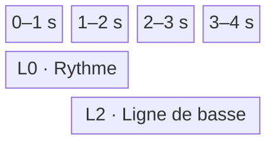
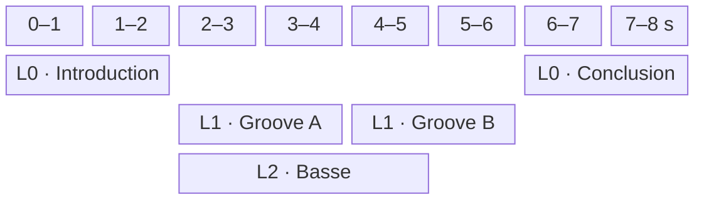
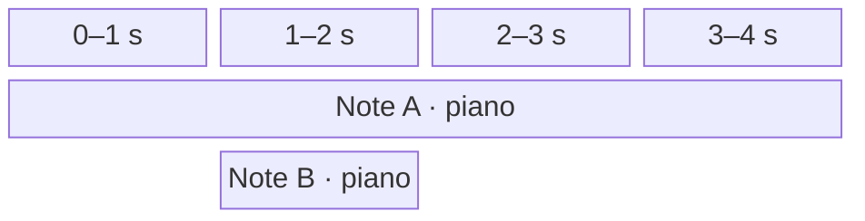

# Études de cas

Ce document illustre les règles de composition et de lecture définies dans [architecture.md](architecture.md). Un `Clip` désigne un contenu musical local éditable dans le piano roll ; un bloc de la grille est une `ClipOccurrence` persistante qui référence ce contenu. Sauf indication contraire, chaque occurrence nommée dans les exemples référence un clip source de même nom.

## Conventions de calcul

Sauf indication contraire, le projet utilise un tempo unique de 120,0 BPM et une résolution de 960 ticks par noire. Un `Tempo` accepte une décimale entre 20,0 et 999,9 BPM inclus :

```text
durationSeconds = (durationTicks / 960) * (60 / 120)
```

La métrique, la tonalité et l'harmonie restent locales à chaque clip. La métrique fournit des repères de mesures, mais ne modifie pas la conversion des ticks en secondes.

La durée structurelle d'une occurrence et celle du projet suivent les règles suivantes :

```text
occurrenceEnd = occurrence.start + clip.duration * occurrence.repeatCount
projectEnd    = maximum des occurrenceEnd, ou 0 si le projet ne contient aucune occurrence
```

Les intervalles sont semi-ouverts. Deux occurrences sont simultanées si leurs intervalles globaux se recouvrent avec une durée strictement positive. Le premier périmètre interdit ce recouvrement sur une même ligne ; des occurrences situées sur des lignes différentes restent simultanées. La ligne n'intervient jamais dans le calcul audio.

## Cas 1 — Placement explicite, espace vide et répétition

Trois occurrences sont placées sur la ligne `0` :

| Occurrence | Début global | Durée du clip référencé | `repeatCount` | Fin globale |
| --- | ---: | ---: | ---: | ---: |
| `Ouverture` | 0 | 3840 ticks | 1 | 3840 |
| `Motif` | 5760 | 1920 ticks | 2 | 9600 |
| `Conclusion` | 11520 | 3840 ticks | 1 | 15360 |

La position de `Motif` n'est pas calculée depuis la fin d'`Ouverture`. L'intervalle `[3840, 5760)` reste silencieux, puis les deux lectures contiguës du motif occupent `[5760, 9600)`. Un second silence sépare le motif de la conclusion.


Déplacer ou supprimer une occurrence ne rapproche jamais automatiquement les autres occurrences. Leurs coordonnées persistantes restent inchangées. Supprimer l'occurrence ne supprime pas son clip source, même s'il s'agissait de sa dernière occurrence : seule une suppression manuelle distincte peut ensuite supprimer ce clip non référencé.

## Cas 2 — Chevauchement de clips aux métriques indépendantes

Deux occurrences référencent des clips soumis au même tempo de projet, mais possédant des métriques locales différentes :

| Occurrence | Ligne | Début | Durée du clip | Métrique locale | Intervalle réel |
| --- | ---: | ---: | ---: | ---: | ---: |
| `Rythme` | 0 | 0 | 3840 ticks | 4/4 | 0 à 2 s |
| `Ligne de basse` | 2 | 1920 ticks | 5760 ticks | 3/4 | 1 à 4 s |

Les deux clips jouent simultanément entre une et deux secondes. La basse continue seule jusqu'à quatre secondes.



La basse conserve ses mesures en 3/4, mais elle n'utilise ni tempo propre ni horloge indépendante. Son décalage provient uniquement de son début global sauvegardé.

## Cas 3 — Composition sur plusieurs lignes

La grille contient des occurrences d'introduction, de deux grooves consécutifs, d'une basse superposée et d'une conclusion :

| Occurrence | Ligne | Début global | Durée du clip | Intervalle réel |
| --- | ---: | ---: | ---: | ---: |
| `Introduction` | 0 | 0 | 3840 ticks | 0 à 2 s |
| `Groove A` | 1 | 3840 | 3840 ticks | 2 à 4 s |
| `Groove B` | 1 | 7680 | 3840 ticks | 4 à 6 s |
| `Ligne de basse` | 2 | 3840 | 5760 ticks | 2 à 5 s |
| `Conclusion` | 0 | 11520 | 3840 ticks | 6 à 8 s |



`Groove A` et `Groove B` partagent une ligne, mais leur succession résulte exclusivement de leurs placements. `Ligne de basse` chevauche les deux grooves, puis s'arrête une seconde avant `Groove B`. La conclusion commence au tick `11520` parce que cette valeur est sauvegardée, non parce qu'un élément précédent la déclenche.

## Cas 4 — Lignes sans association instrumentale

L'occurrence `Couplet`, ligne `0`, référence un clip associé au piano. L'occurrence `Contrechant`, ligne `3`, référence un clip associé aux cordes. Leurs intervalles globaux se chevauchent et les deux parties peuvent donc être audibles simultanément.

Tenter de déplacer `Contrechant` sur la ligne `0` sans modifier son intervalle est refusé, car il chevaucherait `Couplet` sur la même ligne. Le même déplacement devient valide si `Contrechant` est d'abord décalé après la fin de `Couplet`. Dans les deux cas, changer sa ligne ne modifierait ni ses notes ni le `Clip.instrumentId` de sa source et n'aurait, à placement temporel égal, aucun effet audio.

Une ligne est uniquement une coordonnée d'organisation bornée par une limite fixe de sécurité. Elle n'impose pas d'instrument, ne crée ni bus, ni filtre, ni contexte audio commun et ne fait l'objet d'aucune commande utilisateur d'ajout ou de suppression.

## Cas 5 — Deux clips utilisent le même instrument

Deux occurrences qui se chevauchent référencent chacune un clip associé au piano et contenant une note de même hauteur.

| Occurrence | Source | Instrument | Hauteur | Début | Fin |
| --- | --- | --- | --- | ---: | ---: |
| `occurrence-a` | clip A · note A | piano | do | 0 s | 4 s |
| `occurrence-b` | clip B · note B | piano | do | 1 s | 2 s |

À deux secondes, le moteur relâche uniquement `occurrence-b`. La voix correspondant à `occurrence-a` continue jusqu'à quatre secondes. Une commande identifiée seulement par l'instrument et la hauteur serait insuffisante.

Chaque occurrence active possède son propre `PlaybackContext` et sa propre `InstrumentInstance` `smplr` du piano. Lors de chaque `NOTE_ON`, le moteur associe au `NoteOccurrenceId` le contrôle d'arrêt retourné par l'instance concernée. Les occurrences ne sont jamais fusionnées implicitement.



## Cas 6 — Transports global et local, avec préécoute concurrente

Le projet est lu depuis sa tête globale dans une session `PROJECT`. Le clip source `Motif` est parallèlement ouvert dans le piano roll ; sa tête locale est restée au tick `960`.

Lorsque l'utilisateur appelle `playClip()`, le `PlaybackService` retire immédiatement le rôle de transport à `project-session-a`, annule ses attaques futures et relâche ses occurrences actives selon le mode `GRACEFUL`. Il ouvre ensuite `clip-session-b` de type `CLIP` au tick local `960`. La tête globale conserve sa position.

| Étape | Session | Type | État |
| --- | --- | --- | --- |
| Lecture de l'arrangement | `project-session-a` | `PROJECT` | transport actif |
| Appel à `playClip()` | `project-session-a` | `PROJECT` | inactive ; contextes éventuellement `DRAINING` |
| Appel à `playClip()` | `clip-session-b` | `CLIP` | nouveau transport actif |

La session `CLIP` lit directement le contenu local de `Motif` jusqu'à sa durée structurelle. Elle ignore toutes ses occurrences, leurs positions globales et leurs répétitions.

Pendant ce transport local, l'utilisateur maintient une touche du piano roll :

```ts
const notePreview = preview(noteId);

// À la fin du geste : pointerup ou pointercancel
notePreview.release();
```

`preview(noteId)` résout la note dans le clip `Motif` actuellement édité et ouvre une session `NOTE_PREVIEW` sans remplacer `clip-session-b`. La présentation reçoit seulement un `NotePreviewHandle`.

`release()` produit le `NOTE_OFF` de l'occurrence correspondante, termine structurellement son contexte et laisse sa release et son tail se drainer. Une durée maximale de sécurité applique le même relâchement si la fin du geste n'est pas reçue. Plusieurs préécoutes peuvent se chevaucher et être relâchées indépendamment.

Un appel ultérieur à `playProject(5760)` remplace à son tour le transport `CLIP`, déplace uniquement la tête globale au tick demandé et reprend la lecture de l'arrangement. La tête locale conserve son dernier tick.

## Cas 7 — Répétitions et occurrences de notes

Un clip contient une note `note-a` et possède une durée locale de 1920 ticks. Une occurrence qui le référence possède un `repeatCount` de `3` et occupe donc 5760 ticks globaux à partir de son `start`.

| Répétition | Note persistante | Occurrence d'exécution |
| ---: | --- | --- |
| 1 | `note-a` | `occurrence-a-1` |
| 2 | `note-a` | `occurrence-a-2` |
| 3 | `note-a` | `occurrence-a-3` |

Les trois répétitions de cette même occurrence de clip réutilisent le même `PlaybackContextId` et la même `InstrumentInstance`, mais chaque attaque reçoit un `NoteOccurrenceId` distinct. Une release peut continuer au début de la répétition suivante sans confondre les deux occurrences de note.

Si une voix a déjà été volée, le `NOTE_OFF` programmé pour son ancienne occurrence devient une opération sans effet. Les relâchements sont donc idempotents.

## Cas 8 — Fin structurelle et tail audio

L'occurrence `Nappe` occupe `[0, 3840)`, soit deux secondes. Le clip qu'elle référence produit une release et une réverbération qui restent audibles une seconde supplémentaire. L'occurrence `Conclusion` est placée explicitement au tick `3840`.

| Temps réel | Événement structurel | État audio de `Nappe` |
| --- | --- | --- |
| 0 s | début de `Nappe` | `ACTIVE` |
| 2 s | fin de `Nappe`, début de `Conclusion` | `DRAINING` |
| 3 s | aucun changement de placement | `DISPOSED` après extinction du tail |

Le tail ne modifie ni la fin globale de l'occurrence `Nappe`, ni le `start` de l'occurrence `Conclusion`. Il peut se superposer à l'occurrence suivante. Le contexte de `Nappe` refuse toute nouvelle attaque après deux secondes, mais conserve ses instances jusqu'au silence ou jusqu'à une durée maximale de sécurité.

## Cas 9 — Lecture globale depuis un tick explicite

La grille contient les occurrences suivantes :

| Occurrence | Ligne | Intervalle réel |
| --- | ---: | ---: |
| `Introduction` | 0 | 0 à 2 s |
| `Piano` | 1 | 2 à 6 s |
| `Basse` | 2 | 2 à 5 s |
| `Percussions` | 3 | 1 à 4 s |
| `Conclusion` | 0 | 6 à 8 s |

Les commandes suivantes choisissent une position sans changer la portée du transport :

| Commande | Résultat |
| --- | --- |
| `playProject()`, tête globale à 0 | Lit tout le projet depuis son début. |
| `playProject(3840)` | Place la tête globale à 2 s ; `Piano`, `Basse` et la partie encore active de `Percussions` participent au transport. |
| `playProject(11520)` | Place la tête globale à 6 s et lit la fin du projet. |

`playProject` reçoit directement un `Tick` global et aucune identité d'occurrence. `playClip(tick?)` utilise au contraire un tick local au clip édité. `preview(noteId)` ne déplace aucune tête et ne modifie pas le transport.

Si une note de `Percussions` a commencé avant deux secondes mais couvre encore cette position, la note chase minimale la réattaque au démarrage et programme son relâchement pour sa durée restante. Aucun état antérieur d'enveloppe ou de voix n'est reconstruit.

## Cas 10 — Accord `ROOT` et changement de tonalité

Un clip de 7680 ticks contient un unique `HarmonyChange` au tick local `0`. Son `Harmony` est un accord défini par `ROOT D` et `MINOR_SEVENTH`. La `Key` est do majeur au tick `0`, puis fa majeur au tick `3840`.

| Intervalle local | `Key` active | `Harmony` persistante | Accord résolu |
| --- | --- | --- | --- |
| 0 à 3840 | do majeur | `CHORD · ROOT D · MINOR_SEVENTH` | `Dm7` |
| 3840 à 7680 | fa majeur | `CHORD · ROOT D · MINOR_SEVENTH` | `Dm7` |

La référence `ROOT` conserve la fondamentale orthographiée. Le `KeyChange` ne modifie donc ni l'accord sauvegardé ni l'accord résolu. Il modifie seulement sa relation à la tonalité active.

Le placement global de ses occurrences et le tempo du projet n'affectent pas cette résolution locale.

## Cas 11 — Accord `DEGREE` résolu par la tonalité

Le clip possède la même chronologie de tonalité que le cas précédent, mais son unique `Harmony` est définie par `DEGREE II` et `MINOR_SEVENTH`.

| Intervalle local | `Key` active | Intention persistante | Accord résolu |
| --- | --- | --- | --- |
| 0 à 3840 | do majeur | `CHORD · DEGREE II · MINOR_SEVENTH` | `Dm7` |
| 3840 à 7680 | fa majeur | `CHORD · DEGREE II · MINOR_SEVENTH` | `Gm7` |

L'intention persistante est le deuxième degré mineur septième. Au tick local `3840`, le `KeyChange` suffit à faire évoluer l'accord résolu sans créer de nouvel `HarmonyChange`.

Le `ChordTypeId` reste inchangé. La tonalité détermine uniquement la fondamentale correspondant au degré ; elle ne remplace pas automatiquement la qualité choisie.

## Cas 12 — Gammes modales et pentatoniques

Deux clips illustrent les deux références possibles d'une `Harmony` de variante `SCALE`. Leur `Key` locale passe de do majeur à fa majeur au tick `3840`.

| Clip | `Harmony` persistante | Sous do majeur | Sous fa majeur |
| --- | --- | --- | --- |
| `Modal fixe` | `SCALE · ROOT D · DORIAN` | ré dorien | ré dorien |
| `Pentatonique relative` | `SCALE · DEGREE VI · MINOR_PENTATONIC` | la pentatonique mineure | ré pentatonique mineure |

Dans `Modal fixe`, la collection reste inchangée. Dans `Pentatonique relative`, aucune tonique de gamme n'est sauvegardée : le sixième degré est résolu depuis la `Key` active.

Les deux clips peuvent être placés n'importe où dans la grille. Leur ligne et leur éventuel chevauchement sur des lignes différentes ne changent pas ces analyses.

## Cas 13 — Note tenue à travers `KeyChange` et `HarmonyChange`

Une note `E4` commence au tick local `960` et se termine au tick `5280`. Elle traverse un changement d'harmonie au tick `1920`, puis un changement simultané de tonalité et d'harmonie au tick `3840`.

| Intervalle analysé | `Key` active | `Harmony` active | Résolution | Rôle de `E4` |
| --- | --- | --- | --- | --- |
| 960 à 1920 | do majeur | `CHORD · ROOT C · MAJOR_TRIAD` | `C` majeur | tierce de l'accord |
| 1920 à 3840 | do majeur | `SCALE · DEGREE II · DORIAN` | ré dorien | deuxième degré de la gamme |
| 3840 à 5280 | fa majeur | `CHORD · DEGREE V · DOMINANT_SEVENTH` | `C7` | tierce de l'accord |

Au tick `3840`, les nouvelles valeurs de `Key` et d'`Harmony` s'appliquent ensemble. La note persistante conserve un seul `TimeRange`. Les trois intervalles sont uniquement des vues d'analyse dérivées.

Si une occurrence du clip commence au tick global `10000`, ces bornes locales correspondent aux ticks globaux `10960`, `11920`, `13840` et `15280`. Les objets locaux ne sont pas réécrits pour autant.

## Cas 14 — Replanification du projet transitoire

Un transport `PROJECT` est actif. À cinq secondes depuis le début de sa session, un même geste déplace globalement une occurrence déjà active et déplace un changement local situé plus loin dans le clip qu'elle référence. Le nouveau `transientProject` devient immédiatement l'`effectiveProject`.

Le `PlaybackService` recalcule le transport depuis cette borne sans ouvrir une nouvelle session, puis demande :

```ts
replaceScheduledCommands(transportSessionId, 5, replacementCommands);
```

Le moteur retire les anciennes commandes non exécutées dont `at >= 5` et installe atomiquement `replacementCommands`.

Si l'ancien et le nouveau début global de la note restent avant la tête, tandis que sa fin reste après, l'occurrence de note audible est conservée et seul son `NOTE_OFF` est replanifié. Si le déplacement de la `ClipOccurrence` place l'attaque après la tête, l'occurrence de note reçoit un `NOTE_OFF` à la borne et sa future attaque est replanifiée. Une note auparavant inactive qui couvre désormais la tête reçoit un `NOTE_ON` à cette borne.

Une modification de hauteur ou de vélocité de la note impose une relâche puis une réattaque lorsqu'elle reste couverte. Changer l'instrument du clip applique cette règle à chacune de ses notes audibles dans toutes ses occurrences actives. Un changement du tempo du projet replanifie les instants futurs sans réattaquer une note dont les données sonores sont inchangées.

Le déplacement du changement local participe au même recalcul atomique. Le `PlaybackSessionId`, l'origine temporelle et le tick global du transport ne changent pas.

Si le transport actif était `CLIP` sur ce même clip, le service ignorerait le déplacement de la `ClipOccurrence` et réconcilierait uniquement le contenu local depuis la tête du clip. Une modification d'un autre clip n'affecterait pas cette session.

## Cas 15 — Plusieurs occurrences liées au même clip

Le clip source `Ostinato` possède une durée de 1920 ticks et contient `note-a`. Deux blocs de la grille le référencent :

| `ClipOccurrence` | `clipId` | Ligne | Début | `repeatCount` |
| --- | --- | ---: | ---: | ---: |
| `ostinato-a` | `ostinato` | 0 | 0 | 2 |
| `ostinato-b` | `ostinato` | 2 | 960 | 1 |

Les deux occurrences se chevauchent et sont planifiées dans deux `PlaybackContext` distincts. Les attaques issues de `note-a` reçoivent des `NoteOccurrenceId` distincts ; elles ne partagent ni voix ni instance audio malgré leur `ClipId` commun.

Ouvrir l'un ou l'autre bloc dans le piano roll édite le même clip `Ostinato`. Transposer `note-a`, modifier sa vélocité, changer l'instrument du clip, déplacer un changement local ou redimensionner le clip met immédiatement à jour les deux occurrences. Pendant un transport, le `PlaybackService` réconcilie séparément leurs occurrences de notes audibles et leurs commandes futures.

Déplacer `ostinato-b`, changer sa ligne ou son `repeatCount` ne modifie pas `ostinato-a`, car ces propriétés appartiennent à chaque `ClipOccurrence`. Dupliquer `ostinato-a` crée une troisième occurrence liée au même `clipId`. Le premier périmètre ne propose aucune commande pour rendre cette occurrence unique ou la délier.

## Cas 16 — Interruption explicite de la tonalité

Un clip possède un `KeyChange` vers do majeur au tick `0`, un `KeyChange` portant `null` au tick `3840`, puis un `KeyChange` vers fa majeur au tick `5760`.

| Intervalle local | Valeur du changement | Tonalité active |
| --- | --- | --- |
| `[0, 3840)` | do majeur | do majeur |
| `[3840, 5760)` | `null` | aucune |
| `[5760, clip.duration)` | fa majeur | fa majeur |

Une `Harmony` définie par `ROOT` peut traverser l'intervalle sans tonalité, car sa fondamentale ou sa tonique reste autonome. Une `Harmony` définie par `DEGREE` ne peut ni commencer avant le tick `3840` et le traverser, ni être créée dans `[3840, 5760)` : son invariant exige une `Key` active sur toute sa section.

## Cas 17 — Préchargement, seek et fermeture du piano roll

Le projet est arrêté avec une tête globale au tick `1920`. `playProject()` recense les instruments nécessaires entre ce tick et la fin du projet, demande leur préparation au moteur, puis attend leur chargement. La session `PROJECT` et l'avancement de la tête ne commencent qu'après la disponibilité de toutes les banques requises.

Pendant la lecture, `setProjectPlayhead(7680)` remplace gracieusement la session par une nouvelle session `PROJECT` commençant au tick `7680`. Un `stop(IMMEDIATE)` ultérieur coupe le son mais laisse la tête globale au tick atteint ; la tête locale n'est pas modifiée.

Dans un autre scénario, `playClip()` démarre le clip `Motif`, puis l'utilisateur ferme le piano roll ou ouvre `Couplet`. La session `CLIP` continue sur `Motif` avec son propre curseur d'exécution. La tête locale du nouvel éditeur ne suit pas ce transport. Un nouvel appel à `playClip()` remplace la session et cible alors `Couplet`.

## Conséquences pour le PlaybackService

Le calcul de planification repose sur l'intervalle persistant de chaque occurrence et sur la durée du clip qu'elle référence, sans parcours récursif :

```ts
calculateInterval(
  occurrence: ClipOccurrence,
  clip: Clip
): {
  start: Tick;
  end: Tick;
}
```

- le `Project` fournit un tempo unique à toutes les conversions vers les secondes ;
- chaque `ClipOccurrence` calcule ses événements à partir de son `start`, de son `repeatCount` et des positions locales du `Clip` référencé ; chaque `NOTE_ON` reçoit l'`instrumentId` unique de ce clip ;
- toutes les occurrences dont les intervalles se chevauchent sur des lignes différentes sont actives simultanément, quelle que soit leur référence source ;
- le domaine refuse toutefois deux intervalles chevauchants sur une même ligne ;
- un changement de ligne n'entraîne aucune replanification sonore ;
- les déplacements et redimensionnements globaux sont quantifiés par une grille globale sans métrique ;
- `playProject()` commence à la tête globale, tandis que `playProject(tick)` la déplace avant de lire le projet ;
- `playClip()` commence à la tête locale du clip édité, tandis que `playClip(tick)` la déplace avant de lire ce seul clip ;
- le transport `CLIP` ignore les placements et répétitions des occurrences, mais conserve le tempo unique du projet ;
- `preview(noteId)` résout uniquement une note du clip édité, sans déplacer les têtes ni remplacer le transport ;
- une seule session `PROJECT` ou `CLIP` peut constituer le transport actif ;
- tous les instruments requis sont chargés avant l'ouverture de cette session ;
- déplacer la tête du transport actif remplace immédiatement sa session par une session de même portée ;
- fermer le piano roll ou changer de clip édité ne termine pas un transport `CLIP` déjà actif ;
- les sessions `NOTE_PREVIEW` peuvent coexister entre elles et avec le transport actif ;
- `stop(mode)` arrête uniquement le transport actif, laisse les deux têtes en place et n'affecte aucune préécoute de note ;
- chaque activation de `ClipOccurrence`, chaque transport local de clip et chaque préécoute de note reçoivent un `PlaybackContextId` transitoire distinct des identifiants persistants ;
- deux occurrences du même `Clip` possèdent des contextes audio indépendants ;
- chaque `AudioCommand` porte ce `contextId`, tandis que la relation entre contexte et session n'est enregistrée qu'à l'ouverture du contexte ;
- chaque attaque, y compris lors d'une répétition, reçoit un `NoteOccurrenceId` unique ;
- une modification du projet transitoire remplace atomiquement les commandes futures selon la portée `PROJECT` ou `CLIP` du transport actif, sans changer sa session ni son origine temporelle ;
- la fin structurelle permet aux autres occurrences de poursuivre leur lecture pendant que l'infrastructure conserve éventuellement un contexte en `DRAINING` ;
- un contexte déjà `DRAINING` conserve ses tails jusqu'au silence même si l'occurrence est déplacée ; un nouveau placement nécessitant des attaques reçoit un nouveau contexte ;
- le tempo, les contenus `Clip` et les propriétés globales des `ClipOccurrence` sont persistants ; les identifiants d'exécution ne le sont jamais.
