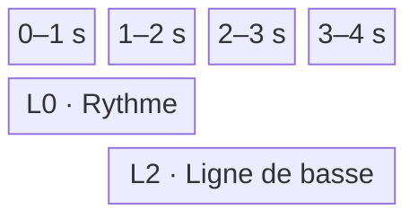
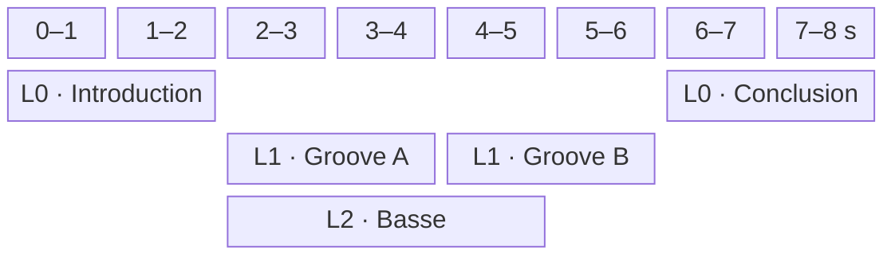
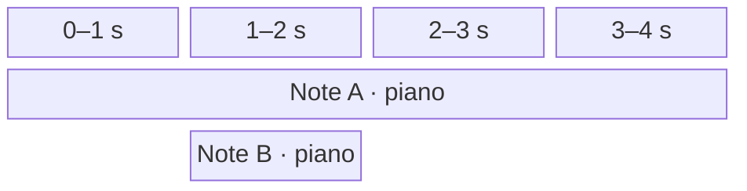

# Études de cas

Ce document illustre les règles de composition et de lecture définies dans [architecture.md](architecture.md). Les débuts globaux et les lignes indiqués dans les exemples sont sauvegardés dans le `ClipPlacement` de chaque clip.

## Conventions de calcul

Sauf indication contraire, le projet utilise un tempo unique de 120 BPM et une résolution de 960 ticks par noire :

```text
durationSeconds = (durationTicks / 960) * (60 / 120)
```

La métrique, la tonalité et l'harmonie restent locales à chaque clip. La métrique fournit des repères de mesures, mais ne modifie pas la conversion des ticks en secondes.

La durée structurelle d'un clip et celle du projet suivent les règles suivantes :

```text
clipEnd   = placement.start + duration * repeatCount
projectEnd = maximum des clipEnd, ou 0 si le projet est vide
```

Les intervalles sont semi-ouverts. Deux clips sont simultanés si leurs intervalles globaux se recouvrent avec une durée strictement positive. La ligne n'intervient jamais dans ce calcul.

## Cas 1 — Placement explicite, espace vide et répétition

Trois clips sont placés sur la ligne `0` :

| Clip | Début global | Durée locale | `repeatCount` | Fin globale |
| --- | ---: | ---: | ---: | ---: |
| `Ouverture` | 0 | 3840 ticks | 1 | 3840 |
| `Motif` | 5760 | 1920 ticks | 2 | 9600 |
| `Conclusion` | 11520 | 3840 ticks | 1 | 15360 |

La position de `Motif` n'est pas calculée depuis la fin d'`Ouverture`. L'intervalle `[3840, 5760)` reste silencieux, puis les deux lectures contiguës du motif occupent `[5760, 9600)`. Un second silence sépare le motif de la conclusion.


Déplacer ou supprimer un clip ne rapproche jamais automatiquement les autres clips. Leurs placements persistants restent inchangés.

## Cas 2 — Chevauchement de clips aux métriques indépendantes

Deux clips utilisent le même tempo de projet, mais des métriques locales différentes :

| Clip | Ligne | Début | Durée | Métrique locale | Intervalle réel |
| --- | ---: | ---: | ---: | ---: | ---: |
| `Rythme` | 0 | 0 | 3840 ticks | 4/4 | 0 à 2 s |
| `Ligne de basse` | 2 | 1920 ticks | 5760 ticks | 3/4 | 1 à 4 s |

Les deux clips jouent simultanément entre une et deux secondes. La basse continue seule jusqu'à quatre secondes.



La basse conserve ses mesures en 3/4, mais elle n'utilise ni tempo propre ni horloge indépendante. Son décalage provient uniquement de son début global sauvegardé.

## Cas 3 — Composition sur plusieurs lignes

La grille contient une introduction, deux grooves consécutifs, une basse superposée et une conclusion :

| Clip | Ligne | Début global | Durée | Intervalle réel |
| --- | ---: | ---: | ---: | ---: |
| `Introduction` | 0 | 0 | 3840 ticks | 0 à 2 s |
| `Groove A` | 1 | 3840 | 3840 ticks | 2 à 4 s |
| `Groove B` | 1 | 7680 | 3840 ticks | 4 à 6 s |
| `Ligne de basse` | 2 | 3840 | 5760 ticks | 2 à 5 s |
| `Conclusion` | 0 | 11520 | 3840 ticks | 6 à 8 s |



`Groove A` et `Groove B` partagent une ligne, mais leur succession résulte exclusivement de leurs placements. `Ligne de basse` chevauche les deux grooves, puis s'arrête une seconde avant `Groove B`. La conclusion commence au tick `11520` parce que cette valeur est sauvegardée, non parce qu'un élément précédent la déclenche.

## Cas 4 — Lignes sans association instrumentale

Le clip `Couplet`, ligne `0`, contient des notes de piano et de basse. Le clip `Contrechant`, ligne `3`, contient des notes de piano et de cordes. Leurs intervalles globaux se chevauchent et les quatre parties peuvent donc être audibles simultanément.

Déplacer `Contrechant` sur la ligne `0` ne modifie aucune note, aucun `InstrumentId` et aucune commande audio. Les deux clips continuent de jouer simultanément selon leurs seuls intervalles temporels.

Une ligne est uniquement une coordonnée d'organisation. Elle n'impose pas d'instrument et ne crée ni bus, ni filtre, ni contexte audio commun entre les clips qui l'occupent.

## Cas 5 — Deux clips utilisent le même instrument

Deux clips qui se chevauchent contiennent chacun une note de même hauteur jouée par le même instrument.

| Occurrence | Source | Instrument | Hauteur | Début | Fin |
| --- | --- | --- | --- | ---: | ---: |
| `occurrence-a` | note A du clip A | piano | do | 0 s | 4 s |
| `occurrence-b` | note B du clip B | piano | do | 1 s | 2 s |

À deux secondes, le moteur relâche uniquement `occurrence-b`. La voix correspondant à `occurrence-a` continue jusqu'à quatre secondes. Une commande identifiée seulement par l'instrument et la hauteur serait insuffisante.

Chaque clip actif possède son propre `PlaybackContext` et sa propre `InstrumentInstance` `smplr` du piano. Lors de chaque `NOTE_ON`, le moteur associe au `NoteOccurrenceId` le contrôle d'arrêt retourné par l'instance concernée. Les occurrences ne sont jamais fusionnées implicitement.



## Cas 6 — Remplacement du transport et préécoute concurrente

Le clip `Motif` commence au tick global `3840`. Un transport est actif lorsque l'utilisateur appelle `play(motif.id)`.

Le nouvel appel place la tête à ce début sauvegardé et ouvre une nouvelle session `PROJECT`. Le `PlaybackService` retire immédiatement le rôle de transport à `project-session-a`, annule ses attaques futures, relâche ses occurrences actives selon le mode `GRACEFUL` et ouvre `project-session-b`. Il n'existe jamais deux transports actifs.

| Étape | Session | Type | État |
| --- | --- | --- | --- |
| Lecture initiale | `project-session-a` | `PROJECT` | transport actif |
| Nouvel appel à `play` | `project-session-a` | `PROJECT` | inactive ; contextes éventuellement `DRAINING` |
| Nouvel appel à `play` | `project-session-b` | `PROJECT` | nouveau transport actif |

Pendant ce transport, l'utilisateur maintient une touche du piano roll :

```ts
const notePreview = preview(noteId);

// À la fin du geste : pointerup ou pointercancel
notePreview.release();
```

`preview(noteId)` ouvre en interne une session `NOTE_PREVIEW` sans remplacer `project-session-b`. La présentation reçoit seulement un `NotePreviewHandle`.

`release()` produit le `NOTE_OFF` de l'occurrence correspondante, termine structurellement son contexte et laisse sa release et son tail se drainer. Une durée maximale de sécurité applique le même relâchement si la fin du geste n'est pas reçue. Plusieurs préécoutes peuvent se chevaucher et être relâchées indépendamment.

## Cas 7 — Répétitions et occurrences de notes

Un clip contient une note `note-a`, possède une durée locale de 1920 ticks et un `repeatCount` de `3`. Il occupe donc 5760 ticks globaux à partir de son placement.

| Répétition | Note persistante | Occurrence d'exécution |
| ---: | --- | --- |
| 1 | `note-a` | `occurrence-a-1` |
| 2 | `note-a` | `occurrence-a-2` |
| 3 | `note-a` | `occurrence-a-3` |

Les trois lectures réutilisent le même `PlaybackContextId` et la même `InstrumentInstance`, mais chaque attaque reçoit un `NoteOccurrenceId` distinct. Une release peut continuer au début de la répétition suivante sans confondre les deux occurrences.

Si une voix a déjà été volée, le `NOTE_OFF` programmé pour son ancienne occurrence devient une opération sans effet. Les relâchements sont donc idempotents.

## Cas 8 — Fin structurelle et tail audio

Le clip `Nappe` occupe `[0, 3840)`, soit deux secondes. Son instrument produit une release et une réverbération qui restent audibles une seconde supplémentaire. `Conclusion` est placé explicitement au tick `3840`.

| Temps réel | Événement structurel | État audio de `Nappe` |
| --- | --- | --- |
| 0 s | début de `Nappe` | `ACTIVE` |
| 2 s | fin de `Nappe`, début de `Conclusion` | `DRAINING` |
| 3 s | aucun changement de placement | `DISPOSED` après extinction du tail |

Le tail ne modifie ni la fin globale de `Nappe`, ni le placement de `Conclusion`. Il peut se superposer au clip suivant. Le contexte de `Nappe` refuse toute nouvelle attaque après deux secondes, mais conserve ses instances jusqu'au silence ou jusqu'à une durée maximale de sécurité.

## Cas 9 — Lecture globale depuis un clip

La grille contient les placements suivants :

| Clip | Ligne | Intervalle réel |
| --- | ---: | ---: |
| `Introduction` | 0 | 0 à 2 s |
| `Piano` | 1 | 2 à 6 s |
| `Basse` | 2 | 2 à 5 s |
| `Percussions` | 3 | 1 à 4 s |
| `Conclusion` | 0 | 6 à 8 s |

Les commandes suivantes choisissent une position sans changer la portée du transport :

| Commande | Résultat |
| --- | --- |
| `play()`, tête à 0 | Lit tout le projet depuis son début. |
| `play(piano.id)` | Place la tête à 2 s ; `Piano`, `Basse` et la partie encore active de `Percussions` participent au transport. |
| `play(basse.id)` | Produit le même point de départ que `play(piano.id)`. |
| `play(conclusion.id)` | Place la tête à 6 s et lit la fin du projet. |

L'identifiant passé à `play` sert seulement à retrouver `placement.start`. Une note possède uniquement une action `preview(noteId)`, qui ne déplace pas la tête et ne modifie pas le transport.

Le traitement d'une note ayant commencé avant la position choisie reste soumis à la politique de note chase à définir.

## Cas 10 — Accord `ROOT` et changement de tonalité

Un clip de 7680 ticks contient un unique `HarmonyChange` au tick local `0`. Son `Harmony` est un accord défini par `ROOT D` et `MINOR_SEVENTH`. La `Key` est do majeur au tick `0`, puis fa majeur au tick `3840`.

| Intervalle local | `Key` active | `Harmony` persistante | Accord résolu |
| --- | --- | --- | --- |
| 0 à 3840 | do majeur | `CHORD · ROOT D · MINOR_SEVENTH` | `Dm7` |
| 3840 à 7680 | fa majeur | `CHORD · ROOT D · MINOR_SEVENTH` | `Dm7` |

La référence `ROOT` conserve la fondamentale orthographiée. Le `KeyChange` ne modifie donc ni l'accord sauvegardé ni l'accord résolu. Il modifie seulement sa relation à la tonalité active.

Le placement global du clip et le tempo du projet n'affectent pas cette résolution locale.

## Cas 11 — Accord `DEGREE` résolu par la tonalité

Le clip possède la même chronologie de tonalité que le cas précédent, mais son unique `Harmony` est définie par `DEGREE II` et `MINOR_SEVENTH`.

| Intervalle local | `Key` active | Intention persistante | Accord résolu |
| --- | --- | --- | --- |
| 0 à 3840 | do majeur | `CHORD · DEGREE II · MINOR_SEVENTH` | `Dm7` |
| 3840 à 7680 | fa majeur | `CHORD · DEGREE II · MINOR_SEVENTH` | `Gm7` |

L'intention persistante est le deuxième degré mineur septième. Au tick local `3840`, le `KeyChange` suffit à faire évoluer l'accord résolu sans créer de nouvel `HarmonyChange`.

Le `ChordTypeId` reste inchangé. La tonalité détermine uniquement la fondamentale correspondant au degré ; elle ne remplace pas automatiquement la qualité choisie.

## Cas 12 — Gammes modales et pentatoniques

Deux clips illustrent les deux références possibles d'une `Harmony` de variante `SCALE`. Leur `Key` locale passe de do majeur à fa majeur au tick `3840`.

| Clip | `Harmony` persistante | Sous do majeur | Sous fa majeur |
| --- | --- | --- | --- |
| `Modal fixe` | `SCALE · ROOT D · DORIAN` | ré dorien | ré dorien |
| `Pentatonique relative` | `SCALE · DEGREE VI · MINOR_PENTATONIC` | la pentatonique mineure | ré pentatonique mineure |

Dans `Modal fixe`, la collection reste inchangée. Dans `Pentatonique relative`, aucune tonique de gamme n'est sauvegardée : le sixième degré est résolu depuis la `Key` active.

Les deux clips peuvent être placés n'importe où dans la grille. Leur ligne et leur chevauchement éventuel ne changent pas ces analyses.

## Cas 13 — Note tenue à travers `KeyChange` et `HarmonyChange`

Une note `E4` commence au tick local `960` et se termine au tick `5280`. Elle traverse un changement d'harmonie au tick `1920`, puis un changement simultané de tonalité et d'harmonie au tick `3840`.

| Intervalle analysé | `Key` active | `Harmony` active | Résolution | Rôle de `E4` |
| --- | --- | --- | --- | --- |
| 960 à 1920 | do majeur | `CHORD · ROOT C · MAJOR_TRIAD` | `C` majeur | tierce de l'accord |
| 1920 à 3840 | do majeur | `SCALE · DEGREE II · DORIAN` | ré dorien | deuxième degré de la gamme |
| 3840 à 5280 | fa majeur | `CHORD · DEGREE V · DOMINANT_SEVENTH` | `C7` | tierce de l'accord |

Au tick `3840`, les nouvelles valeurs de `Key` et d'`Harmony` s'appliquent ensemble. La note persistante conserve un seul `TimeRange`. Les trois intervalles sont uniquement des vues d'analyse dérivées.

Si le clip commence au tick global `10000`, ces bornes locales correspondent aux ticks globaux `10960`, `11920`, `13840` et `15280`. Les objets locaux ne sont pas réécrits pour autant.

## Cas 14 — Replanification du projet transitoire

Un transport est actif. À cinq secondes depuis le début de sa session, un même geste déplace globalement un clip déjà actif et déplace un changement local situé plus loin dans ce clip. Le nouveau `transientProject` devient immédiatement l'`effectiveProject`.

Le `PlaybackService` recalcule le transport depuis cette borne sans ouvrir une nouvelle session, puis demande :

```ts
replaceScheduledCommands(transportSessionId, 5, replacementCommands);
```

Le moteur retire les anciennes commandes non exécutées dont `at >= 5` et installe atomiquement `replacementCommands`.

Si l'ancien et le nouveau début global de la note restent avant la tête, tandis que sa fin reste après, l'occurrence audible est conservée et seul son `NOTE_OFF` est replanifié. Si le déplacement du clip place l'attaque après la tête, l'occurrence reçoit un `NOTE_OFF` à la borne et sa future attaque est replanifiée. Une note auparavant inactive qui couvre désormais la tête reçoit un `NOTE_ON` à cette borne.

Une modification de hauteur, d'instrument ou de vélocité impose une relâche puis une réattaque lorsque la note reste couverte. Un changement du tempo du projet replanifie les instants futurs sans réattaquer une note dont les données sonores sont inchangées.

Le déplacement du changement local participe au même recalcul atomique. Le `PlaybackSessionId`, l'origine temporelle et la position musicale du transport ne changent pas.

## Conséquences pour le PlaybackService

Le calcul de planification repose sur l'intervalle persistant de chaque clip, sans parcours récursif :

```ts
calculateInterval(clip: Clip): {
  start: ProjectPosition;
  end: ProjectPosition;
}
```

- le `Project` fournit un tempo unique à toutes les conversions vers les secondes ;
- un `Clip` calcule ses événements à partir de `placement.start`, de ses positions locales et de ses répétitions ;
- tous les clips dont les intervalles se chevauchent sont actifs simultanément, quelle que soit leur ligne ;
- un changement de ligne n'entraîne aucune replanification sonore ;
- `play()` commence à la position actuelle de la tête ;
- `play(clipId)` place la tête au début global sauvegardé du clip, puis lit le projet depuis cette position ;
- tous les clips actifs à la position choisie participent au transport ;
- `preview(noteId)` auditionne uniquement une note, sans déplacer la tête ni remplacer le transport ;
- une seule session `PROJECT` peut constituer le transport actif ;
- les sessions `NOTE_PREVIEW` peuvent coexister entre elles et avec le transport actif ;
- `stop(mode)` arrête uniquement le transport actif et n'affecte aucune préécoute de note ;
- chaque activation de clip et chaque préécoute de note reçoivent un `PlaybackContextId` transitoire distinct des identifiants persistants ;
- chaque `AudioCommand` porte ce `contextId`, tandis que la relation entre contexte et session n'est enregistrée qu'à l'ouverture du contexte ;
- chaque attaque, y compris lors d'une répétition, reçoit un `NoteOccurrenceId` unique ;
- une modification du projet transitoire remplace atomiquement les commandes futures du transport actif, sans changer sa session ni son origine temporelle ;
- la fin structurelle permet aux autres clips de poursuivre leur lecture pendant que l'infrastructure conserve éventuellement un contexte en `DRAINING` ;
- le tempo, le début global et la ligne des clips sont persistants ; les identifiants d'exécution ne le sont jamais.
